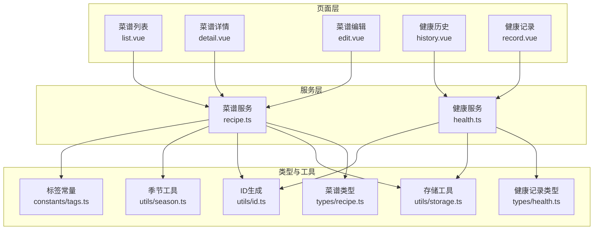
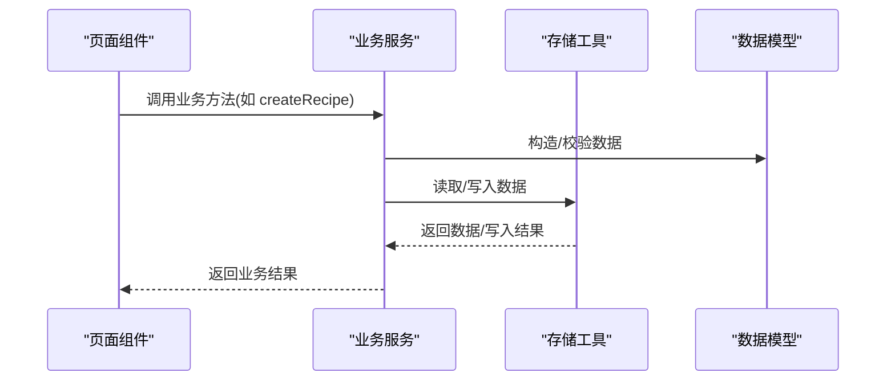
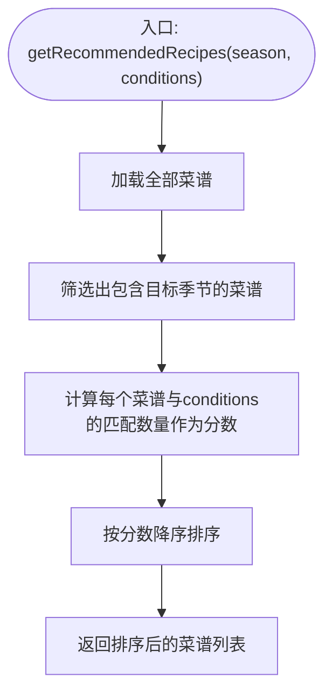
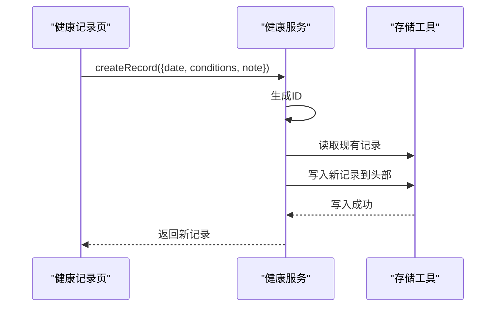
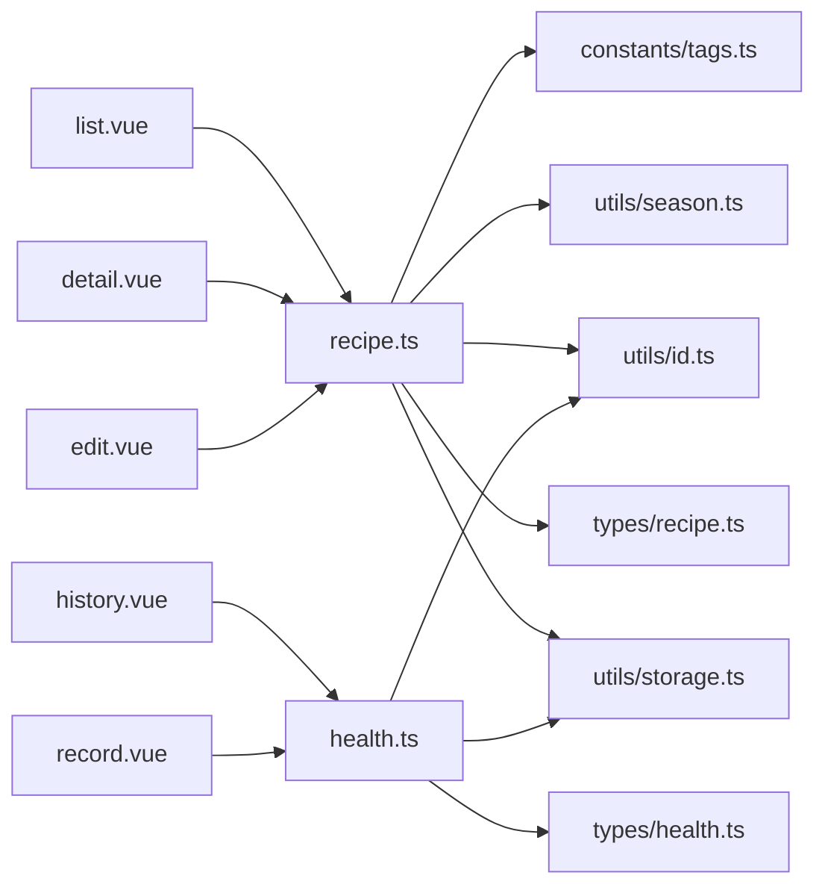

# 业务服务层

<cite>
**本文引用的文件**
- [src/services/recipe.ts](file://src/services/recipe.ts)
- [src/services/health.ts](file://src/services/health.ts)
- [src/types/recipe.ts](file://src/types/recipe.ts)
- [src/types/health.ts](file://src/types/health.ts)
- [src/utils/storage.ts](file://src/utils/storage.ts)
- [src/utils/id.ts](file://src/utils/id.ts)
- [src/utils/season.ts](file://src/utils/season.ts)
- [src/constants/tags.ts](file://src/constants/tags.ts)
- [src/pages/recipe/list.vue](file://src/pages/recipe/list.vue)
- [src/pages/recipe/detail.vue](file://src/pages/recipe/detail.vue)
- [src/pages/recipe/edit.vue](file://src/pages/recipe/edit.vue)
- [src/pages/health/history.vue](file://src/pages/health/history.vue)
- [src/pages/health/record.vue](file://src/pages/health/record.vue)
</cite>

## 目录
1. [简介](#简介)
2. [项目结构](#项目结构)
3. [核心组件](#核心组件)
4. [架构总览](#架构总览)
5. [详细组件分析](#详细组件分析)
6. [依赖分析](#依赖分析)
7. [性能考虑](#性能考虑)
8. [故障排查指南](#故障排查指南)
9. [结论](#结论)
10. [附录](#附录)

## 简介
本文件面向 eat 项目的业务服务层，重点解析菜谱服务（RecipeService）与健康服务（HealthService）的架构设计、API 定义、业务逻辑与错误处理机制。文档同时覆盖服务层职责分离、数据访问模式、与页面组件的交互方式、异步与并发控制、性能优化与缓存策略，并提供可操作的调用示例与最佳实践，帮助开发者快速理解与扩展业务逻辑。

## 项目结构
eat 采用“页面 + 服务 + 类型 + 工具”的分层组织：
- 页面层：负责用户交互与视图渲染（如菜谱列表、详情、编辑；健康记录、历史）
- 服务层：封装业务逻辑与数据访问（RecipeService、HealthService）
- 类型层：统一数据模型（Recipe、HealthRecord）
- 工具层：通用能力（存储、ID、季节、标签）

图表来源
- [src/pages/recipe/list.vue](file://src/pages/recipe/list.vue)
- [src/pages/recipe/detail.vue](file://src/pages/recipe/detail.vue)
- [src/pages/recipe/edit.vue](file://src/pages/recipe/edit.vue)
- [src/pages/health/history.vue](file://src/pages/health/history.vue)
- [src/pages/health/record.vue](file://src/pages/health/record.vue)
- [src/services/recipe.ts](file://src/services/recipe.ts)
- [src/services/health.ts](file://src/services/health.ts)
- [src/types/recipe.ts](file://src/types/recipe.ts)
- [src/types/health.ts](file://src/types/health.ts)
- [src/utils/storage.ts](file://src/utils/storage.ts)
- [src/utils/id.ts](file://src/utils/id.ts)
- [src/utils/season.ts](file://src/utils/season.ts)
- [src/constants/tags.ts](file://src/constants/tags.ts)

章节来源
- [src/services/recipe.ts](file://src/services/recipe.ts)
- [src/services/health.ts](file://src/services/health.ts)
- [src/types/recipe.ts](file://src/types/recipe.ts)
- [src/types/health.ts](file://src/types/health.ts)
- [src/utils/storage.ts](file://src/utils/storage.ts)
- [src/utils/id.ts](file://src/utils/id.ts)
- [src/utils/season.ts](file://src/utils/season.ts)
- [src/constants/tags.ts](file://src/constants/tags.ts)
- [src/pages/recipe/list.vue](file://src/pages/recipe/list.vue)
- [src/pages/recipe/detail.vue](file://src/pages/recipe/detail.vue)
- [src/pages/recipe/edit.vue](file://src/pages/recipe/edit.vue)
- [src/pages/health/history.vue](file://src/pages/health/history.vue)
- [src/pages/health/record.vue](file://src/pages/health/record.vue)

## 核心组件
- 菜谱服务（RecipeService）：提供菜谱的增删改查、搜索、筛选、推荐等能力，数据持久化基于 uni 存储。
- 健康服务（HealthService）：提供健康记录的增删改查、按日期范围查询、按月份查询、获取最新记录等能力，数据持久化基于 uni 存储。
- 数据模型：Recipe、HealthRecord，分别描述菜谱与健康记录的数据结构。
- 工具模块：存储（get/set/remove）、ID 生成、季节映射与标签常量。

章节来源
- [src/services/recipe.ts](file://src/services/recipe.ts)
- [src/services/health.ts](file://src/services/health.ts)
- [src/types/recipe.ts](file://src/types/recipe.ts)
- [src/types/health.ts](file://src/types/health.ts)
- [src/utils/storage.ts](file://src/utils/storage.ts)
- [src/utils/id.ts](file://src/utils/id.ts)
- [src/utils/season.ts](file://src/utils/season.ts)
- [src/constants/tags.ts](file://src/constants/tags.ts)

## 架构总览
服务层通过统一的存储工具进行数据持久化，页面层通过服务层暴露的方法完成业务操作。服务层内部不直接依赖页面，仅依赖类型与工具，保证高内聚、低耦合。

图表来源
- [src/services/recipe.ts](file://src/services/recipe.ts)
- [src/services/health.ts](file://src/services/health.ts)
- [src/utils/storage.ts](file://src/utils/storage.ts)
- [src/types/recipe.ts](file://src/types/recipe.ts)
- [src/types/health.ts](file://src/types/health.ts)

## 详细组件分析

### 菜谱服务（RecipeService）分析
职责分离：
- 数据访问：通过存储工具读写本地存储，避免页面直接操作存储。
- 业务逻辑：提供搜索、筛选、推荐、增删改查等纯业务方法，不关心 UI 细节。
- 参数与返回：严格使用类型约束，返回值明确（如未找到返回 undefined）。

关键方法与行为：
- getAllRecipes：读取全部菜谱
- getRecipeById：按 ID 获取单个菜谱
- createRecipe：创建新菜谱（自动生成 ID 与时间戳）
- updateRecipe：按 ID 更新菜谱（仅部分字段可更新）
- deleteRecipe：按 ID 删除菜谱
- searchRecipes：关键词搜索（支持菜名与食材）
- filterRecipes：多维筛选（季节、身体状况、自定义标签）
- getRecommendedRecipes：基于季节与身体状况匹配度打分排序

图表来源
- [src/services/recipe.ts](file://src/services/recipe.ts)

章节来源
- [src/services/recipe.ts](file://src/services/recipe.ts)
- [src/types/recipe.ts](file://src/types/recipe.ts)
- [src/utils/id.ts](file://src/utils/id.ts)
- [src/utils/season.ts](file://src/utils/season.ts)
- [src/constants/tags.ts](file://src/constants/tags.ts)

### 健康服务（HealthService）分析
职责分离：
- 数据访问：通过存储工具读写健康记录。
- 业务逻辑：提供记录管理、按日期范围/月份查询、获取最新记录等方法。

关键方法与行为：
- getAllRecords：读取全部健康记录
- getRecordById：按 ID 获取单个记录
- createRecord：创建新记录（自动生成 ID）
- deleteRecord：按 ID 删除记录
- getLatestRecord：获取最新记录（按日期倒序取第一个）
- getRecordsByDateRange：按日期区间过滤
- getRecordsByMonth：按年月过滤

图表来源
- [src/services/health.ts](file://src/services/health.ts)
- [src/utils/storage.ts](file://src/utils/storage.ts)
- [src/utils/id.ts](file://src/utils/id.ts)

章节来源
- [src/services/health.ts](file://src/services/health.ts)
- [src/types/health.ts](file://src/types/health.ts)
- [src/utils/id.ts](file://src/utils/id.ts)
- [src/utils/storage.ts](file://src/utils/storage.ts)

### 页面与服务交互示例
- 菜谱列表页：组合使用 searchRecipes 与 filterRecipes 实现搜索与筛选联动
- 菜谱详情页：根据路由参数加载单条菜谱并展示
- 菜谱编辑页：新增或更新菜谱，涉及图片转 base64、表单校验与保存
- 健康记录页：创建记录并跳转首页
- 健康历史页：展示所有记录并支持删除

章节来源
- [src/pages/recipe/list.vue](file://src/pages/recipe/list.vue)
- [src/pages/recipe/detail.vue](file://src/pages/recipe/detail.vue)
- [src/pages/recipe/edit.vue](file://src/pages/recipe/edit.vue)
- [src/pages/health/record.vue](file://src/pages/health/record.vue)
- [src/pages/health/history.vue](file://src/pages/health/history.vue)

## 依赖分析
- 服务层对类型与工具的依赖清晰且稳定，避免循环依赖
- 页面层仅依赖服务层，不直接依赖存储，降低耦合
- 存储工具统一封装了异常处理，服务层无需重复处理

图表来源
- [src/pages/recipe/list.vue](file://src/pages/recipe/list.vue)
- [src/pages/recipe/detail.vue](file://src/pages/recipe/detail.vue)
- [src/pages/recipe/edit.vue](file://src/pages/recipe/edit.vue)
- [src/pages/health/history.vue](file://src/pages/health/history.vue)
- [src/pages/health/record.vue](file://src/pages/health/record.vue)
- [src/services/recipe.ts](file://src/services/recipe.ts)
- [src/services/health.ts](file://src/services/health.ts)
- [src/types/recipe.ts](file://src/types/recipe.ts)
- [src/types/health.ts](file://src/types/health.ts)
- [src/utils/storage.ts](file://src/utils/storage.ts)
- [src/utils/id.ts](file://src/utils/id.ts)
- [src/utils/season.ts](file://src/utils/season.ts)
- [src/constants/tags.ts](file://src/constants/tags.ts)

章节来源
- [src/services/recipe.ts](file://src/services/recipe.ts)
- [src/services/health.ts](file://src/services/health.ts)
- [src/utils/storage.ts](file://src/utils/storage.ts)

## 性能考虑
- 本地存储读写：服务层每次操作均会完整读取/写入数组，复杂度 O(n)。对于大量数据可能成为瓶颈。
- 推荐算法：getRecommendedRecipes 对候选集做一次 map/sort，复杂度 O(k log k)，k 为匹配菜谱数。
- 页面筛选：list.vue 在有搜索词时手动交集过滤，避免重复 map，减少不必要的计算。
- 图片处理：编辑页图片转 base64 异步处理，避免阻塞 UI；建议限制图片大小与格式以提升性能。
- 缓存策略：当前未实现应用级缓存，可在服务层增加内存缓存或懒加载策略，减少频繁读写存储。

章节来源
- [src/services/recipe.ts](file://src/services/recipe.ts)
- [src/pages/recipe/list.vue](file://src/pages/recipe/list.vue)
- [src/pages/recipe/edit.vue](file://src/pages/recipe/edit.vue)

## 故障排查指南
- 存储异常：存储工具对读写进行了 try/catch 并回退默认值，若出现数据丢失或异常，检查存储键是否正确、设备存储权限与容量。
- ID 冲突：ID 由时间戳与随机字符串拼接生成，冲突概率极低；如遇异常，检查生成逻辑与时间设置。
- 更新失败：updateRecipe 未命中返回 undefined，需确保传入的 ID 存在；页面层应提示用户或回退。
- 删除失败：deleteRecipe 未命中返回 false，页面层应提示用户或刷新列表。
- 推荐为空：getRecommendedRecipes 无匹配时返回空数组，页面层应显示空状态。

章节来源
- [src/utils/storage.ts](file://src/utils/storage.ts)
- [src/utils/id.ts](file://src/utils/id.ts)
- [src/services/recipe.ts](file://src/services/recipe.ts)
- [src/services/health.ts](file://src/services/health.ts)

## 结论
eat 项目的业务服务层遵循“页面不直接操作存储、服务层统一业务逻辑”的设计原则，结构清晰、职责明确。当前实现以本地存储为基础，满足轻量场景需求；在性能与可靠性方面仍有优化空间，建议引入内存缓存、批量写入与更完善的错误上报机制，以支撑更大规模的数据与更复杂的业务场景。

## 附录

### API 定义与调用示例（路径指引）
- 菜谱服务
  - 获取全部菜谱：[getAllRecipes](file://src/services/recipe.ts)
  - 按 ID 获取：[getRecipeById](file://src/services/recipe.ts)
  - 创建菜谱：[createRecipe](file://src/services/recipe.ts)
  - 更新菜谱：[updateRecipe](file://src/services/recipe.ts)
  - 删除菜谱：[deleteRecipe](file://src/services/recipe.ts)
  - 搜索菜谱：[searchRecipes](file://src/services/recipe.ts)
  - 筛选菜谱：[filterRecipes](file://src/services/recipe.ts)
  - 推荐菜谱：[getRecommendedRecipes](file://src/services/recipe.ts)
- 健康服务
  - 获取全部记录：[getAllRecords](file://src/services/health.ts)
  - 按 ID 获取：[getRecordById](file://src/services/health.ts)
  - 创建记录：[createRecord](file://src/services/health.ts)
  - 删除记录：[deleteRecord](file://src/services/health.ts)
  - 最新记录：[getLatestRecord](file://src/services/health.ts)
  - 日期范围查询：[getRecordsByDateRange](file://src/services/health.ts)
  - 月份查询：[getRecordsByMonth](file://src/services/health.ts)

### 数据模型
- 菜谱模型：[Recipe](file://src/types/recipe.ts)
- 健康记录模型：[HealthRecord](file://src/types/health.ts)

### 工具与常量
- 存储工具：[STORAGE_KEYS、getStorage、setStorage、removeStorage](file://src/utils/storage.ts)
- ID 生成：[generateId](file://src/utils/id.ts)
- 季节工具：[getCurrentSeason、getSeasonColor、getSeasonEmoji、getAllSeasons](file://src/utils/season.ts)
- 标签常量：[CONDITION_TAG_GROUPS、DEFAULT_CONDITION_TAGS、INGREDIENT_CATEGORIES、RECIPE_TAGS](file://src/constants/tags.ts)