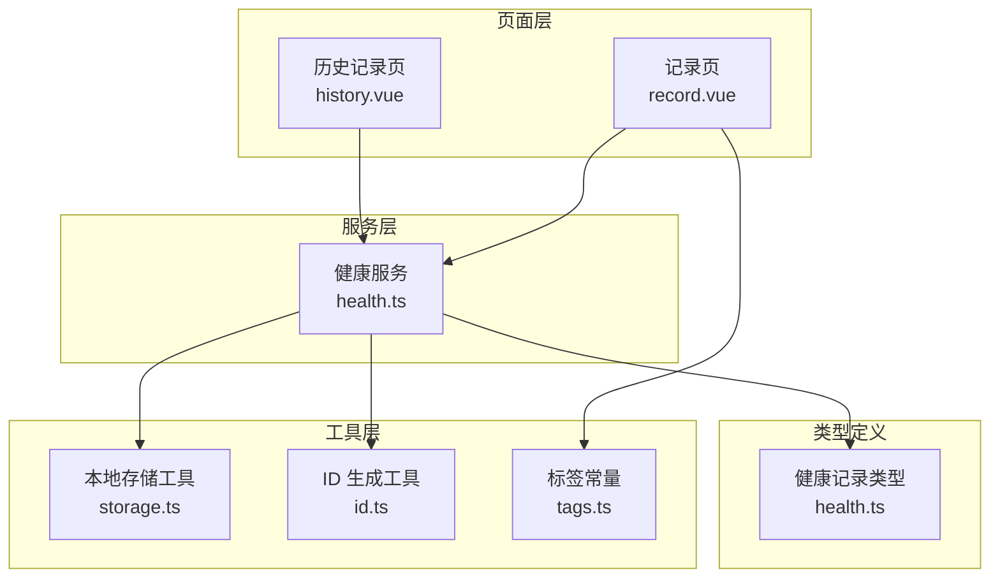
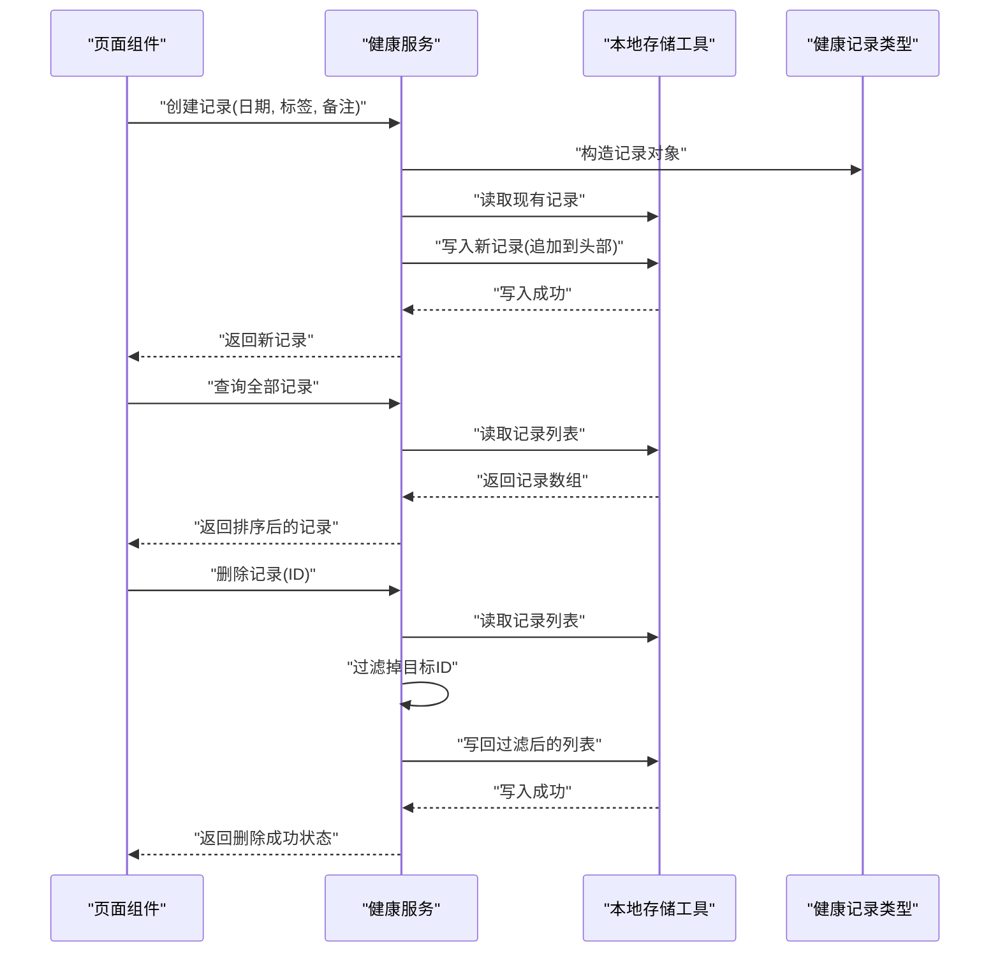
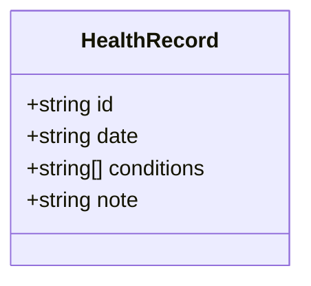
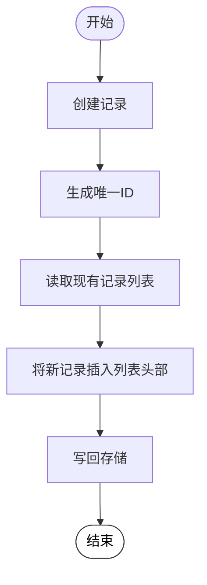
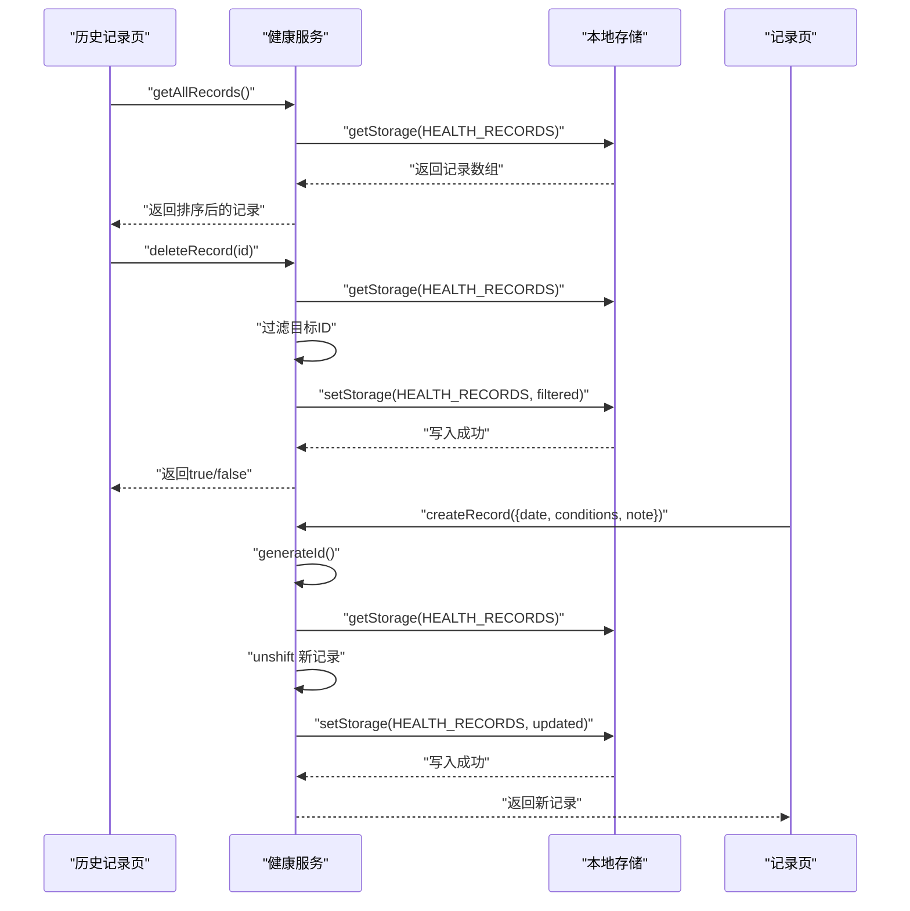
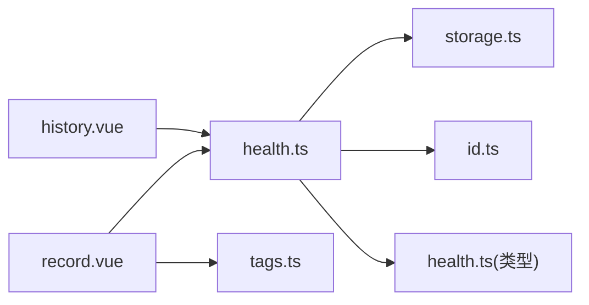

# 健康服务

<cite>
**本文引用的文件**
- [src/services/health.ts](file://src/services/health.ts)
- [src/types/health.ts](file://src/types/health.ts)
- [src/utils/storage.ts](file://src/utils/storage.ts)
- [src/pages/health/history.vue](file://src/pages/health/history.vue)
- [src/pages/health/record.vue](file://src/pages/health/record.vue)
- [src/constants/tags.ts](file://src/constants/tags.ts)
- [src/utils/id.ts](file://src/utils/id.ts)
- [package.json](file://package.json)
</cite>

## 目录
1. [简介](#简介)
2. [项目结构](#项目结构)
3. [核心组件](#核心组件)
4. [架构总览](#架构总览)
5. [详细组件分析](#详细组件分析)
6. [依赖关系分析](#依赖关系分析)
7. [性能考虑](#性能考虑)
8. [故障排查指南](#故障排查指南)
9. [结论](#结论)
10. [附录](#附录)

## 简介
本文件为 eat 项目的“健康服务”模块提供全面技术文档，重点围绕 HealthService 的架构设计与核心业务逻辑展开，涵盖健康记录的创建、查询、更新与删除流程；健康数据的统计分析与趋势管理；服务与数据模型的交互方式、数据验证规则与错误处理机制；完整的 API 接口说明；以及与本地存储工具的集成模式与数据一致性保障策略。文档同时提供可视化图示、使用示例与性能优化建议，帮助开发者快速理解与扩展该模块。

## 项目结构
健康服务模块采用“页面层 + 服务层 + 类型定义 + 工具层”的分层组织方式：
- 页面层：负责用户交互与视图渲染，分别在历史记录页与记录页中调用服务层接口。
- 服务层：封装对健康记录的增删改查与统计查询等业务逻辑。
- 类型定义：统一健康记录的数据结构与字段约束。
- 工具层：提供本地存储封装与唯一 ID 生成工具。

图表来源
- [src/pages/health/history.vue:34-82](file://src/pages/health/history.vue#L34-L82)
- [src/pages/health/record.vue:81-157](file://src/pages/health/record.vue#L81-L157)
- [src/services/health.ts:1-49](file://src/services/health.ts#L1-L49)
- [src/types/health.ts:1-7](file://src/types/health.ts#L1-L7)
- [src/utils/storage.ts:1-34](file://src/utils/storage.ts#L1-L34)
- [src/utils/id.ts:1-4](file://src/utils/id.ts#L1-L4)
- [src/constants/tags.ts:1-23](file://src/constants/tags.ts#L1-L23)

章节来源
- [src/pages/health/history.vue:1-177](file://src/pages/health/history.vue#L1-L177)
- [src/pages/health/record.vue:1-313](file://src/pages/health/record.vue#L1-L313)
- [src/services/health.ts:1-49](file://src/services/health.ts#L1-L49)
- [src/types/health.ts:1-7](file://src/types/health.ts#L1-L7)
- [src/utils/storage.ts:1-34](file://src/utils/storage.ts#L1-L34)
- [src/utils/id.ts:1-4](file://src/utils/id.ts#L1-L4)
- [src/constants/tags.ts:1-23](file://src/constants/tags.ts#L1-L23)

## 核心组件
- 健康记录类型：定义了记录的唯一标识、日期、状况标签集合与备注字段。
- 健康服务：提供记录全量查询、按 ID 查询、创建、删除、最新记录查询、按日期范围查询、按年月查询等能力。
- 本地存储工具：提供统一的读写与删除封装，并对异常进行捕获与降级处理。
- ID 生成工具：基于时间戳与随机字符串生成唯一 ID。
- 页面组件：历史记录页负责展示与删除；记录页负责标签选择、自定义标签维护与保存。

章节来源
- [src/types/health.ts:1-7](file://src/types/health.ts#L1-L7)
- [src/services/health.ts:1-49](file://src/services/health.ts#L1-L49)
- [src/utils/storage.ts:1-34](file://src/utils/storage.ts#L1-L34)
- [src/utils/id.ts:1-4](file://src/utils/id.ts#L1-L4)
- [src/pages/health/history.vue:34-82](file://src/pages/health/history.vue#L34-L82)
- [src/pages/health/record.vue:81-157](file://src/pages/health/record.vue#L81-L157)

## 架构总览
健康服务采用“纯前端本地存储”的架构，所有数据均通过 uni-app 的本地存储 API 进行持久化，无需后端服务参与。页面通过服务层暴露的函数完成数据读写与统计查询，服务层内部依赖本地存储工具与 ID 生成工具。

图表来源
- [src/services/health.ts:5-49](file://src/services/health.ts#L5-L49)
- [src/utils/storage.ts:7-25](file://src/utils/storage.ts#L7-L25)
- [src/types/health.ts:1-7](file://src/types/health.ts#L1-L7)

## 详细组件分析

### 健康记录类型与数据模型
- 字段定义
  - id: 字符串，唯一标识
  - date: 字符串，格式为 YYYY-MM-DD
  - conditions: 字符串数组，当前状况标签列表
  - note: 字符串，备注
- 数据模型复杂度
  - 模型本身为简单扁平结构，序列化/反序列化开销极低。
  - 列表查询与过滤的时间复杂度为 O(n)，其中 n 为记录总数。

图表来源
- [src/types/health.ts:1-7](file://src/types/health.ts#L1-L7)

章节来源
- [src/types/health.ts:1-7](file://src/types/health.ts#L1-L7)

### 健康服务 API 定义与实现
- 全部记录查询
  - 方法：getAllRecords()
  - 输入：无
  - 返回：HealthRecord[]
  - 实现要点：从本地存储读取数组，若不存在则返回空数组
- 按 ID 查询
  - 方法：getRecordById(id: string)
  - 输入：记录 ID
  - 返回：HealthRecord | undefined
  - 实现要点：遍历列表查找匹配项
- 创建记录
  - 方法：createRecord(data: Omit<HealthRecord, 'id'>)
  - 输入：不包含 id 的记录数据
  - 返回：HealthRecord（含生成的唯一 ID）
  - 实现要点：生成 ID，将新记录插入列表头部，写回存储
- 删除记录
  - 方法：deleteRecord(id: string)
  - 输入：记录 ID
  - 返回：boolean（是否发生删除）
  - 实现要点：过滤掉目标 ID，若长度未变则表示未找到
- 最新记录查询
  - 方法：getLatestRecord()
  - 输入：无
  - 返回：HealthRecord | undefined
  - 实现要点：按日期倒序取第一个
- 按日期范围查询
  - 方法：getRecordsByDateRange(startDate: string, endDate: string)
  - 输入：起止日期字符串（YYYY-MM-DD）
  - 返回：HealthRecord[]
  - 实现要点：字符串比较筛选
- 按年月查询
  - 方法：getRecordsByMonth(year: number, month: number)
  - 输入：年份与月份
  - 返回：HealthRecord[]
  - 实现要点：拼接前缀 YYYY-MM 后进行前缀匹配

图表来源
- [src/services/health.ts:14-23](file://src/services/health.ts#L14-L23)
- [src/utils/id.ts:1-4](file://src/utils/id.ts#L1-L4)
- [src/utils/storage.ts:19-25](file://src/utils/storage.ts#L19-L25)

章节来源
- [src/services/health.ts:1-49](file://src/services/health.ts#L1-L49)
- [src/utils/id.ts:1-4](file://src/utils/id.ts#L1-L4)
- [src/utils/storage.ts:1-34](file://src/utils/storage.ts#L1-L34)

### 页面组件与服务交互
- 历史记录页
  - 功能：展示所有记录，支持长按或点击删除，跳转至记录页
  - 关键交互：加载全部记录并按日期倒序排列；删除时弹窗确认；删除成功提示
- 记录页
  - 功能：选择日期、选择/添加自定义标签、输入备注、保存记录
  - 关键交互：标签分组展示与多选；自定义标签去重与持久化；保存成功后跳转首页

图表来源
- [src/pages/health/history.vue:34-82](file://src/pages/health/history.vue#L34-L82)
- [src/pages/health/record.vue:81-157](file://src/pages/health/record.vue#L81-L157)
- [src/services/health.ts:5-49](file://src/services/health.ts#L5-L49)
- [src/utils/storage.ts:7-25](file://src/utils/storage.ts#L7-L25)

章节来源
- [src/pages/health/history.vue:1-177](file://src/pages/health/history.vue#L1-L177)
- [src/pages/health/record.vue:1-313](file://src/pages/health/record.vue#L1-L313)
- [src/services/health.ts:1-49](file://src/services/health.ts#L1-L49)
- [src/utils/storage.ts:1-34](file://src/utils/storage.ts#L1-L34)

### 数据验证与错误处理
- 数据验证
  - 日期格式：YYYY-MM-DD 字符串，用于范围与前缀匹配
  - 标签集合：字符串数组，允许重复但页面层面通过去重避免重复选择
  - 备注：字符串，最大长度限制由页面输入控件约束
- 错误处理
  - 存储读取：若存储为空或解析失败，返回默认值
  - 存储写入：捕获异常并输出错误日志，不影响业务主流程
  - 删除判断：若过滤后长度不变，视为未找到目标记录，返回 false

章节来源
- [src/utils/storage.ts:7-25](file://src/utils/storage.ts#L7-L25)
- [src/services/health.ts:25-31](file://src/services/health.ts#L25-L31)

### 统计分析与趋势管理
- 历史记录管理
  - 全量查询：直接返回存储中的完整列表
  - 最新记录：按日期倒序取首条
  - 日期范围查询：基于字符串比较筛选
  - 年月查询：基于前缀匹配筛选
- 趋势分析
  - 当前实现：通过日期范围与年月查询组合，可实现按周/月趋势的聚合统计
  - 建议：可在服务层新增按标签出现频次统计、连续天数变化等高级分析函数

章节来源
- [src/services/health.ts:33-48](file://src/services/health.ts#L33-L48)

### 本地存储集成与一致性保证
- 存储键名：统一定义于 STORAGE_KEYS，避免硬编码
- 读写封装：getStorage/setStorage/removeStorage 提供统一接口与异常捕获
- 一致性策略
  - 写入原子性：单次 setStorage 覆盖写入，避免并发覆盖问题
  - 读写一致性：读取与写入均通过同一工具函数，减少不一致风险
  - 默认值策略：读取失败或空值时返回默认值，确保 UI 正常渲染

章节来源
- [src/utils/storage.ts:1-34](file://src/utils/storage.ts#L1-L34)

## 依赖关系分析
- 页面依赖服务：history.vue 与 record.vue 通过 import 方式依赖 health.ts
- 服务依赖工具：health.ts 依赖 storage.ts 与 id.ts
- 类型依赖：health.ts 依赖 health.ts 类型定义
- 常量依赖：record.vue 依赖 tags.ts 中的标签分组与默认标签

图表来源
- [src/pages/health/history.vue:34-38](file://src/pages/health/history.vue#L34-L38)
- [src/pages/health/record.vue:84-86](file://src/pages/health/record.vue#L84-L86)
- [src/services/health.ts:1-3](file://src/services/health.ts#L1-L3)
- [src/utils/storage.ts:1-5](file://src/utils/storage.ts#L1-L5)
- [src/utils/id.ts:1-4](file://src/utils/id.ts#L1-L4)
- [src/types/health.ts:1-7](file://src/types/health.ts#L1-L7)
- [src/constants/tags.ts:1-23](file://src/constants/tags.ts#L1-L23)

章节来源
- [src/pages/health/history.vue:34-38](file://src/pages/health/history.vue#L34-L38)
- [src/pages/health/record.vue:84-86](file://src/pages/health/record.vue#L84-L86)
- [src/services/health.ts:1-3](file://src/services/health.ts#L1-L3)
- [src/utils/storage.ts:1-5](file://src/utils/storage.ts#L1-L5)
- [src/utils/id.ts:1-4](file://src/utils/id.ts#L1-L4)
- [src/types/health.ts:1-7](file://src/types/health.ts#L1-L7)
- [src/constants/tags.ts:1-23](file://src/constants/tags.ts#L1-L23)

## 性能考虑
- 时间复杂度
  - 全量查询与删除：O(n)
  - 按 ID 查询：O(n)
  - 最新记录：O(n)
  - 日期范围与年月查询：O(n)
- 空间复杂度
  - 存储层：线性存储记录数组
- 优化建议
  - 分页加载：当记录数量增长时，引入分页或虚拟滚动
  - 索引缓存：为高频查询（如最近记录）增加内存缓存
  - 批量写入：合并多次写入操作，减少存储抖动
  - 增量更新：删除与更新改为局部替换，避免整表重写
  - 异步写入：在主线程空闲时异步落盘，提升交互流畅度

## 故障排查指南
- 无法读取记录
  - 检查 STORAGE_KEYS.HEALTH_RECORDS 是否正确
  - 确认本地存储未被清理或异常
- 保存失败
  - 查看控制台是否有存储写入错误日志
  - 确认设备存储空间充足
- 删除无效
  - 确认传入的 ID 是否正确
  - 检查过滤逻辑是否生效
- 标签重复或冲突
  - 页面层已做去重处理，检查自定义标签输入与默认标签冲突逻辑

章节来源
- [src/utils/storage.ts:7-25](file://src/utils/storage.ts#L7-L25)
- [src/services/health.ts:25-31](file://src/services/health.ts#L25-L31)
- [src/pages/health/record.vue:115-129](file://src/pages/health/record.vue#L115-L129)

## 结论
健康服务模块以简洁的分层架构实现了健康记录的全生命周期管理，结合本地存储工具提供了可靠的持久化能力。当前实现满足基础场景需求，后续可在统计分析、性能优化与一致性保障方面进一步增强，以支撑更大规模的数据与更复杂的业务场景。

## 附录

### API 接口文档
- getAllRecords()
  - 描述：获取全部健康记录
  - 参数：无
  - 返回：HealthRecord[]
  - 异常：无抛出，读取失败返回空数组
- getRecordById(id: string)
  - 描述：按 ID 获取记录
  - 参数：id: string
  - 返回：HealthRecord | undefined
  - 异常：无抛出
- createRecord(data: Omit<HealthRecord, 'id'>)
  - 描述：创建新记录
  - 参数：data: 不包含 id 的记录数据
  - 返回：HealthRecord（含生成的唯一 ID）
  - 异常：无抛出
- deleteRecord(id: string)
  - 描述：删除指定记录
  - 参数：id: string
  - 返回：boolean（是否发生删除）
  - 异常：无抛出
- getLatestRecord()
  - 描述：获取最新记录
  - 参数：无
  - 返回：HealthRecord | undefined
  - 异常：无抛出
- getRecordsByDateRange(startDate: string, endDate: string)
  - 描述：按日期范围查询
  - 参数：startDate: string, endDate: string
  - 返回：HealthRecord[]
  - 异常：无抛出
- getRecordsByMonth(year: number, month: number)
  - 描述：按年月查询
  - 参数：year: number, month: number
  - 返回：HealthRecord[]
  - 异常：无抛出

章节来源
- [src/services/health.ts:5-49](file://src/services/health.ts#L5-L49)

### 使用示例
- 在历史页中加载并展示记录
  - 参考路径：[src/pages/health/history.vue:42-47](file://src/pages/health/history.vue#L42-L47)
- 在记录页中保存新记录
  - 参考路径：[src/pages/health/record.vue:131-152](file://src/pages/health/record.vue#L131-L152)
- 在服务层中创建记录
  - 参考路径：[src/services/health.ts:14-23](file://src/services/health.ts#L14-L23)

### 数据持久化策略
- 使用统一的本地存储键名与读写封装
- 写入时采用覆盖写入，保证原子性
- 读取时提供默认值，确保 UI 稳定

章节来源
- [src/utils/storage.ts:1-34](file://src/utils/storage.ts#L1-L34)

### 性能优化建议
- 引入内存缓存与懒加载
- 对高频查询结果进行索引
- 减少不必要的整表重写
- 异步化存储写入