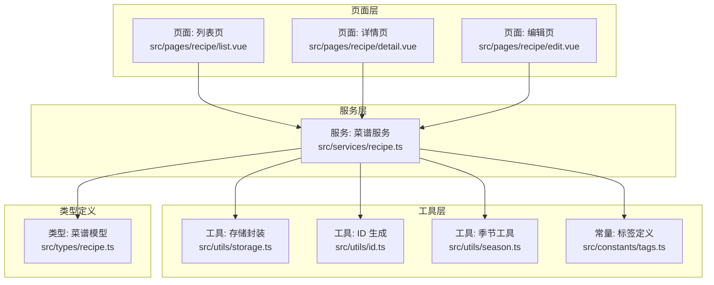
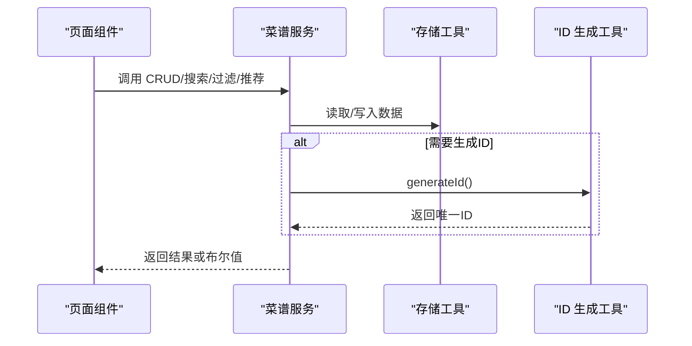
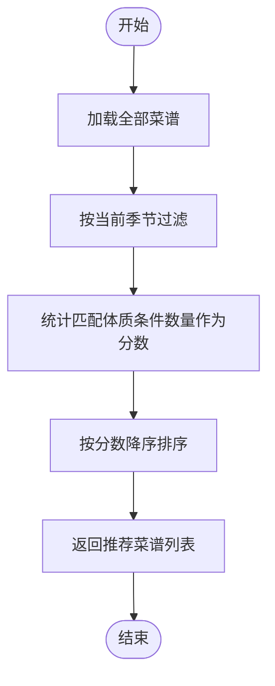
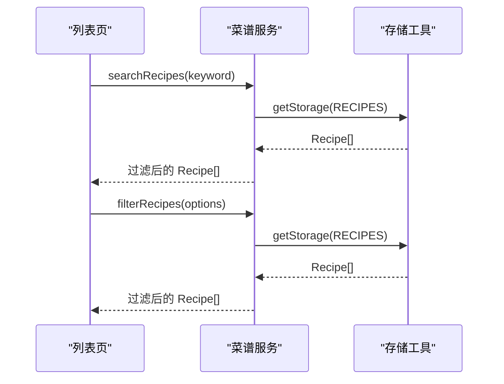
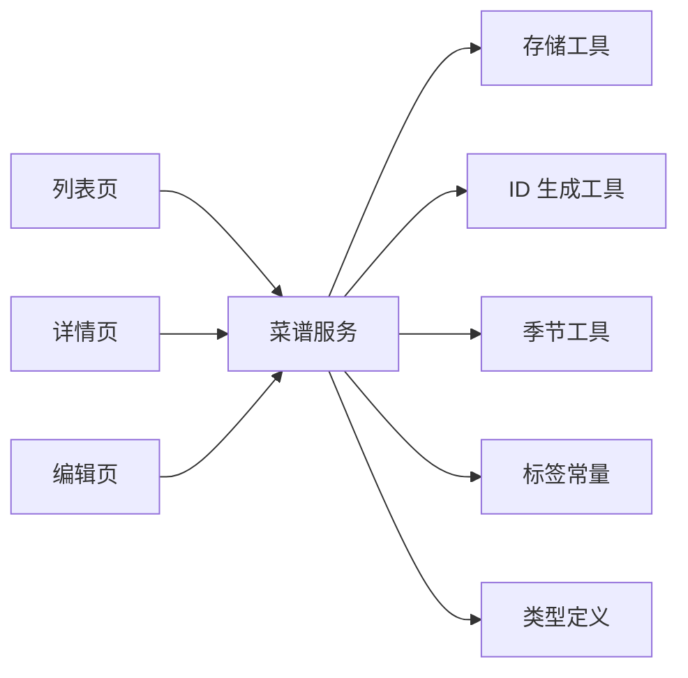

# 菜谱服务

<cite>
**本文引用的文件**
- [src/services/recipe.ts](file://src/services/recipe.ts)
- [src/types/recipe.ts](file://src/types/recipe.ts)
- [src/utils/storage.ts](file://src/utils/storage.ts)
- [src/utils/id.ts](file://src/utils/id.ts)
- [src/utils/season.ts](file://src/utils/season.ts)
- [src/constants/tags.ts](file://src/constants/tags.ts)
- [src/pages/recipe/list.vue](file://src/pages/recipe/list.vue)
- [src/pages/recipe/detail.vue](file://src/pages/recipe/detail.vue)
- [src/pages/recipe/edit.vue](file://src/pages/recipe/edit.vue)
- [package.json](file://package.json)
- [src/main.ts](file://src/main.ts)
</cite>

## 目录
1. [简介](#简介)
2. [项目结构](#项目结构)
3. [核心组件](#核心组件)
4. [架构总览](#架构总览)
5. [详细组件分析](#详细组件分析)
6. [依赖关系分析](#依赖关系分析)
7. [性能考量](#性能考量)
8. [故障排查指南](#故障排查指南)
9. [结论](#结论)
10. [附录](#附录)

## 简介
本技术文档围绕 eat 项目的“菜谱服务”进行深入解析，重点覆盖以下方面：
- RecipeService 的完整实现与使用方式：getAllRecipes、getRecipeById、createRecipe、updateRecipe、deleteRecipe
- 菜谱搜索与过滤：searchRecipes 的关键词匹配算法、filterRecipes 的过滤机制
- 智能推荐：getRecommendedRecipes 的评分算法（季节匹配与体质条件匹配）
- 完整 API 接口文档：参数类型、返回值结构、异常处理
- 性能优化建议与数据持久化策略
- 与存储工具与 ID 生成工具的集成方式

## 项目结构
该项目采用基于 Vue 3 + UniApp 的跨端应用架构，菜谱服务位于 src/services/recipe.ts，数据模型定义于 src/types/recipe.ts，通用工具位于 src/utils 下，页面组件位于 src/pages/recipe 下。



图表来源
- [src/pages/recipe/list.vue:114-213](file://src/pages/recipe/list.vue#L114-L213)
- [src/pages/recipe/detail.vue:115-187](file://src/pages/recipe/detail.vue#L115-L187)
- [src/pages/recipe/edit.vue:189-394](file://src/pages/recipe/edit.vue#L189-L394)
- [src/services/recipe.ts:1-103](file://src/services/recipe.ts#L1-L103)
- [src/utils/storage.ts:1-34](file://src/utils/storage.ts#L1-L34)
- [src/utils/id.ts:1-4](file://src/utils/id.ts#L1-L4)
- [src/utils/season.ts:1-34](file://src/utils/season.ts#L1-L34)
- [src/constants/tags.ts:1-23](file://src/constants/tags.ts#L1-L23)
- [src/types/recipe.ts:1-15](file://src/types/recipe.ts#L1-L15)

章节来源
- [src/services/recipe.ts:1-103](file://src/services/recipe.ts#L1-L103)
- [src/types/recipe.ts:1-15](file://src/types/recipe.ts#L1-L15)
- [src/utils/storage.ts:1-34](file://src/utils/storage.ts#L1-L34)
- [src/utils/id.ts:1-4](file://src/utils/id.ts#L1-L4)
- [src/utils/season.ts:1-34](file://src/utils/season.ts#L1-L34)
- [src/constants/tags.ts:1-23](file://src/constants/tags.ts#L1-L23)
- [src/pages/recipe/list.vue:114-213](file://src/pages/recipe/list.vue#L114-L213)
- [src/pages/recipe/detail.vue:115-187](file://src/pages/recipe/detail.vue#L115-L187)
- [src/pages/recipe/edit.vue:189-394](file://src/pages/recipe/edit.vue#L189-L394)

## 核心组件
- 菜谱服务（RecipeService）：提供 CRUD、搜索、过滤、推荐等能力，统一管理本地存储与 ID 生成。
- 数据模型（Recipe）：定义菜谱字段及季节枚举。
- 存储工具（Storage）：封装 uni 存储接口，提供键空间与错误兜底。
- ID 生成工具（generateId）：生成唯一字符串 ID。
- 季节工具（Season Utils）：当前季节识别、颜色与表情映射。
- 标签常量（CONDITION_TAG_GROUPS、RECIPE_TAGS）：预置标签与分组，供页面与服务使用。

章节来源
- [src/services/recipe.ts:1-103](file://src/services/recipe.ts#L1-L103)
- [src/types/recipe.ts:1-15](file://src/types/recipe.ts#L1-L15)
- [src/utils/storage.ts:1-34](file://src/utils/storage.ts#L1-L34)
- [src/utils/id.ts:1-4](file://src/utils/id.ts#L1-L4)
- [src/utils/season.ts:1-34](file://src/utils/season.ts#L1-L34)
- [src/constants/tags.ts:1-23](file://src/constants/tags.ts#L1-L23)

## 架构总览
菜谱服务通过统一的函数式 API 对外暴露能力，内部依赖存储工具与 ID 工具完成数据持久化与标识生成。页面组件通过调用服务函数实现业务交互，如列表页的搜索与筛选、详情页的查看与删除、编辑页的新增与更新。



图表来源
- [src/services/recipe.ts:1-103](file://src/services/recipe.ts#L1-L103)
- [src/utils/storage.ts:1-34](file://src/utils/storage.ts#L1-L34)
- [src/utils/id.ts:1-4](file://src/utils/id.ts#L1-L4)

## 详细组件分析

### 菜谱服务（RecipeService）实现详解
- 数据模型与类型
  - 菜谱字段：id、name、ingredients、steps、seasons、conditions、tags、image、createdAt、updatedAt
  - 季节枚举：'春' | '夏' | '秋' | '冬'
- CRUD 方法
  - getAllRecipes：从本地存储读取菜谱数组
  - getRecipeById：根据 id 查找单个菜谱
  - createRecipe：生成唯一 ID，设置创建/更新时间，插入到数组头部并持久化
  - updateRecipe：定位索引，合并更新字段并更新时间，持久化
  - deleteRecipe：过滤掉指定 id 的菜谱，若长度未变则视为未找到
- 搜索与过滤
  - searchRecipes：对名称与食材进行不区分大小写的包含匹配
  - filterRecipes：支持按季节、体质条件、自定义标签三类维度的交集过滤
- 智能推荐
  - getRecommendedRecipes：先按当前季节过滤，再统计匹配的体质条件数量作为分数，按分数降序排序返回



图表来源
- [src/services/recipe.ts:87-102](file://src/services/recipe.ts#L87-L102)

章节来源
- [src/services/recipe.ts:1-103](file://src/services/recipe.ts#L1-L103)
- [src/types/recipe.ts:1-15](file://src/types/recipe.ts#L1-L15)

### API 接口文档

- getAllRecipes
  - 功能：获取全部菜谱
  - 参数：无
  - 返回：Recipe[]
  - 异常：无抛出，空数据返回空数组
  - 使用场景：页面初始化、刷新列表
  - 复杂度：O(n)，n 为菜谱数量
  - 章节来源
    - [src/services/recipe.ts:5-7](file://src/services/recipe.ts#L5-L7)

- getRecipeById(id)
  - 功能：按 id 获取单个菜谱
  - 参数：id: string
  - 返回：Recipe | undefined
  - 异常：无抛出，未命中返回 undefined
  - 使用场景：详情页加载
  - 复杂度：O(n)
  - 章节来源
    - [src/services/recipe.ts:9-12](file://src/services/recipe.ts#L9-L12)

- createRecipe(data)
  - 功能：创建新菜谱
  - 参数：data 为 Recipe 去除 id、createdAt、updatedAt 后的字段
  - 返回：Recipe
  - 异常：无抛出，创建后立即持久化
  - 使用场景：编辑页保存新建
  - 复杂度：O(n)
  - 章节来源
    - [src/services/recipe.ts:14-26](file://src/services/recipe.ts#L14-L26)
    - [src/utils/id.ts:1-4](file://src/utils/id.ts#L1-L4)

- updateRecipe(id, data)
  - 功能：更新现有菜谱
  - 参数：id: string；data: 部分字段（去重 id、createdAt、updatedAt）
  - 返回：Recipe | undefined（未找到返回 undefined）
  - 异常：无抛出，未找到返回 undefined
  - 使用场景：编辑页保存修改
  - 复杂度：O(n)
  - 章节来源
    - [src/services/recipe.ts:28-43](file://src/services/recipe.ts#L28-L43)

- deleteRecipe(id)
  - 功能：删除菜谱
  - 参数：id: string
  - 返回：boolean（true 表示删除成功）
  - 异常：无抛出，未找到返回 false
  - 使用场景：详情页删除
  - 复杂度：O(n)
  - 章节来源
    - [src/services/recipe.ts:45-51](file://src/services/recipe.ts#L45-L51)

- searchRecipes(keyword)
  - 功能：按关键词搜索菜谱（菜名或食材）
  - 参数：keyword: string
  - 返回：Recipe[]
  - 异常：无抛出，空关键词返回全部
  - 使用场景：列表页搜索框
  - 复杂度：O(n·m)，n 为菜谱数，m 为平均食材数量
  - 章节来源
    - [src/services/recipe.ts:53-62](file://src/services/recipe.ts#L53-L62)

- filterRecipes(options)
  - 功能：多维过滤（季节、体质条件、自定义标签）
  - 参数：options = { seasons?: Season[]; conditions?: string[]; tags?: string[] }
  - 返回：Recipe[]
  - 异常：无抛出
  - 使用场景：列表页筛选器
  - 复杂度：O(n·k)，k 为过滤条件数量
  - 章节来源
    - [src/services/recipe.ts:64-85](file://src/services/recipe.ts#L64-L85)

- getRecommendedRecipes(season, conditions)
  - 功能：按季节与体质条件匹配度进行智能推荐
  - 参数：season: Season；conditions: string[]
  - 返回：Recipe[]
  - 异常：无抛出
  - 使用场景：首页或推荐模块
  - 复杂度：O(n·c + n log n)，c 为条件数量，排序 O(n log n)
  - 章节来源
    - [src/services/recipe.ts:87-102](file://src/services/recipe.ts#L87-L102)

### 页面与服务的交互流程

- 列表页（搜索与筛选）
  - 关键点：支持关键词搜索与多维筛选；当存在关键词时，先执行搜索，再在搜索结果上做二次筛选；否则直接执行 filterRecipes
  - 章节来源
    - [src/pages/recipe/list.vue:139-170](file://src/pages/recipe/list.vue#L139-L170)

- 详情页（查看与删除）
  - 关键点：根据 id 获取菜谱；删除前弹窗确认；删除成功后返回列表
  - 章节来源
    - [src/pages/recipe/detail.vue:115-187](file://src/pages/recipe/detail.vue#L115-L187)

- 编辑页（新增与更新）
  - 关键点：校验必填项；保存时根据是否存在 id 决定新增或更新；图片可上传并转为 base64
  - 章节来源
    - [src/pages/recipe/edit.vue:189-394](file://src/pages/recipe/edit.vue#L189-L394)



图表来源
- [src/pages/recipe/list.vue:139-170](file://src/pages/recipe/list.vue#L139-L170)
- [src/services/recipe.ts:53-85](file://src/services/recipe.ts#L53-L85)
- [src/utils/storage.ts:7-17](file://src/utils/storage.ts#L7-L17)

## 依赖关系分析
- 组件耦合
  - 服务层仅依赖工具层与类型定义，耦合度低，便于测试与替换
  - 页面层通过服务层间接依赖存储与 ID 工具，职责清晰
- 直接依赖
  - 服务层依赖：存储工具（读写）、ID 生成工具（新增时）、季节工具（推荐）、标签常量（页面渲染）
- 外部依赖
  - uni-app 提供的存储 API（同步存取）、页面生命周期钩子、导航 API



图表来源
- [src/pages/recipe/list.vue:114-213](file://src/pages/recipe/list.vue#L114-L213)
- [src/pages/recipe/detail.vue:115-187](file://src/pages/recipe/detail.vue#L115-L187)
- [src/pages/recipe/edit.vue:189-394](file://src/pages/recipe/edit.vue#L189-L394)
- [src/services/recipe.ts:1-103](file://src/services/recipe.ts#L1-L103)
- [src/utils/storage.ts:1-34](file://src/utils/storage.ts#L1-L34)
- [src/utils/id.ts:1-4](file://src/utils/id.ts#L1-L4)
- [src/utils/season.ts:1-34](file://src/utils/season.ts#L1-L34)
- [src/constants/tags.ts:1-23](file://src/constants/tags.ts#L1-L23)
- [src/types/recipe.ts:1-15](file://src/types/recipe.ts#L1-L15)

章节来源
- [src/services/recipe.ts:1-103](file://src/services/recipe.ts#L1-L103)
- [src/utils/storage.ts:1-34](file://src/utils/storage.ts#L1-L34)
- [src/utils/id.ts:1-4](file://src/utils/id.ts#L1-L4)
- [src/utils/season.ts:1-34](file://src/utils/season.ts#L1-L34)
- [src/constants/tags.ts:1-23](file://src/constants/tags.ts#L1-L23)
- [src/types/recipe.ts:1-15](file://src/types/recipe.ts#L1-L15)
- [src/pages/recipe/list.vue:114-213](file://src/pages/recipe/list.vue#L114-L213)
- [src/pages/recipe/detail.vue:115-187](file://src/pages/recipe/detail.vue#L115-L187)
- [src/pages/recipe/edit.vue:189-394](file://src/pages/recipe/edit.vue#L189-L394)

## 性能考量
- 时间复杂度
  - CRUD：O(n)（遍历数组）
  - searchRecipes：O(n·m)（逐条检查 name 与每个食材）
  - filterRecipes：O(n·k)（逐条检查多个维度）
  - getRecommendedRecipes：O(n·c + n log n)（匹配计分 + 排序）
- 空间复杂度
  - 服务层不缓存，每次读取均从存储加载，内存占用稳定
- 优化建议
  - 将存储改为异步（Promise 包装），避免阻塞主线程
  - 在高频搜索场景下引入索引（如倒排索引）以降低搜索复杂度
  - 对 filterRecipes 增加“短路”策略：先按最稀疏维度过滤，减少后续计算
  - 对推荐算法增加权重因子（如季节权重、体质匹配权重），提升排序质量
  - 分页加载与虚拟滚动，减少一次性渲染大量节点
  - 图片采用懒加载与压缩，避免首屏阻塞

## 故障排查指南
- 存储异常
  - 现象：读取为空或报错
  - 排查：确认 uni 存储可用性、键名正确、JSON 解析异常
  - 参考
    - [src/utils/storage.ts:7-17](file://src/utils/storage.ts#L7-L17)
- ID 重复或冲突
  - 现象：新增菜谱后查询不到最新项
  - 排查：确认 generateId 的唯一性与存储写入顺序
  - 参考
    - [src/utils/id.ts:1-4](file://src/utils/id.ts#L1-L4)
    - [src/services/recipe.ts:14-26](file://src/services/recipe.ts#L14-L26)
- 删除无效
  - 现象：deleteRecipe 返回 false
  - 排查：确认传入 id 是否存在、是否被正确持久化
  - 参考
    - [src/services/recipe.ts:45-51](file://src/services/recipe.ts#L45-L51)
- 推荐结果为空
  - 现象：getRecommendedRecipes 返回空列表
  - 排查：确认当前季节是否匹配、用户体质条件是否存在于菜谱中
  - 参考
    - [src/services/recipe.ts:87-102](file://src/services/recipe.ts#L87-L102)
- 页面无法跳转或参数丢失
  - 现象：详情页/编辑页无法加载或显示错误
  - 排查：确认 uni 导航参数传递、页面生命周期钩子使用
  - 参考
    - [src/pages/recipe/detail.vue:134-145](file://src/pages/recipe/detail.vue#L134-L145)
    - [src/pages/recipe/edit.vue:225-242](file://src/pages/recipe/edit.vue#L225-L242)

章节来源
- [src/utils/storage.ts:7-17](file://src/utils/storage.ts#L7-L17)
- [src/utils/id.ts:1-4](file://src/utils/id.ts#L1-L4)
- [src/services/recipe.ts:45-51](file://src/services/recipe.ts#L45-L51)
- [src/services/recipe.ts:87-102](file://src/services/recipe.ts#L87-L102)
- [src/pages/recipe/detail.vue:134-145](file://src/pages/recipe/detail.vue#L134-L145)
- [src/pages/recipe/edit.vue:225-242](file://src/pages/recipe/edit.vue#L225-L242)

## 结论
本菜谱服务以简洁的函数式 API 实现了完整的 CRUD、搜索、过滤与推荐能力，并通过存储与 ID 工具实现了稳定的本地持久化。页面层通过服务层解耦，职责清晰、易于扩展。建议在高频场景下引入索引与异步存储、优化推荐算法权重，并结合分页与懒加载提升用户体验。

## 附录

### 数据模型定义
```mermaid
classDiagram
class Season {
<<enumeration>>
"春"
"夏"
"秋"
"冬"
}
class Recipe {
+string id
+string name
+string[] ingredients
+string steps
+Season[] seasons
+string[] conditions
+string[] tags
+string image
+number createdAt
+number updatedAt
}
```

图表来源
- [src/types/recipe.ts:1-15](file://src/types/recipe.ts#L1-L15)

### 季节工具与标签常量
- 季节工具：提供当前季节识别、颜色与表情映射、全季节枚举
- 标签常量：预置体质标签分组、默认标签集合、菜谱常用标签

章节来源
- [src/utils/season.ts:1-34](file://src/utils/season.ts#L1-L34)
- [src/constants/tags.ts:1-23](file://src/constants/tags.ts#L1-L23)