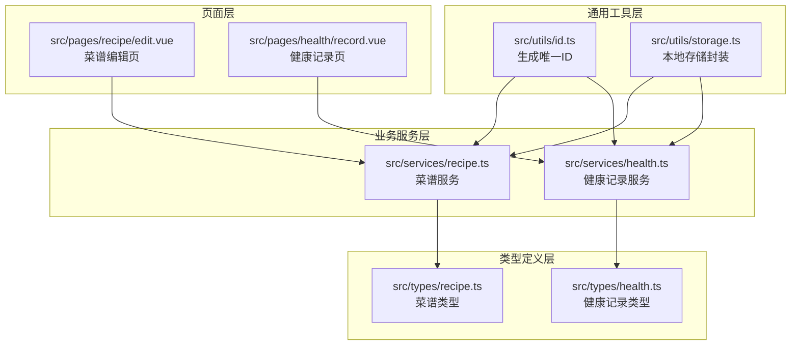
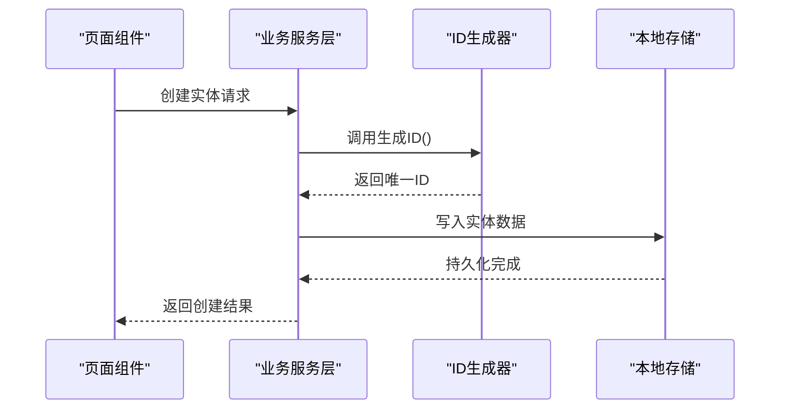
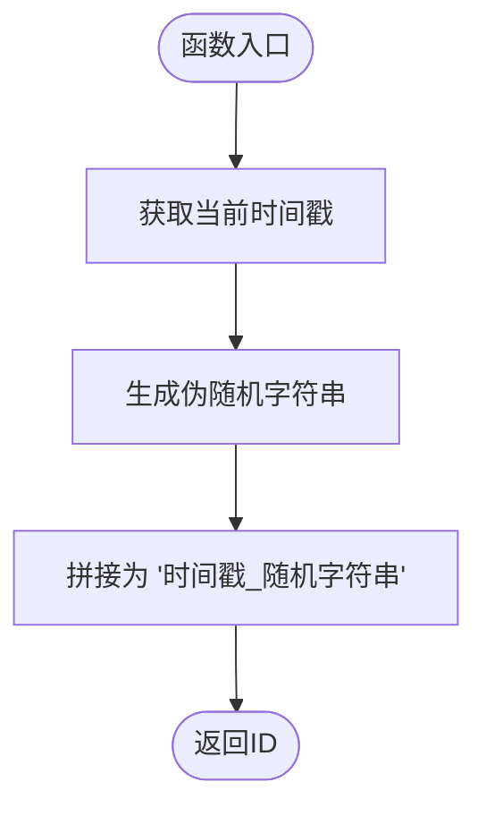
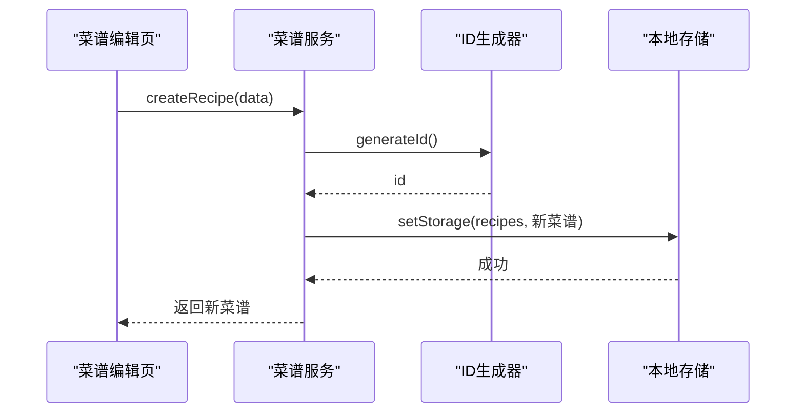
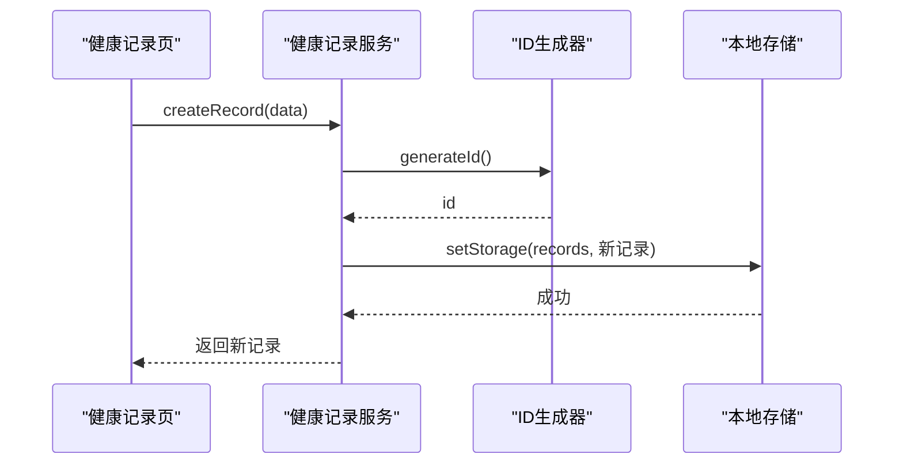
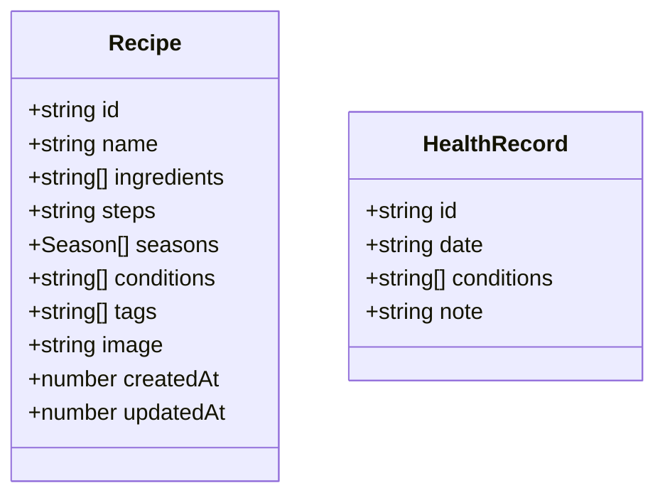
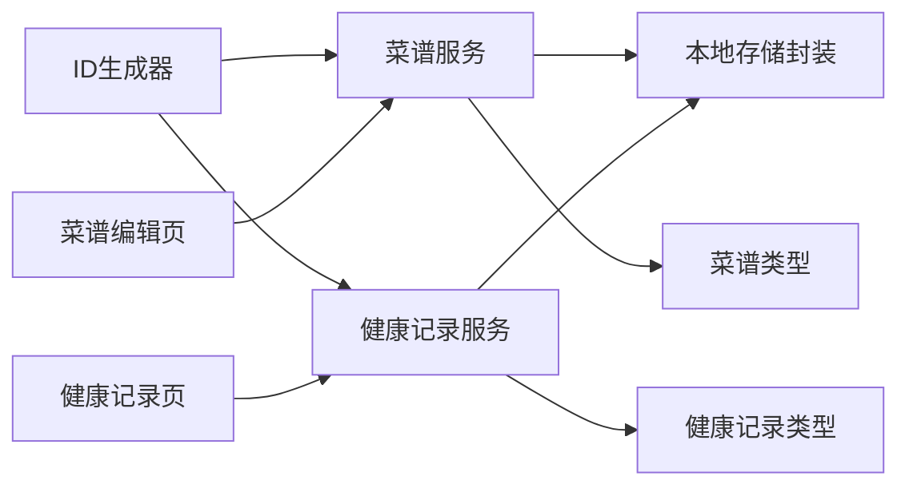

# ID 生成工具 (IdUtils)

<cite>
**本文档引用的文件**
- [src/utils/id.ts](file://src/utils/id.ts)
- [src/services/recipe.ts](file://src/services/recipe.ts)
- [src/services/health.ts](file://src/services/health.ts)
- [src/utils/storage.ts](file://src/utils/storage.ts)
- [src/types/recipe.ts](file://src/types/recipe.ts)
- [src/types/health.ts](file://src/types/health.ts)
- [src/pages/recipe/edit.vue](file://src/pages/recipe/edit.vue)
- [src/pages/health/record.vue](file://src/pages/health/record.vue)
- [src/constants/tags.ts](file://src/constants/tags.ts)
- [src/pages.json](file://src/pages.json)
- [package.json](file://package.json)
</cite>

## 目录
1. [简介](#简介)
2. [项目结构](#项目结构)
3. [核心组件](#核心组件)
4. [架构总览](#架构总览)
5. [详细组件分析](#详细组件分析)
6. [依赖关系分析](#依赖关系分析)
7. [性能考量](#性能考量)
8. [故障排查指南](#故障排查指南)
9. [结论](#结论)
10. [附录](#附录)

## 简介
本文件系统化梳理并解释项目中的 ID 生成工具（IdUtils）的设计与实现，重点覆盖以下方面：
- 设计原理与实现机制：基于时间戳与伪随机字符串拼接的组合策略
- 唯一标识符生成算法与格式规范：字符串组成、长度范围与字符集规则
- 使用示例：菜谱 ID、健康记录 ID 的生成与应用
- 随机性保证、冲突规避与性能特征
- 分布式环境下的唯一性保障与扩展性建议
- ID 验证、解析与管理的最佳实践

## 项目结构
该项目采用前端多端统一框架（uni-app），围绕“食之有道”主题构建，包含菜谱与健康记录两大功能模块。ID 生成工具位于通用工具层，被业务服务层复用以生成各类实体的唯一标识。

图表来源
- [src/utils/id.ts:1-4](file://src/utils/id.ts#L1-L4)
- [src/utils/storage.ts:1-34](file://src/utils/storage.ts#L1-L34)
- [src/services/recipe.ts:1-103](file://src/services/recipe.ts#L1-L103)
- [src/services/health.ts:1-49](file://src/services/health.ts#L1-L49)
- [src/types/recipe.ts:1-15](file://src/types/recipe.ts#L1-L15)
- [src/types/health.ts:1-7](file://src/types/health.ts#L1-L7)
- [src/pages/recipe/edit.vue:1-702](file://src/pages/recipe/edit.vue#L1-L702)
- [src/pages/health/record.vue:1-313](file://src/pages/health/record.vue#L1-L313)

章节来源
- [src/utils/id.ts:1-4](file://src/utils/id.ts#L1-L4)
- [src/services/recipe.ts:1-103](file://src/services/recipe.ts#L1-L103)
- [src/services/health.ts:1-49](file://src/services/health.ts#L1-L49)
- [src/utils/storage.ts:1-34](file://src/utils/storage.ts#L1-L34)
- [src/types/recipe.ts:1-15](file://src/types/recipe.ts#L1-L15)
- [src/types/health.ts:1-7](file://src/types/health.ts#L1-L7)
- [src/pages/recipe/edit.vue:1-702](file://src/pages/recipe/edit.vue#L1-L702)
- [src/pages/health/record.vue:1-313](file://src/pages/health/record.vue#L1-L313)

## 核心组件
- ID 生成器（IdUtils）
  - 实现位置：[src/utils/id.ts:1-4](file://src/utils/id.ts#L1-L4)
  - 功能：生成形如“时间戳_随机字符串”的唯一标识符
  - 特点：简单、可读、便于调试；在单进程内具备高概率唯一性
- 业务服务层
  - 菜谱服务：负责菜谱实体的增删改查与推荐逻辑，使用 ID 生成器创建新菜谱
    - 参考：[src/services/recipe.ts:14-26](file://src/services/recipe.ts#L14-L26)
  - 健康记录服务：负责健康记录实体的增删查与时间范围查询，使用 ID 生成器创建新记录
    - 参考：[src/services/health.ts:14-23](file://src/services/health.ts#L14-L23)
- 类型定义
  - 菜谱类型：包含 id、name、ingredients、steps、seasons、conditions、tags、image、createdAt、updatedAt
    - 参考：[src/types/recipe.ts:3-14](file://src/types/recipe.ts#L3-L14)
  - 健康记录类型：包含 id、date、conditions、note
    - 参考：[src/types/health.ts:1-6](file://src/types/health.ts#L1-L6)
- 页面与交互
  - 菜谱编辑页：调用菜谱服务进行创建/更新，并通过 ID 进行定位
    - 参考：[src/pages/recipe/edit.vue:365-389](file://src/pages/recipe/edit.vue#L365-L389)
  - 健康记录页：调用健康记录服务进行创建
    - 参考：[src/pages/health/record.vue:131-151](file://src/pages/health/record.vue#L131-L151)

章节来源
- [src/utils/id.ts:1-4](file://src/utils/id.ts#L1-L4)
- [src/services/recipe.ts:14-26](file://src/services/recipe.ts#L14-L26)
- [src/services/health.ts:14-23](file://src/services/health.ts#L14-L23)
- [src/types/recipe.ts:3-14](file://src/types/recipe.ts#L3-L14)
- [src/types/health.ts:1-6](file://src/types/health.ts#L1-L6)
- [src/pages/recipe/edit.vue:365-389](file://src/pages/recipe/edit.vue#L365-L389)
- [src/pages/health/record.vue:131-151](file://src/pages/health/record.vue#L131-L151)

## 架构总览
ID 生成工具在系统中的调用链路如下：

图表来源
- [src/utils/id.ts:1-4](file://src/utils/id.ts#L1-L4)
- [src/services/recipe.ts:14-26](file://src/services/recipe.ts#L14-L26)
- [src/services/health.ts:14-23](file://src/services/health.ts#L14-L23)
- [src/utils/storage.ts:19-25](file://src/utils/storage.ts#L19-L25)

## 详细组件分析

### 组件A：ID 生成器（IdUtils）
- 设计原理
  - 时间戳前缀：确保 ID 在时间维度上的单调递增趋势，有利于排序与检索
  - 随机字符串后缀：使用伪随机数生成器，降低并发场景下的碰撞概率
  - 组合分隔符：下划线分隔，提升可读性与解析便利性
- 数据结构与复杂度
  - 输入：无
  - 输出：字符串（时间戳_随机字符串）
  - 时间复杂度：O(1)
  - 空间复杂度：O(1)
- 依赖关系
  - 依赖浏览器/运行时的时间与随机数能力
  - 不依赖外部状态，保持幂等性
- 错误处理
  - 无显式异常抛出，遵循“无副作用”的纯函数风格
- 性能特征
  - 生成开销极低，适合高频调用
  - 在单实例内具备高概率唯一性，但不保证绝对唯一

图表来源
- [src/utils/id.ts:1-4](file://src/utils/id.ts#L1-L4)

章节来源
- [src/utils/id.ts:1-4](file://src/utils/id.ts#L1-L4)

### 组件B：菜谱服务（RecipeService）
- 关键职责
  - 创建菜谱：生成唯一 ID 并写入存储
  - 查询/更新/删除：基于 ID 定位实体
  - 搜索与筛选：支持关键词与多维标签过滤
- ID 使用模式
  - 创建流程中调用 ID 生成器，随后写入存储
  - 参考：[src/services/recipe.ts:14-26](file://src/services/recipe.ts#L14-L26)
- 页面集成
  - 编辑页在保存时根据是否为编辑模式决定创建或更新
  - 参考：[src/pages/recipe/edit.vue:365-389](file://src/pages/recipe/edit.vue#L365-L389)

图表来源
- [src/services/recipe.ts:14-26](file://src/services/recipe.ts#L14-L26)
- [src/utils/id.ts:1-4](file://src/utils/id.ts#L1-L4)
- [src/utils/storage.ts:19-25](file://src/utils/storage.ts#L19-L25)

章节来源
- [src/services/recipe.ts:14-26](file://src/services/recipe.ts#L14-L26)
- [src/pages/recipe/edit.vue:365-389](file://src/pages/recipe/edit.vue#L365-L389)

### 组件C：健康记录服务（HealthService）
- 关键职责
  - 创建健康记录：生成唯一 ID 并写入存储
  - 查询最新记录与按日期范围查询
- ID 使用模式
  - 创建流程中调用 ID 生成器，随后写入存储
  - 参考：[src/services/health.ts:14-23](file://src/services/health.ts#L14-L23)

图表来源
- [src/services/health.ts:14-23](file://src/services/health.ts#L14-L23)
- [src/utils/id.ts:1-4](file://src/utils/id.ts#L1-L4)
- [src/utils/storage.ts:19-25](file://src/utils/storage.ts#L19-L25)

章节来源
- [src/services/health.ts:14-23](file://src/services/health.ts#L14-L23)
- [src/pages/health/record.vue:131-151](file://src/pages/health/record.vue#L131-L151)

### 组件D：类型模型（Recipe 与 HealthRecord）
- 菜谱类型
  - 字段：id、name、ingredients、steps、seasons、conditions、tags、image、createdAt、updatedAt
  - 参考：[src/types/recipe.ts:3-14](file://src/types/recipe.ts#L3-L14)
- 健康记录类型
  - 字段：id、date、conditions、note
  - 参考：[src/types/health.ts:1-6](file://src/types/health.ts#L1-L6)

图表来源
- [src/types/recipe.ts:3-14](file://src/types/recipe.ts#L3-L14)
- [src/types/health.ts:1-6](file://src/types/health.ts#L1-L6)

章节来源
- [src/types/recipe.ts:3-14](file://src/types/recipe.ts#L3-L14)
- [src/types/health.ts:1-6](file://src/types/health.ts#L1-L6)

### 组件E：页面与交互
- 菜谱编辑页
  - 表单校验与保存逻辑，保存时调用服务层创建/更新
  - 参考：[src/pages/recipe/edit.vue:348-389](file://src/pages/recipe/edit.vue#L348-L389)
- 健康记录页
  - 日期选择、标签选择与备注输入，保存时调用服务层创建
  - 参考：[src/pages/health/record.vue:131-151](file://src/pages/health/record.vue#L131-L151)

章节来源
- [src/pages/recipe/edit.vue:348-389](file://src/pages/recipe/edit.vue#L348-L389)
- [src/pages/health/record.vue:131-151](file://src/pages/health/record.vue#L131-L151)

## 依赖关系分析
- 组件耦合与内聚
  - ID 生成器高度内聚，仅依赖运行时时间与随机数
  - 业务服务层对 ID 生成器的依赖为单向、低耦合
- 直接与间接依赖
  - 业务服务层直接依赖 ID 生成器与本地存储封装
  - 页面层通过业务服务层间接依赖 ID 生成器
- 外部依赖
  - uni-app 运行时提供的存储 API（跨平台）

图表来源
- [src/utils/id.ts:1-4](file://src/utils/id.ts#L1-L4)
- [src/services/recipe.ts:1-103](file://src/services/recipe.ts#L1-L103)
- [src/services/health.ts:1-49](file://src/services/health.ts#L1-L49)
- [src/utils/storage.ts:1-34](file://src/utils/storage.ts#L1-L34)
- [src/types/recipe.ts:1-15](file://src/types/recipe.ts#L1-L15)
- [src/types/health.ts:1-7](file://src/types/health.ts#L1-L7)
- [src/pages/recipe/edit.vue:1-702](file://src/pages/recipe/edit.vue#L1-L702)
- [src/pages/health/record.vue:1-313](file://src/pages/health/record.vue#L1-L313)

章节来源
- [src/utils/id.ts:1-4](file://src/utils/id.ts#L1-L4)
- [src/services/recipe.ts:1-103](file://src/services/recipe.ts#L1-L103)
- [src/services/health.ts:1-49](file://src/services/health.ts#L1-L49)
- [src/utils/storage.ts:1-34](file://src/utils/storage.ts#L1-L34)
- [src/types/recipe.ts:1-15](file://src/types/recipe.ts#L1-L15)
- [src/types/health.ts:1-7](file://src/types/health.ts#L1-L7)
- [src/pages/recipe/edit.vue:1-702](file://src/pages/recipe/edit.vue#L1-L702)
- [src/pages/health/record.vue:1-313](file://src/pages/health/record.vue#L1-L313)

## 性能考量
- 生成成本
  - ID 生成为 O(1) 时间与空间复杂度，适合高频调用
- 冲突风险
  - 单实例内高概率唯一；跨实例或跨进程需额外保障
- 存储与序列化
  - 本地存储采用 JSON 序列化，注意字段类型一致性
- 并发场景
  - 同一毫秒内可能产生相同前缀，后缀随机性降低重复概率
- 建议
  - 若未来需要更强的全局唯一性，可引入雪花算法或 UUID v1/v4
  - 对于分布式部署，建议在网关或服务层统一分配前缀或使用数据库自增主键

[本节为通用性能讨论，无需特定文件引用]

## 故障排查指南
- ID 重复或冲突
  - 现象：同一毫秒内生成相同 ID
  - 排查：检查是否在同一毫秒内多次调用；必要时增加微小延迟或引入后缀计数
- ID 解析困难
  - 现象：无法从字符串中提取时间戳或随机部分
  - 排查：确认 ID 格式始终为“时间戳_随机字符串”
- 存储异常
  - 现象：写入失败或读取为空
  - 排查：检查本地存储封装的错误处理与默认值返回逻辑
  - 参考：[src/utils/storage.ts:7-25](file://src/utils/storage.ts#L7-L25)
- 页面未显示新 ID
  - 现象：创建后页面未刷新或未正确回显
  - 排查：确认服务层返回实体包含 id，页面正确绑定并导航

章节来源
- [src/utils/storage.ts:7-25](file://src/utils/storage.ts#L7-L25)

## 结论
- IdUtils 采用“时间戳_随机字符串”的简洁组合策略，在单实例内具备高概率唯一性与良好可读性
- 在菜谱与健康记录两大业务场景中，ID 生成器被稳定复用，支撑了实体的创建与管理
- 面向未来的分布式与高并发需求，建议评估引入更强的全局唯一性方案（如雪花算法或 UUID），并在网关层或服务层统一治理

[本节为总结性内容，无需特定文件引用]

## 附录

### ID 格式规范与字符集规则
- 组成结构
  - 前缀：时间戳（毫秒级）
  - 分隔符：下划线
  - 后缀：随机字符串（由伪随机数生成）
- 长度范围
  - 随机字符串长度受随机数生成策略影响，通常为若干字符
- 字符集规则
  - 时间戳部分：数字字符
  - 分隔符：下划线
  - 随机字符串部分：字母与数字（取决于随机数生成的进制表示）

章节来源
- [src/utils/id.ts:1-4](file://src/utils/id.ts#L1-L4)

### 使用示例（路径指引）
- 生成菜谱 ID
  - 调用位置：[src/services/recipe.ts:14-26](file://src/services/recipe.ts#L14-L26)
  - 页面触发：[src/pages/recipe/edit.vue:365-389](file://src/pages/recipe/edit.vue#L365-L389)
- 生成健康记录 ID
  - 调用位置：[src/services/health.ts:14-23](file://src/services/health.ts#L14-L23)
  - 页面触发：[src/pages/health/record.vue:131-151](file://src/pages/health/record.vue#L131-L151)

### 验证、解析与管理最佳实践
- 验证
  - 格式校验：确保包含且仅包含一个下划线分隔符
  - 类型校验：前缀应为数值型时间戳，后缀为字母数字组合
- 解析
  - 分割：按“_”分割为两部分
  - 提取：前缀用于排序与时间推断，后缀用于去重辅助
- 管理
  - 命名：保持一致的命名约定与分隔符
  - 存储：统一序列化与反序列化，确保类型安全
  - 兼容：若未来升级 ID 策略，保留旧格式解析兼容

章节来源
- [src/utils/id.ts:1-4](file://src/utils/id.ts#L1-L4)
- [src/utils/storage.ts:7-25](file://src/utils/storage.ts#L7-L25)