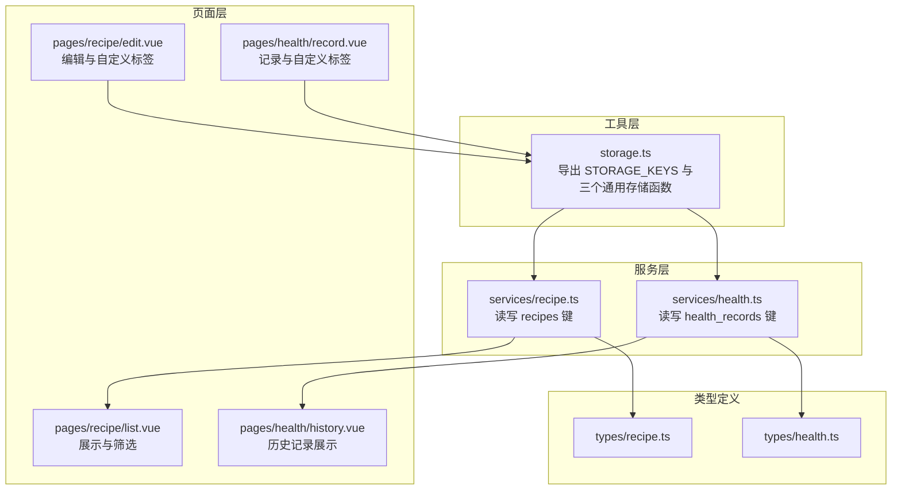
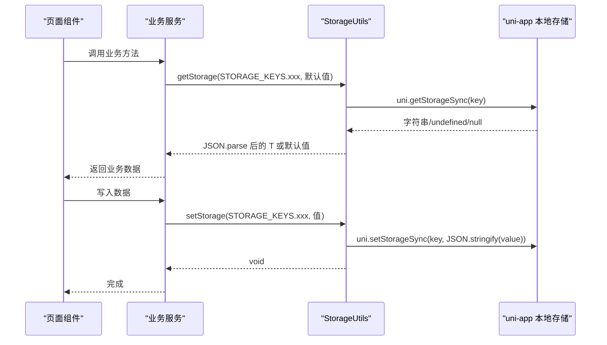
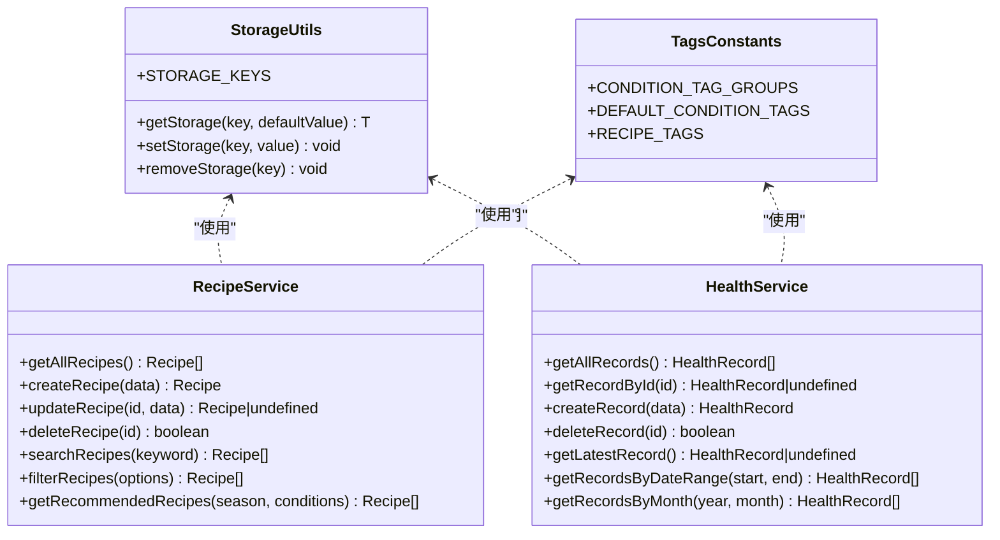

# 存储工具 (StorageUtils)

<cite>
**本文引用的文件**
- [storage.ts](file://src/utils/storage.ts)
- [tags.ts](file://src/constants/tags.ts)
- [recipe.ts](file://src/services/recipe.ts)
- [health.ts](file://src/services/health.ts)
- [recipe/list.vue](file://src/pages/recipe/list.vue)
- [health/history.vue](file://src/pages/health/history.vue)
- [recipe/edit.vue](file://src/pages/recipe/edit.vue)
- [health/record.vue](file://src/pages/health/record.vue)
- [recipe.ts 类型定义](file://src/types/recipe.ts)
- [health.ts 类型定义](file://src/types/health.ts)
</cite>

## 目录
1. [简介](#简介)
2. [项目结构](#项目结构)
3. [核心组件](#核心组件)
4. [架构总览](#架构总览)
5. [详细组件分析](#详细组件分析)
6. [依赖关系分析](#依赖关系分析)
7. [性能考量](#性能考量)
8. [故障排查指南](#故障排查指南)
9. [结论](#结论)
10. [附录](#附录)

## 简介
本文件系统性地解析存储工具库 StorageUtils 的设计与实现，重点覆盖以下方面：
- 键值对存储、数据序列化与反序列化机制
- getStorage、setStorage、removeStorage 的实现原理、参数类型与返回值
- STORAGE_KEYS 常量的定义与用途，涵盖 recipes、health_records、custom_condition_tags 的业务语义
- 完整使用示例（基本类型、对象、数组）
- 错误处理机制、异常场景与性能优化策略
- 数据持久化的最佳实践与跨平台兼容性说明

## 项目结构
StorageUtils 位于 utils 层，为上层服务层与页面组件提供统一的数据持久化能力。其直接依赖于 uni-app 的本地存储 API，并通过常量键名与业务模块解耦。

图表来源
- [storage.ts:1-34](file://src/utils/storage.ts#L1-L34)
- [recipe.ts:1-102](file://src/services/recipe.ts#L1-L102)
- [health.ts:1-48](file://src/services/health.ts#L1-L48)
- [recipe/list.vue:1-477](file://src/pages/recipe/list.vue#L1-L477)
- [health/history.vue:1-177](file://src/pages/health/history.vue#L1-L177)
- [recipe/edit.vue:1-702](file://src/pages/recipe/edit.vue#L1-L702)
- [health/record.vue:1-200](file://src/pages/health/record.vue#L1-L200)
- [recipe.ts 类型定义:1-15](file://src/types/recipe.ts#L1-L15)
- [health.ts 类型定义:1-7](file://src/types/health.ts#L1-L7)

章节来源
- [storage.ts:1-34](file://src/utils/storage.ts#L1-L34)
- [recipe.ts:1-102](file://src/services/recipe.ts#L1-L102)
- [health.ts:1-48](file://src/services/health.ts#L1-L48)

## 核心组件
- STORAGE_KEYS：集中管理所有持久化键名，避免魔法字符串散落各处，提升可维护性与一致性。
- getStorage<T>(key, defaultValue)：从本地存储读取数据，支持泛型推断，自动进行 JSON 反序列化与默认值兜底。
- setStorage<T>(key, value)：将任意可序列化值写入本地存储，内部进行 JSON 序列化。
- removeStorage(key)：删除指定键的本地存储数据。

章节来源
- [storage.ts:1-34](file://src/utils/storage.ts#L1-L34)

## 架构总览
StorageUtils 采用“工具函数 + 常量键名”的轻量架构，向上提供类型安全的读写接口，向下封装 uni-app 本地存储 API。服务层与页面层仅通过键名常量与工具函数交互，降低耦合度。

图表来源
- [storage.ts:7-25](file://src/utils/storage.ts#L7-L25)
- [recipe.ts:5-25](file://src/services/recipe.ts#L5-L25)
- [health.ts:5-22](file://src/services/health.ts#L5-L22)

## 详细组件分析

### STORAGE_KEYS 常量与业务含义
- recipes：菜谱集合的持久化键，用于存储用户创建的菜谱列表。
- health_records：健康记录集合的持久化键，用于存储用户的身体状况记录列表。
- custom_condition_tags：自定义身体状况标签的持久化键，用于存储用户在健康记录页面新增的自定义标签。

章节来源
- [storage.ts:1-5](file://src/utils/storage.ts#L1-L5)
- [recipe.ts:5-7](file://src/services/recipe.ts#L5-L7)
- [health.ts:5-6](file://src/services/health.ts#L5-L6)
- [health/record.vue:154-156](file://src/pages/health/record.vue#L154-L156)

### getStorage<T>(key, defaultValue)
- 参数
  - key: string，存储键名，通常来自 STORAGE_KEYS
  - defaultValue: T，当读取失败或为空时返回的默认值
- 返回值
  - T，反序列化后的数据类型，若读取失败则返回 defaultValue
- 实现要点
  - 使用 uni.getStorageSync 读取字符串
  - 对空字符串、undefined、null 进行兜底
  - JSON.parse 反序列化，失败时返回 defaultValue
  - 泛型 T 支持复杂类型（如数组、对象）

章节来源
- [storage.ts:7-17](file://src/utils/storage.ts#L7-L17)

### setStorage<T>(key, value)
- 参数
  - key: string，存储键名
  - value: T，任意可序列化值（数组、对象等）
- 返回值
  - void
- 实现要点
  - JSON.stringify 序列化后写入
  - 异常捕获并打印错误日志，不抛出异常影响调用方

章节来源
- [storage.ts:19-25](file://src/utils/storage.ts#L19-L25)

### removeStorage(key)
- 参数
  - key: string，存储键名
- 返回值
  - void
- 实现要点
  - 删除指定键的本地存储
  - 异常捕获并打印错误日志

章节来源
- [storage.ts:27-33](file://src/utils/storage.ts#L27-L33)

### 键名与业务模块映射
- 菜谱模块
  - 读取：getAllRecipes 使用 STORAGE_KEYS.RECIPES 作为键
  - 写入：createRecipe/updateRecipe/deleteRecipe 均基于该键进行全量替换
- 健康记录模块
  - 读取：getAllRecords 使用 STORAGE_KEYS.HEALTH_RECORDS 作为键
  - 写入：createRecord/deleteRecord 基于该键进行全量替换
- 自定义标签模块
  - 健康记录页：加载与保存自定义身体状况标签，键为 STORAGE_KEYS.CUSTOM_CONDITION_TAGS

章节来源
- [recipe.ts:5-51](file://src/services/recipe.ts#L5-L51)
- [health.ts:5-31](file://src/services/health.ts#L5-L31)
- [health/record.vue:154-156](file://src/pages/health/record.vue#L154-L156)

### 类型与数据模型
- 菜谱 Recipe：包含 id、name、ingredients、steps、seasons、conditions、tags、image、createdAt、updatedAt 等字段
- 健康记录 HealthRecord：包含 id、date、conditions、note 等字段

章节来源
- [recipe.ts 类型定义:1-15](file://src/types/recipe.ts#L1-L15)
- [health.ts 类型定义:1-7](file://src/types/health.ts#L1-L7)

### 使用示例（路径指引）
- 基本数据类型
  - 读取布尔/数字：通过 getStorage 指定默认值类型，例如布尔开关或计数器
  - 写入布尔/数字：通过 setStorage 直接传入
- 对象
  - 读取健康记录：getStorage<HealthRecord[]>(STORAGE_KEYS.HEALTH_RECORDS, [])
  - 写入健康记录：setStorage(STORAGE_KEYS.HEALTH_RECORDS, records)
- 数组
  - 读取菜谱列表：getStorage<Recipe[]>(STORAGE_KEYS.RECIPES, [])
  - 写入菜谱列表：setStorage(STORAGE_KEYS.RECIPES, recipes)

章节来源
- [recipe.ts:5-25](file://src/services/recipe.ts#L5-L25)
- [health.ts:5-22](file://src/services/health.ts#L5-L22)

### 错误处理机制
- getStorage：读取失败或 JSON 解析失败时返回 defaultValue，保证调用方稳定
- setStorage/removeStorage：捕获异常并输出错误日志，避免影响业务流程
- 建议
  - 在关键路径增加 try/catch 包裹，结合 defaultValue 与错误提示
  - 对大对象写入前进行体积检查，避免超出本地存储限制

章节来源
- [storage.ts:7-33](file://src/utils/storage.ts#L7-L33)

### 性能优化策略
- 全量替换模式
  - 读取 -> 修改 -> 写回：适用于小到中等规模数据（如菜谱列表、健康记录）
  - 优点：逻辑简单，避免并发冲突
  - 缺点：每次写入完整数组，可能产生额外内存开销
- 优化建议
  - 对频繁更新的小对象，考虑分段写入或增量更新
  - 大数据写入前进行 JSON.stringify 预检查，减少异常分支
  - 避免在渲染周期内进行大量同步存储操作

章节来源
- [recipe.ts:22-24](file://src/services/recipe.ts#L22-L24)
- [health.ts:19-21](file://src/services/health.ts#L19-L21)

### 跨平台兼容性
- StorageUtils 基于 uni-app 的本地存储 API，天然支持多端（H5、小程序、App）一致行为
- 注意事项
  - 不同平台的存储容量限制不同，应避免存储超大数据
  - 避免存储不可序列化的值（如函数、Symbol、循环引用），确保 JSON 序列化成功

章节来源
- [storage.ts:19-25](file://src/utils/storage.ts#L19-L25)

## 依赖关系分析

图表来源
- [storage.ts:1-34](file://src/utils/storage.ts#L1-L34)
- [recipe.ts:1-102](file://src/services/recipe.ts#L1-L102)
- [health.ts:1-48](file://src/services/health.ts#L1-L48)
- [tags.ts:1-23](file://src/constants/tags.ts#L1-L23)

## 性能考量
- 读写复杂度
  - getStorage：O(n)（n 为 JSON 字符串长度），受数据体量影响
  - setStorage：O(n)，包含序列化成本
- 内存占用
  - 全量替换模式会在内存中持有完整数组副本，注意大列表场景下的峰值内存
- I/O 频率
  - 避免高频连续写入，建议合并操作或延迟写入
- 数据体积控制
  - 对图片等二进制数据，优先使用本地路径而非 base64，减少存储体积

## 故障排查指南
- 读取不到数据
  - 检查键名是否匹配 STORAGE_KEYS
  - 确认 defaultValue 是否合理，避免误判为空
- JSON 解析失败
  - 排查之前写入的数据是否被篡改或非标准 JSON
  - 建议在写入前进行类型校验
- 写入报错
  - 查看控制台错误日志，定位异常原因
  - 检查数据是否包含不可序列化字段
- 平台差异
  - H5 与小程序的存储容量不同，注意容量上限

章节来源
- [storage.ts:7-33](file://src/utils/storage.ts#L7-L33)

## 结论
StorageUtils 提供了简洁、类型安全且跨平台一致的本地存储能力。通过集中化的键名管理与通用的读写函数，有效降低了业务耦合度。在实际使用中，建议遵循全量替换模式的约定，配合合理的错误处理与性能优化策略，确保数据持久化稳定可靠。

## 附录

### API 定义速览
- getStorage(key: string, defaultValue: T): T
- setStorage(key: string, value: T): void
- removeStorage(key: string): void
- STORAGE_KEYS
  - RECIPES: 'recipes'
  - HEALTH_RECORDS: 'health_records'
  - CUSTOM_CONDITION_TAGS: 'custom_condition_tags'

章节来源
- [storage.ts:1-34](file://src/utils/storage.ts#L1-L34)