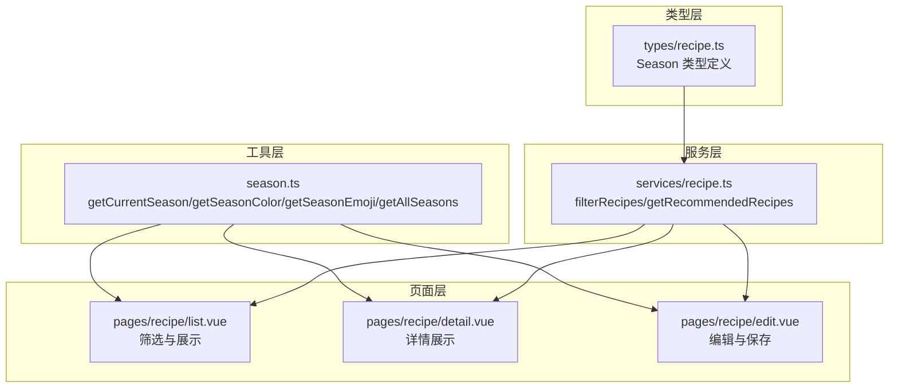
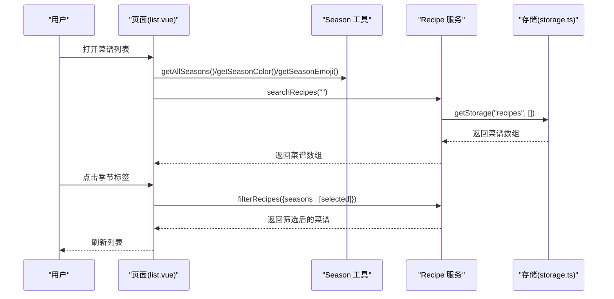
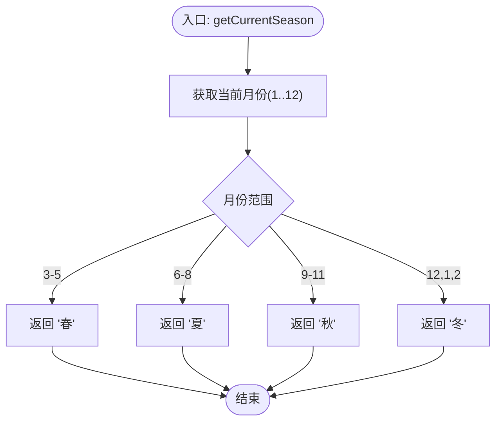
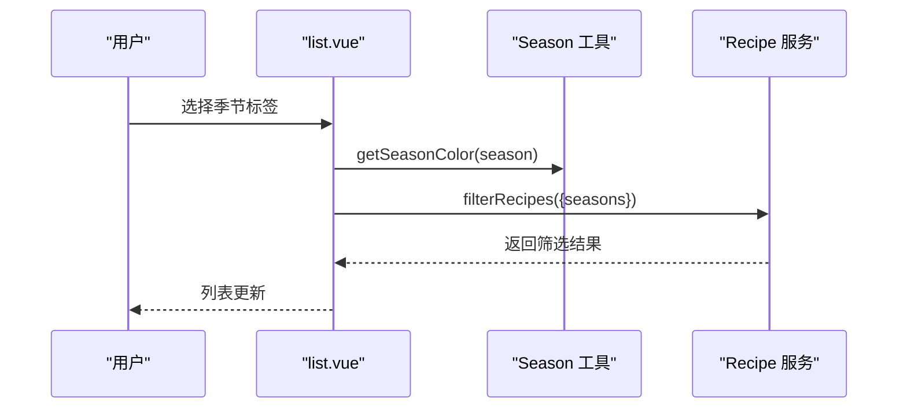
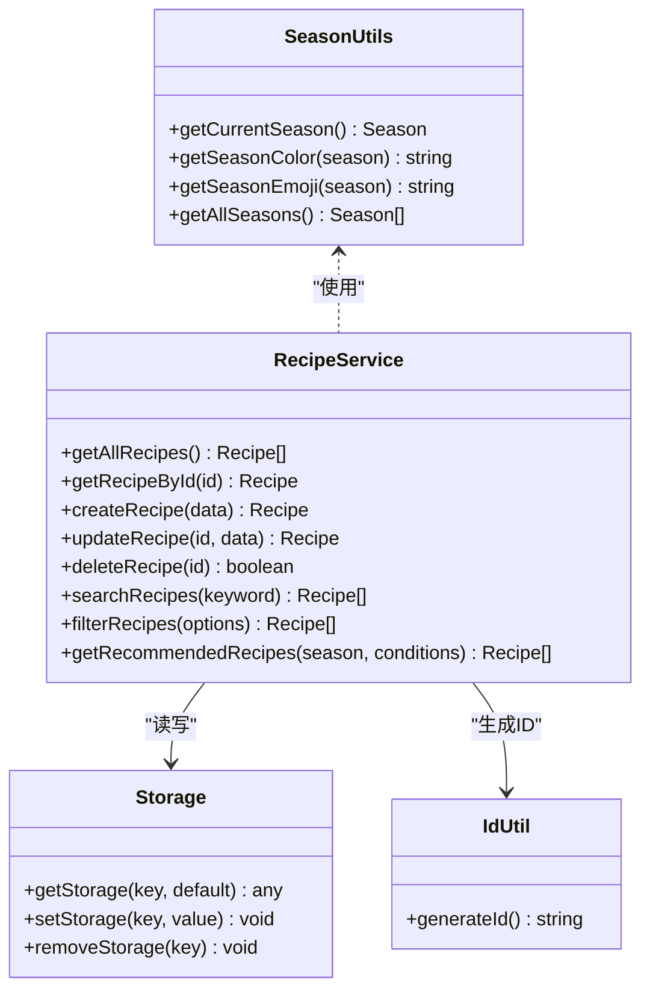
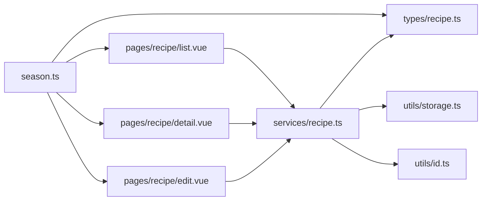

# 季节工具 (SeasonUtils)

<cite>
**本文档引用的文件**
- [src/utils/season.ts](file://src/utils/season.ts)
- [src/types/recipe.ts](file://src/types/recipe.ts)
- [src/services/recipe.ts](file://src/services/recipe.ts)
- [src/pages/recipe/list.vue](file://src/pages/recipe/list.vue)
- [src/pages/recipe/detail.vue](file://src/pages/recipe/detail.vue)
- [src/pages/recipe/edit.vue](file://src/pages/recipe/edit.vue)
- [src/constants/tags.ts](file://src/constants/tags.ts)
- [src/utils/storage.ts](file://src/utils/storage.ts)
- [src/utils/id.ts](file://src/utils/id.ts)
- [src/services/health.ts](file://src/services/health.ts)
- [src/types/health.ts](file://src/types/health.ts)
</cite>

## 目录
1. [简介](#简介)
2. [项目结构](#项目结构)
3. [核心组件](#核心组件)
4. [架构总览](#架构总览)
5. [详细组件分析](#详细组件分析)
6. [依赖分析](#依赖分析)
7. [性能考虑](#性能考虑)
8. [故障排除指南](#故障排除指南)
9. [结论](#结论)
10. [附录](#附录)

## 简介
本文件系统性地介绍 Eat 项目中的“季节工具库”（SeasonUtils），重点围绕以下目标展开：
- 全面说明 SeasonUtils 的功能特性与应用场景
- 解释季节判断算法与日期计算逻辑
- 详细说明季节枚举类型、月份映射关系与季节转换规则
- 提供具体使用示例，展示如何根据当前日期获取对应季节、判断季节变化等操作
- 阐述工具函数的输入验证、边界条件处理与国际化支持现状
- 结合项目现有数据模型与页面，给出季节相关的营养搭配建议与菜谱推荐策略
- 解释与中医养生理论的结合方式与实际应用价值

## 项目结构
SeasonUtils 位于工具层，服务于页面层与服务层的数据展示与筛选逻辑。其主要职责包括：
- 获取当前季节
- 将季节映射到颜色与表情符号
- 提供所有季节选项

图表来源
- [src/utils/season.ts:1-34](file://src/utils/season.ts#L1-L34)
- [src/types/recipe.ts:1-15](file://src/types/recipe.ts#L1-L15)
- [src/services/recipe.ts:64-102](file://src/services/recipe.ts#L64-L102)
- [src/pages/recipe/list.vue:114-213](file://src/pages/recipe/list.vue#L114-L213)
- [src/pages/recipe/detail.vue:115-187](file://src/pages/recipe/detail.vue#L115-L187)
- [src/pages/recipe/edit.vue:189-394](file://src/pages/recipe/edit.vue#L189-L394)

章节来源
- [src/utils/season.ts:1-34](file://src/utils/season.ts#L1-L34)
- [src/types/recipe.ts:1-15](file://src/types/recipe.ts#L1-L15)
- [src/services/recipe.ts:64-102](file://src/services/recipe.ts#L64-L102)
- [src/pages/recipe/list.vue:114-213](file://src/pages/recipe/list.vue#L114-L213)
- [src/pages/recipe/detail.vue:115-187](file://src/pages/recipe/detail.vue#L115-L187)
- [src/pages/recipe/edit.vue:189-394](file://src/pages/recipe/edit.vue#L189-L394)

## 核心组件
- 季节类型定义：通过联合类型限定季节值域，确保类型安全与可维护性。
- 季节工具函数：
  - 获取当前季节
  - 季节到颜色映射
  - 季节到表情映射
  - 获取全部季节选项
- 页面与服务层集成：在菜谱列表、详情与编辑页中使用工具函数进行 UI 展示与筛选。

章节来源
- [src/utils/season.ts:1-34](file://src/utils/season.ts#L1-L34)
- [src/types/recipe.ts:1-15](file://src/types/recipe.ts#L1-L15)
- [src/pages/recipe/list.vue:114-213](file://src/pages/recipe/list.vue#L114-L213)
- [src/pages/recipe/detail.vue:115-187](file://src/pages/recipe/detail.vue#L115-L187)
- [src/pages/recipe/edit.vue:189-394](file://src/pages/recipe/edit.vue#L189-L394)

## 架构总览
SeasonUtils 在系统中的位置如下：
- 类型层：定义 Season 联合类型，约束服务层与页面层对季节的使用
- 工具层：提供与季节相关的纯函数，不依赖外部状态
- 服务层：基于存储与业务逻辑，实现菜谱筛选与推荐
- 页面层：在 UI 中渲染季节标签、颜色与表情，并支持按季节筛选

图表来源
- [src/pages/recipe/list.vue:114-213](file://src/pages/recipe/list.vue#L114-L213)
- [src/utils/season.ts:31-33](file://src/utils/season.ts#L31-L33)
- [src/services/recipe.ts:53-85](file://src/services/recipe.ts#L53-L85)
- [src/utils/storage.ts:7-17](file://src/utils/storage.ts#L7-L17)

## 详细组件分析

### 组件一：季节工具函数（SeasonUtils）
- 功能概述
  - getCurrentSeason：根据当前月份判断所属季节
  - getSeasonColor：将季节映射到颜色值
  - getSeasonEmoji：将季节映射到表情符号
  - getAllSeasons：返回所有季节选项
- 数据结构与复杂度
  - 季节枚举类型为固定集合，映射表为常量查找，时间复杂度 O(1)
  - 月份判断为常量时间分支，整体复杂度 O(1)
- 依赖关系
  - 依赖类型层的 Season 联合类型
  - 依赖页面层与服务层调用

图表来源
- [src/utils/season.ts:3-9](file://src/utils/season.ts#L3-L9)

章节来源
- [src/utils/season.ts:1-34](file://src/utils/season.ts#L1-L34)
- [src/types/recipe.ts:1-15](file://src/types/recipe.ts#L1-L15)

### 组件二：页面层集成（菜谱列表）
- 使用场景
  - 渲染季节标签与颜色
  - 支持按季节筛选菜谱
  - 展示菜谱卡片中的季节标记
- 关键交互
  - 选择“全部”或具体季节进行筛选
  - 与搜索关键词组合筛选
- 边界处理
  - 空结果时显示空状态
  - 季节标签高亮与样式切换

图表来源
- [src/pages/recipe/list.vue:114-213](file://src/pages/recipe/list.vue#L114-L213)
- [src/utils/season.ts:11-19](file://src/utils/season.ts#L11-L19)
- [src/services/recipe.ts:64-85](file://src/services/recipe.ts#L64-L85)

章节来源
- [src/pages/recipe/list.vue:114-213](file://src/pages/recipe/list.vue#L114-L213)

### 组件三：页面层集成（菜谱详情）
- 使用场景
  - 展示菜谱详情中的季节标签与颜色
  - 显示季节表情与标签样式
- 关键交互
  - 读取单个菜谱并渲染
  - 支持编辑与删除操作

章节来源
- [src/pages/recipe/detail.vue:115-187](file://src/pages/recipe/detail.vue#L115-L187)
- [src/utils/season.ts:11-29](file://src/utils/season.ts#L11-L29)

### 组件四：页面层集成（菜谱编辑）
- 使用场景
  - 编辑菜谱时选择适合的季节
  - 与标签系统联动（身体状况标签、自定义标签）
- 关键交互
  - 多选季节
  - 自定义标签的增删与持久化
- 输入验证
  - 校验菜名、至少一种食材、必须选择季节

章节来源
- [src/pages/recipe/edit.vue:189-394](file://src/pages/recipe/edit.vue#L189-L394)
- [src/utils/season.ts:11-29](file://src/utils/season.ts#L11-L29)
- [src/constants/tags.ts:1-23](file://src/constants/tags.ts#L1-L23)

### 组件五：服务层与存储层
- 服务层职责
  - 菜谱的增删改查与筛选
  - 推荐策略：按季节匹配并统计身体状况标签匹配度
- 存储层职责
  - 以键值形式持久化菜谱、健康记录与自定义标签

图表来源
- [src/utils/season.ts:1-34](file://src/utils/season.ts#L1-L34)
- [src/services/recipe.ts:1-103](file://src/services/recipe.ts#L1-L103)
- [src/utils/storage.ts:1-34](file://src/utils/storage.ts#L1-L34)
- [src/utils/id.ts:1-4](file://src/utils/id.ts#L1-L4)

章节来源
- [src/services/recipe.ts:1-103](file://src/services/recipe.ts#L1-L103)
- [src/utils/storage.ts:1-34](file://src/utils/storage.ts#L1-L34)
- [src/utils/id.ts:1-4](file://src/utils/id.ts#L1-L4)

## 依赖分析
- 类型依赖
  - Season 类型由类型层统一定义，服务层与页面层共享
- 工具函数依赖
  - 仅依赖浏览器/运行时的 Date 对象与字符串常量映射
- 页面与服务层耦合
  - 页面通过服务层访问数据，服务层通过存储层持久化
- 可能的循环依赖
  - 未发现循环依赖，模块间关系清晰

图表来源
- [src/utils/season.ts:1-34](file://src/utils/season.ts#L1-L34)
- [src/types/recipe.ts:1-15](file://src/types/recipe.ts#L1-L15)
- [src/services/recipe.ts:1-103](file://src/services/recipe.ts#L1-L103)
- [src/utils/storage.ts:1-34](file://src/utils/storage.ts#L1-L34)
- [src/utils/id.ts:1-4](file://src/utils/id.ts#L1-L4)
- [src/pages/recipe/list.vue:114-213](file://src/pages/recipe/list.vue#L114-L213)
- [src/pages/recipe/detail.vue:115-187](file://src/pages/recipe/detail.vue#L115-L187)
- [src/pages/recipe/edit.vue:189-394](file://src/pages/recipe/edit.vue#L189-L394)

章节来源
- [src/utils/season.ts:1-34](file://src/utils/season.ts#L1-L34)
- [src/services/recipe.ts:1-103](file://src/services/recipe.ts#L1-L103)

## 性能考虑
- 季节判断为 O(1) 分支判断，开销极小
- 映射表为常量对象，查找为 O(1)
- 页面筛选采用内存过滤，适合中小规模数据集
- 建议
  - 若菜谱数量增长，可考虑服务端分页或索引优化
  - 季节标签渲染为纯前端操作，无需额外网络请求

## 故障排除指南
- 季节显示异常
  - 检查当前系统时间是否正确
  - 确认页面是否正确调用工具函数
- 筛选无效
  - 确认筛选参数是否传入正确的 Season 数组
  - 检查服务层 filterRecipes 的调用链
- 存储读写错误
  - 检查存储键名与默认值设置
  - 确认 JSON 序列化/反序列化过程

章节来源
- [src/utils/season.ts:1-34](file://src/utils/season.ts#L1-L34)
- [src/services/recipe.ts:64-85](file://src/services/recipe.ts#L64-L85)
- [src/utils/storage.ts:7-17](file://src/utils/storage.ts#L7-L17)

## 结论
SeasonUtils 以简洁的纯函数形式提供了季节判断与 UI 映射能力，与项目中的菜谱管理、健康记录体系紧密协作。其设计遵循单一职责原则，易于扩展与维护。建议在未来版本中：
- 增加国际化支持（多语言季节名称与标签）
- 引入更灵活的季节划分规则（如天文/气象定义）
- 提供季节相关的营养搭配与菜谱推荐策略接口

## 附录

### 季节判断算法与日期计算逻辑
- 算法说明
  - 依据当前月份（1-12）进行区间判断，分别映射到“春/夏/秋/冬”
  - 该规则与北半球传统节气划分一致
- 边界条件
  - 12月归为冬季
  - 1月、2月归为冬季
  - 3-5月为春季
  - 6-8月为夏季
  - 9-11月为秋季

章节来源
- [src/utils/season.ts:3-9](file://src/utils/season.ts#L3-L9)

### 季节枚举类型与映射关系
- 季节枚举类型：'春' | '夏' | '秋' | '冬'
- 颜色映射：每种季节对应唯一颜色值
- 表情映射：每种季节对应唯一表情符号
- 全部季节选项：['春','夏','秋','冬']

章节来源
- [src/types/recipe.ts:1-1](file://src/types/recipe.ts#L1-L1)
- [src/utils/season.ts:11-33](file://src/utils/season.ts#L11-L33)

### 使用示例与最佳实践
- 获取当前季节
  - 调用 getCurrentSeason()，返回当前季节字符串
- 渲染季节标签
  - 使用 getSeasonColor(season) 设置背景色
  - 使用 getSeasonEmoji(season) 添加表情图标
- 页面筛选
  - 在菜谱列表页选择季节后，调用 filterRecipes 进行筛选
- 输入验证
  - 编辑页对菜名、食材与季节进行必填校验

章节来源
- [src/pages/recipe/list.vue:114-213](file://src/pages/recipe/list.vue#L114-L213)
- [src/pages/recipe/edit.vue:348-363](file://src/pages/recipe/edit.vue#L348-L363)

### 与中医养生理论的结合
- 理论基础
  - 中医强调“天人相应”，饮食应随四季变化而调整
  - 春季宜疏肝理气，夏季宜清热解暑，秋季宜润燥，冬季宜温补
- 实际应用
  - 项目通过“适合季节”字段与“身体状况标签”实现个性化推荐
  - 健康记录页面支持用户标注当前身体状况，便于后续菜谱推荐

章节来源
- [src/constants/tags.ts:1-23](file://src/constants/tags.ts#L1-L23)
- [src/services/recipe.ts:87-102](file://src/services/recipe.ts#L87-L102)
- [src/pages/health/record.vue:81-157](file://src/pages/health/record.vue#L81-L157)

### 营养搭配建议与菜谱推荐策略
- 建议策略
  - 优先推荐与当前季节匹配的菜谱
  - 根据用户健康记录中的身体状况标签，进一步提升匹配度
- 推荐流程
  - 从数据库读取所有菜谱
  - 过滤出适合当前季节的菜谱
  - 统计用户身体状况标签与菜谱标签的匹配数量作为分数
  - 按分数降序排列，输出推荐结果

章节来源
- [src/services/recipe.ts:87-102](file://src/services/recipe.ts#L87-L102)
- [src/pages/recipe/list.vue:139-170](file://src/pages/recipe/list.vue#L139-L170)