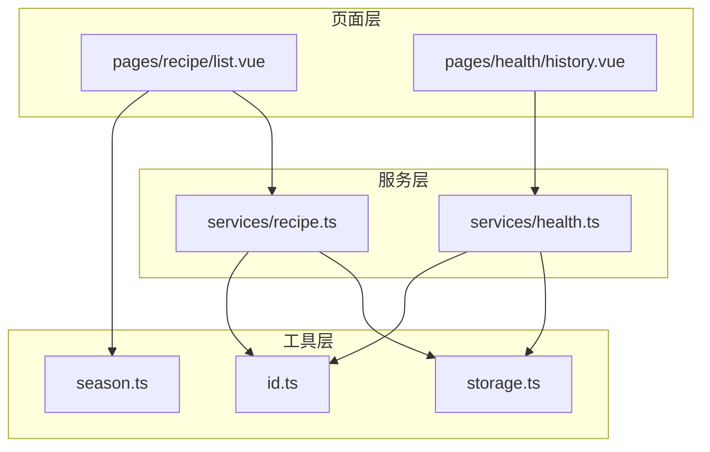
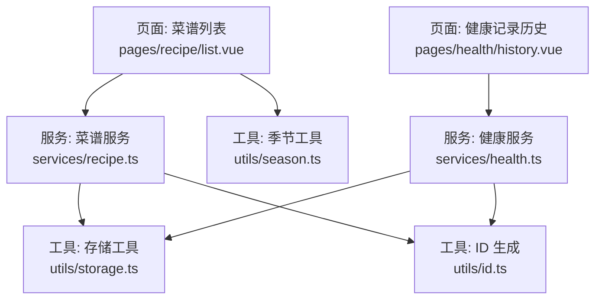
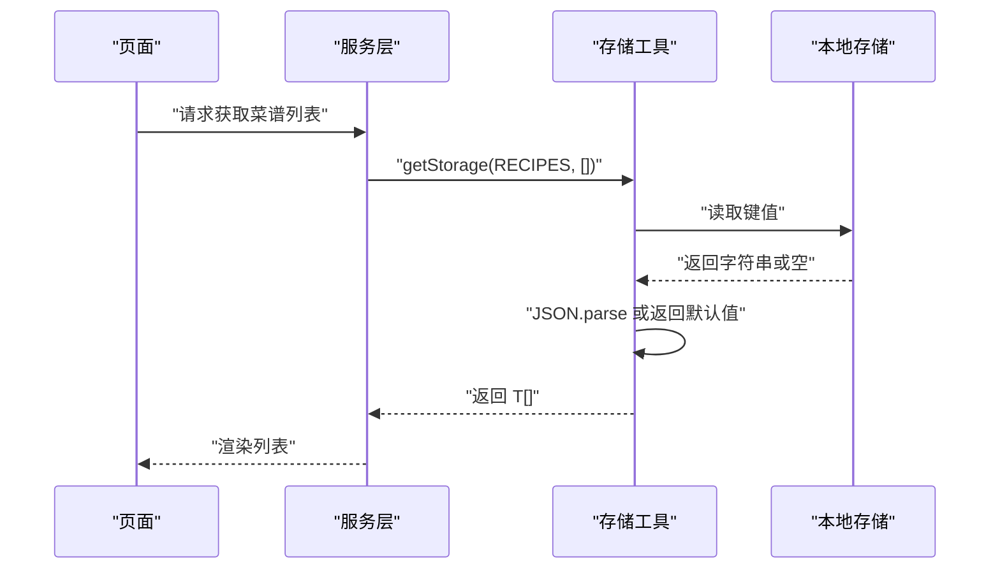
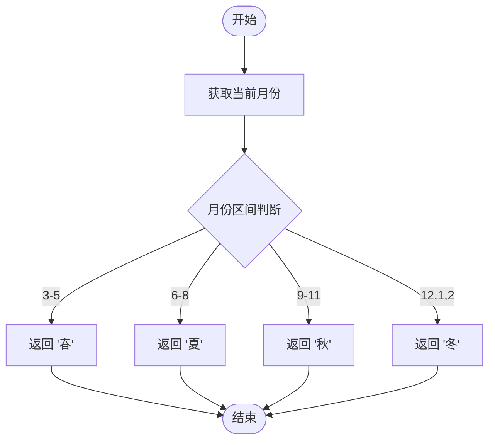
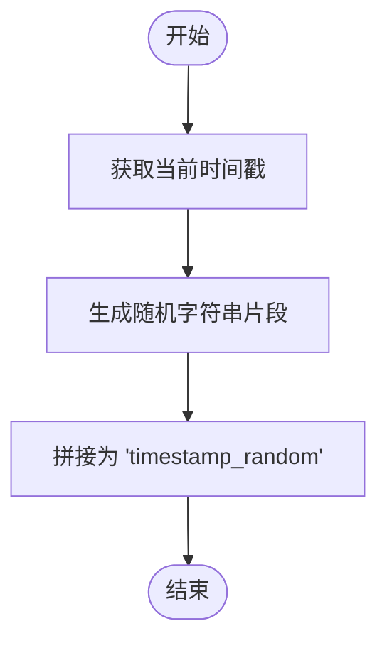
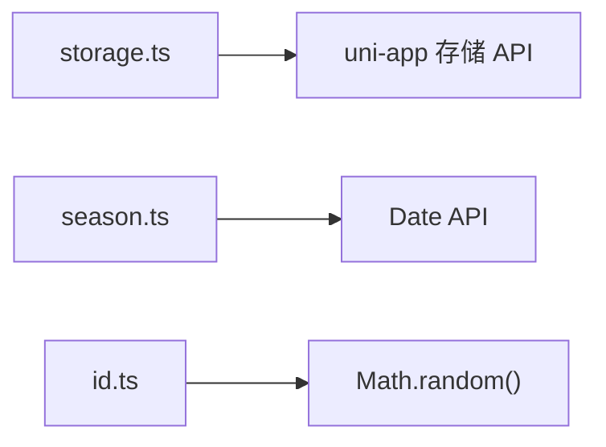

# 工具函数库

<cite>
**本文引用的文件**
- [storage.ts](file://src/utils/storage.ts)
- [season.ts](file://src/utils/season.ts)
- [id.ts](file://src/utils/id.ts)
- [recipe.ts](file://src/services/recipe.ts)
- [health.ts](file://src/services/health.ts)
- [recipe.vue](file://src/pages/recipe/list.vue)
- [health.vue](file://src/pages/health/history.vue)
- [recipe.types.ts](file://src/types/recipe.ts)
- [health.types.ts](file://src/types/health.ts)
- [tags.ts](file://src/constants/tags.ts)
</cite>

## 目录
1. [简介](#简介)
2. [项目结构](#项目结构)
3. [核心组件](#核心组件)
4. [架构总览](#架构总览)
5. [详细组件分析](#详细组件分析)
6. [依赖关系分析](#依赖关系分析)
7. [性能考量](#性能考量)
8. [故障排除指南](#故障排除指南)
9. [结论](#结论)
10. [附录](#附录)

## 简介
本文件系统化梳理 eat 项目中的工具函数库，重点覆盖以下三个工具模块：
- 存储工具（StorageUtils）：封装本地存储的统一读写与移除接口，并提供键值常量管理。
- 季节工具（SeasonUtils）：提供当前季节识别、颜色映射、表情符号映射以及全量季节枚举。
- ID 生成工具（IdUtils）：提供稳定且具备高冲突概率较低的字符串 ID 生成器。

文档将从功能特性、使用方法、最佳实践、输入输出格式、参数验证与错误处理、性能与兼容性、设计原则与扩展方法、常见场景示例与故障排除等方面进行深入说明，帮助开发者高效、安全地使用这些工具函数。

## 项目结构
工具函数库位于 src/utils 目录下，分别对应三个独立的工具模块。它们被服务层与页面层广泛复用：
- 存储工具：提供键值常量与通用的 get/set/remove 封装，服务于 recipe 与 health 服务的数据持久化。
- 季节工具：提供季节枚举与视觉映射（颜色、表情），服务于菜谱列表页的筛选与展示。
- ID 工具：提供全局唯一字符串 ID 生成，服务于新增实体时的主键生成。

图表来源
- [storage.ts:1-34](file://src/utils/storage.ts#L1-L34)
- [season.ts:1-34](file://src/utils/season.ts#L1-L34)
- [id.ts:1-4](file://src/utils/id.ts#L1-L4)
- [recipe.ts:1-102](file://src/services/recipe.ts#L1-L102)
- [health.ts:1-48](file://src/services/health.ts#L1-L48)
- [recipe.vue:114-213](file://src/pages/recipe/list.vue#L114-L213)
- [health.vue:34-82](file://src/pages/health/history.vue#L34-L82)

章节来源
- [storage.ts:1-34](file://src/utils/storage.ts#L1-L34)
- [season.ts:1-34](file://src/utils/season.ts#L1-L34)
- [id.ts:1-4](file://src/utils/id.ts#L1-L4)

## 核心组件
本节对三个工具模块进行概览式说明，包括职责边界、典型调用链路与数据流。

- 存储工具（StorageUtils）
  - 提供键值常量（recipes、health_records、custom_condition_tags）。
  - 提供泛型 getStorage(key, defaultValue) 读取并解析 JSON 数据，异常或空值返回默认值。
  - 提供 setStorage(key, value) 写入 JSON 字符串，异常记录错误日志。
  - 提供 removeStorage(key) 删除键值，异常记录错误日志。
  - 典型使用：服务层通过 getStorage 获取集合，setStorage 写回集合，实现本地持久化。

- 季节工具（SeasonUtils）
  - getCurrentSeason() 基于当前月份返回季节枚举。
  - getSeasonColor(season) 返回季节对应的颜色值。
  - getSeasonEmoji(season) 返回季节对应的 Emoji 表情。
  - getAllSeasons() 返回全量季节枚举。
  - 典型使用：页面层渲染筛选标签、展示卡片标签时调用颜色与表情映射。

- ID 生成工具（IdUtils）
  - generateId() 生成形如“时间戳_随机字符串”的稳定字符串 ID。
  - 典型使用：新增实体时作为主键，确保跨会话唯一性。

章节来源
- [storage.ts:1-34](file://src/utils/storage.ts#L1-L34)
- [season.ts:1-34](file://src/utils/season.ts#L1-L34)
- [id.ts:1-4](file://src/utils/id.ts#L1-L4)

## 架构总览
工具函数库在应用中的位置与交互如下图所示。页面层负责用户交互与视图渲染，服务层负责业务逻辑与数据聚合，工具层提供基础能力（存储、季节、ID）。三者之间通过清晰的导入关系耦合，遵循单一职责与可测试性原则。

图表来源
- [recipe.vue:114-213](file://src/pages/recipe/list.vue#L114-L213)
- [health.vue:34-82](file://src/pages/health/history.vue#L34-L82)
- [recipe.ts:1-102](file://src/services/recipe.ts#L1-L102)
- [health.ts:1-48](file://src/services/health.ts#L1-L48)
- [storage.ts:1-34](file://src/utils/storage.ts#L1-L34)
- [id.ts:1-4](file://src/utils/id.ts#L1-L4)
- [season.ts:1-34](file://src/utils/season.ts#L1-L34)

## 详细组件分析

### 存储工具（StorageUtils）
- 功能概述
  - 键值常量：集中管理本地存储键名，避免魔法字符串。
  - 读取：getStorage(key, defaultValue)，支持泛型返回类型，内部进行 JSON 解析与异常捕获，空值或解析失败时返回默认值。
  - 写入：setStorage(key, value)，JSON 序列化后写入，异常记录错误日志。
  - 删除：removeStorage(key)，异常记录错误日志。
- 输入输出与参数验证
  - getStorage(key: string, defaultValue: T): T
    - key 必须为字符串；若存储为空、未定义或解析异常，则返回 defaultValue。
    - 泛型 T 用于约束返回值类型，便于上层直接消费强类型对象。
  - setStorage(key: string, value: T): void
    - value 会被 JSON.stringify 后写入；若写入异常，仅记录错误日志，不抛出异常。
  - removeStorage(key: string): void
    - 删除指定键；异常记录错误日志。
- 错误处理机制
  - 读取阶段：try/catch 包裹 uni.getStorageSync；解析阶段：try/catch 包裹 JSON.parse；异常均回退到默认值。
  - 写入与删除阶段：try/catch 包裹 uni.setStorageSync/uni.removeStorageSync；异常记录错误日志但不中断流程。
- 使用示例与最佳实践
  - 在服务层读取集合：getAllRecipes() 使用 getStorage<Recipe[]>(STORAGE_KEYS.RECIPES, [])。
  - 在服务层写回集合：createRecipe()/updateRecipe()/deleteRecipe() 使用 setStorage(STORAGE_KEYS.RECIPES, recipes)。
  - 默认值策略：对于集合类数据，建议传入空数组；对于对象类数据，建议传入空对象或具体默认结构。
  - 类型安全：通过泛型约束 getStorage 的返回值，减少运行时类型判断。
- 性能与兼容性
  - JSON 序列化/反序列化成本与数据规模相关；建议控制单次存储的数据体量，必要时拆分键或分批写入。
  - 兼容性：依赖 uni-app 的本地存储 API，适用于小程序、H5、App 等多端环境。

图表来源
- [recipe.ts:5-7](file://src/services/recipe.ts#L5-L7)
- [storage.ts:7-17](file://src/utils/storage.ts#L7-L17)

章节来源
- [storage.ts:1-34](file://src/utils/storage.ts#L1-L34)
- [recipe.ts:1-102](file://src/services/recipe.ts#L1-L102)
- [health.ts:1-48](file://src/services/health.ts#L1-L48)

### 季节工具（SeasonUtils）
- 功能概述
  - getCurrentSeason()：根据当前月份返回季节枚举（春/夏/秋/冬）。
  - getSeasonColor(season: Season)：返回季节对应的颜色值。
  - getSeasonEmoji(season: Season)：返回季节对应的 Emoji。
  - getAllSeasons()：返回全量季节枚举。
- 输入输出与参数验证
  - getCurrentSeason(): Season
    - 无显式参数；内部基于月份计算，保证返回值属于 Season 枚举。
  - getSeasonColor/getSeasonEmoji(season: Season): string
    - 参数必须为 Season 枚举值；内部通过字面量映射返回固定字符串。
    - 若传入非枚举值，TypeScript 编译期会报错；运行时可通过类型断言绕过，但不推荐。
  - getAllSeasons(): Season[]
    - 返回不可变的全量季节数组。
- 错误处理机制
  - 该模块为纯函数，无异常抛出；若传入非法枚举值，建议在调用前进行校验或在上层统一转换。
- 使用示例与最佳实践
  - 页面筛选：在菜谱列表页，使用 getAllSeasons() 生成筛选项，结合 getSeasonColor()/getSeasonEmoji() 渲染样式与图标。
  - 组件复用：将颜色与表情映射抽象为可配置常量，便于主题切换或国际化扩展。
- 性能与兼容性
  - 映射表为静态字面量，查找复杂度为 O(1)；性能开销极小。
  - 兼容性：依赖浏览器/小程序环境的 Date API，通用性强。

图表来源
- [season.ts:3-9](file://src/utils/season.ts#L3-L9)

章节来源
- [season.ts:1-34](file://src/utils/season.ts#L1-L34)
- [recipe.vue:119-129](file://src/pages/recipe/list.vue#L119-L129)

### ID 生成工具（IdUtils）
- 功能概述
  - generateId(): string
    - 生成形如“时间戳_随机字符串”的字符串 ID，具备高冲突概率较低的特性。
- 输入输出与参数验证
  - generateId(): string
    - 无参数；返回字符串 ID。
    - 时间戳部分保证跨进程/跨会话的单调递增趋势；随机部分降低同毫秒内冲突概率。
- 错误处理机制
  - 该模块为纯函数，无异常抛出。
- 使用示例与最佳实践
  - 新增实体：在 createRecipe()/createRecord() 中调用 generateId() 为新对象分配主键。
  - 一致性：确保所有新增实体均使用该生成器，避免混合使用其他 ID 生成策略。
- 性能与兼容性
  - 生成成本极低，仅涉及时间戳与随机数拼接；适合高频调用场景。
  - 兼容性：依赖 Date.now() 与 Math.random()，通用性强。

图表来源
- [id.ts:1-4](file://src/utils/id.ts#L1-L4)

章节来源
- [id.ts:1-4](file://src/utils/id.ts#L1-L4)
- [recipe.ts:14-25](file://src/services/recipe.ts#L14-L25)
- [health.ts:14-23](file://src/services/health.ts#L14-L23)

## 依赖关系分析
- 模块内聚与耦合
  - 三个工具模块彼此独立，无直接相互依赖，符合单一职责原则。
  - 服务层与页面层通过明确的导入关系使用工具，耦合度低，便于单元测试与替换。
- 外部依赖
  - 存储工具依赖 uni-app 的本地存储 API（getStorageSync/setStorageSync/removeStorageSync）。
  - 季节工具依赖浏览器/小程序环境的 Date API。
  - ID 工具依赖 JavaScript 的时间戳与随机数生成。
- 接口契约
  - getStorage/setStorage 采用泛型约束返回值类型，确保上层消费时的类型安全。
  - 季节工具的 Season 枚举来自类型定义文件，保证调用方的一致性。

图表来源
- [storage.ts:7-33](file://src/utils/storage.ts#L7-L33)
- [season.ts:3-9](file://src/utils/season.ts#L3-L9)
- [id.ts:1-4](file://src/utils/id.ts#L1-L4)

章节来源
- [storage.ts:1-34](file://src/utils/storage.ts#L1-L34)
- [season.ts:1-34](file://src/utils/season.ts#L1-L34)
- [id.ts:1-4](file://src/utils/id.ts#L1-L4)

## 性能考量
- 存储工具
  - JSON 序列化/反序列化成本与数据规模成正比；建议：
    - 控制单次存储的数据体量，避免超大对象一次性写入。
    - 对频繁更新的集合，优先局部更新后再整体写回，减少 IO 次数。
    - 对于大文本或图片数据，建议拆分为多个键或外部资源链接。
- 季节工具
  - 映射表为静态字面量，查找为 O(1)，性能开销可忽略。
- ID 工具
  - 生成成本极低，适合高频调用；注意在极端情况下（同一毫秒大量并发）仍存在极低冲突概率，但通常可接受。

## 故障排除指南
- 存储工具
  - 症状：读取返回默认值
    - 可能原因：存储为空、未定义或 JSON 解析失败。
    - 处理建议：检查键名是否正确、数据是否为合法 JSON、是否存在跨端差异。
  - 症状：写入失败但无异常
    - 可能原因：存储空间不足或平台限制。
    - 处理建议：监控 setStorage 的错误日志，必要时降级到内存缓存或提示用户清理空间。
  - 症状：删除无效
    - 可能原因：键名不一致或权限问题。
    - 处理建议：核对键名常量、确认调用 removeStorage 的时机。
- 季节工具
  - 症状：颜色/表情显示异常
    - 可能原因：传入了非 Season 枚举值。
    - 处理建议：在调用前进行类型校验或统一转换，避免运行时错误。
- ID 工具
  - 症状：ID 冲突
    - 可能原因：同一毫秒内大量并发生成。
    - 处理建议：在业务层增加幂等校验或采用更严格的分布式 ID 方案（如 UUID）。

章节来源
- [storage.ts:7-33](file://src/utils/storage.ts#L7-L33)
- [season.ts:11-29](file://src/utils/season.ts#L11-L29)
- [id.ts:1-4](file://src/utils/id.ts#L1-L4)

## 结论
eat 项目的工具函数库以简洁、稳健为核心设计目标：
- 存储工具提供类型安全的本地持久化封装，配合键值常量与默认值策略，降低上层调用复杂度。
- 季节工具以纯函数形式提供季节识别与视觉映射，便于页面层灵活渲染。
- ID 工具提供简单高效的字符串 ID 生成，满足新增实体的主键需求。

通过清晰的职责划分与稳定的接口契约，这些工具为服务层与页面层提供了可靠的基础设施，便于扩展与维护。

## 附录

### 常见使用场景与示例路径
- 菜谱列表页的季节筛选与颜色渲染
  - 示例路径：[pages/recipe/list.vue:119-129](file://src/pages/recipe/list.vue#L119-L129), [pages/recipe/list.vue:139-170](file://src/pages/recipe/list.vue#L139-L170)
- 健康记录历史页的记录加载与排序
  - 示例路径：[pages/health/history.vue:42-47](file://src/pages/health/history.vue#L42-L47)
- 服务层的存储读写与 ID 生成
  - 示例路径：[services/recipe.ts:5-7](file://src/services/recipe.ts#L5-L7), [services/recipe.ts:14-25](file://src/services/recipe.ts#L14-L25), [services/health.ts:5-7](file://src/services/health.ts#L5-L7), [services/health.ts:14-23](file://src/services/health.ts#L14-L23)

### 设计原则与扩展方法
- 设计原则
  - 单一职责：每个工具只做一件事，保持简单与可测试。
  - 类型安全：通过泛型与枚举约束输入输出，减少运行时错误。
  - 容错与回退：读取失败回退默认值，写入失败记录日志，不阻断主流程。
- 扩展方法
  - 存储工具：可引入版本号字段或迁移策略，支持数据结构演进。
  - 季节工具：可支持多语言标签与自定义季节区间，适配不同文化背景。
  - ID 工具：可引入命名空间或分段策略，提升可读性与可追踪性。