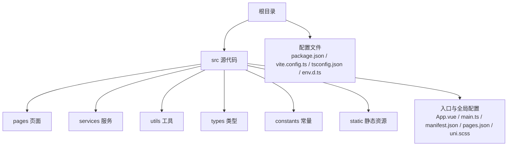
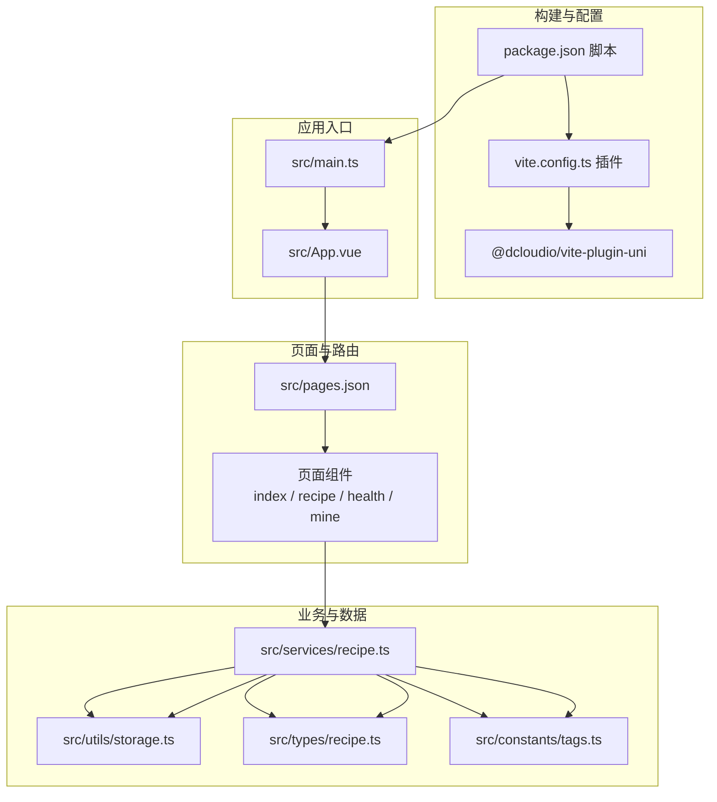
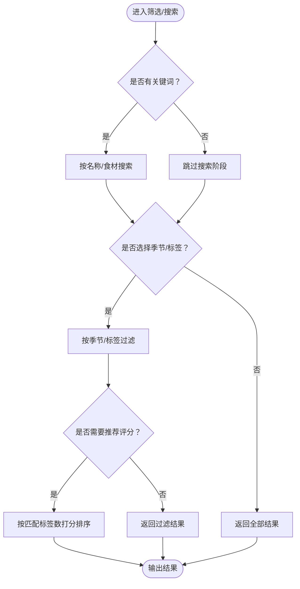
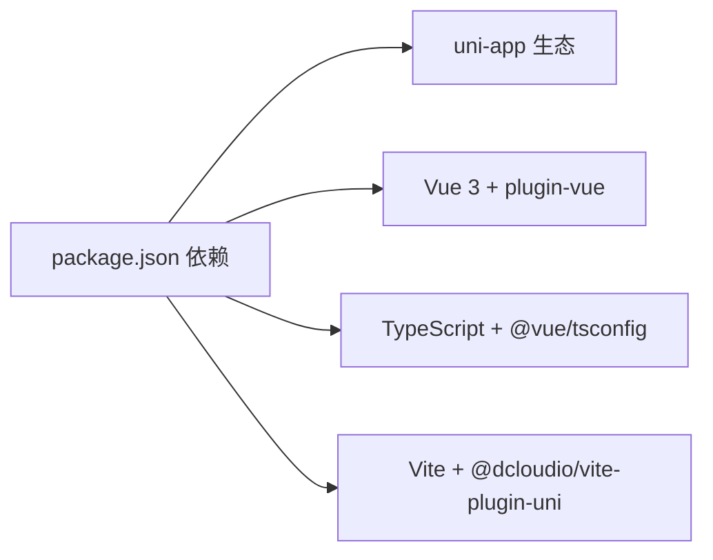

# 快速开始

<cite>
**本文引用的文件**
- [package.json](file://package.json)
- [vite.config.ts](file://vite.config.ts)
- [tsconfig.json](file://tsconfig.json)
- [env.d.ts](file://env.d.ts)
- [src/main.ts](file://src/main.ts)
- [src/App.vue](file://src/App.vue)
- [src/manifest.json](file://src/manifest.json)
- [src/pages.json](file://src/pages.json)
- [src/pages/index/index.vue](file://src/pages/index/index.vue)
- [src/pages/recipe/list.vue](file://src/pages/recipe/list.vue)
- [src/services/recipe.ts](file://src/services/recipe.ts)
- [src/utils/storage.ts](file://src/utils/storage.ts)
- [src/constants/tags.ts](file://src/constants/tags.ts)
- [src/types/recipe.ts](file://src/types/recipe.ts)
</cite>

## 目录
1. [简介](#简介)
2. [项目结构](#项目结构)
3. [核心组件](#核心组件)
4. [架构总览](#架构总览)
5. [详细组件分析](#详细组件分析)
6. [依赖分析](#依赖分析)
7. [性能考虑](#性能考虑)
8. [故障排查指南](#故障排查指南)
9. [结论](#结论)
10. [附录](#附录)

## 简介
本指南面向首次接触 eat 项目的开发者，帮助你在最短时间内完成开发环境准备、项目克隆、依赖安装、开发服务器启动以及多平台构建（H5、微信小程序）的全流程。eat 是一个基于 uni-app 的跨平台应用，使用 Vue 3 + TypeScript + Vite 进行开发，支持 H5 和微信小程序等目标平台。

## 项目结构
项目采用 uni-app 的标准目录组织方式，核心目录与文件如下：
- src：源代码目录
  - pages：页面组件（index、recipe、health、mine）
  - services：业务服务层（recipe、health）
  - utils：工具函数（storage、id、season）
  - types：TypeScript 类型定义
  - constants：常量定义（tags）
  - static：静态资源
  - 其他全局文件：App.vue、main.ts、manifest.json、pages.json、uni.scss
- 根目录配置：package.json、vite.config.ts、tsconfig.json、env.d.ts

图表来源
- [src/pages/index/index.vue](file://src/pages/index/index.vue)
- [src/pages/recipe/list.vue](file://src/pages/recipe/list.vue)
- [src/services/recipe.ts](file://src/services/recipe.ts)
- [src/utils/storage.ts](file://src/utils/storage.ts)
- [src/constants/tags.ts](file://src/constants/tags.ts)
- [src/types/recipe.ts](file://src/types/recipe.ts)

章节来源
- [src/pages/index/index.vue](file://src/pages/index/index.vue)
- [src/pages/recipe/list.vue](file://src/pages/recipe/list.vue)
- [src/services/recipe.ts](file://src/services/recipe.ts)
- [src/utils/storage.ts](file://src/utils/storage.ts)
- [src/constants/tags.ts](file://src/constants/tags.ts)
- [src/types/recipe.ts](file://src/types/recipe.ts)

## 核心组件
- 应用入口与生命周期
  - main.ts：创建 SSR 应用实例并导出 createApp 方法，供 uni-app 插件调用
  - App.vue：应用生命周期钩子（onLaunch、onShow、onHide），全局样式引入
- 平台配置
  - manifest.json：应用名称、版本、H5 标题与路由模式、微信小程序 appid、模块与分发配置等
  - pages.json：页面路由、全局导航样式、tabBar 配置
- 构建与脚本
  - package.json：定义开发脚本（dev:h5、build:h5、dev:mp-weixin、build:mp-weixin）、依赖与开发依赖
  - vite.config.ts：Vite 配置，集成 @dcloudio/vite-plugin-uni 插件
  - tsconfig.json：TypeScript 编译配置，路径别名、类型声明、lib 版本等
  - env.d.ts：Vite 环境类型声明

章节来源
- [src/main.ts](file://src/main.ts)
- [src/App.vue](file://src/App.vue)
- [src/manifest.json](file://src/manifest.json)
- [src/pages.json](file://src/pages.json)
- [package.json](file://package.json)
- [vite.config.ts](file://vite.config.ts)
- [tsconfig.json](file://tsconfig.json)
- [env.d.ts](file://env.d.ts)

## 架构总览
eat 采用 uni-app 生态，通过 Vite 构建工具链与 @dcloudio/vite-plugin-uni 插件实现多端编译。页面通过 pages.json 声明，服务层通过 services 抽象数据访问逻辑，工具层封装存储与标识生成，类型系统约束数据结构。

图表来源
- [package.json](file://package.json)
- [vite.config.ts](file://vite.config.ts)
- [src/main.ts](file://src/main.ts)
- [src/App.vue](file://src/App.vue)
- [src/pages.json](file://src/pages.json)
- [src/pages/index/index.vue](file://src/pages/index/index.vue)
- [src/pages/recipe/list.vue](file://src/pages/recipe/list.vue)
- [src/services/recipe.ts](file://src/services/recipe.ts)
- [src/utils/storage.ts](file://src/utils/storage.ts)
- [src/constants/tags.ts](file://src/constants/tags.ts)
- [src/types/recipe.ts](file://src/types/recipe.ts)

## 详细组件分析

### 页面与路由（pages.json）
- 页面声明：首页、菜谱列表、菜谱详情、编辑页、健康记录、历史、我的
- 导航与 tabBar：统一导航栏样式、tabBar 四个页面、图标与选中态
- H5 路由模式：hash 模式，适配浏览器历史记录

章节来源
- [src/pages.json](file://src/pages.json)

### 应用入口与生命周期（main.ts、App.vue）
- main.ts：创建 SSR 应用并导出 createApp，作为 uni-app 启动入口
- App.vue：应用生命周期钩子用于日志输出，样式引入 uni.scss

章节来源
- [src/main.ts](file://src/main.ts)
- [src/App.vue](file://src/App.vue)

### 平台配置（manifest.json）
- H5：标题、路由模式（hash）
- 微信小程序：appid 占位、安全设置（urlCheck）、组件化
- app-plus：组件化开关、nvue 编译器版本、Splash 屏、分发配置

章节来源
- [src/manifest.json](file://src/manifest.json)

### 菜谱服务（services/recipe.ts）
- 数据持久化：基于 uni.storage 的 get/set/remove 封装
- 基础 CRUD：查询、新增、更新、删除
- 搜索与筛选：按关键字、季节、身体状况标签进行过滤
- 推荐算法：按季节与匹配标签数量打分排序

图表来源
- [src/services/recipe.ts](file://src/services/recipe.ts)

章节来源
- [src/services/recipe.ts](file://src/services/recipe.ts)

### 存储工具（utils/storage.ts）
- 统一键值：RECIPES、HEALTH_RECORDS、CUSTOM_CONDITION_TAGS
- 安全读取/写入：异常兜底，避免崩溃
- 与 uni-app API 对接：同步存储接口

章节来源
- [src/utils/storage.ts](file://src/utils/storage.ts)

### 类型与常量（types/recipe.ts、constants/tags.ts）
- 类型定义：Season、Recipe 接口
- 常量：身体状况标签分组与扁平数组、食材分类、菜谱标签

章节来源
- [src/types/recipe.ts](file://src/types/recipe.ts)
- [src/constants/tags.ts](file://src/constants/tags.ts)

### 示例页面（首页与菜谱列表）
- 首页 index.vue：展示季节头部、今日健康卡片、推荐/当季菜谱、悬浮添加按钮
- 菜谱列表 list.vue：搜索输入、季节筛选、身体状况标签筛选、菜谱卡片列表、空状态与悬浮添加按钮

章节来源
- [src/pages/index/index.vue](file://src/pages/index/index.vue)
- [src/pages/recipe/list.vue](file://src/pages/recipe/list.vue)

## 依赖分析
- 运行时依赖
  - @dcloudio/uni-app、@dcloudio/uni-components、@dcloudio/uni-ui：uni-app 核心与 UI 组件
  - @dcloudio/uni-h5、@dcloudio/uni-mp-weixin：H5 与微信小程序运行时
  - @vitejs/plugin-vue、vue：Vue 3 与 Vite 插件
- 开发依赖
  - @dcloudio/types、@dcloudio/vite-plugin-uni：类型与 uni-app Vite 插件
  - @vue/tsconfig、typescript：TS 配置与编译
  - vite：构建工具

图表来源
- [package.json](file://package.json)
- [vite.config.ts](file://vite.config.ts)
- [tsconfig.json](file://tsconfig.json)

章节来源
- [package.json](file://package.json)
- [vite.config.ts](file://vite.config.ts)
- [tsconfig.json](file://tsconfig.json)

## 性能考虑
- 构建优化
  - 使用 Vite 提升冷启动与热更新速度
  - 在 tsconfig 中启用 skipLibCheck 降低类型检查开销
- 运行时优化
  - 页面级懒加载与按需渲染（如滚动容器）
  - 过滤与搜索在前端内存中处理，建议控制数据规模或增加分页
- 存储策略
  - 使用 uni.storage 同步接口，避免频繁 IO；对大对象序列化注意体积

## 故障排查指南
- 安装依赖失败
  - 症状：npm install 报错或卡住
  - 处理：更换镜像源、清理缓存、确认网络稳定；若为权限问题，使用管理员权限或调整 npm 全局目录
- 启动开发服务器报错
  - 症状：无法启动 dev:h5 或 dev:mp-weixin
  - 处理：检查 Node.js 版本是否满足依赖要求；确认 package.json 脚本存在且拼写正确；重启终端后重试
- H5 页面空白或路由异常
  - 症状：浏览器打开空白或刷新后路由丢失
  - 处理：检查 manifest.json 的 h5.router.mode 是否为 hash；确认 pages.json 的页面路径与实际文件一致
- 微信小程序编译错误
  - 症状：构建时报 appid 或模块相关错误
  - 处理：在 manifest.json 的 mp-weixin.appid 填写有效 appid；关闭 urlCheck 以允许本地调试；确保已安装开发者工具并授权
- 数据不显示或为空
  - 症状：菜谱列表为空、推荐结果为空
  - 处理：确认本地存储中是否存在 RECIPES 数据；使用内置编辑页添加示例数据；检查搜索关键词大小写与输入
- TypeScript 类型错误
  - 症状：编辑器报错或构建失败
  - 处理：检查 tsconfig.json 的路径映射与类型声明；确保 env.d.ts 引入了 Vite 类型；升级到兼容的 TypeScript 版本

章节来源
- [package.json](file://package.json)
- [src/manifest.json](file://src/manifest.json)
- [src/pages.json](file://src/pages.json)
- [src/utils/storage.ts](file://src/utils/storage.ts)

## 结论
通过本指南，你可以完成从环境准备到多平台运行的完整流程。建议先以 H5 平台验证功能，再切换至微信小程序进行联调与发布。日常开发中注意数据存储与页面性能，遇到问题优先核对配置文件与依赖版本。

## 附录

### 开发环境要求
- Node.js：建议使用 LTS 版本（如 18.x 或 20.x）
- 包管理器：npm（或 pnpm/yarn）
- 可选：微信开发者工具（用于小程序调试）

### 依赖安装步骤
- 在项目根目录执行安装命令，等待依赖下载完成
- 若网络较慢可配置镜像源或使用代理

章节来源
- [package.json](file://package.json)

### 项目配置与运行流程
- H5 开发
  - 启动命令：参考脚本 dev:h5
  - 访问地址：默认本地端口（由 Vite 分配）
- H5 构建
  - 构建命令：参考脚本 build:h5
  - 输出目录：Vite 默认 dist
- 微信小程序开发
  - 启动命令：参考脚本 dev:mp-weixin
  - 在微信开发者工具中导入项目目录
- 微信小程序构建
  - 构建命令：参考脚本 build:mp-weixin
  - 输出目录：uni-app 小程序产物目录

章节来源
- [package.json](file://package.json)
- [vite.config.ts](file://vite.config.ts)
- [src/manifest.json](file://src/manifest.json)
- [src/pages.json](file://src/pages.json)