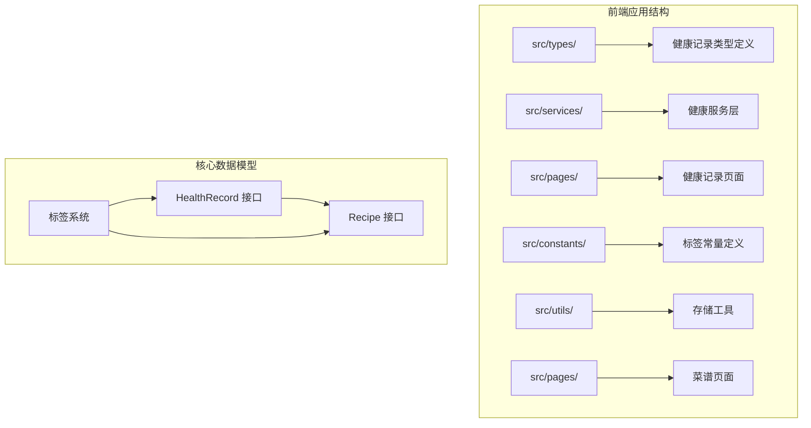
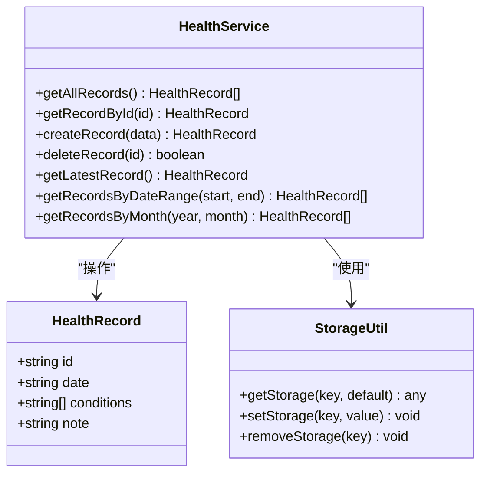
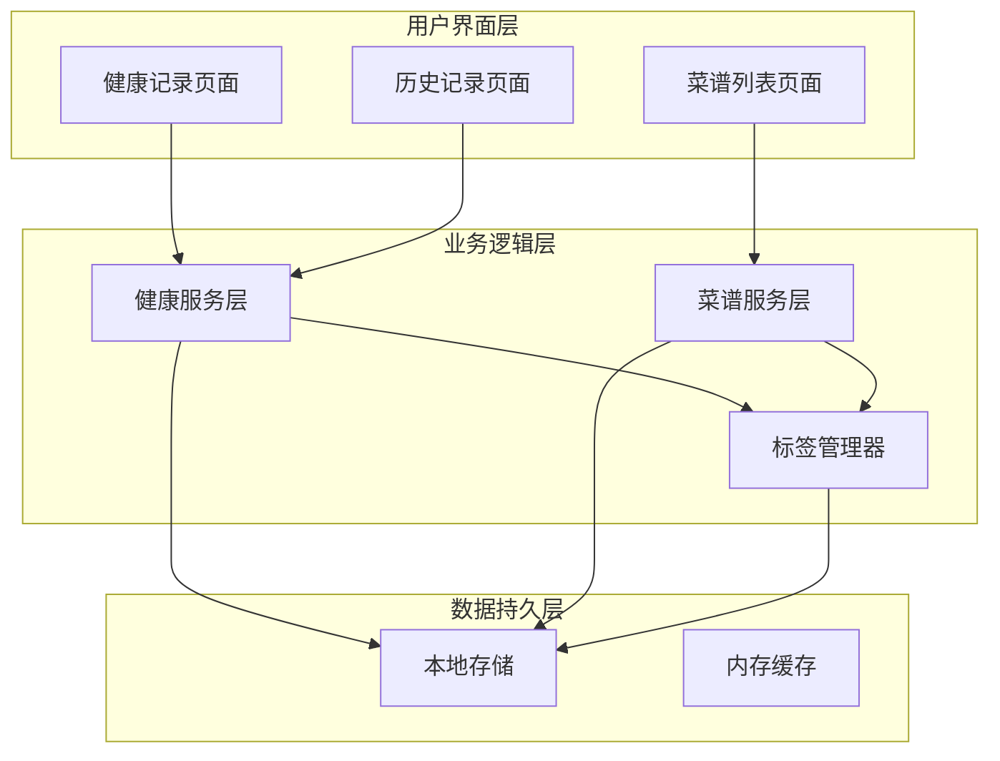
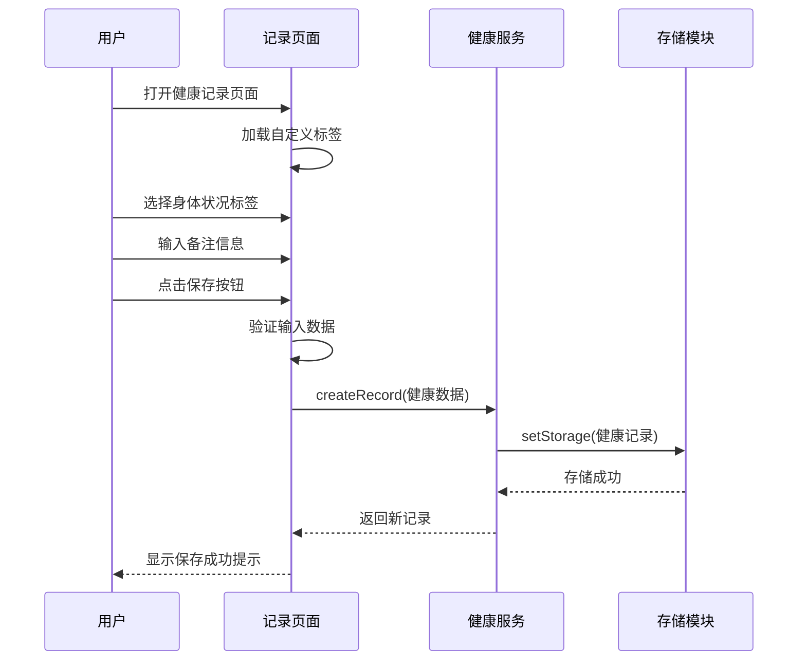
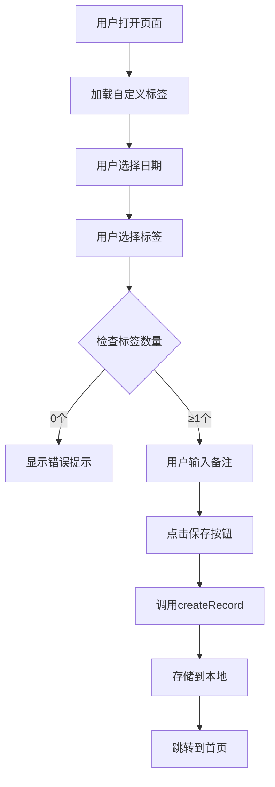
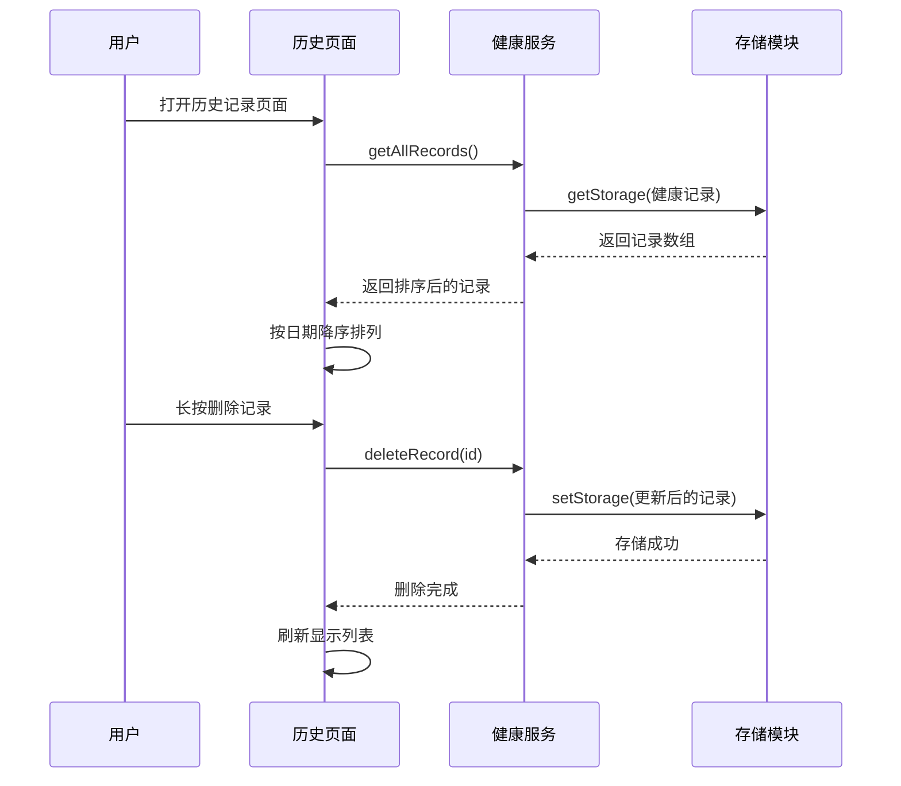
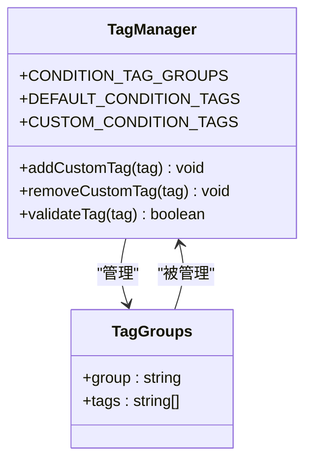
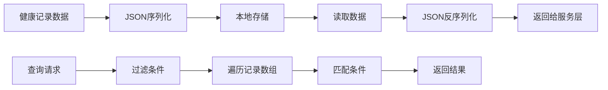
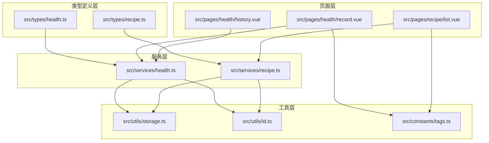

# 健康记录数据模型

<cite>
**本文档引用的文件**
- [src/types/health.ts](file://src/types/health.ts)
- [src/services/health.ts](file://src/services/health.ts)
- [src/pages/health/record.vue](file://src/pages/health/record.vue)
- [src/pages/health/history.vue](file://src/pages/health/history.vue)
- [src/constants/tags.ts](file://src/constants/tags.ts)
- [src/utils/storage.ts](file://src/utils/storage.ts)
- [src/utils/id.ts](file://src/utils/id.ts)
- [src/types/recipe.ts](file://src/types/recipe.ts)
- [src/services/recipe.ts](file://src/services/recipe.ts)
- [src/pages/recipe/list.vue](file://src/pages/recipe/list.vue)
- [src/pages.json](file://src/pages.json)
</cite>

## 目录
1. [简介](#简介)
2. [项目结构](#项目结构)
3. [核心组件](#核心组件)
4. [架构概览](#架构概览)
5. [详细组件分析](#详细组件分析)
6. [依赖关系分析](#依赖关系分析)
7. [性能考虑](#性能考虑)
8. [故障排除指南](#故障排除指南)
9. [结论](#结论)

## 简介

本文件详细阐述了健康记录数据模型（HealthRecord）的设计与实现。该系统是一个基于UniApp框架的移动端应用，主要功能包括健康记录的采集、存储、查询和展示，以及与菜谱推荐系统的集成。健康记录数据模型采用简洁而实用的设计，支持用户记录每日身体状况、添加自定义标签，并通过标签系统实现智能菜谱推荐。

## 项目结构

该项目采用模块化组织方式，按照功能域进行文件分离：

**图表来源**
- [src/types/health.ts:1-7](file://src/types/health.ts#L1-L7)
- [src/types/recipe.ts:1-15](file://src/types/recipe.ts#L1-L15)
- [src/constants/tags.ts:1-23](file://src/constants/tags.ts#L1-L23)

**章节来源**
- [src/pages.json:1-85](file://src/pages.json#L1-L85)
- [src/main.ts:1-10](file://src/main.ts#L1-L10)

## 核心组件

### 健康记录数据模型

健康记录数据模型是整个系统的核心，采用TypeScript接口定义，确保类型安全和开发体验。

**图表来源**
- [src/types/health.ts:1-7](file://src/types/health.ts#L1-L7)
- [src/services/health.ts:1-49](file://src/services/health.ts#L1-L49)
- [src/utils/storage.ts:1-34](file://src/utils/storage.ts#L1-L34)

### 数据模型字段定义

健康记录接口包含以下核心字段：

| 字段名 | 类型 | 必填 | 描述 | 示例值 |
|--------|------|------|------|--------|
| id | string | 是 | 唯一标识符 | "1704067200_abc123def" |
| date | string | 是 | 记录日期（YYYY-MM-DD格式） | "2024-01-01" |
| conditions | string[] | 是 | 身体状况标签列表 | ["感冒", "疲劳"] |
| note | string | 否 | 备注信息 | "今天感觉有些头晕" |

**章节来源**
- [src/types/health.ts:1-7](file://src/types/health.ts#L1-L7)

## 架构概览

系统采用分层架构设计，清晰分离了数据层、业务逻辑层和服务层：

**图表来源**
- [src/services/health.ts:1-49](file://src/services/health.ts#L1-L49)
- [src/services/recipe.ts:1-103](file://src/services/recipe.ts#L1-L103)
- [src/utils/storage.ts:1-34](file://src/utils/storage.ts#L1-L34)

## 详细组件分析

### 健康记录页面组件

健康记录页面提供了完整的用户交互界面，支持日期选择、标签选择和备注输入。

**图表来源**
- [src/pages/health/record.vue:131-152](file://src/pages/health/record.vue#L131-L152)
- [src/services/health.ts:14-23](file://src/services/health.ts#L14-L23)
- [src/utils/storage.ts:19-25](file://src/utils/storage.ts#L19-L25)

#### 页面交互流程

页面实现了完整的表单验证和用户反馈机制：

**图表来源**
- [src/pages/health/record.vue:106-152](file://src/pages/health/record.vue#L106-L152)

**章节来源**
- [src/pages/health/record.vue:1-313](file://src/pages/health/record.vue#L1-L313)

### 历史记录页面组件

历史记录页面展示了用户的健康记录历史，支持删除操作和排序显示。

**图表来源**
- [src/pages/health/history.vue:42-81](file://src/pages/health/history.vue#L42-L81)
- [src/services/health.ts:25-31](file://src/services/health.ts#L25-L31)

**章节来源**
- [src/pages/health/history.vue:1-177](file://src/pages/health/history.vue#L1-L177)

### 标签管理系统

系统实现了灵活的标签管理机制，支持预设标签和自定义标签：

**图表来源**
- [src/constants/tags.ts:1-23](file://src/constants/tags.ts#L1-L23)
- [src/pages/health/record.vue:115-129](file://src/pages/health/record.vue#L115-L129)

**章节来源**
- [src/constants/tags.ts:1-23](file://src/constants/tags.ts#L1-L23)

### 数据存储与查询

系统采用本地存储方案，所有数据都保存在设备本地存储中：

**图表来源**
- [src/utils/storage.ts:7-25](file://src/utils/storage.ts#L7-L25)
- [src/services/health.ts:5-48](file://src/services/health.ts#L5-L48)

**章节来源**
- [src/utils/storage.ts:1-34](file://src/utils/storage.ts#L1-L34)

## 依赖关系分析

系统各组件之间的依赖关系清晰明确：

**图表来源**
- [src/types/health.ts:1-7](file://src/types/health.ts#L1-L7)
- [src/types/recipe.ts:1-15](file://src/types/recipe.ts#L1-L15)
- [src/services/health.ts:1-49](file://src/services/health.ts#L1-L49)
- [src/services/recipe.ts:1-103](file://src/services/recipe.ts#L1-L103)

**章节来源**
- [src/pages/health/record.vue:84-86](file://src/pages/health/record.vue#L84-L86)
- [src/pages/recipe/list.vue:118-120](file://src/pages/recipe/list.vue#L118-L120)

## 性能考虑

### 内存优化策略

1. **懒加载机制**：页面按需加载，避免不必要的初始化
2. **数据缓存**：热门数据在内存中缓存，减少重复读取
3. **批量操作**：批量更新时只进行一次存储操作

### 查询优化

1. **索引策略**：基于日期的快速筛选
2. **条件过滤**：先大范围后精确的分层过滤
3. **结果缓存**：复杂查询结果的临时缓存

### 存储优化

1. **增量更新**：只更新变化的部分
2. **压缩存储**：对大型数据进行压缩
3. **清理策略**：定期清理过期数据

## 故障排除指南

### 常见问题及解决方案

#### 数据丢失问题
- **症状**：重启后健康记录消失
- **原因**：本地存储权限问题或存储空间不足
- **解决**：检查设备存储空间，重新授权应用存储权限

#### 标签显示异常
- **症状**：自定义标签无法显示或重复显示
- **原因**：标签数据损坏或同步问题
- **解决**：清除应用缓存，重新启动应用

#### 页面加载缓慢
- **症状**：页面切换响应慢
- **原因**：数据量过大或网络延迟
- **解决**：优化数据结构，减少不必要的数据传输

### 调试技巧

1. **控制台日志**：使用浏览器开发者工具查看控制台输出
2. **数据监控**：监控存储操作的执行时间和成功率
3. **错误追踪**：捕获并记录所有异常情况

**章节来源**
- [src/utils/storage.ts:7-17](file://src/utils/storage.ts#L7-L17)
- [src/services/health.ts:25-31](file://src/services/health.ts#L25-L31)

## 结论

健康记录数据模型设计简洁而实用，充分考虑了移动端应用的特点和用户需求。通过合理的数据结构设计、完善的业务逻辑实现和友好的用户界面，系统能够有效帮助用户记录和管理健康信息。

### 主要优势

1. **类型安全**：完整的TypeScript类型定义确保编译时类型检查
2. **易用性强**：直观的标签选择界面和简单的操作流程
3. **扩展性好**：模块化的架构设计便于功能扩展和维护
4. **性能稳定**：本地存储方案确保数据访问的快速性和稳定性

### 改进建议

1. **数据备份**：增加云端同步功能，防止本地数据丢失
2. **数据分析**：添加健康趋势分析和统计功能
3. **通知提醒**：设置健康记录提醒功能
4. **多设备同步**：支持跨设备数据同步

该健康记录系统为后续的功能扩展奠定了良好的基础，特别是与菜谱推荐系统的深度集成，为用户提供了一站式的健康管理解决方案。