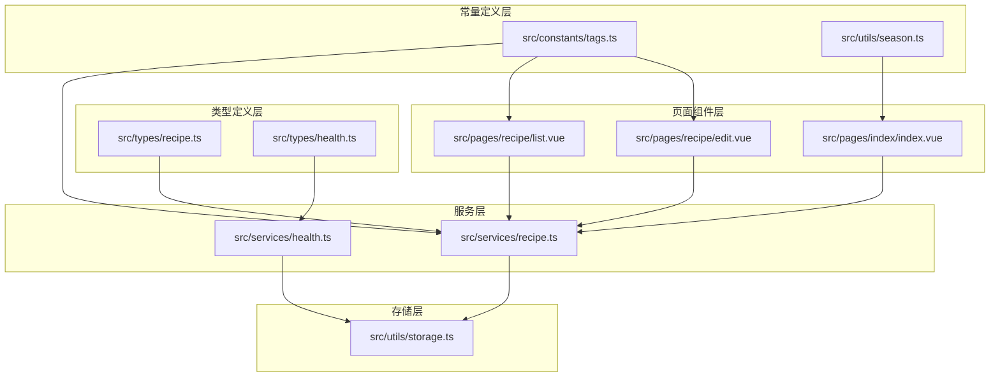
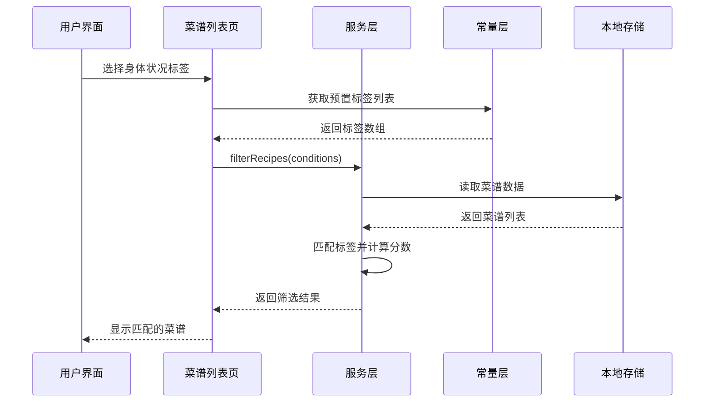
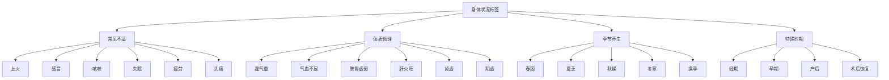
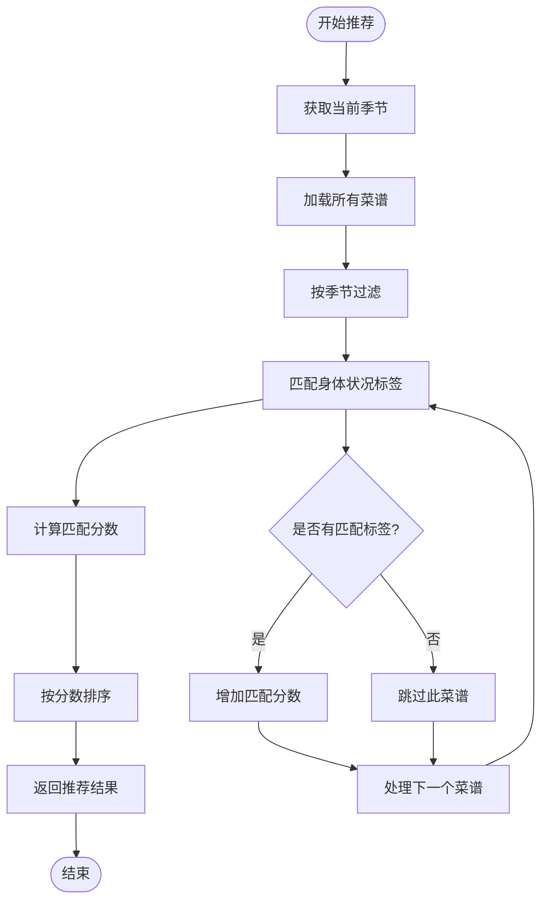
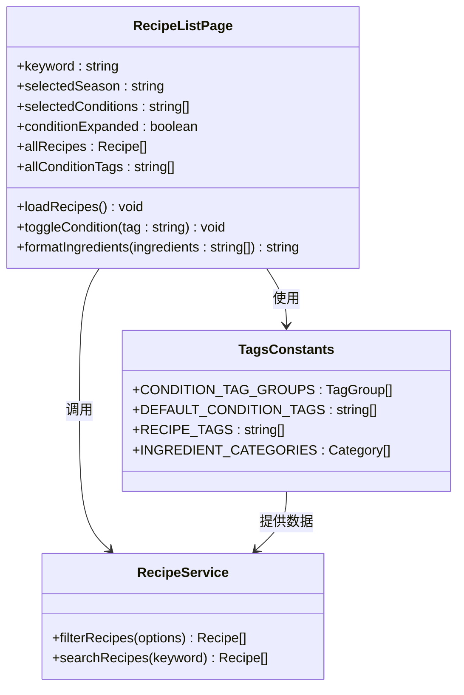
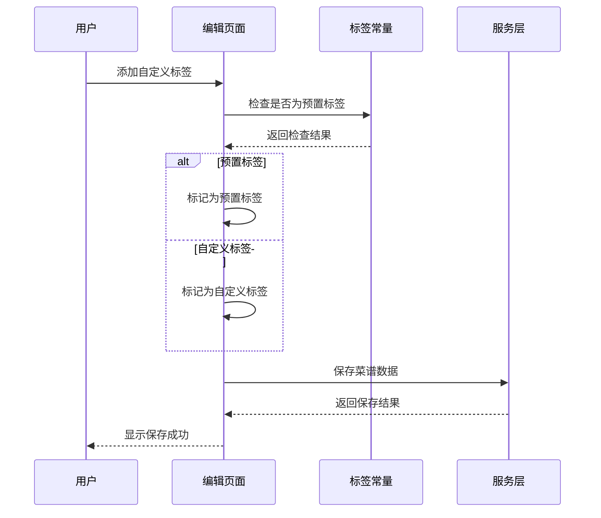
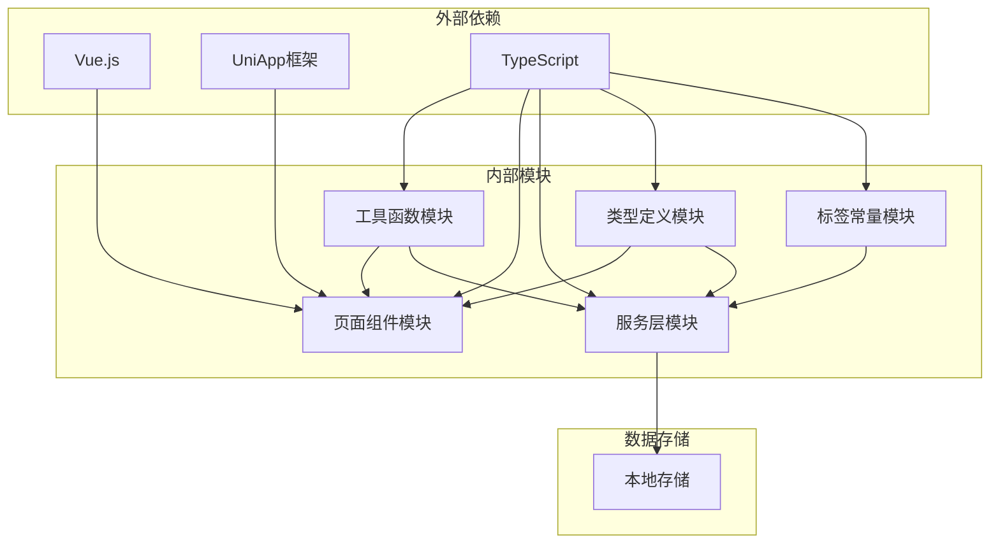

# 常量定义与枚举类型

<cite>
**本文档引用的文件**
- [src/constants/tags.ts](file://src/constants/tags.ts)
- [src/types/recipe.ts](file://src/types/recipe.ts)
- [src/types/health.ts](file://src/types/health.ts)
- [src/services/recipe.ts](file://src/services/recipe.ts)
- [src/services/health.ts](file://src/services/health.ts)
- [src/pages/recipe/list.vue](file://src/pages/recipe/list.vue)
- [src/pages/recipe/edit.vue](file://src/pages/recipe/edit.vue)
- [src/pages/index/index.vue](file://src/pages/index/index.vue)
- [src/utils/season.ts](file://src/utils/season.ts)
- [src/utils/storage.ts](file://src/utils/storage.ts)
</cite>

## 目录
1. [简介](#简介)
2. [项目结构](#项目结构)
3. [核心组件](#核心组件)
4. [架构概览](#架构概览)
5. [详细组件分析](#详细组件分析)
6. [依赖关系分析](#依赖关系分析)
7. [性能考虑](#性能考虑)
8. [故障排除指南](#故障排除指南)
9. [结论](#结论)

## 简介

本文件详细阐述了项目中的常量定义与枚举类型系统，重点分析了标签常量（tags.ts）的定义和使用方法。该系统包含预置标签的分类体系、标签语义和应用场景，解释了枚举类型的设计原则和类型安全机制，并提供了常量值的完整列表、使用示例和最佳实践。

系统通过精心设计的常量体系支持菜谱推荐算法，实现了基于身体状况标签、季节偏好和自定义标签的智能匹配逻辑。同时，文档还涵盖了常量的维护策略、扩展方法和版本管理，以及常量与数据模型的关联关系和数据一致性保证。

## 项目结构

项目采用模块化架构，常量定义集中在 `src/constants/` 目录下，主要包含标签常量定义文件。系统的核心数据结构通过 TypeScript 类型定义进行约束，服务层提供数据操作功能，页面组件负责用户界面交互。



**图表来源**
- [src/constants/tags.ts:1-23](file://src/constants/tags.ts#L1-L23)
- [src/types/recipe.ts:1-15](file://src/types/recipe.ts#L1-L15)
- [src/services/recipe.ts:1-102](file://src/services/recipe.ts#L1-L102)

**章节来源**
- [src/constants/tags.ts:1-23](file://src/constants/tags.ts#L1-L23)
- [src/types/recipe.ts:1-15](file://src/types/recipe.ts#L1-L15)

## 核心组件

### 标签常量系统

系统定义了三个主要的标签常量集合，每个集合都有明确的功能定位和使用场景：

#### 预置身体状况标签组（CONDITION_TAG_GROUPS）

这是一个结构化的标签分组系统，包含四个主要类别：
- **常见不适**：上火、感冒、咳嗽、失眠、疲劳、头痛
- **体质调理**：湿气重、气血不足、脾胃虚弱、肝火旺、肾虚、阴虚  
- **季节养生**：春困、夏乏、秋燥、冬寒、换季
- **特殊时期**：经期、孕期、产后、术后恢复

这些标签通过扁平化处理形成完整的标签列表，便于在不同场景下使用。

#### 预置菜谱标签（RECIPE_TAGS）

包含14个常用的菜谱分类标签：
- 快手菜、汤煲、粥品、甜品、凉菜
- 炒菜、蒸菜、烤制、素食、低脂
- 补气血、清热、祛湿、养胃

这些标签用于描述菜谱的制作方式、营养特性等属性。

#### 食材分类系统（INGREDIENT_CATEGORIES）

提供五类常见食材的分类定义：
- **蔬菜类**：白菜、菠菜、西兰花、胡萝卜等10种常见蔬菜
- **肉类**：猪肉、牛肉、鸡肉等8种常见肉类
- **豆类/蛋奶**：豆腐、鸡蛋、牛奶等7种蛋白质来源
- **药食同源**：枸杞、红枣、当归等10种药食两用材料
- **调味/其他**：生姜、大蒜、花椒等8种常用调料

**章节来源**
- [src/constants/tags.ts:1-23](file://src/constants/tags.ts#L1-L23)

### 枚举类型系统

系统采用了 TypeScript 的字面量类型（Literal Types）来实现类型安全的枚举：

#### 季节枚举（Season）

```typescript
export type Season = '春' | '夏' | '秋' | '冬'
```

这种设计提供了以下优势：
- 编译时类型检查，防止输入无效值
- 智能提示支持，IDE 可以提供完整的选项建议
- 运行时零开销，编译后转换为字符串类型
- 明确的语义边界，确保季节值的唯一性和完整性

#### 数据模型接口

系统通过 TypeScript 接口定义了清晰的数据结构：
- **Recipe 接口**：包含菜谱的基本信息、食材列表、适用季节、身体状况标签、自定义标签等字段
- **HealthRecord 接口**：包含健康记录的日期、身体状况标签列表和备注信息

**章节来源**
- [src/types/recipe.ts:1-15](file://src/types/recipe.ts#L1-L15)
- [src/types/health.ts:1-7](file://src/types/health.ts#L1-L7)

## 架构概览

系统采用分层架构设计，常量定义作为基础设施层，为上层业务逻辑提供稳定的配置基础。



**图表来源**
- [src/pages/recipe/list.vue:139-170](file://src/pages/recipe/list.vue#L139-L170)
- [src/services/recipe.ts:64-85](file://src/services/recipe.ts#L64-L85)
- [src/constants/tags.ts:9-10](file://src/constants/tags.ts#L9-L10)

## 详细组件分析

### 标签常量的使用模式

#### 预置标签的分类体系

系统通过分组的方式组织预置标签，形成了完整的健康和饮食知识体系：



**图表来源**
- [src/constants/tags.ts:2-7](file://src/constants/tags.ts#L2-L7)

#### 标签匹配算法

系统实现了基于标签匹配的智能推荐算法：



**图表来源**
- [src/services/recipe.ts:87-102](file://src/services/recipe.ts#L87-L102)

**章节来源**
- [src/services/recipe.ts:87-102](file://src/services/recipe.ts#L87-L102)

### 页面组件中的常量使用

#### 菜谱列表页面的标签展示

菜谱列表页面通过预置标签系统实现了丰富的筛选功能：



**图表来源**
- [src/pages/recipe/list.vue:114-200](file://src/pages/recipe/list.vue#L114-L200)
- [src/constants/tags.ts:1-23](file://src/constants/tags.ts#L1-L23)

#### 菜谱编辑页面的标签管理

编辑页面提供了灵活的标签管理系统，支持预置标签和自定义标签的混合使用：



**图表来源**
- [src/pages/recipe/edit.vue:215-223](file://src/pages/recipe/edit.vue#L215-L223)
- [src/constants/tags.ts:9-10](file://src/constants/tags.ts#L9-L10)

**章节来源**
- [src/pages/recipe/list.vue:114-200](file://src/pages/recipe/list.vue#L114-L200)
- [src/pages/recipe/edit.vue:215-223](file://src/pages/recipe/edit.vue#L215-L223)

### 推荐算法的实现细节

#### 多维度匹配策略

系统实现了基于多个维度的智能匹配算法：

1. **季节匹配**：优先筛选符合当前季节的菜谱
2. **身体状况匹配**：计算用户身体状况标签与菜谱标签的匹配程度
3. **分数计算**：基于匹配标签数量计算综合评分
4. **结果排序**：按匹配分数降序排列

#### 类型安全的实现

通过 TypeScript 的类型系统确保了算法实现的正确性：

```mermaid
graph LR
A[输入参数] --> B[Season类型检查]
A --> C[string[]类型检查]
B --> D[编译时验证]
C --> D
D --> E[运行时安全]
F[返回结果] --> G[Recipe[]类型约束]
G --> H[编译器自动推断]
H --> I[IDE智能提示]
```

**图表来源**
- [src/services/recipe.ts:87-102](file://src/services/recipe.ts#L87-L102)
- [src/types/recipe.ts:1-15](file://src/types/recipe.ts#L1-L15)

**章节来源**
- [src/services/recipe.ts:87-102](file://src/services/recipe.ts#L87-L102)

## 依赖关系分析

系统中的依赖关系体现了清晰的分层架构和职责分离：



**图表来源**
- [src/constants/tags.ts:1-23](file://src/constants/tags.ts#L1-L23)
- [src/services/recipe.ts:1-102](file://src/services/recipe.ts#L1-L102)

### 关键依赖链路

1. **常量依赖链**：页面组件 → 常量定义 → 服务层
2. **类型依赖链**：服务层 → 类型定义 → 数据模型
3. **数据流链路**：用户输入 → 页面组件 → 服务层 → 存储层

**章节来源**
- [src/constants/tags.ts:1-23](file://src/constants/tags.ts#L1-L23)
- [src/services/recipe.ts:1-102](file://src/services/recipe.ts#L1-L102)

## 性能考虑

### 内存优化策略

1. **常量缓存**：标签常量作为纯静态数据，首次加载后在内存中缓存
2. **扁平化处理**：通过 `flatMap` 方法生成扁平数组，减少嵌套层级
3. **按需加载**：页面组件只导入需要使用的常量，避免不必要的内存占用

### 计算性能优化

1. **高效匹配算法**：使用 `some` 和 `filter` 方法实现高效的标签匹配
2. **分数计算优化**：仅对符合条件的菜谱进行分数计算
3. **结果缓存**：在用户界面层面避免重复计算

### 存储效率

1. **JSON序列化**：使用 `JSON.stringify` 进行数据持久化
2. **增量更新**：只更新发生变化的数据项
3. **类型安全**：通过 TypeScript 确保数据格式的正确性

## 故障排除指南

### 常见问题及解决方案

#### 标签不显示问题

**症状**：页面无法显示预置标签
**可能原因**：
- 常量文件导入错误
- 标签数组为空
- 组件状态未正确更新

**解决方法**：
1. 检查常量文件的导出语法
2. 验证标签数组的初始化
3. 确认组件的响应式状态更新

#### 推荐算法异常

**症状**：菜谱推荐结果不符合预期
**可能原因**：
- 身体状况标签不匹配
- 季节判断错误
- 数据格式不正确

**解决方法**：
1. 检查输入的标签是否在预置列表中
2. 验证当前季节的计算逻辑
3. 确认菜谱数据的结构完整性

#### 类型错误

**症状**：TypeScript 编译报错
**可能原因**：
- 类型定义不匹配
- 枚举值超出范围
- 接口字段缺失

**解决方法**：
1. 检查类型定义的一致性
2. 验证枚举值的有效性
3. 确认接口实现的完整性

**章节来源**
- [src/constants/tags.ts:1-23](file://src/constants/tags.ts#L1-L23)
- [src/services/recipe.ts:87-102](file://src/services/recipe.ts#L87-L102)

## 结论

本系统的常量定义与枚举类型设计体现了现代前端开发的最佳实践，通过精心设计的标签体系和类型安全机制，为菜谱推荐算法提供了坚实的基础。

### 主要优势

1. **类型安全**：通过 TypeScript 的字面量类型确保编译时的类型检查
2. **可维护性**：模块化的常量定义便于维护和扩展
3. **性能优化**：合理的数据结构和算法设计保证了良好的用户体验
4. **灵活性**：支持预置标签和自定义标签的混合使用

### 技术亮点

- **分层架构**：清晰的职责分离和依赖关系
- **智能推荐**：基于多维度标签匹配的推荐算法
- **扩展性**：完善的常量维护和扩展机制
- **数据一致性**：通过类型定义保证数据结构的完整性

### 发展建议

1. **持续优化**：根据用户反馈不断调整标签分类和权重
2. **功能扩展**：增加更多维度的标签和匹配规则
3. **性能监控**：建立性能指标监控体系
4. **文档完善**：持续更新技术文档和使用指南

该系统为健康饮食应用提供了可靠的基础设施，通过合理的常量管理和智能算法实现了高质量的个性化推荐体验。