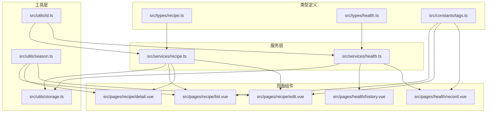
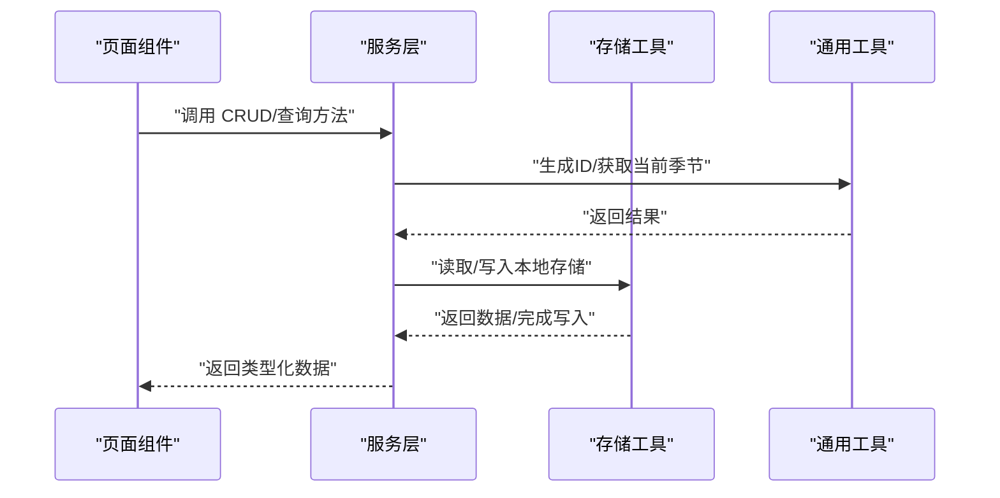
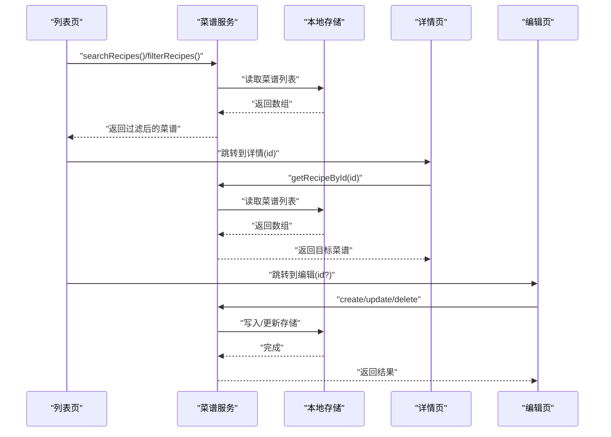
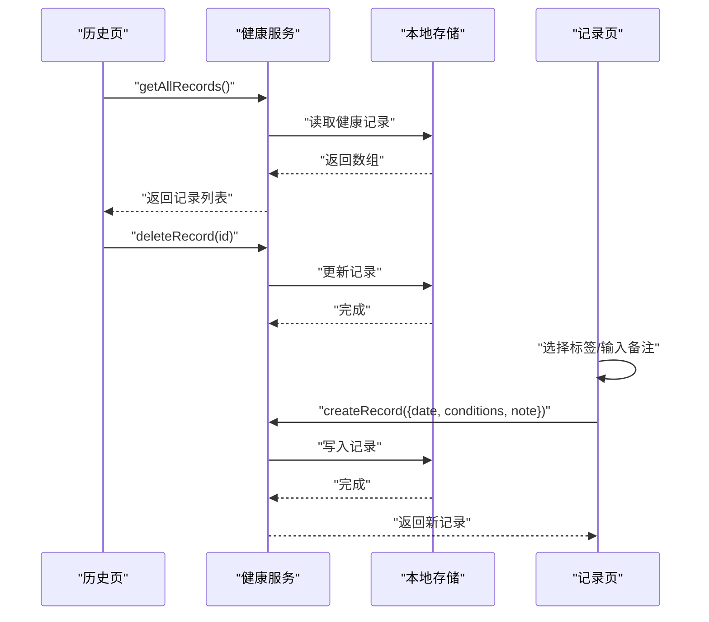
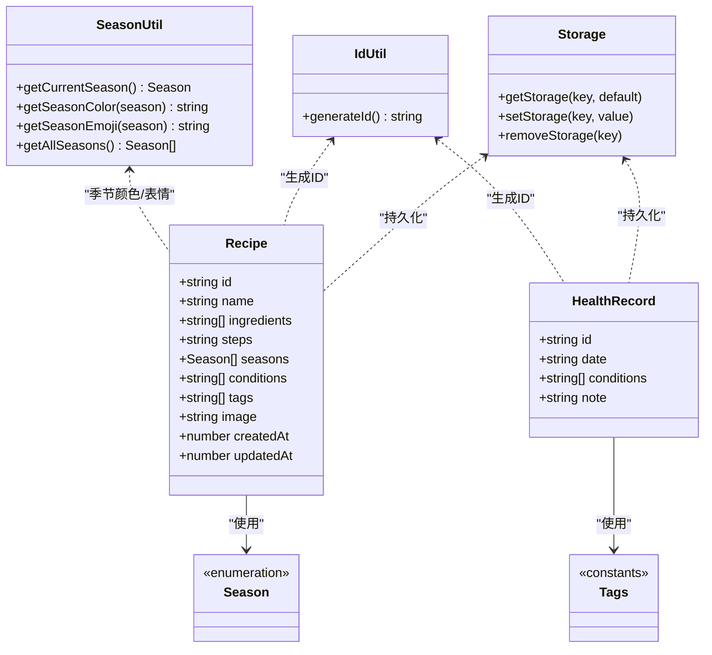

# 数据模型与类型定义

<cite>
**本文引用的文件**
- [src/types/recipe.ts](file://src/types/recipe.ts)
- [src/types/health.ts](file://src/types/health.ts)
- [src/constants/tags.ts](file://src/constants/tags.ts)
- [src/services/recipe.ts](file://src/services/recipe.ts)
- [src/services/health.ts](file://src/services/health.ts)
- [src/utils/storage.ts](file://src/utils/storage.ts)
- [src/utils/id.ts](file://src/utils/id.ts)
- [src/utils/season.ts](file://src/utils/season.ts)
- [src/pages/recipe/list.vue](file://src/pages/recipe/list.vue)
- [src/pages/recipe/detail.vue](file://src/pages/recipe/detail.vue)
- [src/pages/recipe/edit.vue](file://src/pages/recipe/edit.vue)
- [src/pages/health/history.vue](file://src/pages/health/history.vue)
- [src/pages/health/record.vue](file://src/pages/health/record.vue)
- [tsconfig.json](file://tsconfig.json)
- [package.json](file://package.json)
</cite>

## 目录
1. [简介](#简介)
2. [项目结构](#项目结构)
3. [核心数据模型](#核心数据模型)
4. [架构总览](#架构总览)
5. [组件级详细分析](#组件级详细分析)
6. [依赖关系分析](#依赖关系分析)
7. [性能与类型安全考量](#性能与类型安全考量)
8. [故障排查指南](#故障排查指南)
9. [结论](#结论)
10. [附录](#附录)

## 简介
本文件面向开发者，系统梳理 eat 项目的“数据模型与类型定义”。重点覆盖两类核心实体：
- 菜谱数据模型（Recipe）
- 健康记录数据模型（HealthRecord）

同时，文档解释 TypeScript 接口设计原则、类型安全机制、数据验证策略、标签常量与枚举、预置数据使用、数据生命周期管理、类型推导与泛型实践，并提供模型关系图、字段说明表与示例数据，帮助开发者准确理解数据结构并正确使用类型定义。

## 项目结构
eat 项目采用基于功能模块的组织方式，类型定义集中在 types 目录，服务层封装 CRUD 与查询逻辑，页面组件通过服务层消费数据模型，工具层提供存储与标识生成等通用能力。

图表来源
- [src/types/recipe.ts:1-15](file://src/types/recipe.ts#L1-L15)
- [src/types/health.ts:1-7](file://src/types/health.ts#L1-L7)
- [src/constants/tags.ts:1-23](file://src/constants/tags.ts#L1-L23)
- [src/services/recipe.ts:1-103](file://src/services/recipe.ts#L1-L103)
- [src/services/health.ts:1-49](file://src/services/health.ts#L1-L49)
- [src/utils/storage.ts:1-34](file://src/utils/storage.ts#L1-L34)
- [src/utils/id.ts:1-4](file://src/utils/id.ts#L1-L4)
- [src/utils/season.ts:1-34](file://src/utils/season.ts#L1-L34)
- [src/pages/recipe/list.vue:1-477](file://src/pages/recipe/list.vue#L1-L477)
- [src/pages/recipe/detail.vue:1-435](file://src/pages/recipe/detail.vue#L1-L435)
- [src/pages/recipe/edit.vue:1-702](file://src/pages/recipe/edit.vue#L1-L702)
- [src/pages/health/history.vue:1-177](file://src/pages/health/history.vue#L1-L177)
- [src/pages/health/record.vue:1-313](file://src/pages/health/record.vue#L1-L313)

章节来源
- [tsconfig.json:1-20](file://tsconfig.json#L1-L20)
- [package.json:1-28](file://package.json#L1-L28)

## 核心数据模型

### 菜谱数据模型（Recipe）
- 字段定义与类型
  - id: string（唯一标识）
  - name: string（菜名）
  - ingredients: string[]（食材列表）
  - steps: string（做法步骤）
  - seasons: Season[]（适合季节）
  - conditions: string[]（适合的身体状况标签）
  - tags: string[]（自定义标签）
  - image: string（图片，支持 base64 或本地路径）
  - createdAt: number（毫秒时间戳）
  - updatedAt: number（毫秒时间戳）

- 设计要点
  - 使用字面量联合类型 Season 定义可选值集合，确保 seasons 字段的取值受控。
  - 时间戳字段统一使用 number 类型，便于排序与比较。
  - image 支持 base64，便于离线展示与跨平台兼容。

- 业务规则
  - seasons 至少包含一个元素（编辑页校验）。
  - ingredients 至少包含一个非空字符串（编辑页校验）。
  - name 必填且去除首尾空白（编辑页校验）。
  - createdAt/updatedAt 在创建时写入当前时间，更新时仅更新 updatedAt。

- 字段说明表
  - id: 唯一标识符，由全局 ID 生成器生成。
  - name: 菜名，必填。
  - ingredients: 食材数组，至少一项有效内容。
  - steps: 做法文本，支持多行。
  - seasons: 季节数组，取值来自 Season 枚举。
  - conditions: 身体状况标签数组，来源于预置分组或用户自定义。
  - tags: 自定义标签数组，来源于预置标签或用户自定义。
  - image: 图片地址或 base64 数据。
  - createdAt/updatedAt: 创建与更新时间戳。

- 示例数据（示意）
  - id: "1719926400_abc123f"
  - name: "清炒时蔬"
  - ingredients: ["小白菜", "蒜蓉", "盐"]
  - steps: "1. 小白菜洗净\n2. 热锅下油爆香蒜蓉\n3. 下菜大火快炒..."
  - seasons: ["春", "夏"]
  - conditions: ["清淡饮食", "脾胃虚弱"]
  - tags: ["快手菜", "清热"]
  - image: "data:image/jpeg;base64,/9j/..."
  - createdAt: 1719926400000
  - updatedAt: 1719926400000

章节来源
- [src/types/recipe.ts:1-15](file://src/types/recipe.ts#L1-L15)
- [src/services/recipe.ts:14-26](file://src/services/recipe.ts#L14-L26)
- [src/services/recipe.ts:28-43](file://src/services/recipe.ts#L28-L43)
- [src/pages/recipe/edit.vue:348-363](file://src/pages/recipe/edit.vue#L348-L363)

### 健康记录数据模型（HealthRecord）
- 字段定义与类型
  - id: string（唯一标识）
  - date: string（YYYY-MM-DD）
  - conditions: string[]（当前状况标签列表）
  - note: string（备注）

- 设计要点
  - date 使用字符串格式，便于本地化显示与范围查询。
  - conditions 为标签数组，支持多选。
  - note 提供可选补充说明。

- 业务规则
  - 至少选择一个身体状况标签（保存时校验）。
  - date 默认为当天，允许用户修改。
  - note 最大长度限制（页面组件设置）。

- 字段说明表
  - id: 唯一标识符，由全局 ID 生成器生成。
  - date: 记录日期，格式为 YYYY-MM-DD。
  - conditions: 身体状况标签数组。
  - note: 备注文本。

- 示例数据（示意）
  - id: "1719926400_def456g"
  - date: "2024-07-05"
  - conditions: ["湿气重", "疲劳"]
  - note: "今日感觉乏力，注意休息"

章节来源
- [src/types/health.ts:1-7](file://src/types/health.ts#L1-L7)
- [src/services/health.ts:14-23](file://src/services/health.ts#L14-L23)
- [src/pages/health/record.vue:131-152](file://src/pages/health/record.vue#L131-L152)

## 架构总览
eat 项目的数据流遵循“页面组件 → 服务层 → 工具层”的分层架构：
- 页面组件负责用户交互与视图渲染，调用服务层接口。
- 服务层封装数据访问与业务逻辑，使用类型定义保证参数与返回值的类型安全。
- 工具层提供通用能力（存储、ID 生成、季节映射），被服务层复用。

图表来源
- [src/services/recipe.ts:1-103](file://src/services/recipe.ts#L1-L103)
- [src/services/health.ts:1-49](file://src/services/health.ts#L1-L49)
- [src/utils/storage.ts:1-34](file://src/utils/storage.ts#L1-L34)
- [src/utils/id.ts:1-4](file://src/utils/id.ts#L1-L4)
- [src/utils/season.ts:1-34](file://src/utils/season.ts#L1-L34)
- [src/pages/recipe/list.vue:114-170](file://src/pages/recipe/list.vue#L114-L170)
- [src/pages/health/record.vue:81-157](file://src/pages/health/record.vue#L81-L157)

## 组件级详细分析

### 菜谱模块（列表/详情/编辑）
- 列表页（list.vue）
  - 功能：搜索、按季节与身体状况标签筛选、展示菜谱卡片。
  - 关键点：使用 DEFAULT_CONDITION_TAGS 作为筛选标签源；computed 计算过滤后的菜谱列表；调用 searchRecipes 与 filterRecipes。
  - 交互：点击卡片跳转详情；悬浮按钮进入编辑。

- 详情页（detail.vue）
  - 功能：展示菜谱详情，包括图片、标签、食材、步骤、时间信息。
  - 关键点：根据 seasons 显示彩色标签与表情；格式化时间戳；支持删除与编辑跳转。

- 编辑页（edit.vue）
  - 功能：新增/编辑菜谱，包含菜名、图片、食材、步骤、季节、身体状况标签、自定义标签。
  - 关键点：校验必填项（name、至少一个食材、至少一个季节）；支持自定义标签；图片读取为 base64；保存后返回列表。

图表来源
- [src/pages/recipe/list.vue:114-170](file://src/pages/recipe/list.vue#L114-L170)
- [src/services/recipe.ts:5-62](file://src/services/recipe.ts#L5-L62)
- [src/pages/recipe/detail.vue:115-145](file://src/pages/recipe/detail.vue#L115-L145)
- [src/pages/recipe/edit.vue:189-394](file://src/pages/recipe/edit.vue#L189-L394)

章节来源
- [src/pages/recipe/list.vue:1-477](file://src/pages/recipe/list.vue#L1-L477)
- [src/pages/recipe/detail.vue:1-435](file://src/pages/recipe/detail.vue#L1-L435)
- [src/pages/recipe/edit.vue:1-702](file://src/pages/recipe/edit.vue#L1-L702)
- [src/services/recipe.ts:1-103](file://src/services/recipe.ts#L1-L103)

### 健康模块（历史/记录）
- 历史页（history.vue）
  - 功能：展示历史健康记录，支持按日期降序排列、长按删除。
  - 关键点：从本地存储读取记录；格式化日期显示；删除后刷新列表。

- 记录页（record.vue）
  - 功能：选择日期、勾选身体状况标签、输入备注、保存记录。
  - 关键点：使用 CONDITION_TAG_GROUPS 与 DEFAULT_CONDITION_TAGS；支持自定义标签持久化；保存时进行必填校验。

图表来源
- [src/pages/health/history.vue:34-82](file://src/pages/health/history.vue#L34-L82)
- [src/services/health.ts:5-49](file://src/services/health.ts#L5-L49)
- [src/pages/health/record.vue:81-157](file://src/pages/health/record.vue#L81-L157)

章节来源
- [src/pages/health/history.vue:1-177](file://src/pages/health/history.vue#L1-L177)
- [src/pages/health/record.vue:1-313](file://src/pages/health/record.vue#L1-L313)
- [src/services/health.ts:1-49](file://src/services/health.ts#L1-L49)

### 标签常量与枚举
- 标签分组与扁平化
  - 身体状况标签按分组组织，提供扁平数组用于筛选与选择。
  - 常见食材分类与菜谱常用标签作为预置数据，供页面组件直接使用。
- 枚举类型
  - Season 使用字面量联合类型，限定取值为“春/夏/秋/冬”。

章节来源
- [src/constants/tags.ts:1-23](file://src/constants/tags.ts#L1-L23)
- [src/types/recipe.ts:1-1](file://src/types/recipe.ts#L1-L1)

### 数据生命周期管理
- 生成与持久化
  - 全局 ID 生成器用于创建唯一标识。
  - 本地存储封装了读取/写入/删除，统一键名常量管理。
- 读取与更新
  - 读取时提供默认值，避免空值导致的异常。
  - 更新时仅更新指定字段并刷新 updatedAt，保持一致性。

章节来源
- [src/utils/id.ts:1-4](file://src/utils/id.ts#L1-L4)
- [src/utils/storage.ts:1-34](file://src/utils/storage.ts#L1-L34)
- [src/services/recipe.ts:14-26](file://src/services/recipe.ts#L14-L26)
- [src/services/recipe.ts:28-43](file://src/services/recipe.ts#L28-L43)
- [src/services/health.ts:14-23](file://src/services/health.ts#L14-L23)

## 依赖关系分析

图表来源
- [src/types/recipe.ts:1-15](file://src/types/recipe.ts#L1-L15)
- [src/types/health.ts:1-7](file://src/types/health.ts#L1-L7)
- [src/constants/tags.ts:1-23](file://src/constants/tags.ts#L1-L23)
- [src/utils/storage.ts:1-34](file://src/utils/storage.ts#L1-L34)
- [src/utils/id.ts:1-4](file://src/utils/id.ts#L1-L4)
- [src/utils/season.ts:1-34](file://src/utils/season.ts#L1-L34)

章节来源
- [src/types/recipe.ts:1-15](file://src/types/recipe.ts#L1-L15)
- [src/types/health.ts:1-7](file://src/types/health.ts#L1-L7)
- [src/constants/tags.ts:1-23](file://src/constants/tags.ts#L1-L23)
- [src/utils/storage.ts:1-34](file://src/utils/storage.ts#L1-L34)
- [src/utils/id.ts:1-4](file://src/utils/id.ts#L1-L4)
- [src/utils/season.ts:1-34](file://src/utils/season.ts#L1-L34)

## 性能与类型安全考量
- 类型安全
  - 使用字面量联合类型（Season）限制枚举值，避免运行时错误。
  - 使用 Omit/Partial 等工具类型，确保对外暴露的 API 参数最小化、明确化。
- 数据访问
  - 本地存储读取提供默认值，减少空值判断开销。
  - 过滤与排序在内存中进行，建议在数据量较大时考虑分页或索引策略。
- 渲染优化
  - 页面组件使用 computed 缓存计算结果，减少重复过滤。
  - 列表滚动容器与懒加载策略提升滚动性能。

章节来源
- [src/services/recipe.ts:14-26](file://src/services/recipe.ts#L14-L26)
- [src/services/recipe.ts:28-43](file://src/services/recipe.ts#L28-L43)
- [src/services/health.ts:14-23](file://src/services/health.ts#L14-L23)
- [src/pages/recipe/list.vue:139-170](file://src/pages/recipe/list.vue#L139-L170)

## 故障排查指南
- 本地存储异常
  - 现象：读取为空或报错。
  - 排查：检查键名是否一致、JSON 解析是否异常、存储权限。
  - 参考：存储工具的默认值与异常捕获逻辑。
- ID 冲突
  - 现象：重复 ID 导致更新/删除异常。
  - 排查：确认 ID 生成器是否被正确调用；避免手动传入 id。
- 季节/标签不匹配
  - 现象：筛选无效或显示异常。
  - 排查：确认 seasons 与 conditions 的取值是否属于 Season 与预置标签集合。
- 图片无法显示
  - 现象：图片路径或 base64 不生效。
  - 排查：确认图片读取流程与 base64 前缀；检查平台差异处理。

章节来源
- [src/utils/storage.ts:7-25](file://src/utils/storage.ts#L7-L25)
- [src/utils/id.ts:1-4](file://src/utils/id.ts#L1-L4)
- [src/utils/season.ts:1-34](file://src/utils/season.ts#L1-L34)
- [src/pages/recipe/edit.vue:244-273](file://src/pages/recipe/edit.vue#L244-L273)

## 结论
eat 项目通过清晰的类型定义与分层架构，实现了菜谱与健康记录两大核心领域的数据建模与业务编排。类型安全与工具层抽象提升了开发效率与可维护性；标签常量与季节工具增强了业务语义表达与用户体验。建议在后续迭代中持续完善数据校验、分页与缓存策略，以支撑更大规模的数据场景。

## 附录

### 字段与类型对照表
- Recipe
  - id: string
  - name: string
  - ingredients: string[]
  - steps: string
  - seasons: Season[]
  - conditions: string[]
  - tags: string[]
  - image: string
  - createdAt: number
  - updatedAt: number
- HealthRecord
  - id: string
  - date: string
  - conditions: string[]
  - note: string
- Season
  - "春" | "夏" | "秋" | "冬"

章节来源
- [src/types/recipe.ts:1-15](file://src/types/recipe.ts#L1-L15)
- [src/types/health.ts:1-7](file://src/types/health.ts#L1-L7)