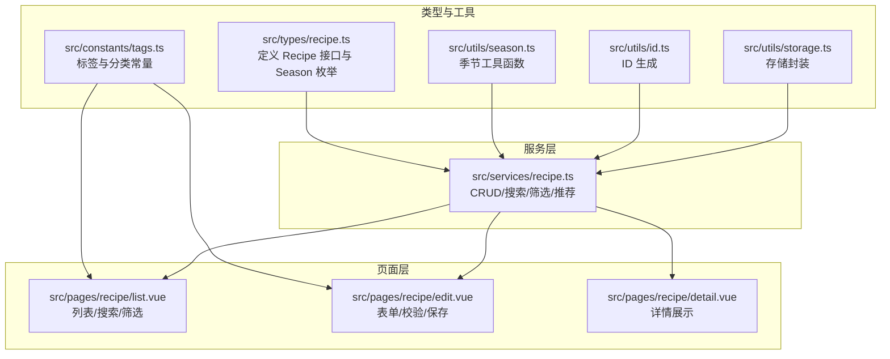
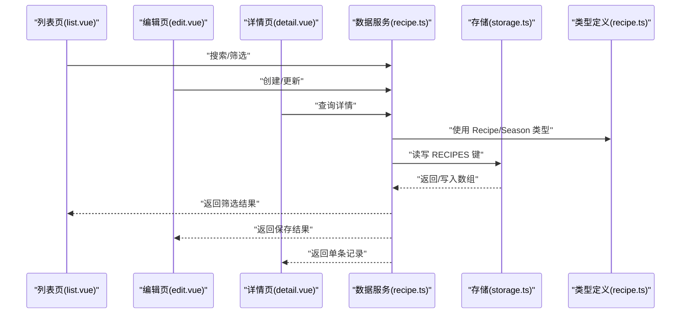
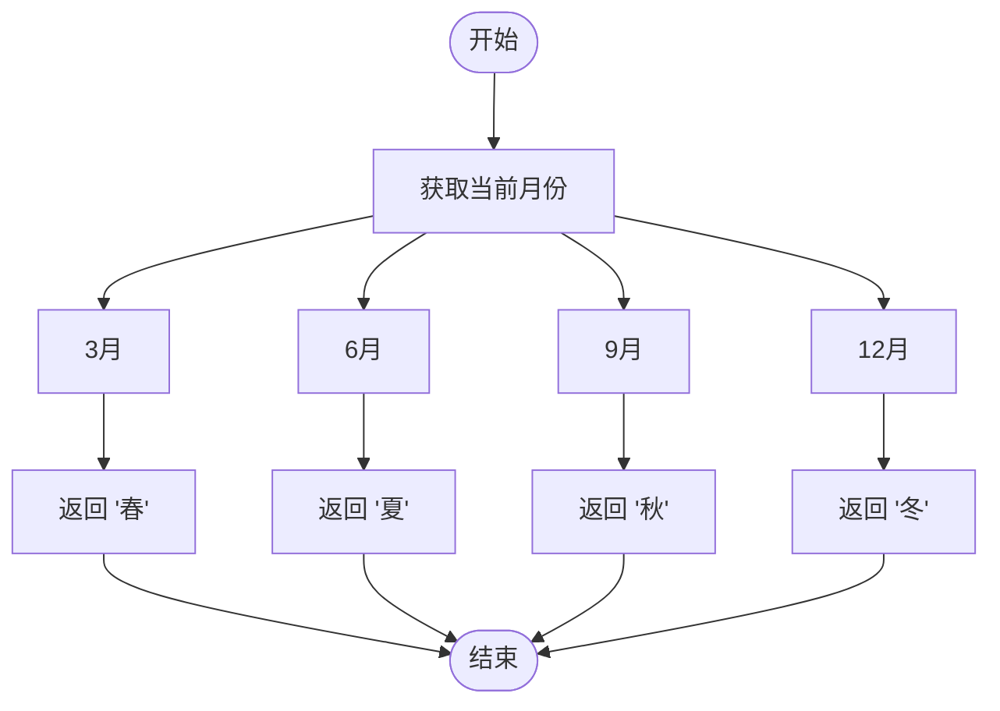
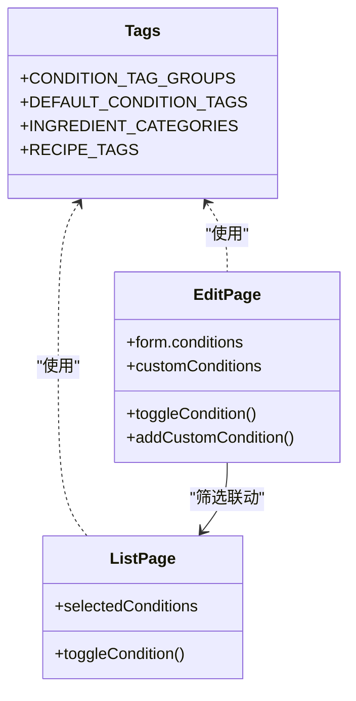
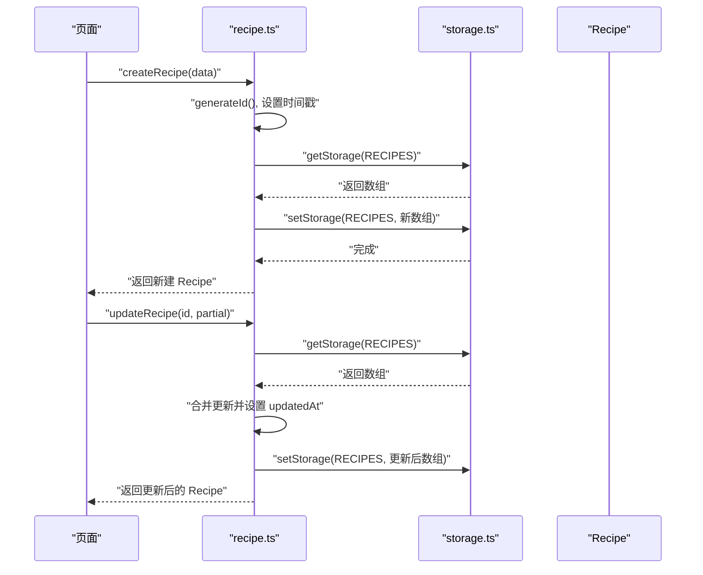
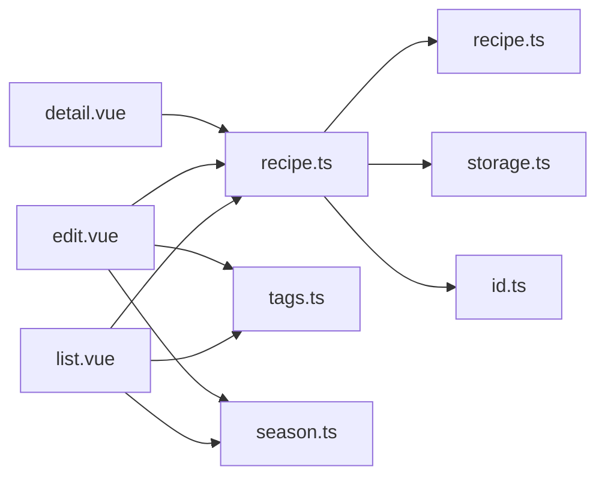

# 菜谱数据模型

<cite>
**本文引用的文件**
- [src/types/recipe.ts](file://src/types/recipe.ts)
- [src/utils/season.ts](file://src/utils/season.ts)
- [src/constants/tags.ts](file://src/constants/tags.ts)
- [src/services/recipe.ts](file://src/services/recipe.ts)
- [src/utils/storage.ts](file://src/utils/storage.ts)
- [src/utils/id.ts](file://src/utils/id.ts)
- [src/pages/recipe/detail.vue](file://src/pages/recipe/detail.vue)
- [src/pages/recipe/edit.vue](file://src/pages/recipe/edit.vue)
- [src/pages/recipe/list.vue](file://src/pages/recipe/list.vue)
</cite>

## 目录
1. [简介](#简介)
2. [项目结构](#项目结构)
3. [核心组件](#核心组件)
4. [架构总览](#架构总览)
5. [详细组件分析](#详细组件分析)
6. [依赖关系分析](#依赖关系分析)
7. [性能考量](#性能考量)
8. [故障排查指南](#故障排查指南)
9. [结论](#结论)
10. [附录](#附录)

## 简介
本文件系统性地解析“菜谱数据模型（Recipe）”，涵盖接口字段定义、业务语义与约束、季节枚举使用、食材与步骤组织、身体状况标签与自定义标签体系、数据持久化与生命周期管理、版本控制与一致性保障机制，并提供可操作的使用场景与最佳实践，帮助开发者准确理解并正确使用该模型。

## 项目结构
围绕菜谱数据模型的关键文件分布如下：
- 类型定义：src/types/recipe.ts
- 季节工具：src/utils/season.ts
- 标签常量：src/constants/tags.ts
- 数据服务：src/services/recipe.ts
- 存储封装：src/utils/storage.ts
- ID生成：src/utils/id.ts
- 页面交互：src/pages/recipe/detail.vue、edit.vue、list.vue

图表来源
- [src/types/recipe.ts:1-15](file://src/types/recipe.ts#L1-L15)
- [src/utils/season.ts:1-34](file://src/utils/season.ts#L1-L34)
- [src/constants/tags.ts:1-23](file://src/constants/tags.ts#L1-L23)
- [src/services/recipe.ts:1-103](file://src/services/recipe.ts#L1-L103)
- [src/utils/storage.ts:1-34](file://src/utils/storage.ts#L1-L34)
- [src/utils/id.ts:1-4](file://src/utils/id.ts#L1-L4)
- [src/pages/recipe/list.vue:1-477](file://src/pages/recipe/list.vue#L1-L477)
- [src/pages/recipe/edit.vue:1-702](file://src/pages/recipe/edit.vue#L1-L702)
- [src/pages/recipe/detail.vue:1-435](file://src/pages/recipe/detail.vue#L1-L435)

章节来源
- [src/types/recipe.ts:1-15](file://src/types/recipe.ts#L1-L15)
- [src/utils/season.ts:1-34](file://src/utils/season.ts#L1-L34)
- [src/constants/tags.ts:1-23](file://src/constants/tags.ts#L1-L23)
- [src/services/recipe.ts:1-103](file://src/services/recipe.ts#L1-L103)
- [src/utils/storage.ts:1-34](file://src/utils/storage.ts#L1-L34)
- [src/utils/id.ts:1-4](file://src/utils/id.ts#L1-L4)
- [src/pages/recipe/list.vue:1-477](file://src/pages/recipe/list.vue#L1-L477)
- [src/pages/recipe/edit.vue:1-702](file://src/pages/recipe/edit.vue#L1-L702)
- [src/pages/recipe/detail.vue:1-435](file://src/pages/recipe/detail.vue#L1-L435)

## 核心组件
- Recipe 接口：统一描述菜谱实体的完整结构
- Season 枚举：限定季节取值集合
- 标签体系：预置标签与自定义标签的组合
- 数据服务：对 Recipe 的增删改查、搜索、筛选、推荐
- 存储层：基于 uni 存储的键值封装
- 页面层：列表、详情、编辑三大视图的交互与展示

章节来源
- [src/types/recipe.ts:3-14](file://src/types/recipe.ts#L3-L14)
- [src/utils/season.ts:1-34](file://src/utils/season.ts#L1-L34)
- [src/constants/tags.ts:1-23](file://src/constants/tags.ts#L1-L23)
- [src/services/recipe.ts:5-103](file://src/services/recipe.ts#L5-L103)
- [src/utils/storage.ts:1-34](file://src/utils/storage.ts#L1-L34)

## 架构总览
从数据模型到页面的端到端流程如下：

图表来源
- [src/pages/recipe/list.vue:114-170](file://src/pages/recipe/list.vue#L114-L170)
- [src/pages/recipe/edit.vue:189-394](file://src/pages/recipe/edit.vue#L189-L394)
- [src/pages/recipe/detail.vue:115-187](file://src/pages/recipe/detail.vue#L115-L187)
- [src/services/recipe.ts:5-103](file://src/services/recipe.ts#L5-L103)
- [src/utils/storage.ts:1-34](file://src/utils/storage.ts#L1-L34)
- [src/types/recipe.ts:3-14](file://src/types/recipe.ts#L3-L14)

## 详细组件分析

### Recipe 接口字段详解
- id: 字符串，唯一标识，由服务层生成
- name: 字符串，菜名，必填且需非空
- ingredients: 字符串数组，食材清单，至少包含一个有效项
- steps: 字符串，烹饪步骤文本，支持多行
- seasons: 季节数组，取值来自 Season 枚举，至少选择一个
- conditions: 身体状况标签数组，支持预置与自定义
- tags: 自定义标签数组，支持预置与自定义
- image: 字符串，图片资源（支持本地路径或 base64）
- createdAt: 数字，毫秒级时间戳，创建时间
- updatedAt: 数字，毫秒级时间戳，更新时间

字段约束与业务含义
- 必填校验：菜名、至少一个食材、至少一个适合季节
- 列表/详情展示：ingredients 展示前 N 个，conditions 展示前若干并带“更多”提示
- 季节适配：通过 seasons 字段与当前季节匹配进行推荐
- 标签组织：conditions 与 tags 分别对应不同维度的筛选与展示

章节来源
- [src/types/recipe.ts:3-14](file://src/types/recipe.ts#L3-L14)
- [src/pages/recipe/detail.vue:54-81](file://src/pages/recipe/detail.vue#L54-L81)
- [src/pages/recipe/list.vue:56-97](file://src/pages/recipe/list.vue#L56-L97)
- [src/pages/recipe/edit.vue:348-363](file://src/pages/recipe/edit.vue#L348-L363)

### Season 枚举与季节适配逻辑
- 枚举取值：春、夏、秋、冬
- 当前季节判定：根据当前月份映射到对应季节
- 视觉呈现：提供颜色与表情符号映射，用于 UI 标签样式
- 使用场景：推荐算法以当前季节作为首要条件，再叠加身体状况匹配度排序

图表来源
- [src/utils/season.ts:3-9](file://src/utils/season.ts#L3-L9)

章节来源
- [src/utils/season.ts:1-34](file://src/utils/season.ts#L1-L34)
- [src/services/recipe.ts:87-102](file://src/services/recipe.ts#L87-L102)
- [src/pages/recipe/detail.vue:23-52](file://src/pages/recipe/detail.vue#L23-L52)
- [src/pages/recipe/list.vue:18-32](file://src/pages/recipe/list.vue#L18-L32)

### 食材列表与做法步骤组织
- 食材列表：以数组形式维护，编辑页支持动态增删，保存时过滤空项
- 做法步骤：以字符串形式存储，支持多行文本，详情页以预格式化方式展示
- 展示策略：列表页仅展示前若干食材，详情页完整展示

章节来源
- [src/pages/recipe/edit.vue:293-301](file://src/pages/recipe/edit.vue#L293-L301)
- [src/pages/recipe/edit.vue:368-376](file://src/pages/recipe/edit.vue#L368-L376)
- [src/pages/recipe/detail.vue:54-81](file://src/pages/recipe/detail.vue#L54-L81)
- [src/pages/recipe/list.vue:76-77](file://src/pages/recipe/list.vue#L76-L77)

### 身体状况标签与自定义标签
- 预置标签：按分组提供常见不适、体质调理、季节养生、特殊时期等
- 自定义标签：用户可自由添加，区分于预置标签并在 UI 中高亮显示
- 编辑页：支持勾选与自定义输入，保存时保留自定义项
- 列表页：支持按条件标签进行筛选与汇总显示

图表来源
- [src/constants/tags.ts:1-23](file://src/constants/tags.ts#L1-L23)
- [src/pages/recipe/edit.vue:195-242](file://src/pages/recipe/edit.vue#L195-L242)
- [src/pages/recipe/list.vue:34-54](file://src/pages/recipe/list.vue#L34-L54)

章节来源
- [src/constants/tags.ts:1-23](file://src/constants/tags.ts#L1-L23)
- [src/pages/recipe/edit.vue:90-135](file://src/pages/recipe/edit.vue#L90-L135)
- [src/pages/recipe/edit.vue:215-223](file://src/pages/recipe/edit.vue#L215-L223)
- [src/pages/recipe/list.vue:34-54](file://src/pages/recipe/list.vue#L34-L54)

### 数据模型示例与字段验证规则
- 示例结构要点：包含 id、name、ingredients、steps、seasons、conditions、tags、image、createdAt、updatedAt
- 关键验证规则：
  - 菜名非空
  - 至少一个有效食材
  - 至少选择一个适合季节
- 保存流程：编辑页校验通过后，调用服务层创建或更新，自动填充 createdAt/updatedAt

章节来源
- [src/types/recipe.ts:3-14](file://src/types/recipe.ts#L3-L14)
- [src/pages/recipe/edit.vue:348-363](file://src/pages/recipe/edit.vue#L348-L363)
- [src/services/recipe.ts:14-26](file://src/services/recipe.ts#L14-L26)
- [src/services/recipe.ts:28-43](file://src/services/recipe.ts#L28-L43)

### 数据生命周期管理与一致性
- 创建：生成唯一 id，设置创建与更新时间为同一时刻
- 更新：仅允许部分字段更新，更新时刷新 updatedAt
- 删除：按 id 过滤，保持数组一致性
- 持久化：统一存储在 RECIPES 键下，采用 JSON 序列化/反序列化
- 一致性：所有读写通过服务层封装，避免直接操作存储

图表来源
- [src/services/recipe.ts:14-26](file://src/services/recipe.ts#L14-L26)
- [src/services/recipe.ts:28-43](file://src/services/recipe.ts#L28-L43)
- [src/utils/storage.ts:7-25](file://src/utils/storage.ts#L7-L25)
- [src/utils/id.ts:1-4](file://src/utils/id.ts#L1-L4)

章节来源
- [src/services/recipe.ts:5-51](file://src/services/recipe.ts#L5-L51)
- [src/utils/storage.ts:1-34](file://src/utils/storage.ts#L1-L34)
- [src/utils/id.ts:1-4](file://src/utils/id.ts#L1-L4)

### 版本控制与数据演进建议
- 当前实现未显式引入版本号字段，但可通过 createdAt/updatedAt 实现“时间线版本”
- 若需强版本控制，可在 Recipe 上新增 version 字段，并在更新时递增
- 迁移策略：新增字段时保持向后兼容，读取时提供默认值

章节来源
- [src/types/recipe.ts:12-13](file://src/types/recipe.ts#L12-L13)
- [src/services/recipe.ts:14-26](file://src/services/recipe.ts#L14-L26)

## 依赖关系分析
- 类型依赖：页面与服务均依赖类型定义
- 工具依赖：服务依赖 ID 生成与存储封装；页面依赖标签常量与季节工具
- 服务依赖：服务依赖存储封装与 ID 生成

图表来源
- [src/pages/recipe/detail.vue:118-122](file://src/pages/recipe/detail.vue#L118-L122)
- [src/pages/recipe/edit.vue:193-195](file://src/pages/recipe/edit.vue#L193-L195)
- [src/pages/recipe/list.vue:117-120](file://src/pages/recipe/list.vue#L117-L120)
- [src/services/recipe.ts:1-3](file://src/services/recipe.ts#L1-L3)
- [src/utils/storage.ts:1-5](file://src/utils/storage.ts#L1-L5)
- [src/utils/id.ts:1-4](file://src/utils/id.ts#L1-L4)
- [src/constants/tags.ts:1-23](file://src/constants/tags.ts#L1-L23)
- [src/utils/season.ts:1-34](file://src/utils/season.ts#L1-L34)

章节来源
- [src/pages/recipe/detail.vue:118-122](file://src/pages/recipe/detail.vue#L118-L122)
- [src/pages/recipe/edit.vue:193-195](file://src/pages/recipe/edit.vue#L193-L195)
- [src/pages/recipe/list.vue:117-120](file://src/pages/recipe/list.vue#L117-L120)
- [src/services/recipe.ts:1-3](file://src/services/recipe.ts#L1-L3)

## 性能考量
- 列表渲染：对 ingredients 与 conditions 采用截断展示，减少 DOM 渲染压力
- 搜索与筛选：先按关键词过滤，再按季节/条件二次过滤，避免全量遍历
- 季节推荐：先按当前季节过滤，再计算匹配度评分，减少无效计算
- 存储读写：批量读取/写入 RECIPES，避免频繁 IO

章节来源
- [src/pages/recipe/list.vue:197-200](file://src/pages/recipe/list.vue#L197-L200)
- [src/services/recipe.ts:53-62](file://src/services/recipe.ts#L53-L62)
- [src/services/recipe.ts:64-85](file://src/services/recipe.ts#L64-L85)
- [src/services/recipe.ts:87-102](file://src/services/recipe.ts#L87-L102)

## 故障排查指南
- 无法保存：检查必填项是否满足（菜名、至少一个食材、至少一个适合季节）
- 图片不显示：确认 image 是否为合法路径或 base64；编辑页支持多种读取方式
- 筛选无结果：确认筛选条件与实际数据是否匹配；列表页支持“全部”与“展开/收起”切换
- 删除失败：确认 id 是否存在；服务层会返回布尔值表示是否删除成功

章节来源
- [src/pages/recipe/edit.vue:348-363](file://src/pages/recipe/edit.vue#L348-L363)
- [src/pages/recipe/edit.vue:244-273](file://src/pages/recipe/edit.vue#L244-L273)
- [src/pages/recipe/list.vue:180-195](file://src/pages/recipe/list.vue#L180-L195)
- [src/services/recipe.ts:45-51](file://src/services/recipe.ts#L45-L51)

## 结论
本菜谱数据模型以清晰的接口定义与完善的工具链支撑了从创建、编辑、展示到筛选与推荐的完整闭环。通过严格的字段约束、统一的存储封装与直观的 UI 组织，开发者可以快速构建稳定可靠的菜谱应用。建议在后续迭代中引入版本控制与更细粒度的校验规则，以进一步提升系统的可维护性与扩展性。

## 附录
- 使用场景建议
  - 推荐：结合当前季节与用户身体状况标签进行智能排序
  - 搜索：支持菜名与食材关键词双维度检索
  - 筛选：多维标签组合筛选，支持“展开/收起”体验优化
  - 编辑：支持图片上传、自定义标签与动态食材列表

章节来源
- [src/services/recipe.ts:53-102](file://src/services/recipe.ts#L53-L102)
- [src/pages/recipe/list.vue:139-170](file://src/pages/recipe/list.vue#L139-L170)
- [src/pages/recipe/edit.vue:365-389](file://src/pages/recipe/edit.vue#L365-L389)