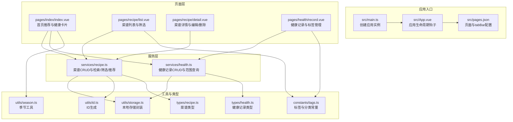
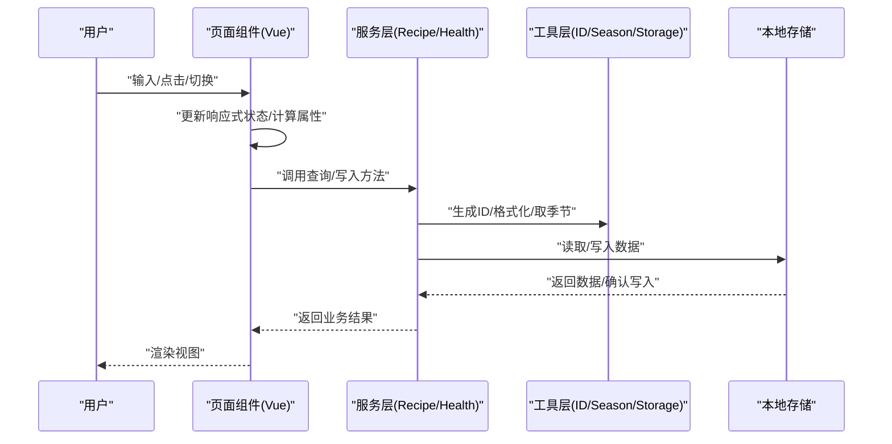
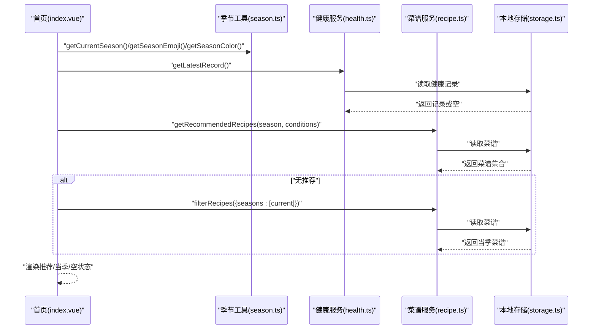
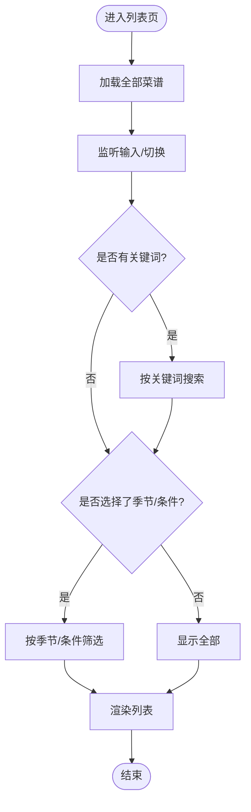
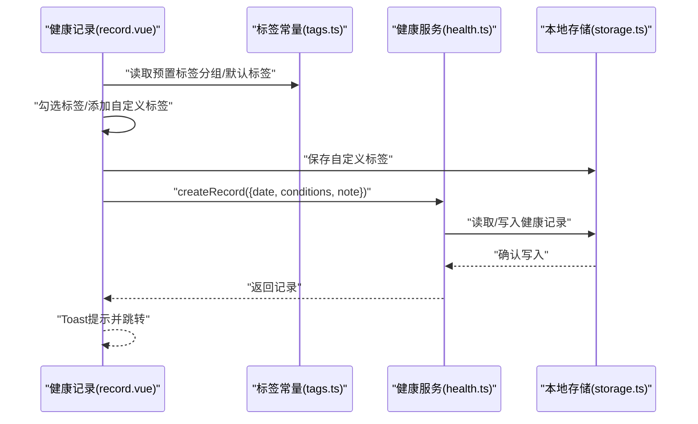
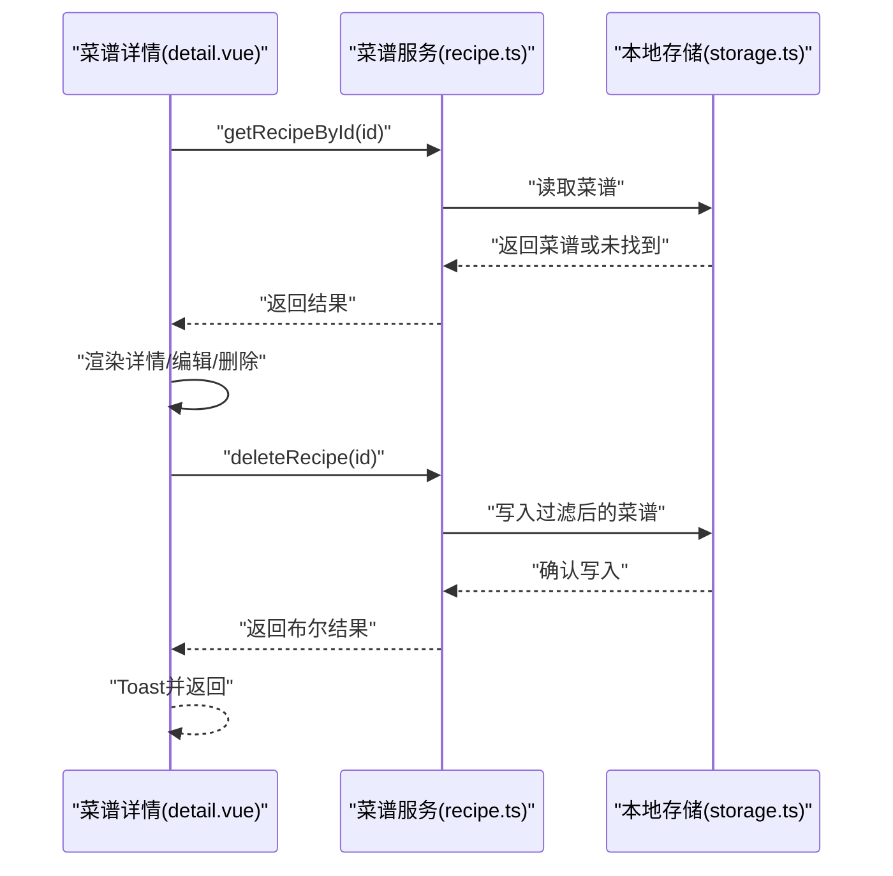
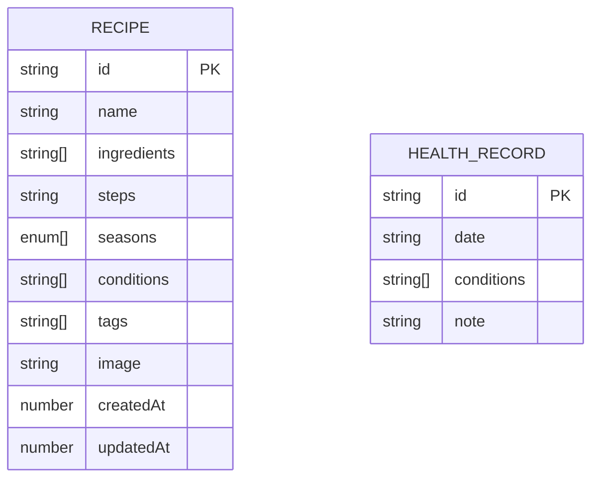
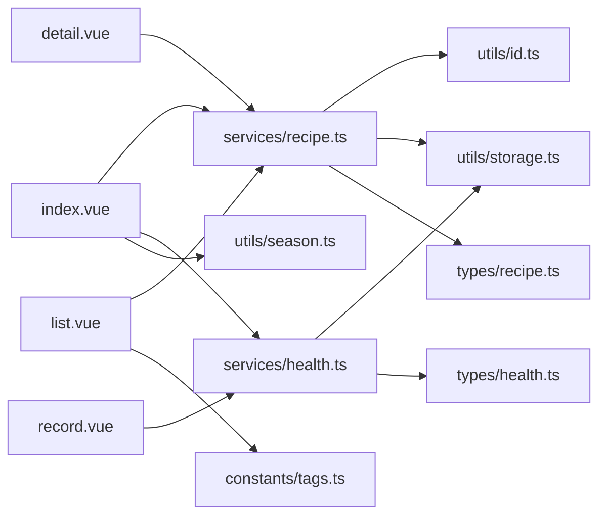

# 数据流架构

<cite>
**本文引用的文件**
- [src/main.ts](file://src/main.ts)
- [src/App.vue](file://src/App.vue)
- [src/pages.json](file://src/pages.json)
- [src/services/recipe.ts](file://src/services/recipe.ts)
- [src/services/health.ts](file://src/services/health.ts)
- [src/utils/storage.ts](file://src/utils/storage.ts)
- [src/utils/id.ts](file://src/utils/id.ts)
- [src/utils/season.ts](file://src/utils/season.ts)
- [src/constants/tags.ts](file://src/constants/tags.ts)
- [src/types/recipe.ts](file://src/types/recipe.ts)
- [src/types/health.ts](file://src/types/health.ts)
- [src/pages/index/index.vue](file://src/pages/index/index.vue)
- [src/pages/recipe/list.vue](file://src/pages/recipe/list.vue)
- [src/pages/recipe/detail.vue](file://src/pages/recipe/detail.vue)
- [src/pages/health/record.vue](file://src/pages/health/record.vue)
</cite>

## 目录
1. [简介](#简介)
2. [项目结构](#项目结构)
3. [核心组件](#核心组件)
4. [架构总览](#架构总览)
5. [详细组件分析](#详细组件分析)
6. [依赖关系分析](#依赖关系分析)
7. [性能考量](#性能考量)
8. [故障排查指南](#故障排查指南)
9. [结论](#结论)
10. [附录](#附录)

## 简介
本文件面向 eat 项目，系统性梳理其“单向数据流”设计与实现，覆盖从用户交互到视图渲染、从组件状态到服务层调用、再到本地存储持久化的完整路径。文档重点解释：
- 用户输入如何驱动组件状态变化，进而通过计算属性与方法触发服务层查询/写入
- 服务层如何封装数据访问与业务逻辑，并与工具函数层协作完成数据生成与转换
- 本地存储的缓存策略、同步机制与状态管理方案
- 异步处理、错误处理与数据一致性保障
- 提供数据流图与状态转换图，帮助读者快速把握典型业务场景下的数据处理流程

## 项目结构
eat 采用基于 Vue 3 + UniApp 的跨端前端架构，页面通过 pages.json 统一声明与路由配置，数据访问通过 services 层封装，工具函数位于 utils 层，类型定义位于 types 层，常量与标签配置位于 constants 层。

图表来源
- [src/main.ts:1-10](file://src/main.ts#L1-L10)
- [src/App.vue:1-20](file://src/App.vue#L1-L20)
- [src/pages.json:1-85](file://src/pages.json#L1-L85)
- [src/services/recipe.ts:1-103](file://src/services/recipe.ts#L1-L103)
- [src/services/health.ts:1-49](file://src/services/health.ts#L1-L49)
- [src/utils/storage.ts:1-34](file://src/utils/storage.ts#L1-L34)
- [src/utils/id.ts:1-4](file://src/utils/id.ts#L1-L4)
- [src/utils/season.ts:1-34](file://src/utils/season.ts#L1-L34)
- [src/constants/tags.ts:1-23](file://src/constants/tags.ts#L1-L23)
- [src/types/recipe.ts:1-15](file://src/types/recipe.ts#L1-L15)
- [src/types/health.ts:1-7](file://src/types/health.ts#L1-L7)
- [src/pages/index/index.vue:136-208](file://src/pages/index/index.vue#L136-L208)
- [src/pages/recipe/list.vue:114-213](file://src/pages/recipe/list.vue#L114-L213)
- [src/pages/recipe/detail.vue:115-187](file://src/pages/recipe/detail.vue#L115-L187)
- [src/pages/health/record.vue:81-157](file://src/pages/health/record.vue#L81-L157)

章节来源
- [src/main.ts:1-10](file://src/main.ts#L1-L10)
- [src/App.vue:1-20](file://src/App.vue#L1-L20)
- [src/pages.json:1-85](file://src/pages.json#L1-L85)

## 核心组件
- 应用入口与生命周期
  - 入口文件负责创建应用实例，App.vue 注册应用生命周期事件，统一日志输出与全局样式引入。
- 页面层
  - 首页：根据当前季节与最新健康记录，调用服务层获取推荐菜谱与当季菜谱，支持跳转至记录与编辑页面。
  - 菜谱列表：支持关键词搜索、季节筛选与身体状况标签筛选，使用计算属性组合筛选条件，动态渲染列表。
  - 菜谱详情：加载指定 ID 的菜谱，支持编辑与删除，删除前二次确认。
  - 健康记录：选择日期、标签（含自定义标签），输入备注后保存，支持范围查询与最新记录读取。
- 服务层
  - 菜谱服务：提供获取全部、按 ID 查询、新增、更新、删除、搜索、筛选、推荐等方法；均通过本地存储进行持久化。
  - 健康服务：提供获取全部、按 ID 查询、新增、删除、最新记录、日期范围查询、按年月查询等方法；同样基于本地存储。
- 工具与类型
  - 存储工具：统一封装 uni 存取与异常处理，提供默认值回退。
  - ID 工具：生成唯一字符串 ID。
  - 季节工具：获取当前季节、颜色、表情与枚举。
  - 标签常量：提供预置标签分组、扁平数组与分类常量。
  - 类型定义：Recipe 与 HealthRecord 的字段与约束。

章节来源
- [src/pages/index/index.vue:136-208](file://src/pages/index/index.vue#L136-L208)
- [src/pages/recipe/list.vue:114-213](file://src/pages/recipe/list.vue#L114-L213)
- [src/pages/recipe/detail.vue:115-187](file://src/pages/recipe/detail.vue#L115-L187)
- [src/pages/health/record.vue:81-157](file://src/pages/health/record.vue#L81-L157)
- [src/services/recipe.ts:1-103](file://src/services/recipe.ts#L1-L103)
- [src/services/health.ts:1-49](file://src/services/health.ts#L1-L49)
- [src/utils/storage.ts:1-34](file://src/utils/storage.ts#L1-L34)
- [src/utils/id.ts:1-4](file://src/utils/id.ts#L1-L4)
- [src/utils/season.ts:1-34](file://src/utils/season.ts#L1-L34)
- [src/constants/tags.ts:1-23](file://src/constants/tags.ts#L1-L23)
- [src/types/recipe.ts:1-15](file://src/types/recipe.ts#L1-L15)
- [src/types/health.ts:1-7](file://src/types/health.ts#L1-L7)

## 架构总览
eat 采用“单向数据流”模式：
- 用户交互触发组件状态变更（如输入框、点击、切换）
- 组件通过响应式状态与计算属性组合出最终数据
- 计算属性或方法调用服务层接口，服务层封装业务逻辑与数据访问
- 服务层通过工具函数与本地存储完成数据生成、转换与持久化
- 视图层基于响应式数据进行渲染，形成闭环

图表来源
- [src/pages/recipe/list.vue:114-213](file://src/pages/recipe/list.vue#L114-L213)
- [src/pages/index/index.vue:136-208](file://src/pages/index/index.vue#L136-L208)
- [src/pages/health/record.vue:81-157](file://src/pages/health/record.vue#L81-L157)
- [src/services/recipe.ts:1-103](file://src/services/recipe.ts#L1-L103)
- [src/services/health.ts:1-49](file://src/services/health.ts#L1-L49)
- [src/utils/storage.ts:1-34](file://src/utils/storage.ts#L1-L34)
- [src/utils/id.ts:1-4](file://src/utils/id.ts#L1-L4)
- [src/utils/season.ts:1-34](file://src/utils/season.ts#L1-L34)

## 详细组件分析

### 首页数据流（推荐与健康卡片）
- 关键点
  - 生命周期 onShow 每次显示时刷新数据
  - 读取最新健康记录，作为推荐菜谱的条件
  - 若无精准推荐，则回退到当季菜谱
  - 支持跳转至健康记录与添加菜谱
- 数据流图

图表来源
- [src/pages/index/index.vue:136-208](file://src/pages/index/index.vue#L136-L208)
- [src/utils/season.ts:1-34](file://src/utils/season.ts#L1-L34)
- [src/services/health.ts:1-49](file://src/services/health.ts#L1-L49)
- [src/services/recipe.ts:1-103](file://src/services/recipe.ts#L1-L103)
- [src/utils/storage.ts:1-34](file://src/utils/storage.ts#L1-L34)

章节来源
- [src/pages/index/index.vue:136-208](file://src/pages/index/index.vue#L136-L208)
- [src/utils/season.ts:1-34](file://src/utils/season.ts#L1-L34)
- [src/services/health.ts:1-49](file://src/services/health.ts#L1-L49)
- [src/services/recipe.ts:1-103](file://src/services/recipe.ts#L1-L103)
- [src/utils/storage.ts:1-34](file://src/utils/storage.ts#L1-L34)

### 菜谱列表与筛选数据流
- 关键点
  - 响应式状态：关键词、选中季节、选中身体状况标签、展开状态
  - 计算属性组合筛选：先按关键词搜索，再在结果中按季节/条件筛选，或直接在全部中筛选
  - 季节颜色与表情由工具函数提供
  - 标签来源于常量与默认值
- 流程图

图表来源
- [src/pages/recipe/list.vue:114-213](file://src/pages/recipe/list.vue#L114-L213)
- [src/services/recipe.ts:1-103](file://src/services/recipe.ts#L1-L103)
- [src/utils/season.ts:1-34](file://src/utils/season.ts#L1-L34)
- [src/constants/tags.ts:1-23](file://src/constants/tags.ts#L1-L23)

章节来源
- [src/pages/recipe/list.vue:114-213](file://src/pages/recipe/list.vue#L114-L213)
- [src/services/recipe.ts:1-103](file://src/services/recipe.ts#L1-L103)
- [src/utils/season.ts:1-34](file://src/utils/season.ts#L1-L34)
- [src/constants/tags.ts:1-23](file://src/constants/tags.ts#L1-L23)

### 健康记录与自定义标签数据流
- 关键点
  - 日期选择器绑定到响应式状态
  - 标签分组与自定义标签管理，自定义标签持久化到本地存储
  - 保存时校验必填项，调用服务层写入，成功后跳转首页
- 顺序图

图表来源
- [src/pages/health/record.vue:81-157](file://src/pages/health/record.vue#L81-L157)
- [src/constants/tags.ts:1-23](file://src/constants/tags.ts#L1-L23)
- [src/services/health.ts:1-49](file://src/services/health.ts#L1-L49)
- [src/utils/storage.ts:1-34](file://src/utils/storage.ts#L1-L34)

章节来源
- [src/pages/health/record.vue:81-157](file://src/pages/health/record.vue#L81-L157)
- [src/constants/tags.ts:1-23](file://src/constants/tags.ts#L1-L23)
- [src/services/health.ts:1-49](file://src/services/health.ts#L1-L49)
- [src/utils/storage.ts:1-34](file://src/utils/storage.ts#L1-L34)

### 菜谱详情与删除流程
- 关键点
  - onLoad/onShow 读取路由参数并加载菜谱
  - 删除前二次确认，删除成功后返回
- 顺序图

图表来源
- [src/pages/recipe/detail.vue:115-187](file://src/pages/recipe/detail.vue#L115-L187)
- [src/services/recipe.ts:1-103](file://src/services/recipe.ts#L1-L103)
- [src/utils/storage.ts:1-34](file://src/utils/storage.ts#L1-L34)

章节来源
- [src/pages/recipe/detail.vue:115-187](file://src/pages/recipe/detail.vue#L115-L187)
- [src/services/recipe.ts:1-103](file://src/services/recipe.ts#L1-L103)
- [src/utils/storage.ts:1-34](file://src/utils/storage.ts#L1-L34)

### 数据模型与类型转换
- 类型定义
  - 菜谱模型包含标识、名称、食材、做法、适用季节、身体状况标签、自定义标签、图片、创建与更新时间戳
  - 健康记录模型包含标识、日期、身体状况标签、备注
- 转换与验证
  - 新增时由 ID 工具生成唯一标识，时间戳由调用侧注入
  - 季节工具提供颜色与表情映射，用于视图渲染
  - 服务层在读取时提供默认值，保证健壮性

图表来源
- [src/types/recipe.ts:1-15](file://src/types/recipe.ts#L1-L15)
- [src/types/health.ts:1-7](file://src/types/health.ts#L1-L7)

章节来源
- [src/types/recipe.ts:1-15](file://src/types/recipe.ts#L1-L15)
- [src/types/health.ts:1-7](file://src/types/health.ts#L1-L7)
- [src/utils/id.ts:1-4](file://src/utils/id.ts#L1-L4)
- [src/utils/season.ts:1-34](file://src/utils/season.ts#L1-L34)

## 依赖关系分析
- 组件到服务层：页面组件直接依赖服务层接口，服务层封装业务逻辑
- 服务层到工具层：服务层调用 ID 生成、季节工具与存储工具
- 存储工具到本地：统一通过 uni 存取，提供异常兜底与默认值
- 类型到服务/组件：类型定义贯穿服务层与组件，确保数据结构一致

图表来源
- [src/pages/index/index.vue:136-208](file://src/pages/index/index.vue#L136-L208)
- [src/pages/recipe/list.vue:114-213](file://src/pages/recipe/list.vue#L114-L213)
- [src/pages/recipe/detail.vue:115-187](file://src/pages/recipe/detail.vue#L115-L187)
- [src/pages/health/record.vue:81-157](file://src/pages/health/record.vue#L81-L157)
- [src/services/recipe.ts:1-103](file://src/services/recipe.ts#L1-L103)
- [src/services/health.ts:1-49](file://src/services/health.ts#L1-L49)
- [src/utils/id.ts:1-4](file://src/utils/id.ts#L1-L4)
- [src/utils/storage.ts:1-34](file://src/utils/storage.ts#L1-L34)
- [src/utils/season.ts:1-34](file://src/utils/season.ts#L1-L34)
- [src/constants/tags.ts:1-23](file://src/constants/tags.ts#L1-L23)
- [src/types/recipe.ts:1-15](file://src/types/recipe.ts#L1-L15)
- [src/types/health.ts:1-7](file://src/types/health.ts#L1-L7)

章节来源
- [src/pages/index/index.vue:136-208](file://src/pages/index/index.vue#L136-L208)
- [src/pages/recipe/list.vue:114-213](file://src/pages/recipe/list.vue#L114-L213)
- [src/pages/recipe/detail.vue:115-187](file://src/pages/recipe/detail.vue#L115-L187)
- [src/pages/health/record.vue:81-157](file://src/pages/health/record.vue#L81-L157)
- [src/services/recipe.ts:1-103](file://src/services/recipe.ts#L1-L103)
- [src/services/health.ts:1-49](file://src/services/health.ts#L1-L49)
- [src/utils/storage.ts:1-34](file://src/utils/storage.ts#L1-L34)
- [src/utils/id.ts:1-4](file://src/utils/id.ts#L1-L4)
- [src/utils/season.ts:1-34](file://src/utils/season.ts#L1-L34)
- [src/constants/tags.ts:1-23](file://src/constants/tags.ts#L1-L23)
- [src/types/recipe.ts:1-15](file://src/types/recipe.ts#L1-L15)
- [src/types/health.ts:1-7](file://src/types/health.ts#L1-L7)

## 性能考量
- 计算属性优先：在列表页通过计算属性组合筛选条件，减少重复遍历与内存占用
- 本地存储批量读写：服务层在一次操作中读取/写入整个集合，降低频繁 IO
- 懒加载与节流：可考虑在搜索输入时增加防抖，减少高频查询
- 渲染优化：列表项使用 key 与虚拟滚动（如需）提升滚动性能
- 缓存策略：当前以“全量读取+全量写入”为主，若数据规模增长，建议引入分页或增量更新策略

## 故障排查指南
- 存储异常
  - 现象：读取为空或报错
  - 处理：检查本地存储键名与默认值；确认 JSON 解析与异常捕获逻辑
- ID 冲突
  - 现象：新增失败或重复
  - 处理：确认 ID 生成策略与唯一性；必要时在服务层增加冲突检测
- 推荐为空
  - 现象：无精准推荐
  - 处理：检查健康记录是否存在且包含条件标签；确认当季筛选逻辑
- 删除无效
  - 现象：删除后仍可见
  - 处理：确认过滤逻辑与写回存储；检查页面刷新时机

章节来源
- [src/utils/storage.ts:1-34](file://src/utils/storage.ts#L1-L34)
- [src/services/recipe.ts:1-103](file://src/services/recipe.ts#L1-L103)
- [src/services/health.ts:1-49](file://src/services/health.ts#L1-L49)

## 结论
eat 项目通过清晰的单向数据流设计，实现了从用户交互到视图渲染的顺畅流转。页面组件负责状态与渲染，服务层封装业务与数据访问，工具层提供基础能力，类型定义确保结构一致。本地存储承担持久化职责，配合默认值与异常兜底，保障了健壮性。未来可在性能与扩展性方面进一步优化，例如引入分页、缓存与增量更新策略。

## 附录
- 运行与构建
  - 开发 H5：执行开发命令
  - 构建 H5：执行构建命令
  - 开发小程序：指定平台运行
  - 构建小程序：指定平台构建

章节来源
- [package.json:1-28](file://package.json#L1-L28)