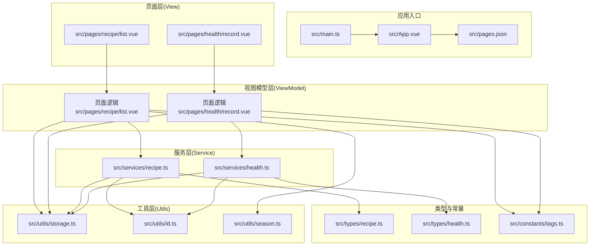
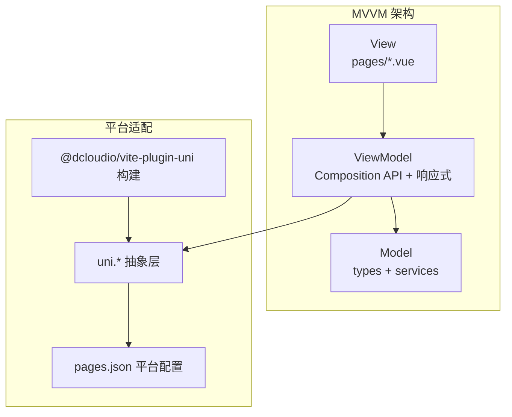
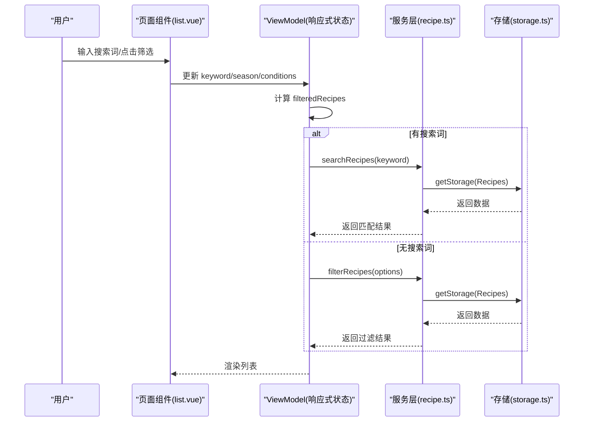
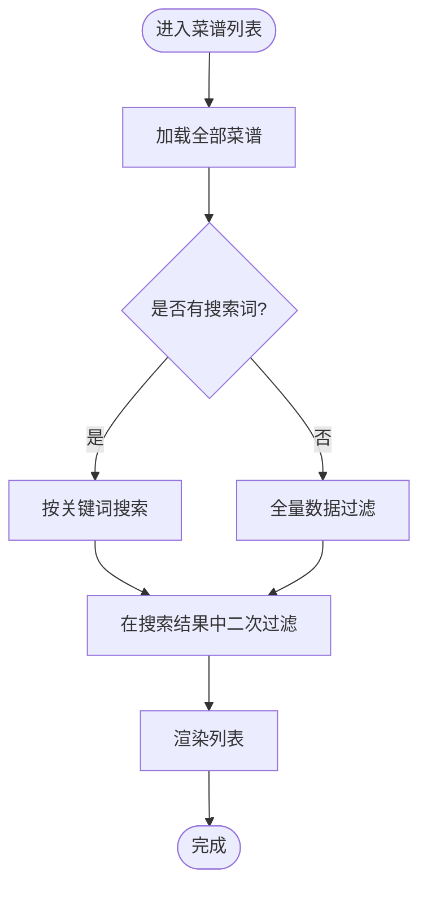
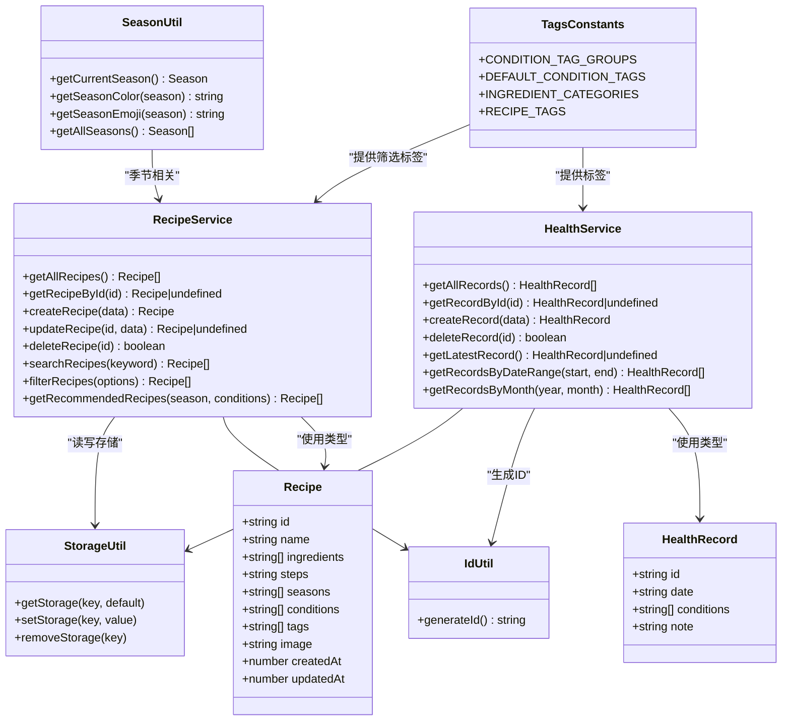
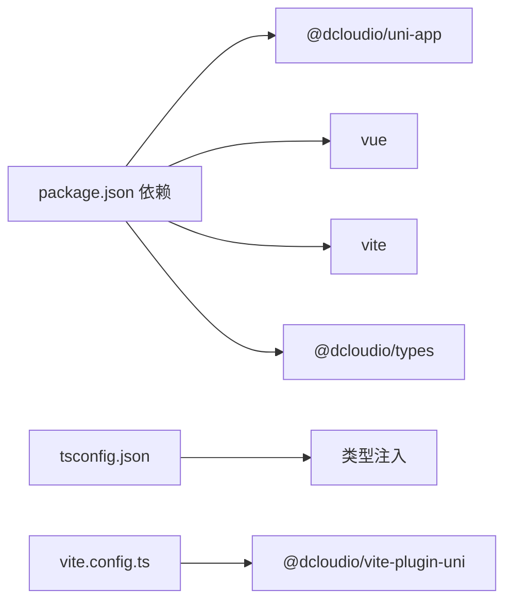

# 整体架构概览

<cite>
**本文引用的文件**
- [package.json](file://package.json)
- [vite.config.ts](file://vite.config.ts)
- [tsconfig.json](file://tsconfig.json)
- [src/main.ts](file://src/main.ts)
- [src/App.vue](file://src/App.vue)
- [src/pages.json](file://src/pages.json)
- [src/services/recipe.ts](file://src/services/recipe.ts)
- [src/services/health.ts](file://src/services/health.ts)
- [src/types/recipe.ts](file://src/types/recipe.ts)
- [src/types/health.ts](file://src/types/health.ts)
- [src/utils/storage.ts](file://src/utils/storage.ts)
- [src/utils/id.ts](file://src/utils/id.ts)
- [src/utils/season.ts](file://src/utils/season.ts)
- [src/constants/tags.ts](file://src/constants/tags.ts)
- [src/pages/recipe/list.vue](file://src/pages/recipe/list.vue)
- [src/pages/health/record.vue](file://src/pages/health/record.vue)
</cite>

## 目录
1. [引言](#引言)
2. [项目结构](#项目结构)
3. [核心组件](#核心组件)
4. [架构总览](#架构总览)
5. [详细组件分析](#详细组件分析)
6. [依赖分析](#依赖分析)
7. [性能考虑](#性能考虑)
8. [故障排查指南](#故障排查指南)
9. [结论](#结论)
10. [附录](#附录)

## 引言
本项目“eat”是一个基于 UniApp 3.0 + Vue 3 + TypeScript 的跨平台移动应用，目标是提供“食之有道”的菜谱与健康记录功能。项目采用 MVVM 架构理念，通过 Model-View-ViewModel 的职责分离与响应式数据绑定，实现视图与业务逻辑的解耦，并以模块化方式组织代码，便于维护与扩展。

技术选型与平台支持方面，项目使用 Vite + @dcloudio/vite-plugin-uni 进行构建与多端编译，支持 H5 与微信小程序等平台；TypeScript 提供类型安全；Vue 3 的 Composition API 与响应式系统支撑 MVVM 的 ViewModel 层。

## 项目结构
项目采用按功能域划分的模块化组织方式，核心目录与职责如下：
- src/constants：存放预置标签与分类等常量数据，为视图层提供可复用的数据源
- src/services：封装业务服务方法，负责数据读写与业务规则处理
- src/types：集中声明领域模型与接口类型，确保类型一致性
- src/utils：提供通用工具函数（如存储、ID 生成、季节映射）
- src/pages：页面级组件，承载视图与交互逻辑，遵循 MVVM 中的 View 与 ViewModel 角色
- 根级配置：package.json、vite.config.ts、tsconfig.json 等，定义构建、类型与依赖

图表来源
- [src/main.ts:1-10](file://src/main.ts#L1-L10)
- [src/App.vue:1-20](file://src/App.vue#L1-L20)
- [src/pages.json:1-85](file://src/pages.json#L1-L85)
- [src/pages/recipe/list.vue:1-477](file://src/pages/recipe/list.vue#L1-L477)
- [src/pages/health/record.vue:1-313](file://src/pages/health/record.vue#L1-L313)
- [src/services/recipe.ts:1-103](file://src/services/recipe.ts#L1-L103)
- [src/services/health.ts:1-49](file://src/services/health.ts#L1-L49)
- [src/types/recipe.ts:1-15](file://src/types/recipe.ts#L1-L15)
- [src/types/health.ts:1-7](file://src/types/health.ts#L1-L7)
- [src/utils/storage.ts:1-34](file://src/utils/storage.ts#L1-L34)
- [src/utils/id.ts:1-4](file://src/utils/id.ts#L1-L4)
- [src/utils/season.ts:1-34](file://src/utils/season.ts#L1-L34)
- [src/constants/tags.ts:1-23](file://src/constants/tags.ts#L1-L23)

章节来源
- [package.json:1-28](file://package.json#L1-L28)
- [vite.config.ts:1-9](file://vite.config.ts#L1-L9)
- [tsconfig.json:1-20](file://tsconfig.json#L1-L20)
- [src/pages.json:1-85](file://src/pages.json#L1-L85)

## 核心组件
- 应用入口与生命周期
  - 入口函数导出应用实例，统一挂载根组件
  - 根组件监听应用生命周期事件，进行初始化与日志输出
- 页面路由与导航
  - pages.json 定义页面路径、导航栏标题与 tabBar 列表，统一全局样式
- 类型系统
  - 统一声明菜谱与健康记录的领域模型，保证跨模块类型一致
- 服务层
  - 菜谱服务：提供查询、新增、更新、删除、搜索与推荐等能力
  - 健康记录服务：提供查询、新增、删除、时间范围筛选等能力
- 工具层
  - 存储工具：封装 uni 存取能力，提供键值常量与错误兜底
  - ID 工具：生成唯一标识
  - 季节工具：提供当前季节、颜色与表情映射
- 常量层
  - 预置身体状况标签分组、食材分类与菜谱标签，供视图层渲染与筛选

章节来源
- [src/main.ts:1-10](file://src/main.ts#L1-L10)
- [src/App.vue:1-20](file://src/App.vue#L1-L20)
- [src/pages.json:1-85](file://src/pages.json#L1-L85)
- [src/types/recipe.ts:1-15](file://src/types/recipe.ts#L1-L15)
- [src/types/health.ts:1-7](file://src/types/health.ts#L1-L7)
- [src/services/recipe.ts:1-103](file://src/services/recipe.ts#L1-L103)
- [src/services/health.ts:1-49](file://src/services/health.ts#L1-L49)
- [src/utils/storage.ts:1-34](file://src/utils/storage.ts#L1-L34)
- [src/utils/id.ts:1-4](file://src/utils/id.ts#L1-L4)
- [src/utils/season.ts:1-34](file://src/utils/season.ts#L1-L34)
- [src/constants/tags.ts:1-23](file://src/constants/tags.ts#L1-L23)

## 架构总览
本项目采用 MVVM 架构：
- Model：由 types 定义的数据模型与 services 提供的业务方法构成，负责数据与业务规则
- View：pages 下的页面组件，负责展示与用户交互
- ViewModel：页面组件内的响应式状态与计算属性，承担数据处理与交互逻辑，通过双向绑定与事件驱动与 View 解耦

跨平台适配机制：
- 平台抽象层：统一使用 uni.xxx API（如 uni.getStorageSync、uni.navigateTo），屏蔽 H5 与小程序差异
- 条件编译：通过 @dcloudio/vite-plugin-uni 在构建阶段注入平台特定代码与资源
- 运行时适配：在不同平台下，uni 对象提供一致的运行时能力，结合 pages.json 的平台配置实现导航与 tabBar 渲染

图表来源
- [src/pages/recipe/list.vue:114-213](file://src/pages/recipe/list.vue#L114-L213)
- [src/pages/health/record.vue:81-157](file://src/pages/health/record.vue#L81-L157)
- [src/services/recipe.ts:1-103](file://src/services/recipe.ts#L1-L103)
- [src/services/health.ts:1-49](file://src/services/health.ts#L1-L49)
- [src/utils/storage.ts:1-34](file://src/utils/storage.ts#L1-L34)
- [src/pages.json:1-85](file://src/pages.json#L1-L85)
- [vite.config.ts:1-9](file://vite.config.ts#L1-L9)

## 详细组件分析

### MVVM 在页面中的应用
- 页面 list.vue
  - ViewModel：使用 ref/computed 管理搜索关键词、季节与身体状况筛选状态，并通过计算属性组合过滤结果
  - View：模板中通过 v-model、v-for、v-if/v-show 等指令绑定 ViewModel 状态
  - Model：调用 services/recipe.ts 的搜索与筛选方法，读取 utils/storage.ts 的持久化数据
- 页面 record.vue
  - ViewModel：管理日期、标签选择、自定义标签与备注，提交时调用 services/health.ts 创建记录
  - View：通过 picker、textarea、flex 布局渲染表单控件
  - Model：使用 utils/storage.ts 读写自定义标签与健康记录

图表来源
- [src/pages/recipe/list.vue:114-170](file://src/pages/recipe/list.vue#L114-L170)
- [src/services/recipe.ts:53-85](file://src/services/recipe.ts#L53-L85)
- [src/utils/storage.ts:7-17](file://src/utils/storage.ts#L7-L17)

章节来源
- [src/pages/recipe/list.vue:1-477](file://src/pages/recipe/list.vue#L1-L477)
- [src/services/recipe.ts:1-103](file://src/services/recipe.ts#L1-L103)
- [src/utils/storage.ts:1-34](file://src/utils/storage.ts#L1-L34)

### 数据流与处理逻辑
- 菜谱筛选流程
  - 关键点：先按关键词检索，再在结果内按季节/身体状况二次过滤；若无关键词则直接对全量数据过滤
  - 性能：计算属性惰性求值，减少重复计算；搜索与筛选均基于内存数组操作
- 健康记录流程
  - 关键点：日期默认今日，标签支持预置与自定义；保存后提示并跳转到首页 tab

图表来源
- [src/pages/recipe/list.vue:131-170](file://src/pages/recipe/list.vue#L131-L170)
- [src/services/recipe.ts:53-85](file://src/services/recipe.ts#L53-L85)

章节来源
- [src/pages/recipe/list.vue:131-170](file://src/pages/recipe/list.vue#L131-L170)
- [src/services/recipe.ts:53-85](file://src/services/recipe.ts#L53-L85)

### 组件关系图

图表来源
- [src/types/recipe.ts:1-15](file://src/types/recipe.ts#L1-L15)
- [src/types/health.ts:1-7](file://src/types/health.ts#L1-L7)
- [src/utils/storage.ts:1-34](file://src/utils/storage.ts#L1-L34)
- [src/utils/id.ts:1-4](file://src/utils/id.ts#L1-L4)
- [src/utils/season.ts:1-34](file://src/utils/season.ts#L1-L34)
- [src/constants/tags.ts:1-23](file://src/constants/tags.ts#L1-L23)
- [src/services/recipe.ts:1-103](file://src/services/recipe.ts#L1-L103)
- [src/services/health.ts:1-49](file://src/services/health.ts#L1-L49)

## 依赖分析
- 构建与框架
  - @dcloudio/uni-app、@dcloudio/uni-components、@dcloudio/uni-ui 提供跨平台基础能力与 UI 组件
  - @vitejs/plugin-vue、vite 提供开发与构建支持
  - vue 提供响应式与组件系统
- 类型与配置
  - @dcloudio/types 提供 uni 生态类型定义
  - tsconfig.json 配置路径别名、类型注入与 lib 版本
- 运行脚本
  - dev:h5/build:h5、dev:mp-weixin/build:mp-weixin 支持多端开发与构建

图表来源
- [package.json:1-28](file://package.json#L1-L28)
- [tsconfig.json:1-20](file://tsconfig.json#L1-L20)
- [vite.config.ts:1-9](file://vite.config.ts#L1-L9)

章节来源
- [package.json:1-28](file://package.json#L1-L28)
- [tsconfig.json:1-20](file://tsconfig.json#L1-L20)
- [vite.config.ts:1-9](file://vite.config.ts#L1-L9)

## 性能考虑
- 计算属性缓存：list.vue 使用 computed 缓存过滤结果，避免每次输入都重新全量计算
- 内存数据处理：所有筛选与排序在内存数组上进行，适合中小规模数据；若数据增长，建议引入分页或服务端筛选
- 存储访问：统一通过 storage 工具封装，异常时返回默认值，避免崩溃；建议在高频写入场景增加防抖
- UI 渲染：长列表使用滚动容器，图片懒加载与占位符优化首屏体验

## 故障排查指南
- 页面无法显示或空白
  - 检查 pages.json 中页面路径与 tabBar 配置是否正确
  - 确认入口函数导出的应用实例已在运行时被正确挂载
- 跨平台行为不一致
  - 确认 uni API 使用是否符合目标平台能力；必要时在页面逻辑中做平台判断
- 存储异常
  - 检查 storage 工具的键值是否与预期一致；确认 JSON 序列化/反序列化未抛错
- 类型报错
  - 确认 tsconfig.json 的路径别名与类型注入已生效；检查 types 目录下的接口定义是否完整

章节来源
- [src/pages.json:1-85](file://src/pages.json#L1-L85)
- [src/main.ts:1-10](file://src/main.ts#L1-L10)
- [src/utils/storage.ts:1-34](file://src/utils/storage.ts#L1-L34)
- [tsconfig.json:1-20](file://tsconfig.json#L1-L20)

## 结论
本项目以 MVVM 为核心，结合 UniApp 3.0 的跨平台能力与 Vue 3 的响应式系统，实现了清晰的职责分离与良好的可维护性。通过模块化的目录结构与统一的类型、服务、工具层，项目在 H5 与小程序等多端具备一致的用户体验与开发体验。未来可在数据规模扩大时引入更完善的缓存与分页策略，并持续完善平台差异的适配与测试覆盖。

## 附录
- 开发与构建命令
  - H5 开发/构建：dev:h5、build:h5
  - 微信小程序开发/构建：dev:mp-weixin、build:mp-weixin
- 关键配置参考
  - 构建插件：vite.config.ts 中的 @dcloudio/vite-plugin-uni
  - 类型与路径：tsconfig.json 中的 paths 与 types 注入