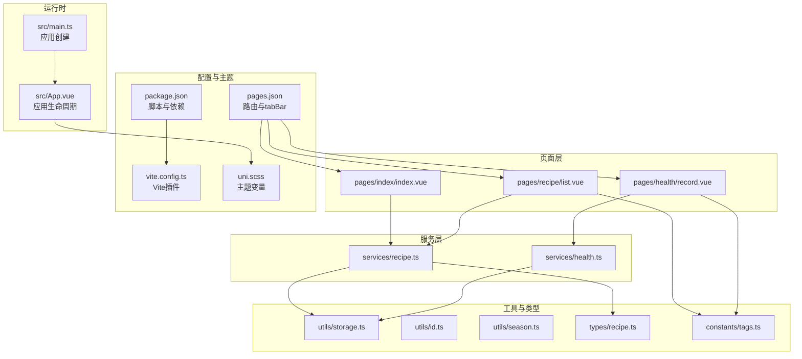
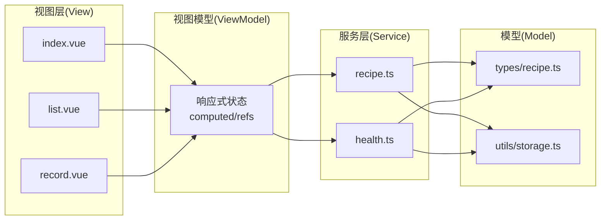
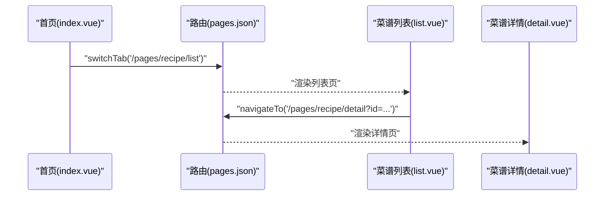
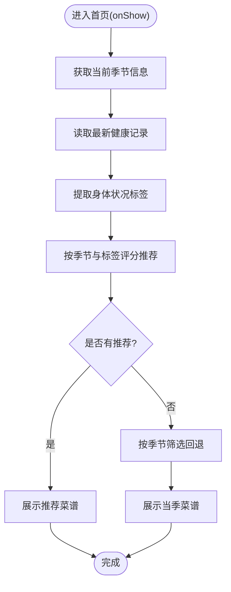
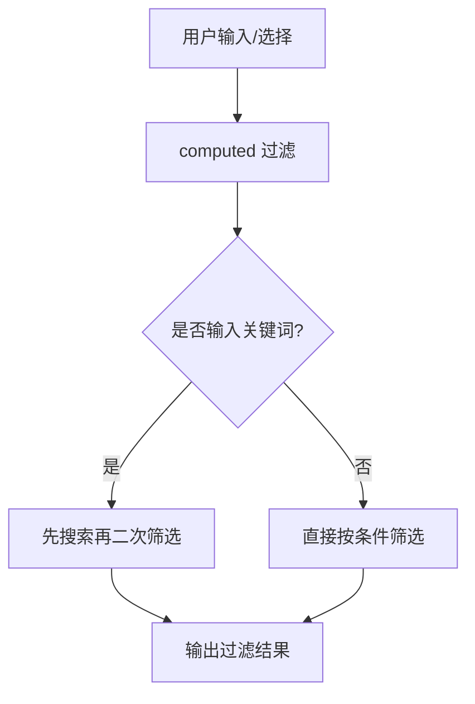
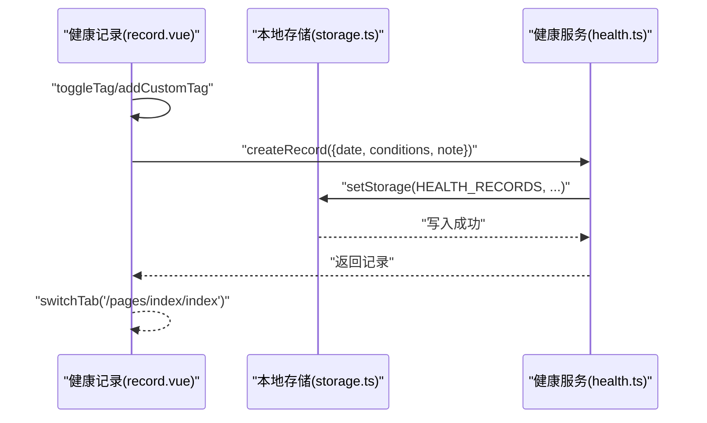
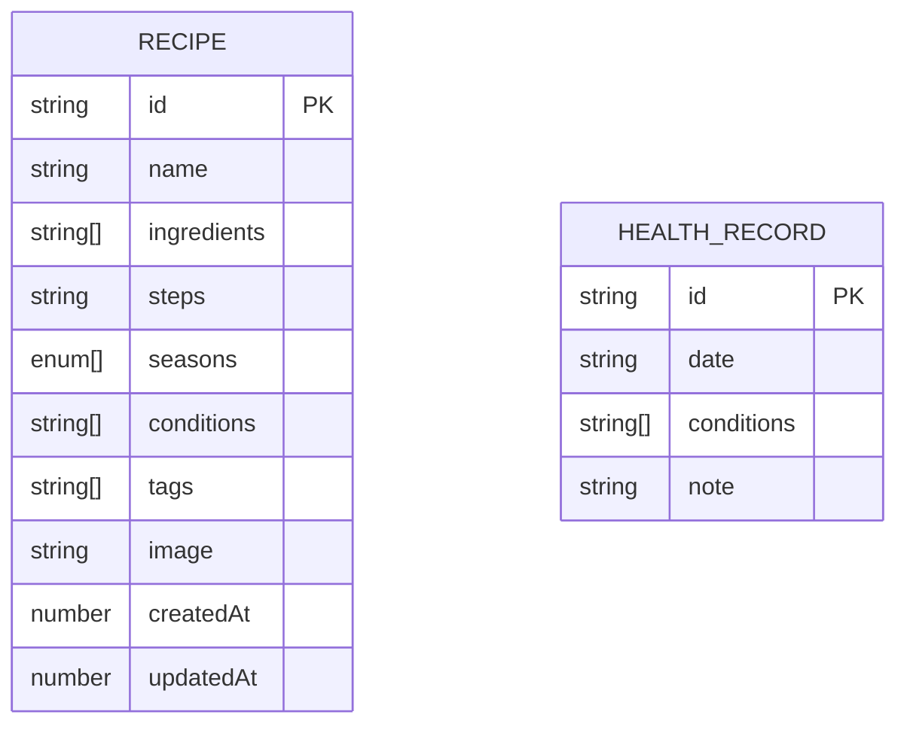
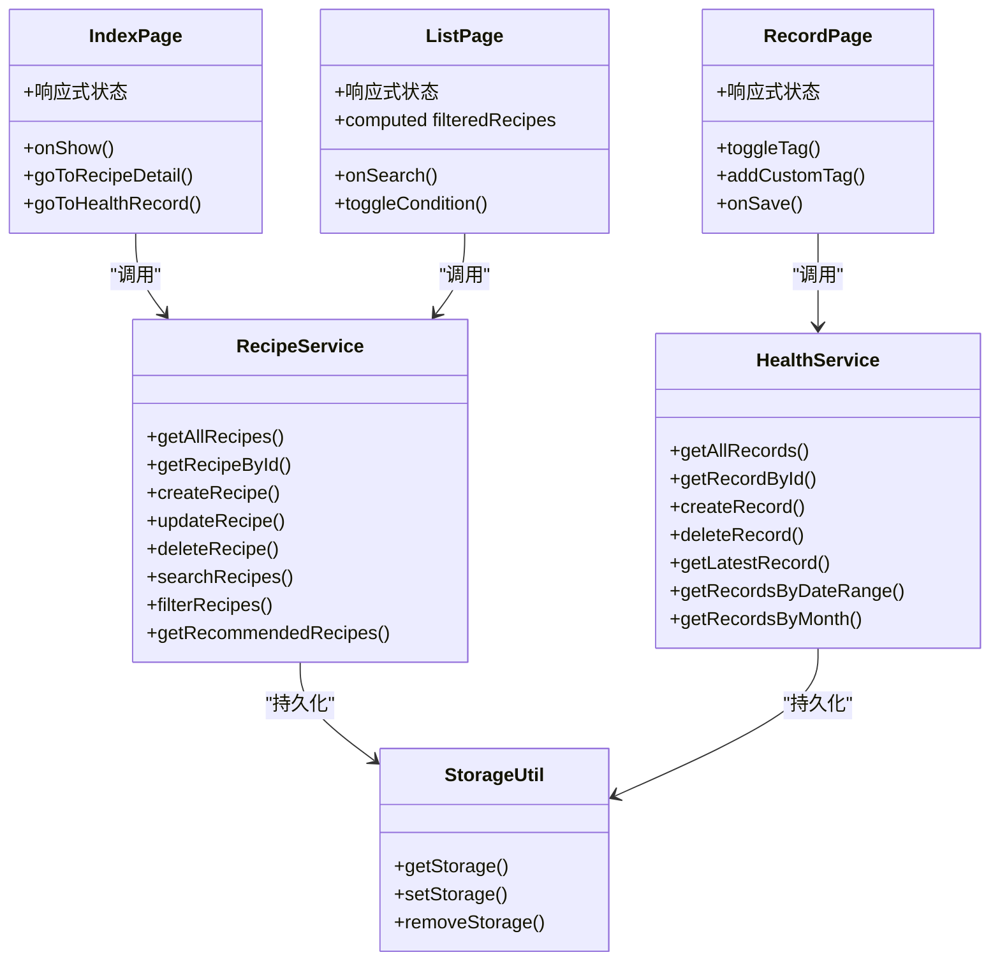
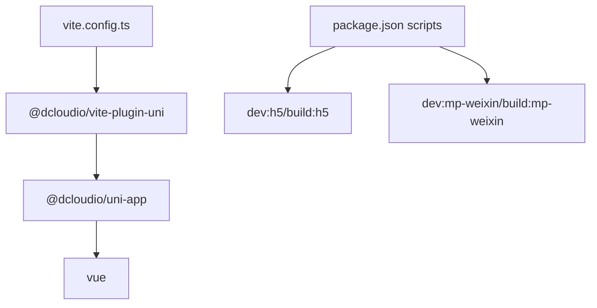

# 架构设计

<cite>
**本文引用的文件**
- [src/main.ts](file://src/main.ts)
- [src/App.vue](file://src/App.vue)
- [src/pages.json](file://src/pages.json)
- [src/uni.scss](file://src/uni.scss)
- [package.json](file://package.json)
- [vite.config.ts](file://vite.config.ts)
- [src/services/recipe.ts](file://src/services/recipe.ts)
- [src/services/health.ts](file://src/services/health.ts)
- [src/utils/storage.ts](file://src/utils/storage.ts)
- [src/times/recipe.ts](file://src/types/recipe.ts)
- [src/constants/tags.ts](file://src/constants/tags.ts)
- [src/utils/id.ts](file://src/utils/id.ts)
- [src/pages/index/index.vue](file://src/pages/index/index.vue)
- [src/pages/recipe/list.vue](file://src/pages/recipe/list.vue)
- [src/pages/health/record.vue](file://src/pages/health/record.vue)
</cite>

## 目录
1. [简介](#简介)
2. [项目结构](#项目结构)
3. [核心组件](#核心组件)
4. [架构总览](#架构总览)
5. [详细组件分析](#详细组件分析)
6. [依赖分析](#依赖分析)
7. [性能考量](#性能考量)
8. [故障排查指南](#故障排查指南)
9. [结论](#结论)
10. [附录](#附录)

## 简介
本项目采用 UniApp + Vue 3 + TypeScript 技术栈构建，目标是实现一套跨平台（H5、小程序等）的“食之有道”应用，围绕“食疗与健康记录”的业务主线，提供首页推荐、菜谱浏览与编辑、健康记录与查询等功能。项目遵循 MVVM 架构思想，通过页面组件（View）绑定响应式数据（ViewModel），由服务层（Service）封装数据访问与业务逻辑，配合工具层（Utils）与类型层（Types）提升可维护性与可扩展性。

## 项目结构
项目采用按功能域划分的模块化组织方式：
- 入口与运行时：入口应用与生命周期管理
- 页面层：按业务模块划分的页面组件
- 服务层：封装数据访问与业务规则
- 类型与常量：统一的数据模型与标签常量
- 工具层：通用能力（存储、ID、季节）
- 配置与主题：构建配置与全局样式

**图表来源**
- [src/main.ts:1-10](file://src/main.ts#L1-L10)
- [src/App.vue:1-20](file://src/App.vue#L1-L20)
- [src/pages.json:1-85](file://src/pages.json#L1-L85)
- [src/services/recipe.ts:1-103](file://src/services/recipe.ts#L1-L103)
- [src/services/health.ts:1-49](file://src/services/health.ts#L1-L49)
- [src/utils/storage.ts:1-34](file://src/utils/storage.ts#L1-L34)
- [src/times/recipe.ts:1-15](file://src/types/recipe.ts#L1-L15)
- [src/constants/tags.ts:1-23](file://src/constants/tags.ts#L1-L23)
- [src/uni.scss:1-49](file://src/uni.scss#L1-L49)
- [package.json:1-28](file://package.json#L1-L28)
- [vite.config.ts:1-9](file://vite.config.ts#L1-L9)

**章节来源**
- [src/main.ts:1-10](file://src/main.ts#L1-L10)
- [src/App.vue:1-20](file://src/App.vue#L1-L20)
- [src/pages.json:1-85](file://src/pages.json#L1-L85)
- [src/uni.scss:1-49](file://src/uni.scss#L1-L49)
- [package.json:1-28](file://package.json#L1-L28)
- [vite.config.ts:1-9](file://vite.config.ts#L1-L9)

## 核心组件
- 应用入口与生命周期：应用实例创建与全局生命周期钩子
- 页面组件：首页、菜谱列表、健康记录页
- 服务层：菜谱与健康记录的增删改查、检索与推荐
- 工具层：本地存储、ID 生成、季节工具
- 类型与常量：数据模型与标签分组
- 全局样式：主题变量与样式导入

**章节来源**
- [src/main.ts:1-10](file://src/main.ts#L1-L10)
- [src/App.vue:1-20](file://src/App.vue#L1-L20)
- [src/services/recipe.ts:1-103](file://src/services/recipe.ts#L1-L103)
- [src/services/health.ts:1-49](file://src/services/health.ts#L1-L49)
- [src/utils/storage.ts:1-34](file://src/utils/storage.ts#L1-L34)
- [src/utils/id.ts:1-4](file://src/utils/id.ts#L1-L4)
- [src/times/recipe.ts:1-15](file://src/types/recipe.ts#L1-L15)
- [src/constants/tags.ts:1-23](file://src/constants/tags.ts#L1-L23)
- [src/uni.scss:1-49](file://src/uni.scss#L1-L49)

## 架构总览
系统采用 MVVM 模式：
- Model：类型定义与本地存储（JSON 序列化）
- View：Vue 组件模板与样式
- ViewModel：组件内的响应式状态与计算属性
- Service：封装业务逻辑与数据访问
- Platform：UniApp 提供的跨平台运行时与 API

**图表来源**
- [src/pages/index/index.vue:1-470](file://src/pages/index/index.vue#L1-L470)
- [src/pages/recipe/list.vue:1-477](file://src/pages/recipe/list.vue#L1-L477)
- [src/pages/health/record.vue:1-313](file://src/pages/health/record.vue#L1-L313)
- [src/services/recipe.ts:1-103](file://src/services/recipe.ts#L1-L103)
- [src/services/health.ts:1-49](file://src/services/health.ts#L1-L49)
- [src/times/recipe.ts:1-15](file://src/types/recipe.ts#L1-L15)
- [src/utils/storage.ts:1-34](file://src/utils/storage.ts#L1-L34)

## 详细组件分析

### 页面路由与导航
- 路由配置：通过 pages.json 声明页面路径、导航栏标题与 tabBar 列表
- 生命周期：页面使用 onShow/onLoad 等生命周期钩子加载数据
- 导航 API：页面内使用 switchTab/navigateTo 等进行页面跳转

**图表来源**
- [src/pages.json:1-85](file://src/pages.json#L1-L85)
- [src/pages/index/index.vue:190-207](file://src/pages/index/index.vue#L190-L207)
- [src/pages/recipe/list.vue:200-212](file://src/pages/recipe/list.vue#L200-L212)

**章节来源**
- [src/pages.json:1-85](file://src/pages.json#L1-L85)
- [src/pages/index/index.vue:136-207](file://src/pages/index/index.vue#L136-L207)
- [src/pages/recipe/list.vue:114-213](file://src/pages/recipe/list.vue#L114-L213)

### 首页推荐流程（MVVM 实践）
- 视图：展示季节头部、今日健康卡片、推荐菜谱列表
- 视图模型：响应式状态 currentSeason、latestRecord、recommendedRecipes、seasonRecipes
- 服务：调用 getRecommendedRecipes/getLatestRecord/filterRecipes
- 数据流：onShow 触发数据加载，computed 与方法组合完成推荐与回退逻辑

**图表来源**
- [src/pages/index/index.vue:136-207](file://src/pages/index/index.vue#L136-L207)
- [src/services/recipe.ts:87-103](file://src/services/recipe.ts#L87-L103)
- [src/services/health.ts:33-37](file://src/services/health.ts#L33-L37)

**章节来源**
- [src/pages/index/index.vue:136-207](file://src/pages/index/index.vue#L136-L207)
- [src/services/recipe.ts:87-103](file://src/services/recipe.ts#L87-L103)
- [src/services/health.ts:33-37](file://src/services/health.ts#L33-L37)

### 菜谱列表筛选与搜索
- 视图：搜索输入、季节标签、身体状况标签多选
- 视图模型：keyword、selectedSeason、selectedConditions、conditionExpanded
- 计算属性：filteredRecipes 基于 keyword 与筛选条件动态计算
- 服务：searchRecipes/filterRecipes

**图表来源**
- [src/pages/recipe/list.vue:114-170](file://src/pages/recipe/list.vue#L114-L170)
- [src/services/recipe.ts:53-85](file://src/services/recipe.ts#L53-L85)

**章节来源**
- [src/pages/recipe/list.vue:114-170](file://src/pages/recipe/list.vue#L114-L170)
- [src/services/recipe.ts:53-85](file://src/services/recipe.ts#L53-L85)

### 健康记录页（标签与存储）
- 视图：日期选择、标签分组、自定义标签输入
- 视图模型：date、selectedConditions、customTags、newCustomTag、note
- 服务：createRecord 写入本地存储
- 工具：getStorage/setStorage 持久化

**图表来源**
- [src/pages/health/record.vue:81-156](file://src/pages/health/record.vue#L81-L156)
- [src/services/health.ts:14-23](file://src/services/health.ts#L14-L23)
- [src/utils/storage.ts:19-25](file://src/utils/storage.ts#L19-L25)

**章节来源**
- [src/pages/health/record.vue:81-156](file://src/pages/health/record.vue#L81-L156)
- [src/services/health.ts:14-23](file://src/services/health.ts#L14-L23)
- [src/utils/storage.ts:1-34](file://src/utils/storage.ts#L1-L34)

### 类型与数据模型
- 菜谱模型：包含 id、名称、食材、做法、适用季节、身体状况标签、自定义标签、图片、时间戳
- 健康记录模型：包含 id、日期、身体状况标签、备注

**图表来源**
- [src/times/recipe.ts:1-15](file://src/types/recipe.ts#L1-L15)

**章节来源**
- [src/times/recipe.ts:1-15](file://src/types/recipe.ts#L1-L15)

### 组件关系图

**图表来源**
- [src/pages/index/index.vue:136-207](file://src/pages/index/index.vue#L136-L207)
- [src/pages/recipe/list.vue:114-213](file://src/pages/recipe/list.vue#L114-L213)
- [src/pages/health/record.vue:81-156](file://src/pages/health/record.vue#L81-L156)
- [src/services/recipe.ts:1-103](file://src/services/recipe.ts#L1-L103)
- [src/services/health.ts:1-49](file://src/services/health.ts#L1-L49)
- [src/utils/storage.ts:1-34](file://src/utils/storage.ts#L1-L34)

## 依赖分析
- 构建与运行：Vite + @dcloudio/vite-plugin-uni；Vue 3 与 UniApp 生态
- 跨平台：通过 @dcloudio/uni-app 提供的 API 与生命周期实现 H5/小程序兼容
- 脚本：dev:h5/build:h5/dev:mp-weixin/build:mp-weixin

**图表来源**
- [vite.config.ts:1-9](file://vite.config.ts#L1-L9)
- [package.json:1-28](file://package.json#L1-L28)

**章节来源**
- [vite.config.ts:1-9](file://vite.config.ts#L1-L9)
- [package.json:1-28](file://package.json#L1-L28)

## 性能考量
- 渲染优化
  - 使用 computed 对复杂筛选与搜索结果进行惰性计算，减少重复计算
  - 在列表页对图片与文本截断处理，避免长列表重排
- 数据访问
  - 本地存储采用 JSON 序列化，批量读写，避免频繁 I/O
  - ID 生成使用时间戳+随机数，保证唯一性且开销极小
- 路由与生命周期
  - 页面在 onShow 中刷新数据，确保切换回页面时数据一致性
- 样式与主题
  - 通过 uni.scss 统一主题变量，减少重复样式定义

[本节为通用性能建议，不涉及具体文件分析]

## 故障排查指南
- 存储异常
  - setStorage/getStorage 包裹 try/catch 并记录错误日志，便于定位序列化失败或权限问题
- 页面跳转
  - 确认 pages.json 中 pagePath 与实际路径一致，tabBar 的 pagePath 与对应页面路径匹配
- 标签与筛选
  - 自定义标签需去重与长度限制；筛选时注意空值与默认值处理
- 开发与构建
  - 使用 package.json 中的脚本命令进行多平台开发与构建，确认依赖安装完整

**章节来源**
- [src/utils/storage.ts:19-25](file://src/utils/storage.ts#L19-L25)
- [src/pages.json:52-83](file://src/pages.json#L52-L83)
- [src/pages/health/record.vue:115-129](file://src/pages/health/record.vue#L115-L129)

## 结论
本项目以 MVVM 为核心，结合 UniApp 的跨平台能力，实现了从页面到服务、从类型到工具的清晰分层。通过统一的主题变量、路由与生命周期管理、以及本地存储抽象，系统具备良好的可维护性与可扩展性。未来可在以下方面演进：引入状态管理库以统一跨页面共享状态、增加单元测试覆盖关键服务函数、对长列表进行虚拟滚动优化、完善错误边界与埋点上报。

## 附录
- 目录结构设计原则
  - 按功能域划分：pages、services、utils、types、constants
  - 入口集中：main.ts 创建应用，App.vue 管理生命周期
  - 配置集中：pages.json 管理路由与 tab，vite.config.ts 管理构建插件
- 跨平台适配策略
  - 使用 @dcloudio/uni-app API 与生命周期，屏蔽平台差异
  - 样式使用 rpx 单位与主题变量，适配不同屏幕密度
- 可扩展性设计
  - 服务层独立于页面，便于复用与替换
  - 类型定义集中，便于约束数据结构
  - 常量与标签集中管理，便于业务扩展