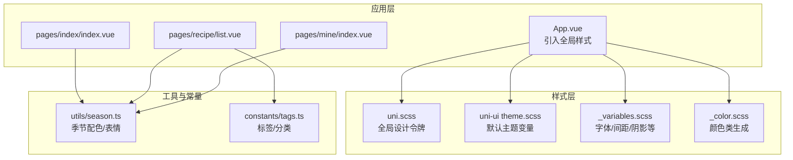
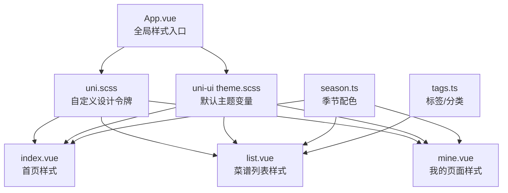
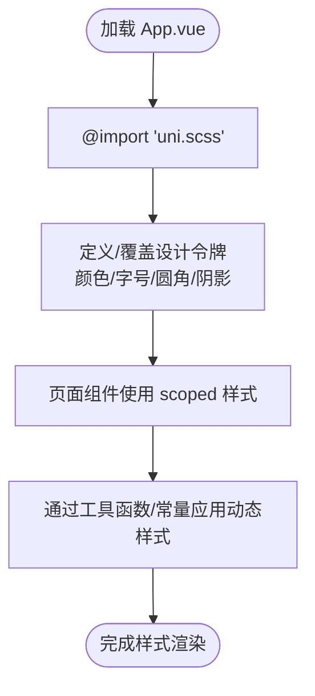
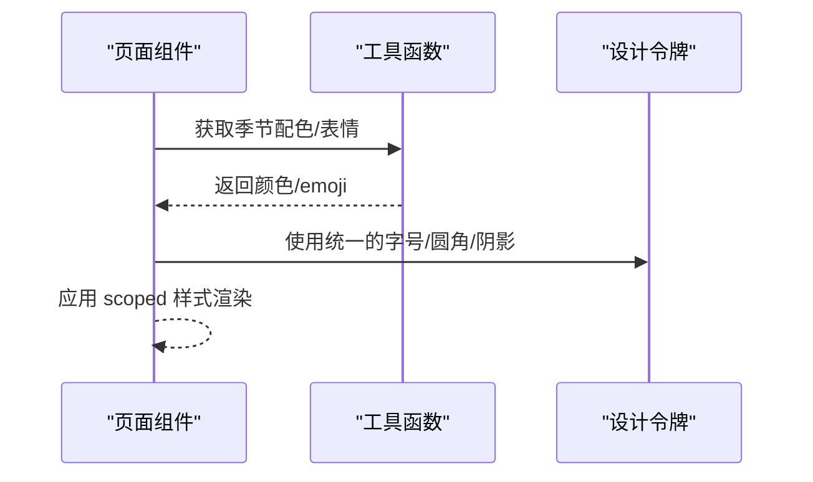
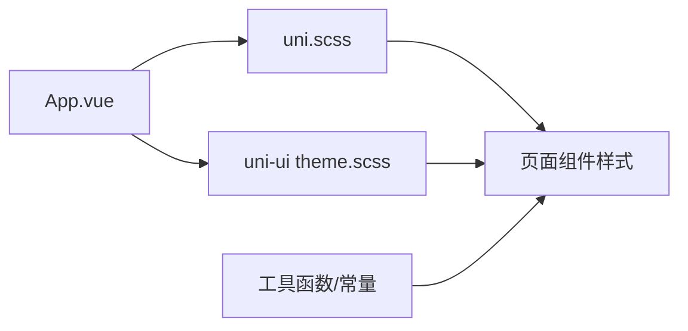

# 样式与主题系统

<cite>
**本文档引用的文件**
- [src/uni.scss](file://src/uni.scss)
- [src/App.vue](file://src/App.vue)
- [src/pages/index/index.vue](file://src/pages/index/index.vue)
- [src/pages/recipe/list.vue](file://src/pages/recipe/list.vue)
- [src/pages/mine/index.vue](file://src/pages/mine/index.vue)
- [src/utils/season.ts](file://src/utils/season.ts)
- [src/constants/tags.ts](file://src/constants/tags.ts)
- [package.json](file://package.json)
- [node_modules/@dcloudio/uni-ui/lib/uni-scss/theme.scss](file://node_modules/@dcloudio/uni-ui/lib/uni-scss/theme.scss)
- [node_modules/@dcloudio/uni-ui/lib/uni-scss/variables.scss](file://node_modules/@dcloudio/uni-ui/lib/uni-scss/variables.scss)
- [node_modules/@dcloudio/uni-ui/lib/uni-scss/styles/setting/_variables.scss](file://node_modules/@dcloudio/uni-ui/lib/uni-scss/styles/setting/_variables.scss)
- [node_modules/@dcloudio/uni-ui/lib/uni-scss/styles/setting/_color.scss](file://node_modules/@dcloudio/uni-ui/lib/uni-scss/styles/setting/_color.scss)
</cite>

## 目录
1. [简介](#简介)
2. [项目结构](#项目结构)
3. [核心组件](#核心组件)
4. [架构总览](#架构总览)
5. [详细组件分析](#详细组件分析)
6. [依赖关系分析](#依赖关系分析)
7. [性能考虑](#性能考虑)
8. [故障排除指南](#故障排除指南)
9. [结论](#结论)
10. [附录](#附录)

## 简介
本文件面向 eat 项目，系统化梳理基于 SCSS 的样式与主题体系，涵盖全局样式变量、混入函数与组件样式组织方式；详解 uni.scss 全局样式文件的作用机制（颜色系统、字体规范、间距标准、断点配置）；阐述响应式设计策略与跨端一致性保障；描述主题切换与暗色模式支持的实现路径；总结样式隔离、CSS 模块化与组件样式封装的最佳实践；并提供样式架构图与设计令牌表，帮助开发者高效理解与维护样式系统。

## 项目结构
eat 项目采用 uni-app 跨端框架，样式以 SCSS 为主，结合 uni-ui 提供的设计令牌与组件样式。全局样式通过 App.vue 引入统一的 uni.scss 变量体系，页面级样式采用 scoped 方式实现样式隔离与组件封装。

**图表来源**
- [src/App.vue:17-19](file://src/App.vue#L17-L19)
- [src/uni.scss:1-49](file://src/uni.scss#L1-L49)
- [node_modules/@dcloudio/uni-ui/lib/uni-scss/theme.scss:1-32](file://node_modules/@dcloudio/uni-ui/lib/uni-scss/theme.scss#L1-L32)
- [node_modules/@dcloudio/uni-ui/lib/uni-scss/styles/setting/_variables.scss:1-147](file://node_modules/@dcloudio/uni-ui/lib/uni-scss/styles/setting/_variables.scss#L1-L147)
- [node_modules/@dcloudio/uni-ui/lib/uni-scss/styles/setting/_color.scss:1-67](file://node_modules/@dcloudio/uni-ui/lib/uni-scss/styles/setting/_color.scss#L1-L67)
- [src/utils/season.ts:1-34](file://src/utils/season.ts#L1-L34)
- [src/constants/tags.ts:1-23](file://src/constants/tags.ts#L1-L23)

**章节来源**
- [src/App.vue:17-19](file://src/App.vue#L17-L19)
- [src/uni.scss:1-49](file://src/uni.scss#L1-L49)

## 核心组件
- 全局样式变量与主题令牌
  - 自定义设计令牌：主色、辅色、文字色、背景色、边框色、功能色、字号、圆角、阴影等。
  - uni-ui 默认主题：提供主色、辅助色、中性色、边框色、背景色、间距、阴影等默认值。
- 组件样式组织
  - 页面级样式采用 scoped，确保样式隔离与可维护性。
  - 通过工具函数与常量提供动态样式（如季节配色、标签样式）。
- 响应式与跨端一致性
  - 使用 rpx 单位适配多端屏幕密度。
  - 结合 uni-ui 的间距与圆角体系，保证组件风格一致。

**章节来源**
- [src/uni.scss:1-49](file://src/uni.scss#L1-L49)
- [node_modules/@dcloudio/uni-ui/lib/uni-scss/theme.scss:1-32](file://node_modules/@dcloudio/uni-ui/lib/uni-scss/theme.scss#L1-L32)
- [src/pages/index/index.vue:210-470](file://src/pages/index/index.vue#L210-L470)
- [src/pages/recipe/list.vue:213-477](file://src/pages/recipe/list.vue#L213-L477)
- [src/pages/mine/index.vue:263-384](file://src/pages/mine/index.vue#L263-L384)

## 架构总览
eat 的样式架构由“全局设计令牌 + 页面组件样式”构成。App.vue 作为入口，统一引入自定义 uni.scss 与 uni-ui 的主题变量与工具，页面组件通过 scoped 样式实现局部化控制，同时利用工具函数与常量实现动态样式与品牌色彩的一致应用。

**图表来源**
- [src/App.vue:17-19](file://src/App.vue#L17-L19)
- [src/uni.scss:1-49](file://src/uni.scss#L1-L49)
- [node_modules/@dcloudio/uni-ui/lib/uni-scss/theme.scss:1-32](file://node_modules/@dcloudio/uni-ui/lib/uni-scss/theme.scss#L1-L32)
- [src/pages/index/index.vue:210-470](file://src/pages/index/index.vue#L210-L470)
- [src/pages/recipe/list.vue:213-477](file://src/pages/recipe/list.vue#L213-L477)
- [src/pages/mine/index.vue:263-384](file://src/pages/mine/index.vue#L263-L384)
- [src/utils/season.ts:1-34](file://src/utils/season.ts#L1-L34)
- [src/constants/tags.ts:1-23](file://src/constants/tags.ts#L1-L23)

## 详细组件分析

### 全局样式变量与主题令牌
- 设计令牌维度
  - 颜色系统：主色（健康绿）、辅色（橙色系）、文字色（主/次/辅助）、背景色（页面/卡片/灰度）、边框色、功能色（成功/警告/错误/信息）。
  - 字号体系：超小/小/中/大/超大/超超大，配合 rpx 单位。
  - 圆角体系：小/中/大/圆形，统一组件圆角风格。
  - 阴影体系：基础阴影，用于卡片与浮层。
- 与 uni-ui 的关系
  - 项目同时引入自定义 uni.scss 与 uni-ui 的 theme.scss/variables.scss，形成“自定义令牌 + 默认主题”的双轨体系。
  - uni-ui 提供字体家族、标题层级、间距、阴影、蒙版等默认值，便于快速构建一致的视觉语言。

**图表来源**
- [src/App.vue:17-19](file://src/App.vue#L17-L19)
- [src/uni.scss:1-49](file://src/uni.scss#L1-L49)
- [node_modules/@dcloudio/uni-ui/lib/uni-scss/theme.scss:1-32](file://node_modules/@dcloudio/uni-ui/lib/uni-scss/theme.scss#L1-L32)

**章节来源**
- [src/uni.scss:1-49](file://src/uni.scss#L1-L49)
- [node_modules/@dcloudio/uni-ui/lib/uni-scss/theme.scss:1-32](file://node_modules/@dcloudio/uni-ui/lib/uni-scss/theme.scss#L1-L32)
- [node_modules/@dcloudio/uni-ui/lib/uni-scss/variables.scss:1-63](file://node_modules/@dcloudio/uni-ui/lib/uni-scss/variables.scss#L1-L63)
- [node_modules/@dcloudio/uni-ui/lib/uni-scss/styles/setting/_variables.scss:1-147](file://node_modules/@dcloudio/uni-ui/lib/uni-scss/styles/setting/_variables.scss#L1-L147)

### 页面组件样式组织与封装
- 首页（index.vue）
  - 使用 scoped 样式定义页面容器、卡片、标签、按钮等元素的视觉与交互。
  - 通过工具函数获取季节配色，动态设置头部背景色与标签色，体现品牌色彩与季节主题。
- 菜谱列表（list.vue）
  - 搜索栏、季节筛选、身体状况筛选、菜谱卡片等模块化样式，均采用 scoped 隔离。
  - 标签样式复用统一的圆角与字号体系，部分标签使用动态配色（如季节标签）。
- 我的（mine.vue）
  - 顶部渐变背景、统计卡片、菜单项等样式，强调品牌主色与卡片阴影的统一风格。

**图表来源**
- [src/pages/index/index.vue:210-470](file://src/pages/index/index.vue#L210-L470)
- [src/pages/recipe/list.vue:213-477](file://src/pages/recipe/list.vue#L213-L477)
- [src/pages/mine/index.vue:263-384](file://src/pages/mine/index.vue#L263-L384)
- [src/utils/season.ts:1-34](file://src/utils/season.ts#L1-L34)

**章节来源**
- [src/pages/index/index.vue:210-470](file://src/pages/index/index.vue#L210-L470)
- [src/pages/recipe/list.vue:213-477](file://src/pages/recipe/list.vue#L213-L477)
- [src/pages/mine/index.vue:263-384](file://src/pages/mine/index.vue#L263-L384)
- [src/utils/season.ts:1-34](file://src/utils/season.ts#L1-L34)

### 响应式设计与跨端一致性
- 单位与布局
  - 使用 rpx 适配移动端与小程序端屏幕密度差异，确保在不同设备上保持相对一致的视觉比例。
- 组件一致性
  - 通过 uni-ui 的间距、圆角、阴影等默认值，统一各页面组件的视觉层级与交互反馈。
- 动态样式
  - 利用工具函数返回的颜色与图标，使页面在不同季节与状态下呈现一致的品牌风格。

**章节来源**
- [src/uni.scss:34-49](file://src/uni.scss#L34-L49)
- [node_modules/@dcloudio/uni-ui/lib/uni-scss/styles/setting/_variables.scss:135-147](file://node_modules/@dcloudio/uni-ui/lib/uni-scss/styles/setting/_variables.scss#L135-L147)

### 主题切换与暗色模式支持
- 现状分析
  - 项目当前未实现显式的主题切换与暗色模式逻辑。
- 实现建议
  - 在 App.vue 中引入主题开关状态（本地存储或全局状态管理），根据状态切换自定义变量或 uni-ui 的主题变量。
  - 通过 CSS 变量或 SCSS 变量映射，动态生成明/暗两套主题令牌，实现一键切换。
  - 对关键组件（如卡片、输入框、标签）进行暗色适配，确保对比度与可读性。

[本节为概念性指导，不直接分析具体文件，故无“章节来源”]

## 依赖关系分析
- 样式依赖链
  - App.vue 依赖 uni.scss 与 uni-ui 的主题变量与工具。
  - 页面组件依赖 App.vue 注入的全局样式，并通过工具函数与常量实现动态样式。
- 外部依赖
  - 项目使用 uni-ui 提供的设计令牌与组件样式，提升开发效率与一致性。

**图表来源**
- [src/App.vue:17-19](file://src/App.vue#L17-L19)
- [src/uni.scss:1-49](file://src/uni.scss#L1-L49)
- [node_modules/@dcloudio/uni-ui/lib/uni-scss/theme.scss:1-32](file://node_modules/@dcloudio/uni-ui/lib/uni-scss/theme.scss#L1-L32)

**章节来源**
- [package.json:11-26](file://package.json#L11-L26)
- [src/App.vue:17-19](file://src/App.vue#L17-L19)

## 性能考虑
- 样式体积控制
  - 优先使用 uni-ui 的默认变量与工具，减少重复定义，降低编译体积。
  - 合理拆分页面样式，避免单文件过大。
- 编译优化
  - 使用 SCSS 的模块化导入，仅引入必要变量与混入，避免冗余计算。
- 运行时性能
  - 动态样式尽量通过工具函数一次性计算，避免在模板中进行复杂样式拼接。

[本节提供一般性建议，不直接分析具体文件，故无“章节来源”]

## 故障排除指南
- 样式未生效
  - 检查 App.vue 是否正确引入 uni.scss。
  - 确认页面样式是否使用 scoped，避免样式穿透导致的覆盖问题。
- 颜色不一致
  - 统一使用设计令牌变量，避免硬编码颜色值。
  - 对照 uni-ui 的默认主题变量，确保与自定义变量协同工作。
- 响应式异常
  - 确保使用 rpx 单位，并在不同设备上测试布局表现。
  - 检查 uni-ui 的间距与圆角变量是否被正确继承。

**章节来源**
- [src/App.vue:17-19](file://src/App.vue#L17-L19)
- [src/uni.scss:1-49](file://src/uni.scss#L1-L49)

## 结论
eat 项目的样式与主题系统以 uni.scss 为核心，结合 uni-ui 的设计令牌，实现了统一的品牌色彩与组件风格。通过 scoped 样式与工具函数，项目在页面层面实现了良好的样式隔离与动态样式应用。建议后续引入主题切换与暗色模式支持，进一步完善用户体验与可访问性。

## 附录

### 设计令牌表（自定义与 uni-ui 对照）
- 颜色系统
  - 自定义主色/辅色/功能色：用于品牌与状态表达。
  - 文字色：主/次/辅助，确保对比度与可读性。
  - 背景色：页面/卡片/灰度，营造层次感。
  - 边框色：用于分割线与容器边框。
- 字号体系
  - 超小/小/中/大/超大/超超大，配合 rpx 单位。
- 圆角体系
  - 小/中/大/圆形，统一组件圆角风格。
- 阴影体系
  - 基础阴影，用于卡片与浮层。
- 间距与字体
  - 间距基础倍数、标题层级、字体家族等，参考 uni-ui 默认值。

**章节来源**
- [src/uni.scss:1-49](file://src/uni.scss#L1-L49)
- [node_modules/@dcloudio/uni-ui/lib/uni-scss/theme.scss:1-32](file://node_modules/@dcloudio/uni-ui/lib/uni-scss/theme.scss#L1-L32)
- [node_modules/@dcloudio/uni-ui/lib/uni-scss/variables.scss:1-63](file://node_modules/@dcloudio/uni-ui/lib/uni-scss/variables.scss#L1-L63)
- [node_modules/@dcloudio/uni-ui/lib/uni-scss/styles/setting/_variables.scss:1-147](file://node_modules/@dcloudio/uni-ui/lib/uni-scss/styles/setting/_variables.scss#L1-L147)