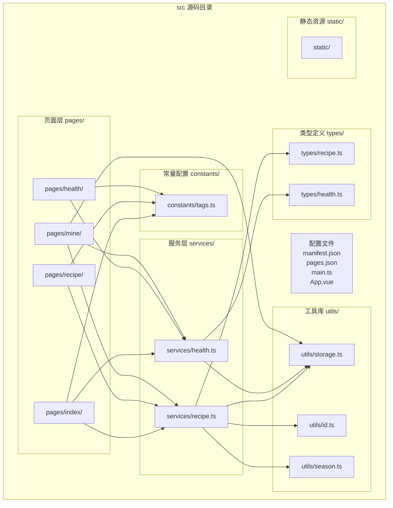
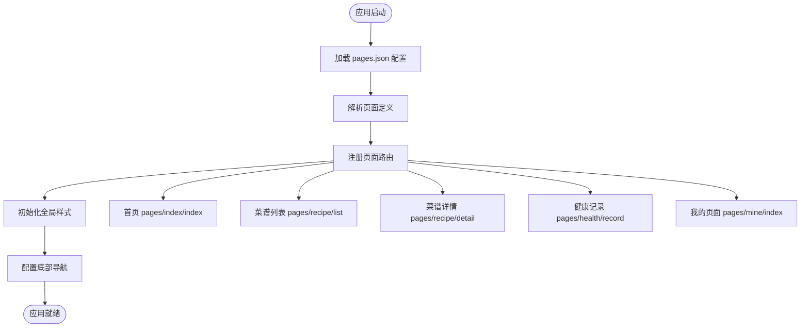

# 目录结构设计

<cite>
**本文档引用的文件**
- [src/pages.json](file://src/pages.json)
- [src/manifest.json](file://src/manifest.json)
- [src/main.ts](file://src/main.ts)
- [src/App.vue](file://src/App.vue)
- [src/constants/tags.ts](file://src/constants/tags.ts)
- [src/services/health.ts](file://src/services/health.ts)
- [src/services/recipe.ts](file://src/services/recipe.ts)
- [src/types/health.ts](file://src/types/health.ts)
- [src/types/recipe.ts](file://src/types/recipe.ts)
- [src/utils/id.ts](file://src/utils/id.ts)
- [src/utils/season.ts](file://src/utils/season.ts)
- [src/utils/storage.ts](file://src/utils/storage.ts)
- [src/pages/index/index.vue](file://src/pages/index/index.vue)
- [src/pages/recipe/list.vue](file://src/pages/recipe/list.vue)
- [src/pages/recipe/detail.vue](file://src/pages/recipe/detail.vue)
- [src/pages/recipe/edit.vue](file://src/pages/recipe/edit.vue)
- [src/pages/health/record.vue](file://src/pages/health/record.vue)
- [src/pages/health/history.vue](file://src/pages/health/history.vue)
- [src/pages/mine/index.vue](file://src/pages/mine/index.vue)
- [package.json](file://package.json)
</cite>

## 目录结构概览

本项目采用基于功能域的目录组织方式，核心目录结构如下：



**图表来源**
- [src/pages.json:1-85](file://src/pages.json#L1-L85)
- [src/services/health.ts:1-49](file://src/services/health.ts#L1-L49)
- [src/services/recipe.ts:1-103](file://src/services/recipe.ts#L1-L103)
- [src/utils/storage.ts:1-34](file://src/utils/storage.ts#L1-L34)

## 项目结构设计原理

### 1. 分层架构设计

项目采用清晰的分层架构，每层职责明确：

- **表现层（Pages）**：负责用户界面展示和交互逻辑
- **业务层（Services）**：封装核心业务逻辑和数据处理
- **数据层（Types/Utils/Constants）**：提供类型定义、工具函数和配置常量
- **配置层（Config）**：管理应用配置和路由设置

### 2. 功能域划分

按照业务功能进行模块化组织，每个功能域包含完整的页面、服务、类型定义和工具函数。

**章节来源**
- [src/pages.json:1-85](file://src/pages.json#L1-L85)
- [src/manifest.json:1-41](file://src/manifest.json#L1-L41)

## 核心目录设计详解

### constants 目录 - 全局常量与配置

**设计原则**：
- 集中管理应用中的静态配置和预设数据
- 提供类型安全的数据访问接口
- 支持多场景复用的业务数据

**核心内容**：
- 身体状况标签分组和默认标签集合
- 食材分类体系
- 菜谱标签体系

**实现特点**：
- 使用 TypeScript 枚举确保类型安全
- 提供扁平化和分组两种数据结构
- 支持动态扩展和自定义标签

**章节来源**
- [src/constants/tags.ts:1-23](file://src/constants/tags.ts#L1-L23)

### services 目录 - 业务逻辑封装

**设计原则**：
- 单一职责原则，每个服务专注特定业务领域
- 数据持久化抽象，统一存储接口
- 业务规则集中管理，便于维护和测试

**核心服务**：

#### health.ts - 健康记录服务
- 健康记录的增删改查操作
- 时间范围查询和统计功能
- 最新记录获取和排序逻辑

#### recipe.ts - 菜谱管理服务
- 菜谱的完整生命周期管理
- 高级搜索和智能推荐算法
- 条件筛选和组合查询

**实现特点**：
- 基于 localStorage 的本地数据持久化
- 统一的错误处理和边界条件检查
- 性能优化的查询和过滤逻辑

**章节来源**
- [src/services/health.ts:1-49](file://src/services/health.ts#L1-L49)
- [src/services/recipe.ts:1-103](file://src/services/recipe.ts#L1-L103)

### types 目录 - TypeScript 类型系统

**设计原则**：
- 严格的类型约束，防止运行时错误
- 可复用的类型定义，减少重复代码
- 清晰的接口设计，便于团队协作

**核心类型**：

#### health.ts - 健康记录接口
```typescript
interface HealthRecord {
  id: string;
  date: string;           // 记录日期 YYYY-MM-DD
  conditions: string[];   // 当前状况标签列表
  note: string;           // 备注
}
```

#### recipe.ts - 菜谱数据模型
```typescript
type Season = '春' | '夏' | '秋' | '冬'

interface Recipe {
  id: string;
  name: string;           // 菜名
  ingredients: string[];  // 食材列表
  steps: string;          // 做法步骤
  seasons: Season[];      // 适合季节
  conditions: string[];   // 适合的身体状况标签
  tags: string[];         // 自定义标签
  image: string;          // 图片(base64或本地路径)
  createdAt: number;
  updatedAt: number;
}
```

**章节来源**
- [src/types/health.ts:1-7](file://src/types/health.ts#L1-L7)
- [src/types/recipe.ts:1-15](file://src/types/recipe.ts#L1-L15)

### utils 目录 - 通用工具函数

**设计原则**：
- 纯函数设计，无副作用
- 高内聚低耦合的功能模块
- 完善的错误处理和边界检查

**核心工具**：

#### id.ts - 唯一标识生成
- 基于时间戳和随机数的复合 ID 生成
- 确保全局唯一性和可排序性

#### season.ts - 季节相关工具
- 当前季节计算和识别
- 季节颜色和表情符号映射
- 季节相关的视觉设计支持

#### storage.ts - 本地存储抽象
- 统一的键值对存储接口
- JSON 序列化和反序列化
- 错误处理和默认值机制

**章节来源**
- [src/utils/id.ts:1-4](file://src/utils/id.ts#L1-L4)
- [src/utils/season.ts:1-34](file://src/utils/season.ts#L1-L34)
- [src/utils/storage.ts:1-34](file://src/utils/storage.ts#L1-L34)

### pages 目录 - 页面组件管理

**设计原则**：
- 基于功能域的页面组织
- 统一的页面结构和交互模式
- 清晰的页面间导航关系

**页面层次结构**：

#### 首页模块 (pages/index/)
- 季节展示和养生提示
- 个性化菜谱推荐
- 快速操作入口

#### 菜谱模块 (pages/recipe/)
- 菜谱列表和搜索
- 高级筛选功能
- 菜谱详情和编辑

#### 健康模块 (pages/health/)
- 身体状况记录
- 历史记录查看
- 健康数据分析

#### 我的模块 (pages/mine/)
- 数据统计和分析
- 导入导出功能
- 应用设置和关于

**章节来源**
- [src/pages/index/index.vue:1-470](file://src/pages/index/index.vue#L1-L470)
- [src/pages/recipe/list.vue:1-477](file://src/pages/recipe/list.vue#L1-L477)
- [src/pages/health/record.vue:1-313](file://src/pages/health/record.vue#L1-L313)
- [src/pages/mine/index.vue:1-384](file://src/pages/mine/index.vue#L1-L384)

## 路由配置机制详解

### pages.json 配置文件作用

**页面注册机制**：
- 通过 pages 数组声明所有可访问页面
- 统一的页面路径管理和导航配置
- 支持页面级别的样式和行为设置

**导航配置**：
- 全局导航栏样式设置
- 底部 tabbar 配置和图标管理
- 页面标题和样式继承机制

**权限控制**：
- 基于页面的访问控制
- 导航权限的统一管理
- 页面生命周期事件处理

**配置结构分析**：



**图表来源**
- [src/pages.json:1-85](file://src/pages.json#L1-L85)

**章节来源**
- [src/pages.json:1-85](file://src/pages.json#L1-L85)

## 应用配置文件设计

### manifest.json 多平台适配策略

**跨平台兼容性**：
- 统一的应用元数据管理
- 平台特定配置的条件化设置
- 构建目标的灵活切换

**平台配置差异**：

#### app-plus (原生应用)
- nvue 编译器配置
- splashscreen 启动页设置
- Android/iOS 分发配置

#### h5 (Web 平台)
- hash 路由模式
- 页面标题配置
- Web 特定的构建选项

#### mp-weixin (微信小程序)
- 开发者账号配置
- URL 校验设置
- 组件化支持

**章节来源**
- [src/manifest.json:1-41](file://src/manifest.json#L1-L41)

## 目录命名规范与组织原则

### 命名规范

**统一命名约定**：
- 目录使用小写字母和连字符分隔
- 文件使用小驼峰命名法
- 常量使用全大写字母和下划线分隔
- 接口类型使用帕斯卡命名法

**模块化设计思想**：
- 功能域内聚，跨功能解耦
- 单一职责的服务模块
- 可复用的工具函数和类型定义
- 明确的依赖关系和导入路径

### 文件组织原则

**层次化组织**：
- 按功能域划分主要目录
- 相关文件就近存放
- 配置文件集中管理
- 静态资源分类存放

**依赖管理**：
- 明确的模块依赖关系
- 避免循环依赖
- 统一的导入路径规范
- 类型安全的接口约束

## 性能优化考虑

### 数据访问优化

**存储层优化**：
- 批量读写操作减少 I/O 次数
- 内存缓存机制提升访问速度
- 懒加载和按需初始化

**计算层优化**：
- 防抖和节流机制
- 计算结果缓存
- 大数据量的分页处理

### 用户体验优化

**界面响应性**：
- 异步数据加载
- 进度指示和空状态处理
- 错误恢复和重试机制

**内存管理**：
- 组件生命周期管理
- 事件监听器清理
- 大对象的及时释放

## 故障排除指南

### 常见问题诊断

**路由配置问题**：
- 页面路径不匹配导致的 404
- tabbar 图标路径错误
- 导航样式配置冲突

**数据访问问题**：
- 本地存储权限限制
- JSON 解析错误
- 数据格式不兼容

**性能问题**：
- 大量数据渲染卡顿
- 频繁的重新计算
- 内存泄漏检测

### 调试建议

**开发工具使用**：
- 浏览器开发者工具
- 移动端调试工具
- 日志输出和错误追踪

**问题定位方法**：
- 分模块测试和验证
- 逐步缩小问题范围
- 查看控制台错误信息

## 结论

本目录结构设计体现了现代前端应用的最佳实践，通过清晰的分层架构、功能域划分和模块化组织，实现了代码的高内聚低耦合。各目录职责明确，相互依赖关系清晰，为项目的长期维护和发展奠定了坚实基础。同时，完善的配置管理和多平台适配策略确保了应用的跨平台兼容性和用户体验一致性。