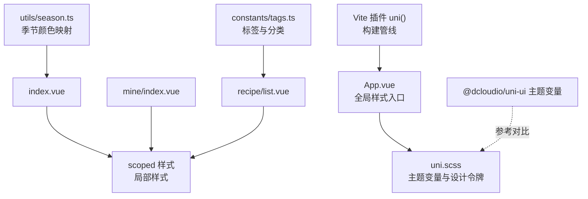
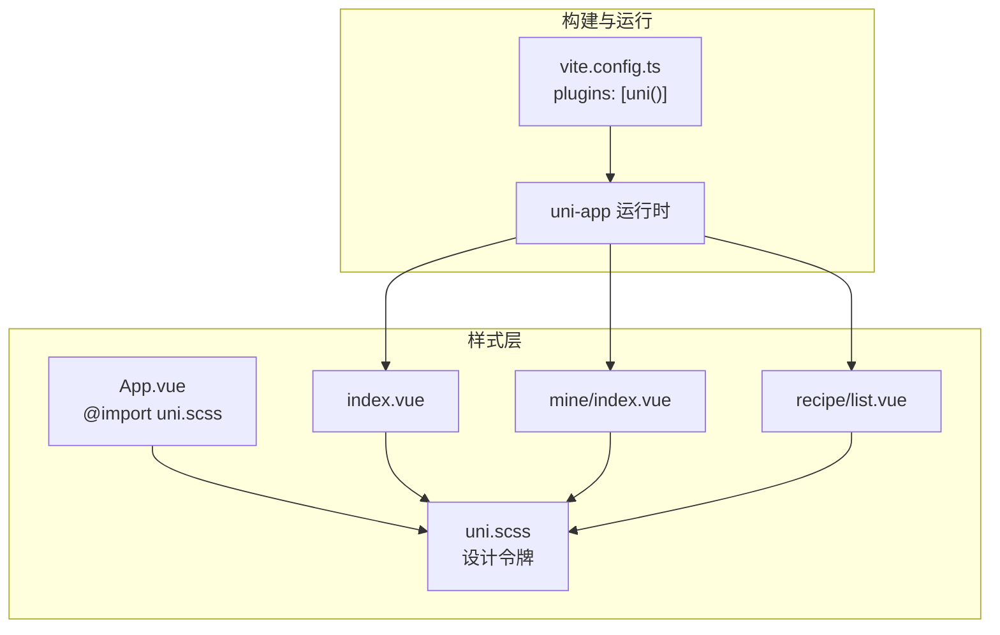
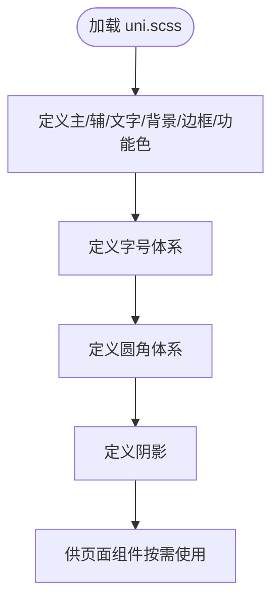
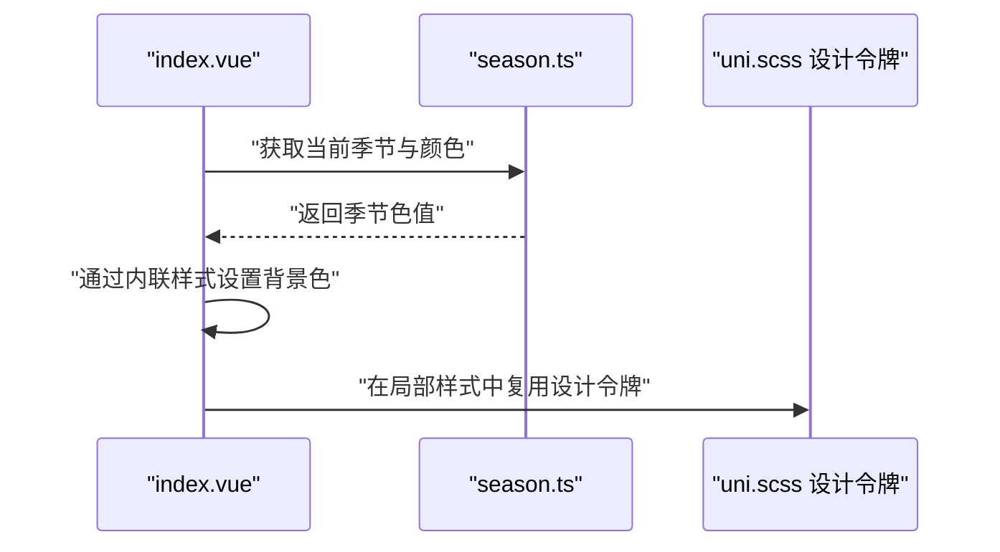
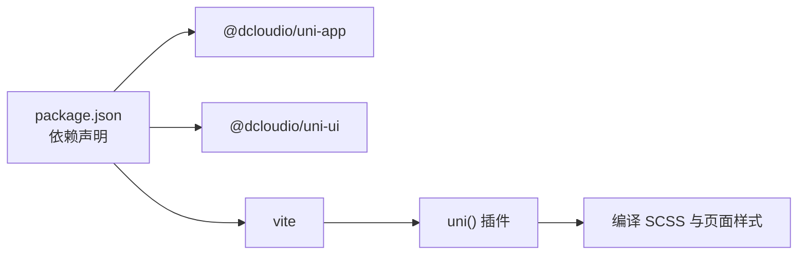

# 样式与主题系统

<cite>
**本文引用的文件**
- [src/uni.scss](file://src/uni.scss)
- [src/App.vue](file://src/App.vue)
- [src/pages/index/index.vue](file://src/pages/index/index.vue)
- [src/pages/mine/index.vue](file://src/pages/mine/index.vue)
- [src/pages/recipe/list.vue](file://src/pages/recipe/list.vue)
- [src/utils/season.ts](file://src/utils/season.ts)
- [src/constants/tags.ts](file://src/constants/tags.ts)
- [package.json](file://package.json)
- [vite.config.ts](file://vite.config.ts)
- [@dcloudio/uni-ui 主题变量](file://node_modules/@dcloudio/uni-ui/lib/uni-scss/variables.scss)
- [@dcloudio/uni-ui 默认主题](file://node_modules/@dcloudio/uni-ui/lib/uni-scss/theme.scss)
- [@dcloudio/uni-ui 变量与混入](file://node_modules/@dcloudio/uni-ui/lib/uni-scss/styles/setting/_variables.scss)
</cite>

## 目录
1. [简介](#简介)
2. [项目结构](#项目结构)
3. [核心组件](#核心组件)
4. [架构总览](#架构总览)
5. [详细组件分析](#详细组件分析)
6. [依赖关系分析](#依赖关系分析)
7. [性能考量](#性能考量)
8. [故障排查指南](#故障排查指南)
9. [结论](#结论)
10. [附录](#附录)

## 简介
本文件系统性梳理 eat 项目的样式与主题体系，围绕基于 SCSS 的样式架构、全局样式配置与主题定制机制展开，重点说明 uni.scss 中的主题变量、颜色系统、字号与圆角规范、阴影与间距等设计令牌，并结合页面组件展示如何在实际开发中应用这些设计令牌，确保跨平台（H5、小程序）的一致性与可维护性。同时给出响应式与移动端适配策略、主题切换建议、命名规范与性能优化实践。

## 项目结构
eat 项目采用 uni-app 3.x + Vite 构建，SCSS 作为样式预处理语言。样式体系以全局主题变量为核心，通过 App.vue 引入统一的样式入口，页面组件内按需编写局部样式并复用全局设计令牌，形成“全局变量 + 局部样式”的分层组织方式。

**图表来源**
- [src/App.vue:17-19](file://src/App.vue#L17-L19)
- [src/uni.scss:1-49](file://src/uni.scss#L1-L49)
- [src/pages/index/index.vue:210-469](file://src/pages/index/index.vue#L210-L469)
- [src/pages/mine/index.vue:265-384](file://src/pages/mine/index.vue#L265-L384)
- [src/pages/recipe/list.vue:215-477](file://src/pages/recipe/list.vue#L215-L477)
- [src/utils/season.ts:11-19](file://src/utils/season.ts#L11-L19)
- [src/constants/tags.ts:10](file://src/constants/tags.ts#L10)
- [vite.config.ts:1-9](file://vite.config.ts#L1-L9)

**章节来源**
- [src/App.vue:17-19](file://src/App.vue#L17-L19)
- [src/uni.scss:1-49](file://src/uni.scss#L1-L49)
- [vite.config.ts:1-9](file://vite.config.ts#L1-L9)

## 核心组件
- 全局主题变量与设计令牌：集中于 uni.scss，定义主色、辅色、文字色、背景色、边框色、功能色、字号、圆角、阴影等。
- 页面组件样式：各页面通过 scoped 样式局部覆盖或组合使用全局设计令牌，实现统一风格与差异化布局。
- 工具与常量：season.ts 提供季节颜色映射，tags.ts 提供标签与分类数据，用于动态样式与交互。

**章节来源**
- [src/uni.scss:1-49](file://src/uni.scss#L1-L49)
- [src/pages/index/index.vue:210-469](file://src/pages/index/index.vue#L210-L469)
- [src/pages/mine/index.vue:265-384](file://src/pages/mine/index.vue#L265-L384)
- [src/pages/recipe/list.vue:215-477](file://src/pages/recipe/list.vue#L215-L477)
- [src/utils/season.ts:11-19](file://src/utils/season.ts#L11-L19)
- [src/constants/tags.ts:10](file://src/constants/tags.ts#L10)

## 架构总览
整体架构以“全局设计令牌 + 页面局部样式”为主，构建流程由 Vite 插件 uni() 驱动，编译阶段将 SCSS 编译为最终样式资源，保证 H5 与小程序平台的一致输出。

**图表来源**
- [vite.config.ts:1-9](file://vite.config.ts#L1-L9)
- [src/App.vue:17-19](file://src/App.vue#L17-L19)
- [src/uni.scss:1-49](file://src/uni.scss#L1-L49)
- [src/pages/index/index.vue:210-469](file://src/pages/index/index.vue#L210-L469)
- [src/pages/mine/index.vue:265-384](file://src/pages/mine/index.vue#L265-L384)
- [src/pages/recipe/list.vue:215-477](file://src/pages/recipe/list.vue#L215-L477)

## 详细组件分析

### 全局主题变量与设计令牌（uni.scss）
- 主色调与辅色：定义主色、浅/深主色，辅色及对应变体，用于强调、按钮、标签等组件状态。
- 文字色：主/次/三级文字色，满足标题、正文、弱提示的层级需求。
- 背景色：页面背景、白色容器、灰度背景，区分页面与卡片层级。
- 边框色：常规边框与浅边框，用于分割线与容器边框。
- 功能色：成功、警告、错误、信息色，用于反馈与状态标识。
- 字号：从 xs 到 xxl 的字号体系，配合 rpx 在移动端保持一致物理尺寸。
- 圆角：小/中/大/圆形圆角，统一组件圆角风格。
- 阴影：统一盒阴影，提升卡片与浮层的层次感。

**图表来源**
- [src/uni.scss:1-49](file://src/uni.scss#L1-L49)

**章节来源**
- [src/uni.scss:1-49](file://src/uni.scss#L1-L49)

### 页面样式组织与命名规范
- 组件样式采用 scoped，避免全局污染；局部样式优先使用全局设计令牌，减少硬编码色值与尺寸。
- 命名规范建议：
  - 结构性类名：如 .section、.card、.recipe-list、.menu-section 等，描述语义与结构。
  - 状态类名：如 .active、.empty-card、.menu-item-last 等，表达状态与交互。
  - 组件类名：如 .fab、.tag、.season-tag、.condition-tag 等，便于复用与扩展。
- 组织原则：
  - 以页面为单位划分样式区块，如“顶部区域”“列表区域”“底部悬浮按钮”等。
  - 合理拆分通用样式与局部样式，通用样式尽量收敛至全局设计令牌。

**章节来源**
- [src/pages/index/index.vue:210-469](file://src/pages/index/index.vue#L210-L469)
- [src/pages/mine/index.vue:265-384](file://src/pages/mine/index.vue#L265-L384)
- [src/pages/recipe/list.vue:215-477](file://src/pages/recipe/list.vue#L215-L477)

### 季节主题与动态样式（season.ts）
- 提供当前季节、季节颜色映射与季节图标，页面通过动态样式绑定实现季节主题色的统一呈现。
- 示例：首页顶部区域背景色、筛选标签高亮态等均使用该映射。

**图表来源**
- [src/pages/index/index.vue:4-4](file://src/pages/index/index.vue#L4-L4)
- [src/utils/season.ts:11-19](file://src/utils/season.ts#L11-L19)
- [src/uni.scss:1-49](file://src/uni.scss#L1-L49)

**章节来源**
- [src/pages/index/index.vue:4-4](file://src/pages/index/index.vue#L4-L4)
- [src/utils/season.ts:11-19](file://src/utils/season.ts#L11-L19)

### 标签与分类数据驱动的样式（tags.ts）
- 默认身体状况标签集合用于筛选器与标签展示，页面通过计算属性与交互控制标签高亮与摘要展示。
- 示例：筛选标签的激活态样式、标签数量省略逻辑等。

**章节来源**
- [src/pages/recipe/list.vue:40-54](file://src/pages/recipe/list.vue#L40-L54)
- [src/pages/recipe/list.vue:314-335](file://src/pages/recipe/list.vue#L314-L335)
- [src/constants/tags.ts:10](file://src/constants/tags.ts#L10)

### App.vue 全局样式入口
- 通过在 App.vue 中引入 uni.scss，确保全局设计令牌在应用启动时即生效，避免页面重复引入导致的重复打包与顺序问题。

**章节来源**
- [src/App.vue:17-19](file://src/App.vue#L17-L19)

### 与 uni-ui 主题变量的对比与参考
- 项目自定义主题变量与 uni-ui 的默认主题变量并存，建议在业务样式中优先使用 uni.scss 中的自定义变量，避免与 uni-ui 组件库默认变量冲突。
- 若需与 uni-ui 组件库深度集成，可参考 uni-ui 的变量与混入文件，统一字号、圆角、阴影等基础规范。

**章节来源**
- [@dcloudio/uni-ui 主题变量:1-63](file://node_modules/@dcloudio/uni-ui/lib/uni-scss/variables.scss#L1-L63)
- [@dcloudio/uni-ui 默认主题:1-32](file://node_modules/@dcloudio/uni-ui/lib/uni-scss/theme.scss#L1-L32)
- [@dcloudio/uni-ui 变量与混入:1-147](file://node_modules/@dcloudio/uni-ui/lib/uni-scss/styles/setting/_variables.scss#L1-L147)

## 依赖关系分析
- 构建依赖：Vite 插件 uni() 负责 uni-app 生态的编译与打包，确保 SCSS 能在 H5 与小程序平台正确输出。
- 运行时依赖：@dcloudio/uni-app、@dcloudio/uni-ui 提供运行时能力与 UI 组件库，样式层面与自定义主题变量协同工作。

**图表来源**
- [package.json:11-26](file://package.json#L11-L26)
- [vite.config.ts:1-9](file://vite.config.ts#L1-L9)

**章节来源**
- [package.json:11-26](file://package.json#L11-L26)
- [vite.config.ts:1-9](file://vite.config.ts#L1-L9)

## 性能考量
- 减少重复定义：优先使用 uni.scss 中的全局变量，避免在多个页面重复声明相同色值与尺寸。
- 合理拆分样式：将通用样式收敛至全局，局部样式仅保留差异化部分，降低 CSS 体积与选择器复杂度。
- 移动端单位：统一使用 rpx，确保在不同设备像素比下保持一致视觉效果，减少缩放与重排成本。
- 选择器层级：避免过深的嵌套与复杂选择器，提升渲染性能与可维护性。
- 构建优化：利用 uni() 插件的按平台优化能力，剔除未使用的样式与冗余代码。

## 故障排查指南
- 样式不生效
  - 检查 App.vue 是否正确引入 uni.scss。
  - 确认页面样式是否为 scoped，且未被 !important 或更高优先级样式覆盖。
- 颜色不一致
  - 统一使用 uni.scss 中的变量，避免直接写死色值。
  - 对照 uni-ui 默认主题变量，避免命名冲突导致的覆盖。
- 移动端显示异常
  - 确认 rpx 单位使用是否正确，避免 px 与 rpx 混用。
  - 检查容器高度与滚动视图的设置，确保内容完整可见。
- 主题切换建议
  - 当前项目未实现运行时主题切换，建议通过 CSS 变量或动态注入样式表的方式实现明暗主题或品牌主题切换，避免在现有 SCSS 变量基础上进行运行时修改。

**章节来源**
- [src/App.vue:17-19](file://src/App.vue#L17-L19)
- [src/uni.scss:1-49](file://src/uni.scss#L1-L49)
- [src/pages/index/index.vue:210-469](file://src/pages/index/index.vue#L210-L469)

## 结论
eat 项目的样式与主题系统以 uni.scss 为核心设计令牌，结合页面组件的 scoped 样式实现统一风格与灵活布局。通过明确的颜色、字号、圆角与阴影规范，以及工具函数对季节主题的支持，项目在 H5 与小程序平台上实现了较好的视觉一致性与可维护性。建议后续在保持现有设计令牌体系的基础上，逐步引入运行时主题切换与 CSS 变量方案，进一步增强主题灵活性与可扩展性。

## 附录

### 设计令牌速览（来自 uni.scss）
- 主/辅/文字/背景/边框/功能色
- 字号体系：xs、sm、base、lg、xl、xxl
- 圆角体系：sm、base、lg、round
- 阴影：box-shadow

**章节来源**
- [src/uni.scss:1-49](file://src/uni.scss#L1-L49)

### 页面样式示例路径
- 首页卡片与悬浮按钮样式：[src/pages/index/index.vue:210-469](file://src/pages/index/index.vue#L210-L469)
- 我的页面统计卡片与菜单项样式：[src/pages/mine/index.vue:265-384](file://src/pages/mine/index.vue#L265-L384)
- 菜谱列表搜索栏、筛选与卡片样式：[src/pages/recipe/list.vue:215-477](file://src/pages/recipe/list.vue#L215-L477)

### 自定义指南与最佳实践
- 自定义主题变量：在 uni.scss 中新增或调整设计令牌，确保命名清晰、语义明确。
- 局部样式复用：在页面组件中优先使用全局变量，减少硬编码。
- 响应式与移动端：统一使用 rpx，配合 flex/grid 布局，避免固定宽度。
- 命名规范：采用结构化命名，结合 BEM 或功能域命名法，提升可读性与可维护性。
- 性能优化：减少选择器层级、合并重复样式、按需引入样式，避免过度使用 !important。