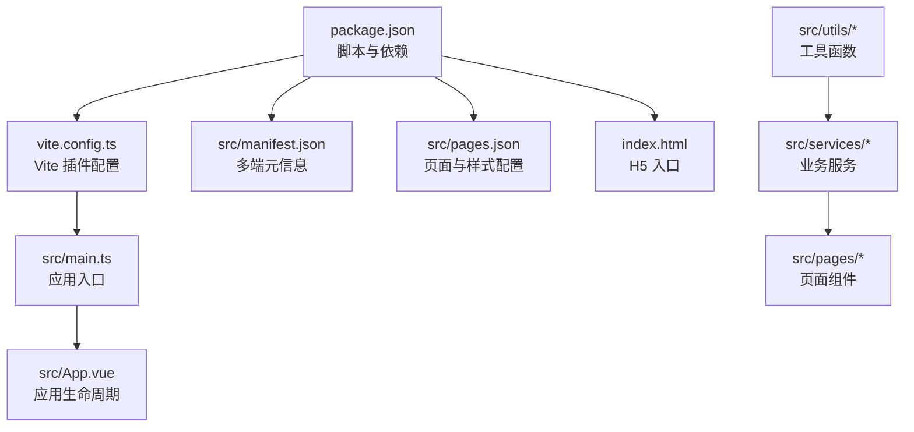
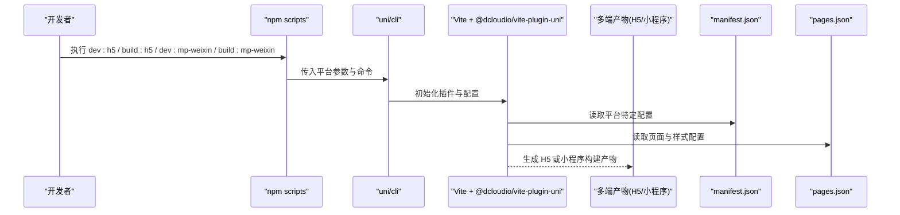
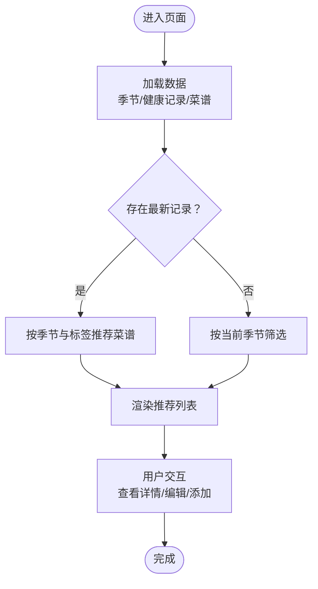
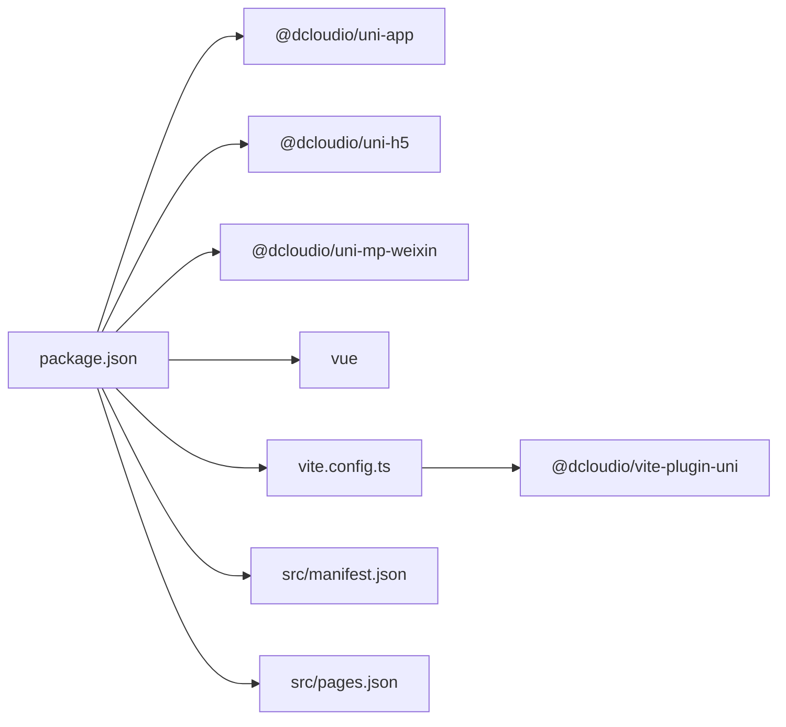

# 部署指南

<cite>
**本文引用的文件**
- [package.json](file://package.json)
- [vite.config.ts](file://vite.config.ts)
- [src/manifest.json](file://src/manifest.json)
- [src/pages.json](file://src/pages.json)
- [src/main.ts](file://src/main.ts)
- [src/App.vue](file://src/App.vue)
- [index.html](file://index.html)
- [src/services/recipe.ts](file://src/services/recipe.ts)
- [src/services/health.ts](file://src/services/health.ts)
- [src/utils/id.ts](file://src/utils/id.ts)
- [src/pages/index/index.vue](file://src/pages/index/index.vue)
- [src/pages/recipe/list.vue](file://src/pages/recipe/list.vue)
</cite>

## 目录
1. [简介](#简介)
2. [项目结构](#项目结构)
3. [核心组件](#核心组件)
4. [架构总览](#架构总览)
5. [详细组件分析](#详细组件分析)
6. [依赖分析](#依赖分析)
7. [性能考虑](#性能考虑)
8. [故障排除指南](#故障排除指南)
9. [结论](#结论)
10. [附录](#附录)

## 简介
本指南面向 eat 项目，提供从开发到上线的多平台部署解决方案，覆盖微信小程序、H5 等平台的配置要点、构建与发布流程、构建优化、包体积控制、性能监控、CI/CD 集成、版本管理、审核与发布规范、更新机制、故障排除、回滚策略与监控告警等。文档基于仓库现有配置与源码进行分析，确保可操作性与可追溯性。

## 项目结构
eat 项目采用 uni-app 生态（Vue 3 + Vite 插件）组织，支持多端编译输出。关键目录与文件职责概览：
- 构建与运行脚本：通过 npm scripts 调用 uni/cli 进行 H5 与微信小程序的开发与构建。
- 配置文件：manifest.json（多端元信息与平台特定配置）、pages.json（页面路由与全局样式、tabBar）。
- 应用入口：main.ts 创建 SSR App，App.vue 注册生命周期钩子。
- 平台适配：index.html 作为 H5 入口，uni-app 插件负责多端编译。
- 业务模块：services 与 utils 提供数据访问与工具函数，pages 下的页面组件实现功能。

图表来源
- [package.json:1-28](file://package.json#L1-L28)
- [vite.config.ts:1-9](file://vite.config.ts#L1-L9)
- [src/main.ts:1-10](file://src/main.ts#L1-L10)
- [src/App.vue:1-20](file://src/App.vue#L1-L20)
- [src/manifest.json:1-41](file://src/manifest.json#L1-L41)
- [src/pages.json:1-85](file://src/pages.json#L1-L85)
- [index.html:1-13](file://index.html#L1-L13)

章节来源
- [package.json:1-28](file://package.json#L1-L28)
- [vite.config.ts:1-9](file://vite.config.ts#L1-L9)
- [src/main.ts:1-10](file://src/main.ts#L1-L10)
- [src/App.vue:1-20](file://src/App.vue#L1-L20)
- [src/manifest.json:1-41](file://src/manifest.json#L1-L41)
- [src/pages.json:1-85](file://src/pages.json#L1-L85)
- [index.html:1-13](file://index.html#L1-L13)

## 核心组件
- 构建与脚本
  - H5 开发与构建：使用 uni 命令分别启动开发服务器与生产构建。
  - 微信小程序开发与构建：通过指定平台参数进行开发与构建。
- 配置中心
  - manifest.json：定义应用名称、版本、平台特定设置（如 splashscreen、权限、H5 title 与路由模式等）。
  - pages.json：集中声明页面路径、导航栏标题、全局样式与 tabBar。
- 应用入口
  - main.ts：创建 SSR App 并导出工厂方法。
  - App.vue：注册应用生命周期钩子，便于统一日志与初始化。
- 页面与业务
  - 页面组件：如首页、菜谱列表页等，承载业务逻辑与交互。
  - 服务层：封装本地存储读写、数据增删改查与推荐算法。
  - 工具层：生成唯一 ID 等辅助函数。

章节来源
- [package.json:5-10](file://package.json#L5-L10)
- [src/manifest.json:1-41](file://src/manifest.json#L1-L41)
- [src/pages.json:1-85](file://src/pages.json#L1-L85)
- [src/main.ts:1-10](file://src/main.ts#L1-L10)
- [src/App.vue:1-20](file://src/App.vue#L1-L20)
- [src/services/recipe.ts:1-103](file://src/services/recipe.ts#L1-L103)
- [src/services/health.ts:1-48](file://src/services/health.ts#L1-L48)
- [src/utils/id.ts:1-3](file://src/utils/id.ts#L1-L3)

## 架构总览
下图展示从命令行到多端产物的关键流程，以及关键配置文件对构建的影响。

图表来源
- [package.json:5-10](file://package.json#L5-L10)
- [vite.config.ts:1-9](file://vite.config.ts#L1-L9)
- [src/manifest.json:1-41](file://src/manifest.json#L1-L41)
- [src/pages.json:1-85](file://src/pages.json#L1-L85)

## 详细组件分析

### H5 平台部署策略
- 构建与运行
  - 开发：通过 H5 开发脚本启动本地服务，便于浏览器调试。
  - 构建：通过 H5 构建脚本产出静态资源，部署至 Web 服务器或 CDN。
- 关键配置
  - H5 入口：index.html 作为浏览器渲染入口。
  - H5 标题与路由：pages.json 中的全局标题与 manifest.json 中 h5.title、router.mode 影响页面标题与路由行为。
- 发布流程
  - 将构建产物上传至静态站点或 CDN，确保资源可访问与缓存策略合理。
  - 配置域名与 HTTPS，校验离线缓存与 PWA 相关配置（如需要）。

章节来源
- [package.json:6-7](file://package.json#L6-L7)
- [index.html:1-13](file://index.html#L1-L13)
- [src/pages.json:46-51](file://src/pages.json#L46-L51)
- [src/manifest.json:27-32](file://src/manifest.json#L27-L32)

### 微信小程序部署策略
- 构建与运行
  - 开发：通过指定平台参数启动小程序开发工具。
  - 构建：通过指定平台参数进行生产构建，生成小程序包。
- 关键配置
  - appid：在 manifest.json 的 mp-weixin 节点中配置小程序 appid。
  - 权限与安全：manifest.json 的 mp-weixin.setting.urlCheck 可用于安全校验设置。
  - 组件化：usingComponents 控制是否启用分包组件化。
- 发布流程
  - 在微信公众平台上传代码，填写版本号与变更说明。
  - 提交审核，审核通过后发布。

章节来源
- [package.json:8-9](file://package.json#L8-L9)
- [src/manifest.json:33-39](file://src/manifest.json#L33-L39)

### manifest.json 配置项详解
- 基础信息
  - name、description、versionName、versionCode：应用名称、描述与版本信息。
- app-plus（App 分发）
  - usingComponents、nvueStyleCompiler、compilerVersion：组件化与编译器配置。
  - splashscreen：启动屏配置（alwaysShowBeforeRender、waiting、autoclose、delay）。
  - distribute.android.permissions：Android 权限声明（空数组表示默认）。
  - distribute.ios/sdkConfigs：iOS SDK 配置占位。
- h5
  - title：页面标题。
  - router.mode：路由模式（hash）。
- mp-weixin
  - appid：小程序 appid。
  - setting.urlCheck：网络请求安全校验开关。
  - usingComponents：组件化开关。

章节来源
- [src/manifest.json:1-41](file://src/manifest.json#L1-L41)

### pages.json 配置项详解
- pages：声明页面路径与导航栏标题。
- globalStyle：全局导航栏与背景色等。
- tabBar：底部导航配置，含颜色、图标路径与页面映射。

章节来源
- [src/pages.json:1-85](file://src/pages.json#L1-L85)

### 构建流程与优化
- 构建链路
  - npm scripts -> uni/cli -> Vite + @dcloudio/vite-plugin-uni -> 多端产物。
- 优化建议
  - 代码分割：拆分页面与公共模块，减少首屏加载。
  - 图片与静态资源：压缩与按需引入，使用 CDN。
  - Tree Shaking：确保未使用的代码被移除。
  - 路由懒加载：结合 uni-app 的动态导入能力。
  - 缓存策略：合理设置静态资源缓存头，版本化资源名。

章节来源
- [package.json:5-10](file://package.json#L5-L10)
- [vite.config.ts:1-9](file://vite.config.ts#L1-L9)

### 数据流与页面组件
- 页面组件
  - 首页：根据季节与健康记录推荐菜谱，支持跳转到记录与编辑页面。
  - 菜谱列表：支持关键词搜索、季节筛选与身体状况标签筛选。
- 服务层
  - 本地存储：封装读写，提供增删改查与推荐算法。
  - ID 生成：提供唯一标识符生成。

图表来源
- [src/pages/index/index.vue:136-208](file://src/pages/index/index.vue#L136-L208)
- [src/pages/recipe/list.vue:114-213](file://src/pages/recipe/list.vue#L114-L213)
- [src/services/recipe.ts:53-103](file://src/services/recipe.ts#L53-L103)
- [src/services/health.ts:5-48](file://src/services/health.ts#L5-L48)
- [src/utils/id.ts:1-3](file://src/utils/id.ts#L1-L3)

章节来源
- [src/pages/index/index.vue:136-208](file://src/pages/index/index.vue#L136-L208)
- [src/pages/recipe/list.vue:114-213](file://src/pages/recipe/list.vue#L114-L213)
- [src/services/recipe.ts:53-103](file://src/services/recipe.ts#L53-L103)
- [src/services/health.ts:5-48](file://src/services/health.ts#L5-L48)
- [src/utils/id.ts:1-3](file://src/utils/id.ts#L1-L3)

## 依赖分析
- 依赖关系
  - package.json 声明了 uni-app、uni-h5、uni-mp-weixin、@vitejs/plugin-vue、vue 等依赖。
  - vite.config.ts 引入 @dcloudio/vite-plugin-uni，使 Vite 支持多端编译。
- 耦合与内聚
  - 页面组件与服务层解耦，通过服务层访问本地存储，降低页面复杂度。
  - 配置文件（manifest.json、pages.json）集中管理平台差异与页面结构。

图表来源
- [package.json:11-26](file://package.json#L11-L26)
- [vite.config.ts:1-9](file://vite.config.ts#L1-L9)
- [src/manifest.json:1-41](file://src/manifest.json#L1-L41)
- [src/pages.json:1-85](file://src/pages.json#L1-L85)

章节来源
- [package.json:11-26](file://package.json#L11-L26)
- [vite.config.ts:1-9](file://vite.config.ts#L1-L9)
- [src/manifest.json:1-41](file://src/manifest.json#L1-L41)
- [src/pages.json:1-85](file://src/pages.json#L1-L85)

## 性能考虑
- 构建优化
  - 启用按需加载与代码分割，减少首屏体积。
  - 对图片与字体进行压缩与格式优化。
  - 使用长效缓存策略，静态资源版本化。
- 运行时优化
  - 避免在 onShow 等高频生命周期中执行重计算，必要时做节流/防抖。
  - 列表渲染时使用虚拟滚动（如适用），减少 DOM 数量。
- 监控与告警
  - 集成性能监控（如首屏时间、接口耗时、错误上报）。
  - 设置阈值告警，异常时自动通知与回滚。

## 故障排除指南
- 常见问题
  - H5 路由不生效：检查 pages.json 的 router.mode 与 manifest.json 的 h5.title 是否符合预期。
  - 小程序构建失败：确认 manifest.json 的 mp-weixin.appid 是否正确配置。
  - 页面无法显示：核对 pages.json 的 pages 与 tabBar 配置是否与实际路径一致。
- 回滚策略
  - 版本化产物与发布记录，出现问题时回退至上一稳定版本。
  - 配置回滚：若为配置变更导致的问题，回退到上一版 manifest.json 或 pages.json。
- 监控告警
  - 建立构建与发布流水线中的健康检查与错误上报。
  - 对关键指标（构建时长、包体积、首屏时间、崩溃率）设置阈值告警。

章节来源
- [src/pages.json:27-32](file://src/pages.json#L27-L32)
- [src/manifest.json:33-39](file://src/manifest.json#L33-L39)
- [src/pages.json:2-45](file://src/pages.json#L2-L45)

## 结论
本指南基于 eat 项目的现有配置与源码，提供了多平台部署的系统化方案。通过明确的配置项解读、构建与发布流程、性能优化与监控告警建议，以及故障排除与回滚策略，帮助团队高效、稳定地完成从开发到上线的全流程交付。

## 附录
- CI/CD 集成建议
  - 触发条件：分支保护、PR 合并、标签推送。
  - 步骤：安装依赖、H5 构建、小程序构建、产物归档、发布到目标环境。
  - 审核与发布：在 CI 中调用平台提供的上传与审核接口，完成后发布。
- 版本管理策略
  - 使用语义化版本（主.次.修订），在 manifest.json 与 pages.json 中同步更新版本号与描述。
  - 为每次发布打标签，保留发布日志与变更说明。