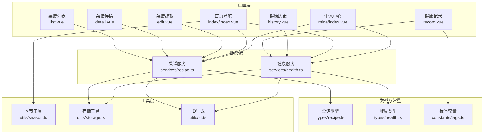
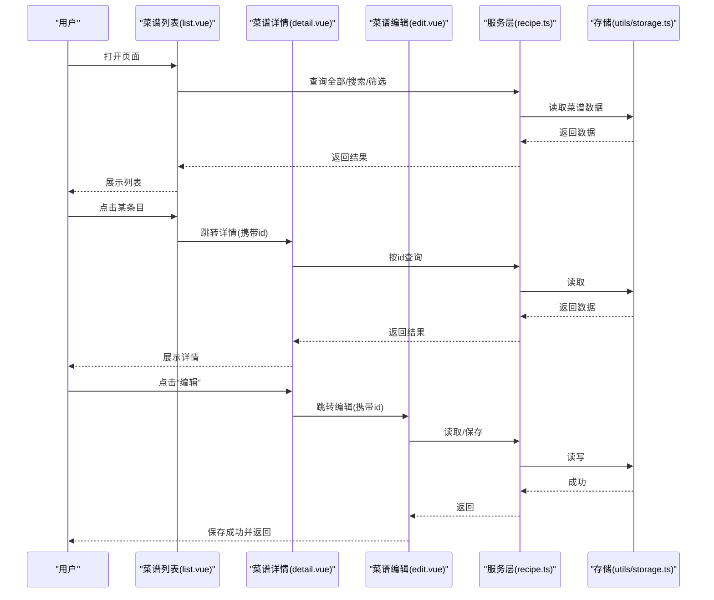
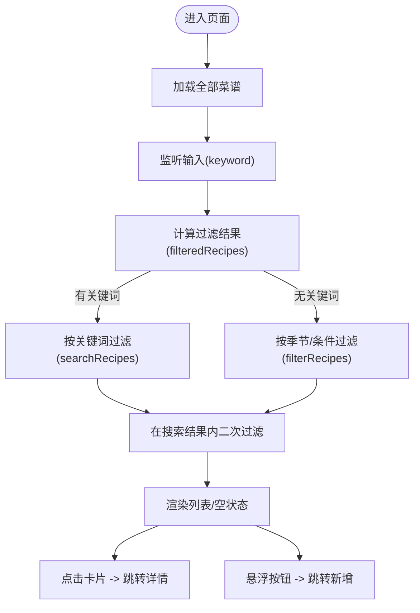
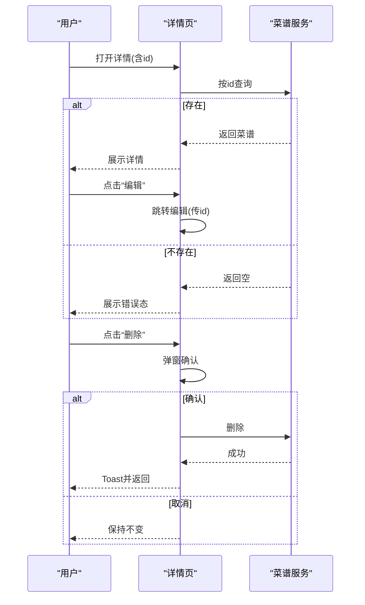
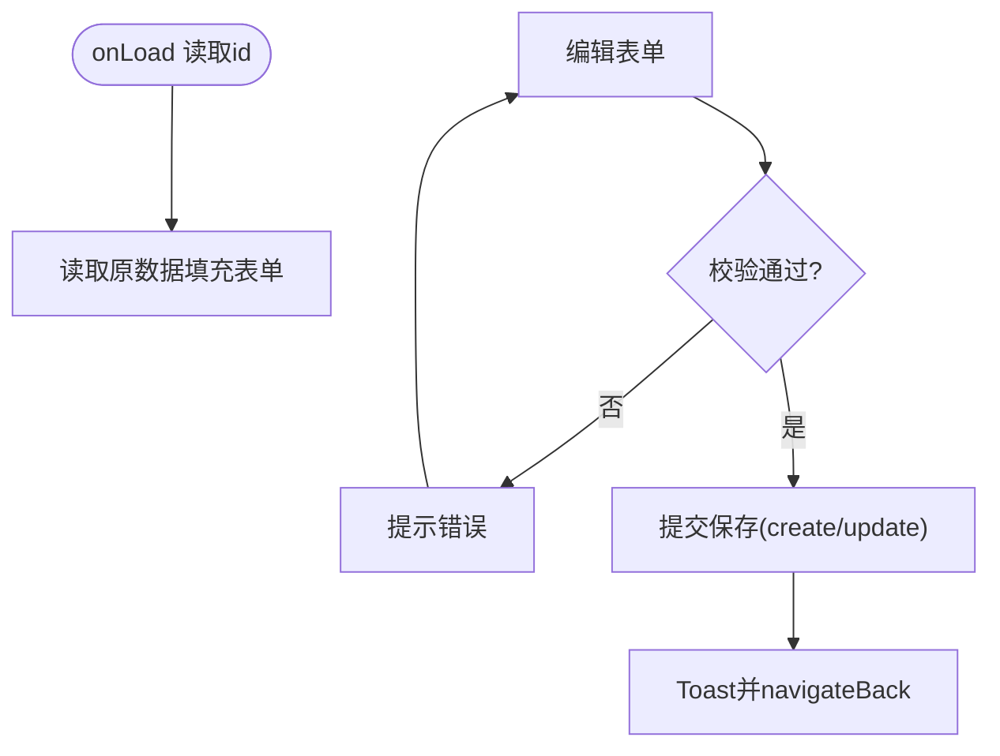
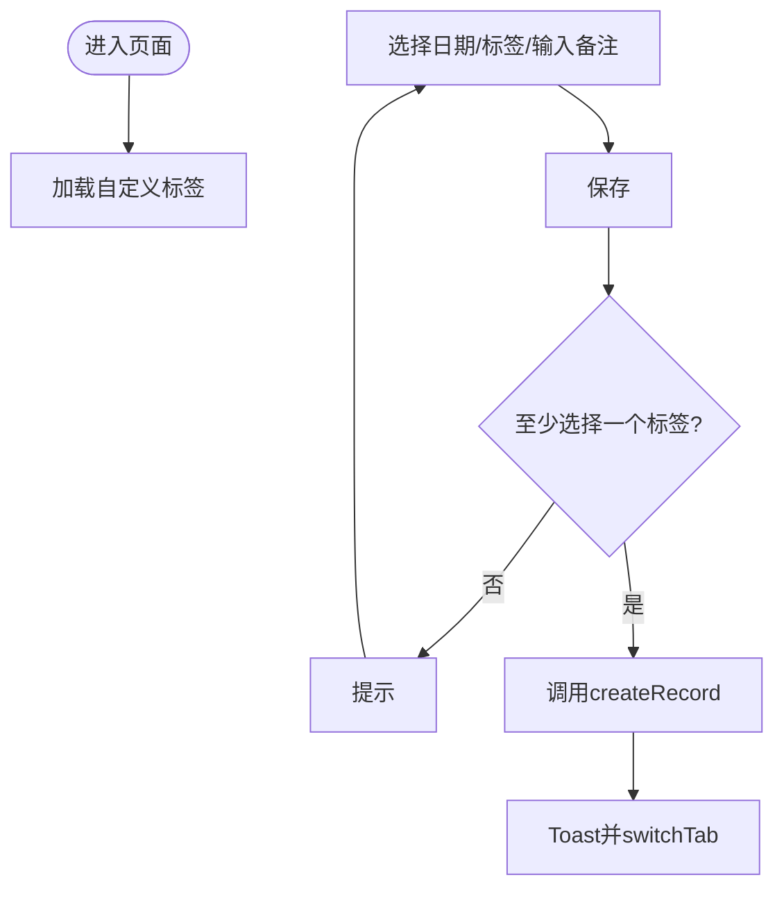
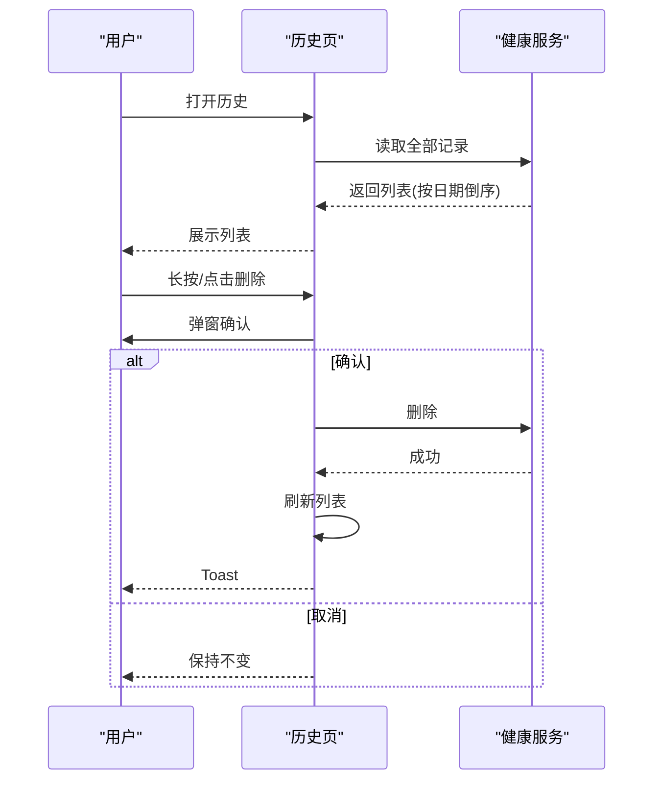
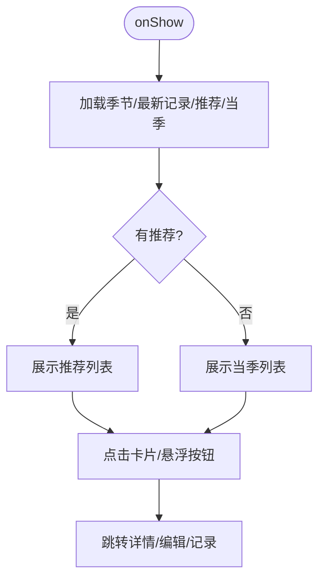
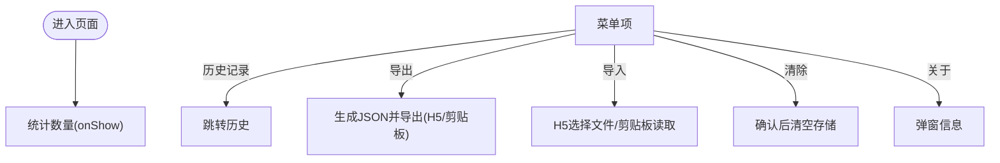
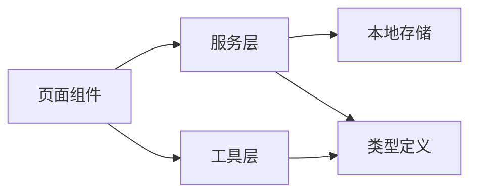

# 页面组件详解

<cite>
**本文引用的文件**   
- [src/pages/recipe/list.vue](file://src/pages/recipe/list.vue)
- [src/pages/recipe/detail.vue](file://src/pages/recipe/detail.vue)
- [src/pages/recipe/edit.vue](file://src/pages/recipe/edit.vue)
- [src/pages/health/record.vue](file://src/pages/health/record.vue)
- [src/pages/health/history.vue](file://src/pages/health/history.vue)
- [src/pages/index/index.vue](file://src/pages/index/index.vue)
- [src/pages/mine/index.vue](file://src/pages/mine/index.vue)
- [src/services/recipe.ts](file://src/services/recipe.ts)
- [src/services/health.ts](file://src/services/health.ts)
- [src/types/recipe.ts](file://src/types/recipe.ts)
- [src/types/health.ts](file://src/types/health.ts)
- [src/constants/tags.ts](file://src/constants/tags.ts)
- [src/utils/season.ts](file://src/utils/season.ts)
- [src/utils/storage.ts](file://src/utils/storage.ts)
- [src/utils/id.ts](file://src/utils/id.ts)
</cite>

## 目录
1. [简介](#简介)
2. [项目结构](#项目结构)
3. [核心组件](#核心组件)
4. [架构总览](#架构总览)
5. [详细组件分析](#详细组件分析)
6. [依赖分析](#依赖分析)
7. [性能考虑](#性能考虑)
8. [故障排查指南](#故障排查指南)
9. [结论](#结论)
10. [附录](#附录)

## 简介
本文件面向 eat 项目的页面组件，系统化梳理菜谱与健康两大模块的页面实现，包括页面职责、数据流、交互逻辑、状态管理、导航关系与样式定制等。目标是帮助开发者快速理解并高效扩展这些页面组件。

## 项目结构
eat 采用基于目录的页面组织方式，页面位于 src/pages 下，按功能划分为 recipe、health、index、mine 四个子目录；业务服务位于 src/services，类型定义位于 src/types，常量与工具位于 src/constants 与 src/utils。

图表来源
- [src/pages/recipe/list.vue:1-477](file://src/pages/recipe/list.vue#L1-L477)
- [src/pages/recipe/detail.vue:1-435](file://src/pages/recipe/detail.vue#L1-L435)
- [src/pages/recipe/edit.vue:1-702](file://src/pages/recipe/edit.vue#L1-L702)
- [src/pages/health/record.vue:1-313](file://src/pages/health/record.vue#L1-L313)
- [src/pages/health/history.vue:1-177](file://src/pages/health/history.vue#L1-L177)
- [src/pages/index/index.vue:1-470](file://src/pages/index/index.vue#L1-L470)
- [src/pages/mine/index.vue:1-384](file://src/pages/mine/index.vue#L1-L384)
- [src/services/recipe.ts:1-103](file://src/services/recipe.ts#L1-L103)
- [src/services/health.ts:1-49](file://src/services/health.ts#L1-L49)
- [src/types/recipe.ts:1-15](file://src/types/recipe.ts#L1-L15)
- [src/types/health.ts:1-7](file://src/types/health.ts#L1-L7)
- [src/constants/tags.ts:1-23](file://src/constants/tags.ts#L1-L23)
- [src/utils/season.ts:1-34](file://src/utils/season.ts#L1-L34)
- [src/utils/storage.ts:1-34](file://src/utils/storage.ts#L1-L34)
- [src/utils/id.ts:1-4](file://src/utils/id.ts#L1-L4)

章节来源
- [src/pages/recipe/list.vue:1-477](file://src/pages/recipe/list.vue#L1-L477)
- [src/pages/recipe/detail.vue:1-435](file://src/pages/recipe/detail.vue#L1-L435)
- [src/pages/recipe/edit.vue:1-702](file://src/pages/recipe/edit.vue#L1-L702)
- [src/pages/health/record.vue:1-313](file://src/pages/health/record.vue#L1-L313)
- [src/pages/health/history.vue:1-177](file://src/pages/health/history.vue#L1-L177)
- [src/pages/index/index.vue:1-470](file://src/pages/index/index.vue#L1-L470)
- [src/pages/mine/index.vue:1-384](file://src/pages/mine/index.vue#L1-L384)

## 核心组件
- 菜谱页面族：list（列表）、detail（详情）、edit（新增/编辑）
- 健康页面族：record（记录）、history（历史）
- 首页导航：index（展示推荐、季节信息、快捷入口）
- 个人中心：mine（统计、导入导出、清除数据）

章节来源
- [src/pages/recipe/list.vue:1-477](file://src/pages/recipe/list.vue#L1-L477)
- [src/pages/recipe/detail.vue:1-435](file://src/pages/recipe/detail.vue#L1-L435)
- [src/pages/recipe/edit.vue:1-702](file://src/pages/recipe/edit.vue#L1-L702)
- [src/pages/health/record.vue:1-313](file://src/pages/health/record.vue#L1-L313)
- [src/pages/health/history.vue:1-177](file://src/pages/health/history.vue#L1-L177)
- [src/pages/index/index.vue:1-470](file://src/pages/index/index.vue#L1-L470)
- [src/pages/mine/index.vue:1-384](file://src/pages/mine/index.vue#L1-L384)

## 架构总览
页面通过服务层访问本地存储，使用工具层完成季节、颜色、表情与 ID 生成等辅助逻辑；页面间通过 uni-app 导航 API 进行跳转；类型定义确保数据结构一致性。

图表来源
- [src/pages/recipe/list.vue:131-170](file://src/pages/recipe/list.vue#L131-L170)
- [src/pages/recipe/detail.vue:125-145](file://src/pages/recipe/detail.vue#L125-L145)
- [src/pages/recipe/edit.vue:225-242](file://src/pages/recipe/edit.vue#L225-L242)
- [src/services/recipe.ts:5-51](file://src/services/recipe.ts#L5-L51)
- [src/utils/storage.ts:7-25](file://src/utils/storage.ts#L7-L25)

## 详细组件分析

### 菜谱列表页（list.vue）
- 职责
  - 提供搜索、季节筛选、身体状况标签筛选
  - 展示菜谱卡片，支持进入详情与新增
- 关键状态与计算
  - 搜索关键词、选中季节、选中条件标签、展开状态
  - 使用计算属性组合搜索与筛选结果
- 交互逻辑
  - 输入搜索、清空搜索、切换季节、展开/收起条件、多选条件
  - 点击卡片跳转详情，悬浮按钮跳转新增
- 生命周期与数据加载
  - onShow 时重新加载数据
- 依赖
  - 服务：searchRecipes、filterRecipes
  - 工具：季节枚举、颜色、表情
  - 常量：默认身体状况标签

图表来源
- [src/pages/recipe/list.vue:131-170](file://src/pages/recipe/list.vue#L131-L170)
- [src/services/recipe.ts:53-85](file://src/services/recipe.ts#L53-L85)
- [src/utils/season.ts:31-34](file://src/utils/season.ts#L31-L34)
- [src/constants/tags.ts:9-10](file://src/constants/tags.ts#L9-L10)

章节来源
- [src/pages/recipe/list.vue:1-477](file://src/pages/recipe/list.vue#L1-L477)
- [src/services/recipe.ts:53-85](file://src/services/recipe.ts#L53-L85)
- [src/utils/season.ts:1-34](file://src/utils/season.ts#L1-L34)
- [src/constants/tags.ts:1-23](file://src/constants/tags.ts#L1-L23)

### 菜谱详情页（detail.vue）
- 职责
  - 展示菜谱图片、标题、标签、食材、步骤、时间
  - 支持编辑与删除
- 关键状态
  - 当前菜谱对象（可能为空表示不存在）
- 生命周期
  - onLoad 读取路由参数 id，onShow 刷新
- 交互
  - 编辑：跳转编辑页并携带 id
  - 删除：弹窗确认后调用服务删除并返回
- 依赖
  - 服务：getRecipeById、deleteRecipe
  - 工具：季节颜色与表情

图表来源
- [src/pages/recipe/detail.vue:125-186](file://src/pages/recipe/detail.vue#L125-L186)
- [src/services/recipe.ts:9-12](file://src/services/recipe.ts#L9-L12)
- [src/services/recipe.ts:45-51](file://src/services/recipe.ts#L45-L51)

章节来源
- [src/pages/recipe/detail.vue:1-435](file://src/pages/recipe/detail.vue#L1-L435)
- [src/services/recipe.ts:9-12](file://src/services/recipe.ts#L9-L12)
- [src/services/recipe.ts:45-51](file://src/services/recipe.ts#L45-L51)

### 菜谱编辑页（edit.vue）
- 职责
  - 新增/编辑菜谱：名称、图片、食材、步骤、季节、身体状况标签、自定义标签
- 表单与校验
  - 响应式表单，必填项校验
  - 季节多选、条件标签分组选择与自定义
  - 自定义标签去重与动态展示
- 图片处理
  - 选择相册/相机，压缩，必要时转 base64
- 保存与返回
  - 调用创建或更新接口，Toast 后返回
- 依赖
  - 服务：createRecipe、updateRecipe、getRecipeById
  - 常量：标签分组、默认条件标签、菜谱标签
  - 工具：季节颜色与表情

图表来源
- [src/pages/recipe/edit.vue:225-389](file://src/pages/recipe/edit.vue#L225-L389)
- [src/services/recipe.ts:14-43](file://src/services/recipe.ts#L14-L43)
- [src/constants/tags.ts:1-23](file://src/constants/tags.ts#L1-L23)
- [src/utils/season.ts:11-29](file://src/utils/season.ts#L11-L29)

章节来源
- [src/pages/recipe/edit.vue:1-702](file://src/pages/recipe/edit.vue#L1-L702)
- [src/services/recipe.ts:14-43](file://src/services/recipe.ts#L14-L43)
- [src/constants/tags.ts:1-23](file://src/constants/tags.ts#L1-L23)
- [src/utils/season.ts:1-34](file://src/utils/season.ts#L1-L34)

### 健康记录页（record.vue）
- 职责
  - 选择日期、勾选身体状况标签、输入备注、保存记录
- 自定义标签
  - 支持添加自定义标签并持久化
- 保存与跳转
  - 保存成功后 Toast 并 switchTab 到首页
- 依赖
  - 服务：createRecord
  - 常量：标签分组、默认标签
  - 工具：本地存储

图表来源
- [src/pages/health/record.vue:88-156](file://src/pages/health/record.vue#L88-L156)
- [src/services/health.ts:14-23](file://src/services/health.ts#L14-L23)
- [src/constants/tags.ts:1-23](file://src/constants/tags.ts#L1-L23)
- [src/utils/storage.ts:7-25](file://src/utils/storage.ts#L7-L25)

章节来源
- [src/pages/health/record.vue:1-313](file://src/pages/health/record.vue#L1-L313)
- [src/services/health.ts:14-23](file://src/services/health.ts#L14-L23)
- [src/constants/tags.ts:1-23](file://src/constants/tags.ts#L1-L23)
- [src/utils/storage.ts:1-34](file://src/utils/storage.ts#L1-L34)

### 健康历史页（history.vue）
- 职责
  - 展示历史记录，支持长按/点击删除
- 交互
  - 删除前弹窗确认，删除成功后刷新列表
  - 无记录时引导跳转记录页
- 依赖
  - 服务：getAllRecords、deleteRecord
  - 类型：HealthRecord

图表来源
- [src/pages/health/history.vue:42-81](file://src/pages/health/history.vue#L42-L81)
- [src/services/health.ts:5-7](file://src/services/health.ts#L5-L7)
- [src/services/health.ts:25-31](file://src/services/health.ts#L25-L31)

章节来源
- [src/pages/health/history.vue:1-177](file://src/pages/health/history.vue#L1-L177)
- [src/services/health.ts:5-7](file://src/services/health.ts#L5-L7)
- [src/services/health.ts:25-31](file://src/services/health.ts#L25-L31)

### 首页导航页（index/index.vue）
- 职责
  - 展示当前季节与提示
  - 展示今日健康记录卡片
  - 展示个性化菜谱推荐，无推荐时展示当季菜谱
  - 提供快捷入口（添加菜谱、记录健康）
- 数据加载
  - onShow 刷新：获取最新健康记录、推荐菜谱、当季菜谱
- 依赖
  - 服务：getLatestRecord、getRecommendedRecipes、filterRecipes
  - 工具：当前季节、颜色、表情
  - 类型：Season、HealthRecord

图表来源
- [src/pages/index/index.vue:167-207](file://src/pages/index/index.vue#L167-L207)
- [src/utils/season.ts:3-29](file://src/utils/season.ts#L3-L29)
- [src/services/health.ts:33-37](file://src/services/health.ts#L33-L37)
- [src/services/recipe.ts:87-102](file://src/services/recipe.ts#L87-L102)
- [src/services/recipe.ts:64-85](file://src/services/recipe.ts#L64-L85)

章节来源
- [src/pages/index/index.vue:1-470](file://src/pages/index/index.vue#L1-L470)
- [src/utils/season.ts:1-34](file://src/utils/season.ts#L1-L34)
- [src/services/health.ts:33-37](file://src/services/health.ts#L33-L37)
- [src/services/recipe.ts:87-102](file://src/services/recipe.ts#L87-L102)
- [src/services/recipe.ts:64-85](file://src/services/recipe.ts#L64-L85)

### 个人中心页（mine/index.vue）
- 职责
  - 统计：菜谱总数、健康记录总数、本月记录数
  - 功能：历史记录、导出数据、导入数据、清除数据、关于
- 导入导出
  - H5：下载 JSON 文件
  - 其他平台：复制/粘贴 JSON 字符串
- 数据清理
  - 清除菜谱、健康记录、自定义标签
- 依赖
  - 服务：getAllRecipes、getAllRecords、getRecordsByMonth
  - 工具：本地存储

图表来源
- [src/pages/mine/index.vue:96-262](file://src/pages/mine/index.vue#L96-L262)
- [src/services/recipe.ts:5-7](file://src/services/recipe.ts#L5-L7)
- [src/services/health.ts:5-7](file://src/services/health.ts#L5-L7)
- [src/services/health.ts:44-48](file://src/services/health.ts#L44-L48)
- [src/utils/storage.ts:1-34](file://src/utils/storage.ts#L1-L34)

章节来源
- [src/pages/mine/index.vue:1-384](file://src/pages/mine/index.vue#L1-L384)
- [src/services/recipe.ts:5-7](file://src/services/recipe.ts#L5-L7)
- [src/services/health.ts:5-7](file://src/services/health.ts#L5-L7)
- [src/services/health.ts:44-48](file://src/services/health.ts#L44-L48)
- [src/utils/storage.ts:1-34](file://src/utils/storage.ts#L1-L34)

## 依赖分析
- 组件耦合
  - 页面与服务层松耦合，通过统一接口访问数据
  - 页面与工具层弱耦合，仅使用季节、存储、ID 等工具函数
- 数据流向
  - 页面读取：服务层从本地存储读取
  - 页面写入：服务层更新本地存储
- 可能的循环依赖
  - 未发现直接循环依赖；页面仅单向依赖服务与工具
- 外部集成点
  - uni-app 导航 API、存储 API

图表来源
- [src/services/recipe.ts:1-103](file://src/services/recipe.ts#L1-L103)
- [src/services/health.ts:1-49](file://src/services/health.ts#L1-L49)
- [src/utils/storage.ts:1-34](file://src/utils/storage.ts#L1-L34)
- [src/types/recipe.ts:1-15](file://src/types/recipe.ts#L1-L15)
- [src/types/health.ts:1-7](file://src/types/health.ts#L1-L7)

章节来源
- [src/services/recipe.ts:1-103](file://src/services/recipe.ts#L1-L103)
- [src/services/health.ts:1-49](file://src/services/health.ts#L1-L49)
- [src/utils/storage.ts:1-34](file://src/utils/storage.ts#L1-L34)
- [src/types/recipe.ts:1-15](file://src/types/recipe.ts#L1-L15)
- [src/types/health.ts:1-7](file://src/types/health.ts#L1-L7)

## 性能考虑
- 列表渲染
  - 使用虚拟滚动容器（scroll-view）提升长列表性能
  - 列表项使用 key 保证更新效率
- 计算与筛选
  - 使用计算属性缓存 filteredRecipes，减少重复计算
  - 搜索与筛选分步进行，先按关键词再按条件，避免大集合多次遍历
- 图片处理
  - 优先压缩与按需加载，编辑页支持 base64 存储以适配多端
- 本地存储
  - 读写统一通过工具封装，异常兜底，避免阻塞 UI

## 故障排查指南
- 页面无法显示数据
  - 检查服务层读取是否正常，确认本地存储键值是否存在
  - 章节来源
    - [src/services/recipe.ts:5-7](file://src/services/recipe.ts#L5-L7)
    - [src/services/health.ts:5-7](file://src/services/health.ts#L5-L7)
    - [src/utils/storage.ts:7-25](file://src/utils/storage.ts#L7-L25)
- 编辑保存失败
  - 校验逻辑会提示必填项，检查表单字段
  - 章节来源
    - [src/pages/recipe/edit.vue:348-363](file://src/pages/recipe/edit.vue#L348-L363)
- 删除确认不生效
  - 确认弹窗回调与服务调用链路
  - 章节来源
    - [src/pages/recipe/detail.vue:168-186](file://src/pages/recipe/detail.vue#L168-L186)
    - [src/pages/health/history.vue:57-69](file://src/pages/health/history.vue#L57-L69)
- 导入失败
  - 检查 JSON 格式与字段完整性，确认写入存储成功
  - 章节来源
    - [src/pages/mine/index.vue:195-231](file://src/pages/mine/index.vue#L195-L231)
    - [src/utils/storage.ts:19-25](file://src/utils/storage.ts#L19-L25)

## 结论
本项目页面组件围绕“菜谱”和“健康”两条主线构建，采用清晰的服务层与工具层解耦，配合类型约束与本地存储，形成可维护、可扩展的前端架构。建议在后续迭代中进一步抽象通用表单/列表组件，增强可复用性与可测试性。

## 附录
- 组件间导航关系
  - 首页 → 菜谱详情/编辑；首页 → 健康记录
  - 菜谱列表 → 菜谱详情/编辑；详情 → 编辑
  - 个人中心 → 健康历史；历史 → 健康记录
- 数据传递机制
  - 路由参数（如 id）用于详情/编辑
  - 本地存储用于跨页面共享状态（菜谱、健康记录、自定义标签）
- 用户交互流程
  - 记录健康 → 保存并回到首页
  - 查看历史 → 删除确认后刷新
  - 个人中心 → 导出/导入/清除数据