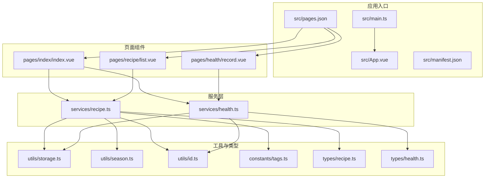
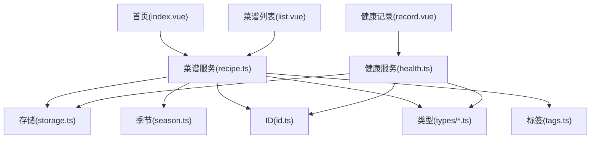
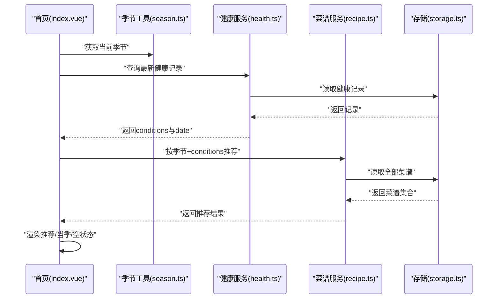
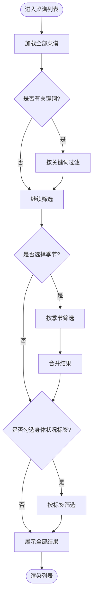
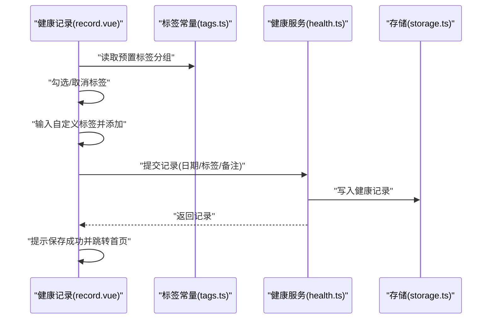
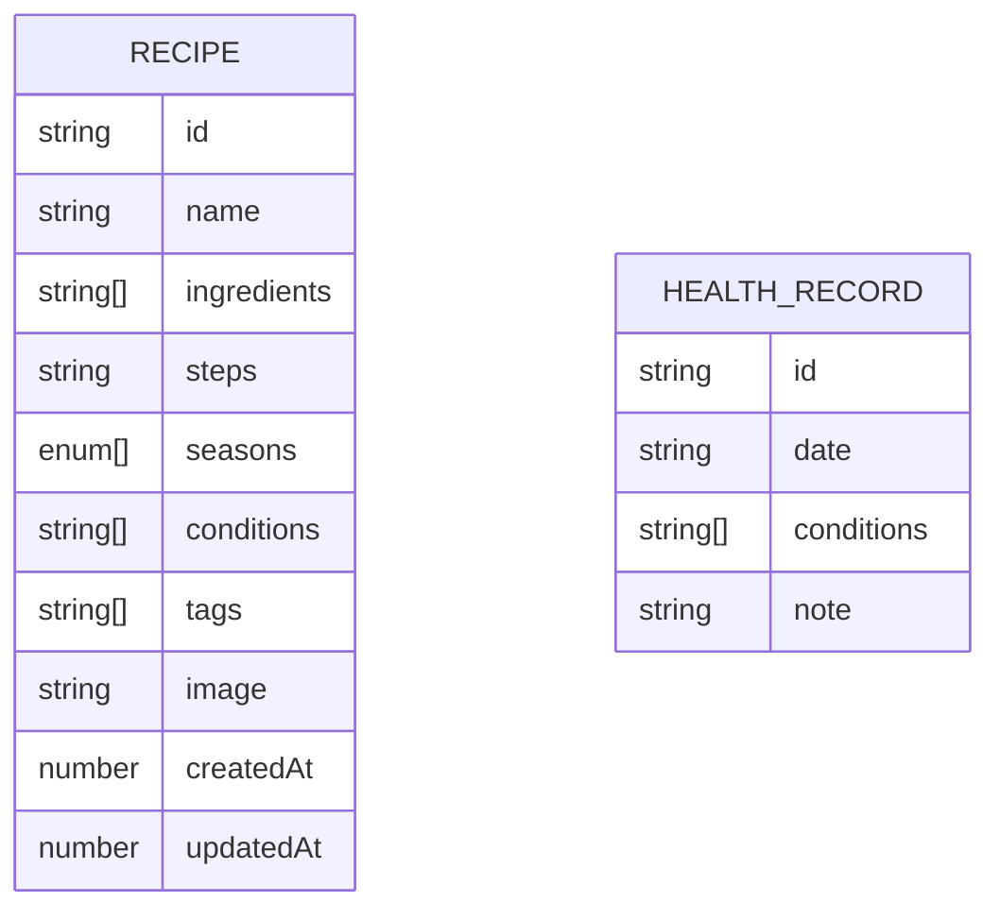
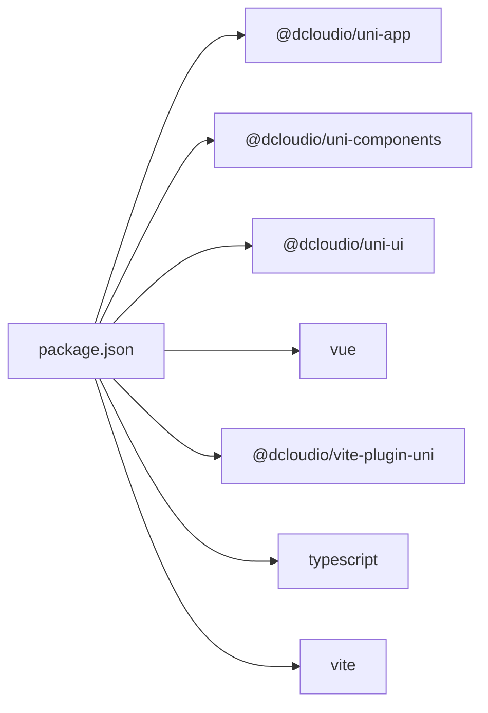

# 项目概述

<cite>
**本文引用的文件**
- [src/main.ts](file://src/main.ts)
- [src/App.vue](file://src/App.vue)
- [src/pages.json](file://src/pages.json)
- [src/manifest.json](file://src/manifest.json)
- [package.json](file://package.json)
- [src/services/recipe.ts](file://src/services/recipe.ts)
- [src/services/health.ts](file://src/services/health.ts)
- [src/tabs/index/index.vue](file://src/pages/index/index.vue)
- [src/pages/recipe/list.vue](file://src/pages/recipe/list.vue)
- [src/pages/health/record.vue](file://src/pages/health/record.vue)
- [src/utils/storage.ts](file://src/utils/storage.ts)
- [src/utils/season.ts](file://src/utils/season.ts)
- [src/constants/tags.ts](file://src/constants/tags.ts)
- [src/types/recipe.ts](file://src/types/recipe.ts)
- [src/types/health.ts](file://src/types/health.ts)
</cite>

## 目录
1. [引言](#引言)
2. [项目结构](#项目结构)
3. [核心组件](#核心组件)
4. [架构总览](#架构总览)
5. [详细组件分析](#详细组件分析)
6. [依赖关系分析](#依赖关系分析)
7. [性能考虑](#性能考虑)
8. [故障排查指南](#故障排查指南)
9. [结论](#结论)
10. [附录](#附录)

## 引言
本项目名为“食之有道”，是一个基于 UniApp 的跨平台移动应用，旨在融合中华传统饮食文化与现代健康管理理念，为用户提供智能化的菜谱推荐与健康记录管理能力。通过记录每日身体状况标签与季节性信息，系统可智能匹配适合当前时节与个人体质的菜谱，帮助用户实现“因时而食、因体施膳”的健康饮食实践。

项目以“易用、实用、可持续”为目标，采用 Vue 3 + TypeScript 技术栈，统一开发 H5、小程序（微信）等多端运行环境，确保在不同平台上保持一致的交互体验与数据一致性。

## 项目结构
项目采用按功能域划分的目录组织方式，核心模块包括：
- 应用入口与生命周期：src/main.ts、src/App.vue
- 页面与路由配置：src/pages.json、src/manifest.json
- 业务服务层：src/services 下的 recipe.ts、health.ts
- 类型定义：src/types 下的 recipe.ts、health.ts
- 工具与常量：src/utils 下的 storage.ts、season.ts、id.ts；src/constants 下的 tags.ts
- 页面组件：首页、菜谱列表、菜谱详情/编辑、健康记录、历史记录、我的等

图表来源
- [src/main.ts:1-10](file://src/main.ts#L1-L10)
- [src/App.vue:1-20](file://src/App.vue#L1-L20)
- [src/pages.json:1-85](file://src/pages.json#L1-L85)
- [src/manifest.json:1-41](file://src/manifest.json#L1-L41)
- [src/services/recipe.ts:1-103](file://src/services/recipe.ts#L1-L103)
- [src/services/health.ts:1-49](file://src/services/health.ts#L1-L49)
- [src/utils/storage.ts:1-34](file://src/utils/storage.ts#L1-L34)
- [src/utils/season.ts:1-34](file://src/utils/season.ts#L1-L34)
- [src/constants/tags.ts:1-23](file://src/constants/tags.ts#L1-L23)
- [src/types/recipe.ts:1-15](file://src/types/recipe.ts#L1-L15)
- [src/types/health.ts:1-7](file://src/types/health.ts#L1-L7)

章节来源
- [src/main.ts:1-10](file://src/main.ts#L1-L10)
- [src/App.vue:1-20](file://src/App.vue#L1-L20)
- [src/pages.json:1-85](file://src/pages.json#L1-L85)
- [src/manifest.json:1-41](file://src/manifest.json#L1-L41)

## 核心组件
- 应用入口与生命周期：负责创建应用实例与全局生命周期钩子，引入全局样式。
- 页面与路由配置：集中声明页面路径、导航标题、tabBar 图标与文案，以及 H5/小程序差异化配置。
- 服务层（菜谱与健康）：封装对本地存储的数据读写、增删改查、检索与筛选、推荐算法等。
- 工具与常量：提供存储键值、季节计算与配色、唯一 ID 生成、预置标签与食材分类等。
- 页面组件：首页展示季节与推荐菜谱、健康卡片；菜谱列表支持关键词搜索与多维筛选；健康记录页支持标签选择与自定义标签。

章节来源
- [src/App.vue:1-20](file://src/App.vue#L1-L20)
- [src/pages.json:1-85](file://src/pages.json#L1-L85)
- [src/services/recipe.ts:1-103](file://src/services/recipe.ts#L1-L103)
- [src/services/health.ts:1-49](file://src/services/health.ts#L1-L49)
- [src/utils/storage.ts:1-34](file://src/utils/storage.ts#L1-L34)
- [src/utils/season.ts:1-34](file://src/utils/season.ts#L1-L34)
- [src/constants/tags.ts:1-23](file://src/constants/tags.ts#L1-L23)

## 架构总览
系统采用“页面组件 → 服务层 → 工具/常量 → 本地存储”的分层架构，页面组件负责视图与交互，服务层抽象数据访问与业务逻辑，工具/常量提供通用能力，本地存储作为数据持久化介质。页面路由由 pages.json 统一管理，构建脚本通过 uni 命令在多端编译。

图表来源
- [src/pages/index/index.vue:1-470](file://src/pages/index/index.vue#L1-L470)
- [src/pages/recipe/list.vue:1-477](file://src/pages/recipe/list.vue#L1-L477)
- [src/pages/health/record.vue:1-313](file://src/pages/health/record.vue#L1-L313)
- [src/services/recipe.ts:1-103](file://src/services/recipe.ts#L1-L103)
- [src/services/health.ts:1-49](file://src/services/health.ts#L1-L49)
- [src/utils/storage.ts:1-34](file://src/utils/storage.ts#L1-L34)
- [src/utils/season.ts:1-34](file://src/utils/season.ts#L1-L34)
- [src/constants/tags.ts:1-23](file://src/constants/tags.ts#L1-L23)
- [src/types/recipe.ts:1-15](file://src/types/recipe.ts#L1-L15)
- [src/types/health.ts:1-7](file://src/types/health.ts#L1-L7)

## 详细组件分析

### 首页（为你推荐）
首页根据当前季节与用户最新健康记录中的身体状况标签，进行菜谱智能推荐。若无精准匹配，则退回到当季菜谱；若尚无菜谱数据则提示添加。

图表来源
- [src/pages/index/index.vue:136-208](file://src/pages/index/index.vue#L136-L208)
- [src/utils/season.ts:1-34](file://src/utils/season.ts#L1-L34)
- [src/services/health.ts:1-49](file://src/services/health.ts#L1-L49)
- [src/services/recipe.ts:87-103](file://src/services/recipe.ts#L87-L103)
- [src/utils/storage.ts:1-34](file://src/utils/storage.ts#L1-L34)

章节来源
- [src/pages/index/index.vue:1-470](file://src/pages/index/index.vue#L1-L470)
- [src/utils/season.ts:1-34](file://src/utils/season.ts#L1-L34)
- [src/services/health.ts:1-49](file://src/services/health.ts#L1-L49)
- [src/services/recipe.ts:87-103](file://src/services/recipe.ts#L87-L103)

### 菜谱列表（搜索与筛选）
菜谱列表支持关键词搜索与多维筛选（季节、身体状况标签），并提供“展开/收起”标签面板与“+N”标签提示，提升筛选效率。

图表来源
- [src/pages/recipe/list.vue:114-213](file://src/pages/recipe/list.vue#L114-L213)
- [src/services/recipe.ts:53-85](file://src/services/recipe.ts#L53-L85)

章节来源
- [src/pages/recipe/list.vue:1-477](file://src/pages/recipe/list.vue#L1-L477)
- [src/services/recipe.ts:53-85](file://src/services/recipe.ts#L53-L85)

### 健康记录（标签与自定义标签）
健康记录页提供日期选择、分组标签选择、自定义标签输入与保存功能。保存成功后自动返回首页，并在首页展示最新记录以驱动菜谱推荐。

图表来源
- [src/pages/health/record.vue:1-313](file://src/pages/health/record.vue#L1-L313)
- [src/constants/tags.ts:1-23](file://src/constants/tags.ts#L1-L23)
- [src/services/health.ts:14-23](file://src/services/health.ts#L14-L23)
- [src/utils/storage.ts:1-34](file://src/utils/storage.ts#L1-L34)

章节来源
- [src/pages/health/record.vue:1-313](file://src/pages/health/record.vue#L1-L313)
- [src/constants/tags.ts:1-23](file://src/constants/tags.ts#L1-L23)
- [src/services/health.ts:14-23](file://src/services/health.ts#L14-L23)

### 数据模型与类型
- 菜谱（Recipe）：包含标识、名称、食材、做法、适用季节、适合身体状况标签、自定义标签、图片、创建/更新时间等字段。
- 健康记录（HealthRecord）：包含标识、日期、身体状况标签列表、备注。

图表来源
- [src/types/recipe.ts:1-15](file://src/types/recipe.ts#L1-L15)
- [src/types/health.ts:1-7](file://src/types/health.ts#L1-L7)

章节来源
- [src/types/recipe.ts:1-15](file://src/types/recipe.ts#L1-L15)
- [src/types/health.ts:1-7](file://src/types/health.ts#L1-L7)

## 依赖关系分析
- 构建与运行：使用 uni-app 生态与 Vite，支持 H5 与小程序（微信）双端开发。
- 运行时依赖：Vue 3、UniApp 核心与组件、UI 组件库、TypeScript。
- 开发依赖：Vite 插件、TS 配置、类型声明等。

图表来源
- [package.json:1-28](file://package.json#L1-L28)

章节来源
- [package.json:1-28](file://package.json#L1-L28)

## 性能考虑
- 数据访问：所有读写均通过统一存储工具进行，避免分散的本地存储调用，减少错误与重复解析。
- 推荐算法：菜谱推荐基于“匹配身体状况标签数量”排序，时间复杂度近似 O(n)，在小规模数据下具备良好性能。
- 列表筛选：先按关键词过滤，再按季节/标签二次过滤，避免对全量数据重复扫描。
- UI 渲染：使用虚拟列表容器与懒加载占位，减少首屏压力；标签与图片采用轻量占位符，提升感知速度。
- 缓存策略：利用页面 onShow 生命周期刷新首页数据，保证推荐与健康卡片实时性。

## 故障排查指南
- 无法读取/写入本地存储
  - 检查存储键值是否正确，确认存储工具的异常捕获与默认值处理。
  - 参考路径：[src/utils/storage.ts:1-34](file://src/utils/storage.ts#L1-L34)
- 菜谱推荐为空
  - 确认是否存在菜谱数据；若无，引导用户添加；若有则检查当前季节与身体状况标签是否过于严格。
  - 参考路径：[src/services/recipe.ts:87-103](file://src/services/recipe.ts#L87-L103)
- 健康记录未生效
  - 检查保存时是否选择了至少一个身体状况标签；确认记录写入成功后是否正确跳转首页。
  - 参考路径：[src/pages/health/record.vue:131-152](file://src/pages/health/record.vue#L131-L152)
- 页面跳转异常
  - 检查 pages.json 中页面路径与 tabBar 配置是否正确，确保跳转 URL 与页面路径一致。
  - 参考路径：[src/pages.json:1-85](file://src/pages.json#L1-L85)

章节来源
- [src/utils/storage.ts:1-34](file://src/utils/storage.ts#L1-L34)
- [src/services/recipe.ts:87-103](file://src/services/recipe.ts#L87-L103)
- [src/pages/health/record.vue:131-152](file://src/pages/health/record.vue#L131-L152)
- [src/pages.json:1-85](file://src/pages.json#L1-L85)

## 结论
“食之有道”以中华四时养生为核心理念，结合现代健康标签体系与本地化存储，构建了从“记录—推荐—实践”的闭环体验。通过清晰的分层架构与可扩展的服务层设计，项目既满足初学者快速上手，也为后续扩展（如云端同步、AI 推荐、更多筛选维度）提供了良好基础。

## 附录
- 术语说明
  - 身体状况标签：用于描述当前健康状态的关键词，如“湿气重”“阴虚”“感冒”等。
  - 季节：春/夏/秋/冬，与中医“因时而食”理念对应。
  - 推荐算法：以“匹配标签数量”为评分依据，降序排列。
- 用户场景示例
  - 场景一：用户在“记录身体状况”页面选择“湿气重”“阴虚”，保存后返回首页，系统根据当前季节与标签推荐相应菜谱。
  - 场景二：用户在“菜谱列表”中按“秋季+湿气重”筛选，快速定位适合的菜品。
- 技术选型考量
  - UniApp：一次开发、多端运行，降低维护成本。
  - Vue 3 + TypeScript：类型安全与响应式能力，提升开发效率与可维护性。
  - 本地存储：无需网络即可使用，保障离线可用性与隐私性。